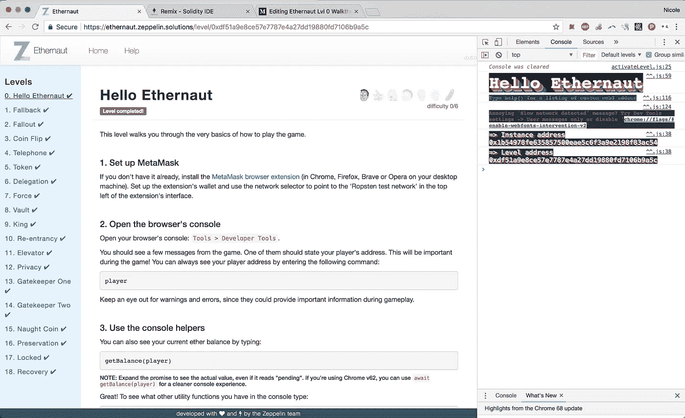
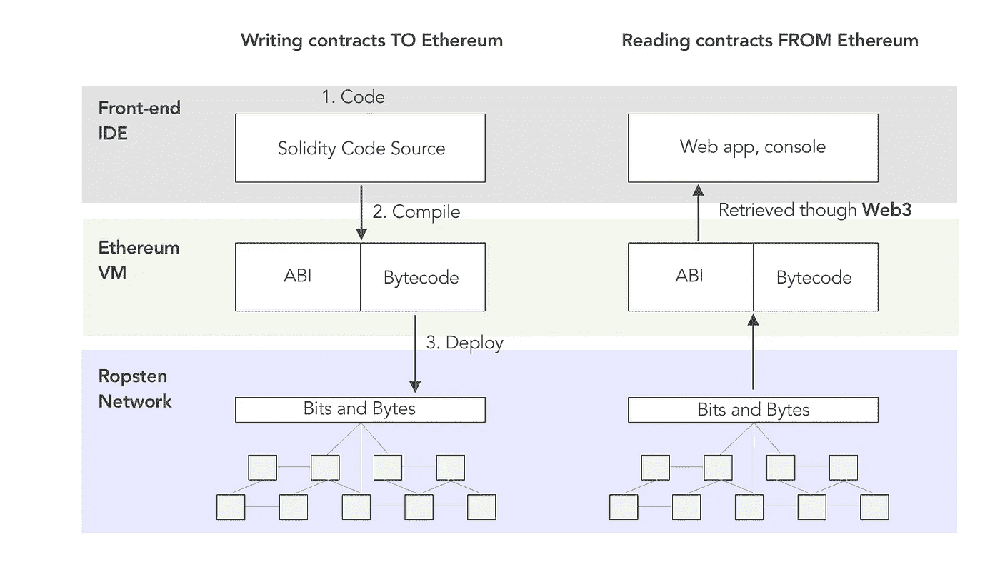
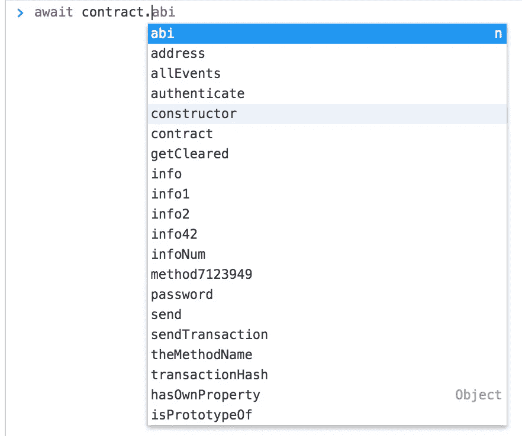

# Ethernaut Lvl 0 演练:ABIs、Web3 以及如何滥用它们

> 原文：<https://medium.com/hackernoon/ethernaut-lvl-0-walkthrough-abis-web3-and-how-to-abuse-them-d92a8842d71b>



## 让智能合同做它不想做的事情…

这是一部[围绕](/@nicolezhu)[齐柏林](https://openzeppelin.org/)的智能合约[安全谜题](https://ethernaut.zeppelin.solutions/)的深度系列。我会给你直接的资源和关键概念你需要 100%自己解决这些难题。

在接下来的几周里，我们将重现一些严重的黑客攻击是如何被诱导的，特别是:

*   [$ 5000 万刀黑客](http://hackingdistributed.com/2016/06/18/analysis-of-the-dao-exploit/):因重入问题导致
*   [$ 3000 万的奇偶校验攻击](https://blog.zeppelin.solutions/on-the-parity-wallet-multisig-hack-405a8c12e8f7):由 delegatecall()漏洞引发

***必修*** *:智能合同开发基础知识*

# 以太网如何工作

所有智能合约源代码都被编译成两种格式，由以太坊虚拟机(EVM)提供:

*   **应用二进制接口(ABI)**:solidity 和 Javascript 之间的通信层，JSON 格式
*   字节码:由 EVM 执行的低级机器语言

当您为每个级别请求`get a new instance`时，Ethernaut 将编译好的字节码部署到 Ropsten 测试网络上的一个新地址:



一旦在区块链上创建了这个新实例，它的地址就会通过一个事件返回到您的 web 客户端，正如在游戏的主合同中所看到的，`Ethernaut.sol`:

[https://github.com/OpenZeppelin/ethernaut/blob/master/contracts/Ethernaut.sol](https://github.com/OpenZeppelin/ethernaut/blob/master/contracts/Ethernaut.sol)

最后，Web3 在这个新的契约实例周围包装了一个 ABI，并允许您通过 Web 控制台与契约进行交互。



Notice that all ``public`` functions are available in the web client

# 详细演练

这个关卡需要你猜一个秘密密码，以便“获得许可”继续前进。

1.  注意，当创建契约实例时，Ethernaut 向构造函数传递了一个秘密的`_password`:

```
function Instance(string _password) public { 
    password = _password; 
}
```

2.这个密码被存储为一个`public` `string`变量

```
string public password;
```

3.Solidity 中所有公共的基本变量类型都有一个自动生成的 getter 函数。这意味着您可以通过在控制台中键入来直接*读取*这个不那么机密的密码:

```
await contract.password()
```

*您可以使用 async/await 更轻松地处理 Web3 承诺*

4.要通过这一关，只需调用最后一个`authenticate`函数，并通过控制台输入检索到的密码:

```
await contract.authenticate("[password here]");
```

*您将在 authenticate 函数中修改存储，因此在调用此事务时，预计要支付一些汽油。*

5.最后，你应该能够再次确认你是否已经通过了这一关:

```
await contract.getCleared();
```

# 关键安全要点

*   公众可以查看存储在区块链上的所有函数和变量
*   永远不要将密码直接存储在智能合约中，(即使是作为`private`变量，我们很快就会知道)

# 更多级别

[](https://hackernoon.com/ethernaut-lvl-1-walkthrough-how-to-abuse-the-fallback-function-118057b68b56) [## Ethernaut Lvl 1 演练:如何滥用回退功能

### 这是一个围绕齐柏林团队的智能合同安全难题的深入系列。我会给你直接的资源…

hackernoon.com](https://hackernoon.com/ethernaut-lvl-1-walkthrough-how-to-abuse-the-fallback-function-118057b68b56) [](/@nicolezhu/ethernaut-lvl-2-walkthrough-how-simple-developer-errors-become-big-mistakes-b705ff00a62f) [## Ethernaut Lvl 2 辐射演练:简单的开发人员错误如何变成大错误

### 这是一个围绕齐柏林团队的智能合同安全难题的深入系列。我会给你直接的资源…

medium.com](/@nicolezhu/ethernaut-lvl-2-walkthrough-how-simple-developer-errors-become-big-mistakes-b705ff00a62f)