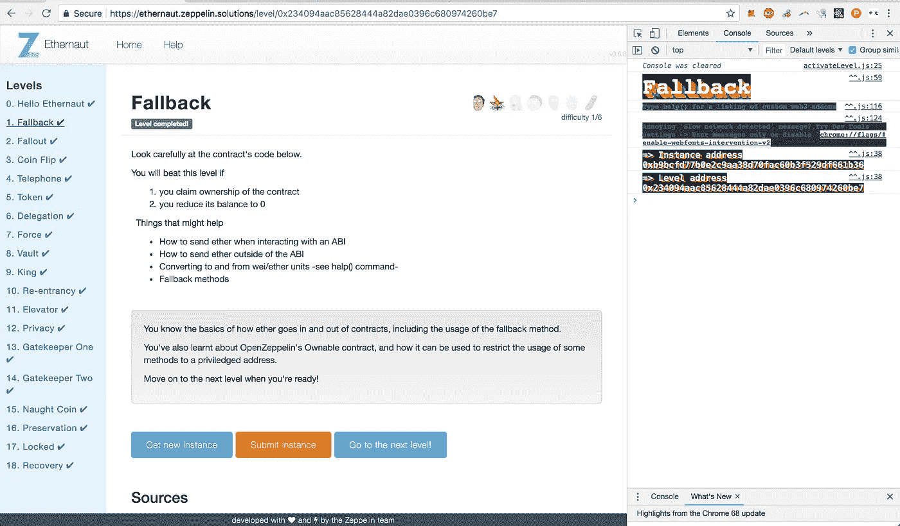
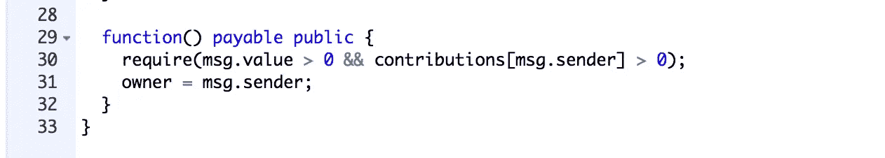
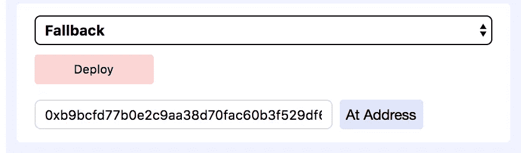
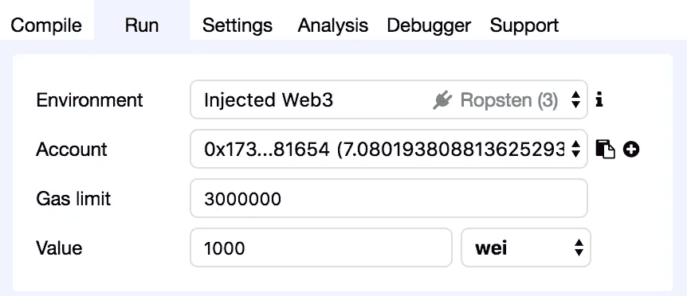
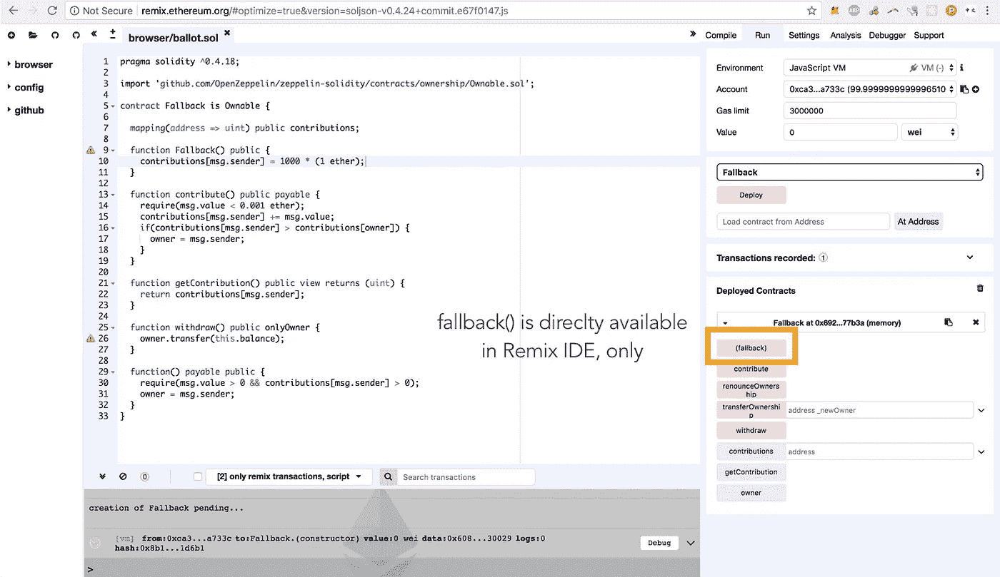

# Ethernaut Lvl 1 演练:如何滥用回退功能

> 原文：<https://medium.com/hackernoon/ethernaut-lvl-1-walkthrough-how-to-abuse-the-fallback-function-118057b68b56>

## *这是一款* [*深度系列*](/@nicolezhu) *围绕* [*齐柏林*](https://openzeppelin.org/) *团队的* [*智能契约安全拼图*](https://ethernaut.zeppelin.solutions/) *。我会给你直接的资源和你需要的关键概念来 100%自己解决这些难题。*



这个级别要求你利用一个实现很差的`fallback`函数来控制别人的智能合约。

# 什么是回退功能

如果你想让你的智能合同从其他合同和钱包接收以太网，最好的做法是实现一个简单的函数。

> 回退功能使智能合约能够像钱包一样发挥作用。

如果我有你的钱包地址，我可以不经你允许给你寄乙醚。在大多数情况下，您可能也希望为您的智能合同启用这种易于支付的功能。这样，其他合同/钱包可以发送以太到你的合同，而不必知道你的 ABI 或具体的功能名称。

> 注意:没有退路，或已知的支付功能，智能合约只能接收乙醚:I)作为采矿奖金，或 ii)作为另一个具有[自毁](http://solidity.readthedocs.io/en/v0.4.21/introduction-to-smart-contracts.html#self-destruct)的合约的备份钱包。

**问题是**当开发者在回退函数内部实现关键逻辑*时。*

这种不良做法包括:改变合同所有权、转移资金等。在回退函数中:



Bad practice: you should not reassign contract ownership in a fallback function

这一关展示了你是如何让你的合同被滥用的，因为**任何人都可以触发回退功能**。

# 触发回退功能的方式

任何人都可以通过以下方式调用回退功能:

1.  调用合同中不存在的函数，或者
2.  调用函数**而没有传入所需的数据**，或者
3.  向合同发送**乙醚**乙醚**无任何数据**

# 详细演练

在 Fallback.sol 中有两个地方，作为`msg.sender`，你可以成为契约的**所有者**:

第一个选项要求您将`1000000000000000000000 wei`或`1000 Ether`发送到这个智能合同。

你可能没有 5 个小时来慢慢地从 Ropsten 水龙头请求 1000 个乙醚，在最初的几次请求后，它会严重地限制你。所以让我们退回到`fallback`选项。

## **注意回退功能有两个要求:**

```
require(msg.value > 0 && contributions[msg.sender] > 0);
```

*   您的帐户地址需要在过去向该合同捐赠过乙醚
*   您的获胜回退函数调用需要包含一些以太值

## 使用[混音 IDE](http://remix.ethereum.org/) :

1.  将合同代码粘贴到 UI 中。这给了混音匹配的 ABI 工作。
2.  确保你给了 Remix 完整的导入路径。Ethernaut 为其 dApp 提供了 Remix 无法识别的短路径:

```
import 'github.com/OpenZeppelin/zeppelin-solidity/contracts/ownership/Ownable.sol'; 
```

3.通过`instance`地址加载合同，检索您现有的合同实例:



Check ‘instance’ inside the console for your address. 0xb9bcfd… is my instance address.

4.使用`contribute`函数向契约捐赠少量的乙醚。确保您从您的`player`账户地址捐款。

**注意:**`contribute()`函数有条件语句:`require(msg.value < 0.001 ether);`

确保你的贡献`value`小于 0.001 乙醚。



Check that you’re donating from your `player` wallet address

5.最后，在`value`字段中添加任意值，并触发`(fallback)`函数。



在控制台中，通过键入`await contract.owner();`检查您现在是否拥有合同

## 如果使用控制台(非混音):

您可以通过控制台发送事务来触发回退功能，效果相同:

```
contract.sendTransaction({
  from: player,
  value: toWei(...)
})// Make sure you leave the "data:" field empty
```

# 关键安全要点

*   如果你实现了回退功能，**保持简单**
*   使用回退功能**将支付事件发送到交易日志**
*   使用回退功能**检查简单的条件要求**
*   **在使用回退函数更改合同所有权、转移资金、支持低级函数调用等之前，请三思而行**。

# 更多级别

[](https://hackernoon.com/ethernaut-lvl-0-walkthrough-abis-web3-and-how-to-abuse-them-d92a8842d71b) [## Ethernaut Lvl 0 演练:ABIs、Web3 以及如何滥用它们

### 让智能合同做它不想做的事情…

hackernoon.com](https://hackernoon.com/ethernaut-lvl-0-walkthrough-abis-web3-and-how-to-abuse-them-d92a8842d71b) [](/@nicolezhu/ethernaut-lvl-2-walkthrough-how-simple-developer-errors-become-big-mistakes-b705ff00a62f) [## Ethernaut Lvl 2 辐射演练:简单的开发人员错误如何变成大错误

### 这是一个围绕齐柏林团队的智能合同安全难题的深入系列。我会给你直接的资源…

medium.com](/@nicolezhu/ethernaut-lvl-2-walkthrough-how-simple-developer-errors-become-big-mistakes-b705ff00a62f)