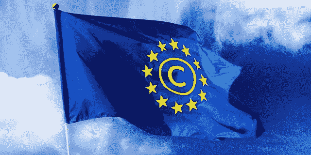

# 欧盟版权规则可能会让我们所有人沉默

> 原文：<https://medium.com/hackernoon/eu-copyright-rules-could-silence-us-all-62374f19a237>

2018 年 5 月 25 日,《通用数据保护条例》( GDPR)在欧洲生效。它引入了一套在线隐私规则，这可能会导致欧洲版权法发生重大变化。

在[数字](https://hackernoon.com/tagged/digital)单一市场指令中的版权已经争论了一段时间，并打算更新 2001 年的版权指令。然而，在这中间的几年里，版权领域发生了相当多的变化，新指令应该一次性解决这些变化。它从来没有被认为是一项有争议的立法，直到 5 月份德国政治家阿克塞尔·沃斯(Axel Voss)在立法草案中插入了两条新规则，它们都是有争议的。

首先是第 11 条:根据这一规定，只有在托管链接的平台拥有新闻网站的付费许可的情况下，才允许带有“新闻网站”的“片段”的“商业”链接。此外，引用一个以上的单词构成了一个“片段”，这是要付费的。由于没有给“商业”或“联系”这两个词下真正的定义，将会有争论。

第二，是第 13 条:这条规则规定，任何公共传播平台都必须确保未经许可不得发布任何有版权的内容，哪怕是短暂的一刻。

德国之前曾试图适用第 11 条，但谷歌找到了规避“链接税”想法的方法——它抵制任何要求付费的网站。所以报纸最终给了谷歌免费的许可证。

第十三条同样，甚至更难适用。YouTube 上有一个 ContentID 工具，但拥有版权的人说它没有抓住足够多的侵权版权。此外，该系统倾向于捕捉没有侵犯版权的视频。用户也不喜欢，因为他们最喜欢的视频被屏蔽了。

有人担心，第 13 条将使这种情况变得更糟，而不是对内容创作者和用户更好。正如[科利·多克托罗](/s/story/europes-copyright-rules-will-stifle-free-expression-8633e91f5284)写道:“第 13 条将扩大过滤器，以考虑文本、音乐、视频、静态照片、软件代码、游戏模块、3D 打印文件以及任何其他可能受版权保护的东西。”

不幸的是，这两条都在法规草案中获得了通过，但辩论并没有结束，因为欧盟正在与每个成员国谈判。这些会谈通常是秘密的，但人们对这一指令的感受如此强烈，以至于欧洲法院裁定，所有欧洲人都应该知道这些谈判中发生了什么。

目标可能是对脸书、推特、谷歌和其他大型科技公司施加更多的控制，但他们有财力遵守规则；较小的公司不会。这意味着巨人队不会有任何竞争。

此外，尽管这是一项欧盟法规，但它可能会影响世界其他地区，平台必须屏蔽欧盟用户，或在全球范围内审查互联网。这一规定将影响许多领域，不仅仅是在线娱乐:它将影响教育、社会和政治交流等等。如果该指令获得通过，这将是对监管实践的滥用——正如 ECJ 所裁定的那样，我们需要听到和了解更多相关信息。