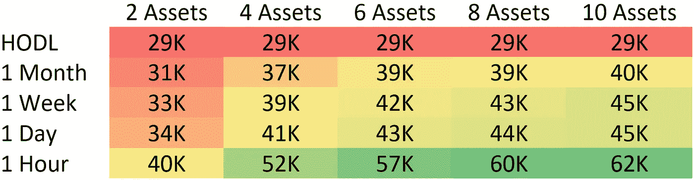
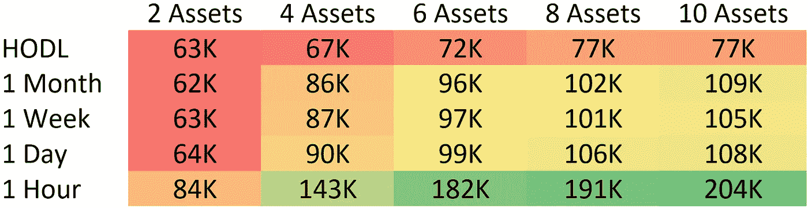
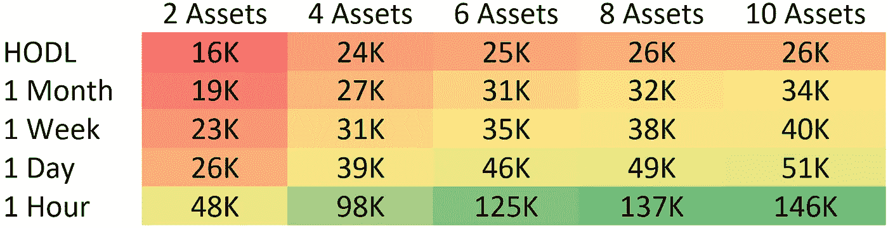
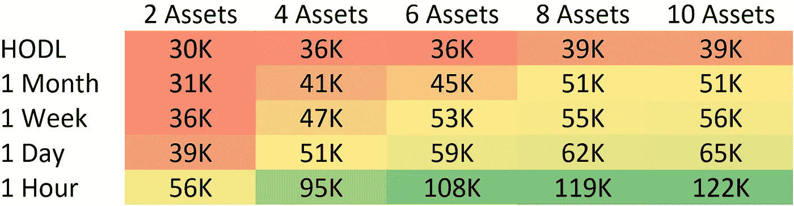

# 基于资产市值的加密投资组合绩效评估

> 原文：<https://medium.com/hackernoon/evaluating-crypto-portfolio-performance-based-on-asset-market-capitalization-2a216f179276>

Taking the speculation out of crypto, one study at a time.

> “我们相信上帝。所有其他人必须携带**数据**。— [爱德华·戴明](https://en.wikipedia.org/wiki/W._Edwards_Deming)

下面的研究将提供一瞥如何市场资本的加密资产影响投资组合的表现。提供的数据基于实际市场数据。这使得我们能够准确计算过去的密码市场的策略表现，而无需投机。

我们的上一篇文章评估了投资组合多样化的绩效含义。你可以在这里阅读更多关于这个话题的内容:

 [## 多样化的加密用户表现更好

### 这是你投资组合的一小步，回报的一大步。我们的上一篇文章讨论了这种关系…

blog.shrimpy.io](https://blog.shrimpy.io/blog/crypto-users-who-diversify-perform-better) 

# 设置

这项研究的设计是将资产分为 3 类；大型(7000 万至 260 万美元)、中型(900 万至 6900 万美元)和小型(90 万至 780 万美元)市值。资本化范围是通过根据 2017 年 5 月 4 日每项资产的市值将资产分为 3 个偶数组来定义的。

在执行每个回溯测试时，使用了以下约束。

**交易费用:** .25%

**数据:**市场数据是从过去一年的交易所收集的。

**数据时间段:**2017 年 5 月 4 日至 2018 年 5 月 3 日

**资产分布:**在所有资产中平均加权。

**交易路径:**为简便起见，所有交易均通过 BTC 进行。

**资产选择:**每个市值组内随机。

**包含的资产:** [*完整的列表可以在我们的回溯测试工具中找到。*](https://www.shrimpy.io/backtest)

初始投资:每个投资组合都有 5000 美元的初始投资。

**回溯测试数量:**每个投资组合规模、策略类型和市值分组 1000 个。

**策略:** [*使用的再平衡方法在我们之前的文章中有所概述。*](https://hackernoon.com/portfolio-rebalancing-for-cryptocurrency-7a129a968ff4)

**回溯测试:** [*阅读更多关于回溯测试的内容，或者自己运行。*](https://hackernoon.com/the-simple-backtest-for-rebalancing-a-portfolio-3289bc8ee618)

关于回测程序和研究设置的更深入的讨论可以在我们之前的文章中找到:

 [## 再平衡与 HODL:技术分析

### 这项研究的目的是描绘一幅公平的画面，说明再平衡作为一种策略如何符合霍德林。为了…

blog.shrimpy.io](https://blog.shrimpy.io/blog/rebalance-vs-hodl-a-technical-analysis) 

# 表演

评估了四个独立的组:大型、中型、小型和综合市值资产。总市值代表所有资产，不考虑市场资本总额。

## 大市值

These values represent the total holdings of the median large market cap portfolio after one year. The top left value representing a portfolio which performed no trades over the course of a single year and contained 2 assets. The bottom right represents a portfolio of 10 assets which were rebalanced every 1 hour. Each cell represents exactly 1,000 backtests which were combined to calculate the median.

在这项研究中，大盘股由 7000 万至 260 万美元估值范围内的资产组成。每次估值都是在 2017 年 5 月 4 日进行的。

这组研究的结果表明，通过简单地增加使用 HODL 策略的投资组合中的资产数量，并没有明显的业绩提升。然而，我们看到一个明显的趋势，即随着重新平衡频率的增加，性能也会提高。在 1 小时的重新平衡期间观察到了最大的性能提升。

> 重新平衡一个大市值加密投资组合导致去年高达 1140%的回报。

## 中等市值

These values represent the total holdings of the median mid market cap portfolio after one year. The top left value representing a portfolio which performed no trades over the course of a single year and contained 2 assets. The bottom right represents a portfolio of 10 assets which were rebalanced every 1 hour. Each cell represents exactly 1,000 backtests which were combined to calculate the median.

在这项研究中，中等市值硬币由 900 万至 6900 万美元估值范围内的资产组成。每次估值都是在 2017 年 5 月 4 日进行的。

在过去的一年中，中等市值硬币的回报率是所有组别中最高的。它们不仅是多样化的有力证明，甚至在增长的时候也是如此，而且在频繁再平衡的时候，它们表现出了令人印象深刻的增长。与 HODL 相比，一小时的再平衡使投资组合价值增加了 156%。

> 重新平衡一个中等市值的加密投资组合导致去年高达 3980%的回报。

## 小市值

These values represent the total holdings of the median small market cap portfolio after one year. The top left value representing a portfolio which performed no trades over the course of a single year and contained 2 assets. The bottom right represents a portfolio of 10 assets which were rebalanced every 1 hour. Each cell represents exactly 1,000 backtests which were combined to calculate the median.

在这项研究中，小市值硬币由 90 万美元至 780 万美元估值范围内的资产组成。每次估值都是在 2017 年 5 月 4 日进行的。

小市值硬币呈现了有趣的结果。在过去的一年里，持有小市值投资组合的回报率是所有回溯测试组中最低的。然而，增加重新平衡的频率提供了显著的改进。尽管霍德林的表现远不如大市值资产，但 1 小时的再平衡时间证明了其在大市值资产上的惊人收益。

> 重新平衡一个小市值加密投资组合导致去年高达 2820%的回报。

## 合计(任何市值)

These values represent the total holdings of the median portfolio after one year. The top left value representing a portfolio which performed no trades over the course of a single year and contained 2 assets. The bottom right represents a portfolio of 10 assets which were rebalanced every 1 hour. Each cell represents exactly 1,000 backtests which were combined to calculate the median.

综合所有市值可以提供市场的总体概况。我们可以看到，将不同市值的资产混合到一个投资组合中，创造了一个中庸的表现。

> 去年，重新平衡加密投资组合带来了高达 2340%的回报。

# 结论和解释

我们获得的数据集显示，在过去一年中，中等市值投资组合的表现优于小市值、大市值和混合市值投资组合。虽然这可能只是基于资产池中包含的资产的异常，但它也可能表明市场的一些情况。

> 中等市值的投资组合在一年内有最高的回报。

尽管有些人可能已经预料到小市值资产在过去的一年中具有最高的回报潜力，但这远非事实。这些结果说明了一个惊人的发展。

> HODLing 小市值投资组合导致了 1 年内最差的回报。

最后，尽管事实证明持有大市值投资组合的表现优于小市值投资组合，但这并不是全部。当频繁重新平衡时，大市值投资组合的表现低于所有其他投资组合。

> 在 1 年的时间里，每小时调整一次大市值投资组合的结果最差。

# 用 Shrimpy 重新平衡

过去一年已经证明，重新平衡多样化的投资组合可以提高业绩。Shrimpy 将整个投资组合管理和再平衡过程简化为一个点击式界面。快速选择资产，立即分配多样化的投资组合，并在预定的时间段内重新平衡。最棒的是，Shrimpy 现在完全免费使用！

点击[这里](https://www.shrimpy.io/)报名。

如果您仍然不确定，请尝试演示，看看我们提供的一切！

 [## Shrimpy 演示

### Shrimpy 是管理您的加密组合的最简单的方法。试试我们的演示，看看我们能提供什么！

www.shrimpy.io/demo](https://www.shrimpy.io/demo) 

# 附加阅读

[***多样化的加密用户表现更好***](https://blog.shrimpy.io/blog/crypto-users-who-diversify-perform-better)

[***再平衡 vs HODL:技术分析***](https://blog.shrimpy.io/blog/rebalance-vs-hodl-a-technical-analysis)

[***针对加密货币的投资组合再平衡***](https://blog.shrimpy.io/blog/portfolio-rebalancing-for-cryptocurrency)

[***加密组合再平衡回溯测试工具***](https://blog.shrimpy.io/blog/the-crypto-portfolio-rebalancing-backtest-tool)

别忘了查看一下 [Shrimpy 网站](https://www.shrimpy.io/)，在 [Twitter](https://twitter.com/ShrimpyApp) 和[脸书](https://www.facebook.com/ShrimpyApp)上关注我们的更新，并在[Telegram](https://t.me/ShrimpyGroup)&[Discord](https://discord.gg/gXyy95y)上向我们令人惊叹的活跃社区提问。

留下你的评论，让我们知道你的平衡经验！

捕虾队