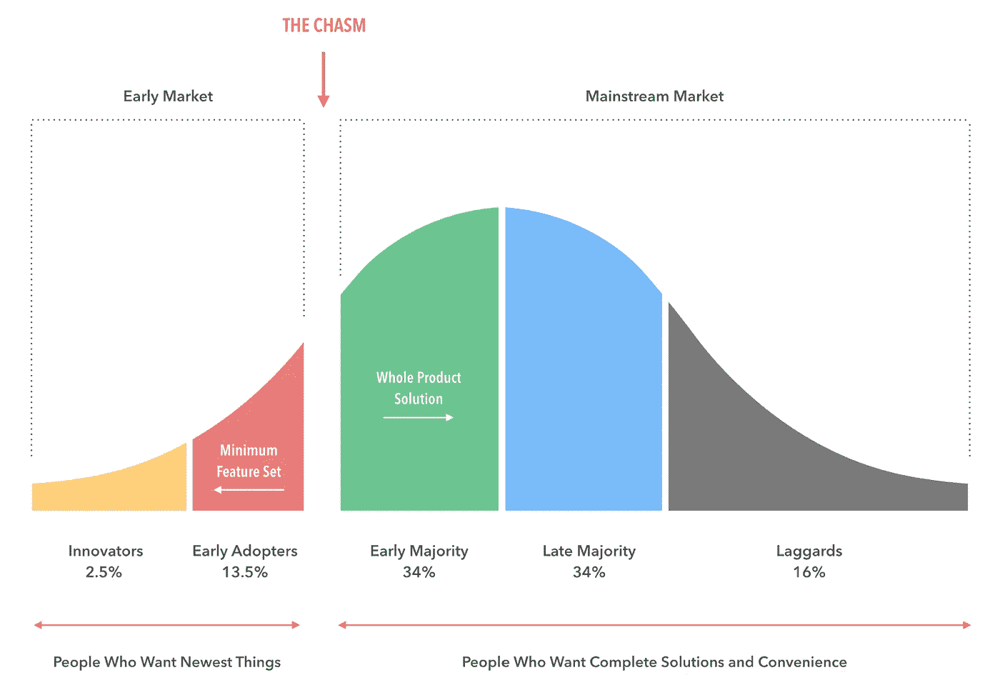

# 评估加密货币大规模采用的驱动因素

> 原文：<https://medium.com/hackernoon/evaluating-drivers-of-cryptocurrency-mass-adoption-62fbc961fb00>

当前加密货币市场的大规模低迷给人的感觉与以往截然不同。

在太熟悉的关于比特币死亡的声明和关于加密货币是骗局的断言中，我开始看到除了投机之外有意义的采用的清晰迹象。

我认为，这些力量将逐渐推动加密货币[跨越鸿沟](https://en.wikipedia.org/wiki/Crossing_the_Chasm)，这一鸿沟将乐观的早期采用者与早期多数派的务实成员分隔开来，主流采用需要他们的支持。

# 机构收养

一些世界上最大和最有影响力的机构正在张开双臂拥抱加密货币。

[Bakkt](https://www.bakkt.com/index) 是纽约证券交易所运营商旗下的创业公司。在微软、星巴克和波士顿咨询集团的帮助下，Bakkt 正在[推出一套 a 产品](http://fortune.com/longform/nyse-owner-bitcoin-exchange-startup/)，帮助机构和消费者轻松存储和消费数字货币。Bakkt 的 CEO [最近表示](https://twitter.com/DelRayMan/status/1067434637083893760)星巴克打算给顾客提供用比特币支付的能力。

富达投资(负责超过 2 万亿美元的资产)推出了一个[数字资产平台](https://www.fidelitydigitalassets.com/overview)，为机构投资者提供企业级托管和执行服务。

纳斯达克首席执行官[表示，该交易所对成为加密货币交易平台持开放态度](https://www.cnbc.com/2018/04/25/nasdaq-is-open-to-becoming-cryptocurrency-exchange-ceo-says.html)。纳斯达克(Nasdaq)正在为加密货币交易所 Gemini 提供其市场监控技术(T3 ),并计划明年在 T4 上市比特币期货(T5)。

[芝加哥期权交易所](https://en.wikipedia.org/wiki/Chicago_Board_Options_Exchange)、 [TD Ameritrade](https://www.tdameritrade.com/investment-products/cryptocurrency-trading.page) 、纳斯达克、富达都[投资了加密货币交易所 ErisX](https://uk.reuters.com/article/us-crypto-currencies-erisx/fidelity-nasdaq-ventures-invest-in-cryptocurrency-exchange-erisx-idUKKBN1O31KY?rpc=401&) 。

耶鲁大学的捐赠基金经理[最近投资了两个加密基金](https://www.cnbc.com/2018/10/05/yale-investment-chief-david-swensen-jumps-into-crypto-with-bets-on-two-silicon-valley-funds.html)，斯坦福大学是众多推出了专注于加密货币和区块链技术的[学术研究中心](https://cbr.stanford.edu/)和[课程](https://online.stanford.edu/courses/cs251-cryptocurrencies-and-blockchain-technologies)的著名学校之一。

俄亥俄州允许企业和个人用比特币缴税。

自从一月份将比特币加入其现金应用以来，Square 已经在比特币销售上获得了小额利润。Robinhood 是千禧一代最受欢迎的投资应用之一，今年[增加了对加密货币](https://crypto.robinhood.com/)的支持。

受尊敬的机构继续采用加密货币将逐渐增加对该技术的信任。

# 分散应用

以太坊被设计成一个分散的世界计算机，由加密货币(以太)驱动，任何人都可以在其上构建和访问不可阻挡的应用程序。经过多年的开发，我们终于开始看到其中一些应用程序投入使用。

占卜市场是一个分散的预测市场，用户可以对任何事件的 T2 结果打赌。该平台有一个[小用户群](https://dappradar.com/app/673/augur)，但在 [2018 年美国中期选举](https://www.coindesk.com/us-election-pushes-total-augur-bets-over-2-million)期间活动激增。除了让人们更容易下注之外，还有大量的文献证明了预测市场的社会价值。Augur 于 2018 年 7 月在以太坊的 Mainnet 上推出，Guesser 最近发表了一篇关于该项目的状态的[精彩概述](/guesser/insights-into-augur-62ad41f4cf38)。

假人是一个分布式超级计算网络。用户可以将计算任务外包给全球计算机网络，并通过向网络出租计算机的处理能力来赚钱。该平台应提供一个环境，在该环境中，计算任务可以更快地完成，并且比依赖单台计算机时的成本更低。假人目前处于公开测试阶段。

StorJ 是一个分散的文件存储系统。文件不是存放在“云中”(由大公司管理的服务器农场)，而是拼接在一起，散布在一个点对点的[全球计算机网络](https://storjstat.com/)，并且只能由所有者重新组装。用户可以受益于[更低的成本](/@storjproject/the-high-price-of-traditional-cloud-storage-2909d737e1c9)，更多的隐私，以及通过出租闲置硬盘空间赚钱的能力。前 Docker 首席执行官 Ben Golub 是 StorJ 的现任执行主席和临时首席执行官。StorJ 目前处于公开 alpha 阶段。

目前 Dapps 的使用可以忽略不计，但这仍然是早期。

# 经济危机

由于政府通过恶性通货膨胀摧毁了本国货币的价值，委内瑞拉公民一直在使用加密货币生存。

土耳其和津巴布韦的加密货币交易活动激增，因为这两个国家都受到了经济和政治危机的困扰。

全球最大对冲基金的创始人雷伊·达里奥是警告美元作为世界储备货币的地位岌岌可危的主要声音之一。他认为美联储的政策可能导致美元贬值 30%。

如果世界主要货币之一失去信心，一些人可能会开始密切关注加密货币。

# 社交媒体网络

[Steemit](https://steemit.com/) 、 [Cent](https://cent.co/) 、[Y ' all](https://yalls.org/)、 [Minds](https://www.minds.com/) 、 [Bitchute](https://www.bitchute.com/) 和[peepest](https://peepeth.com/_)都是加密货币驱动的社交网络，已经实现了不同程度的使用。

这些网站允许用户通过分享和管理内容来赚钱，Cent 让用户无需购买就可以非常容易地获得 crypto，消除了一个主要的进入壁垒。

如果这些平台用户允许用户在创造和分享有价值的内容的同时轻松赚钱，他们就会增长。

# 娱乐/媒体平台和应用

[SingularDTV](https://singulardtv.com/) 是一家娱乐工作室，它为艺术家推出了一个名为 [Tokit](https://tokit.io/) 的众筹门户网站，并正在建立一个由基于[以太坊的加密资产](/@SingularDTV/whats-the-difference-between-an-ico-and-a-token-launch-d892d4d689a4)支持的点对点内容分发平台。

DJ 和电子音乐制作人 Gramatik 利用 Tokit 在不到一天的时间里筹集了 225 万美元。该工作室的第一部电影，一部名为[信任机器](https://www.rottentomatoes.com/m/trust_machine_the_story_of_blockchain/)的纪录片于 10 月首映。SXSW 获奖的独立科幻电影 [Prospect](https://www.youtube.com/watch?v=F96wbQ698Z0) 于 11 月在影院首映，目前已经获得了评论家的积极评价，并将在 SingularDTV 上进行其[数字处女作。](https://variety.com/2018/film/news/pedro-pascal-prospect-dust-platform-1202943690/)

Audius 是一个音频分发、认证和货币化的平台，它使用两个基于以太坊的[加密资产](https://audius.co/token.html)作为 Spotify 和 SoundCloud 的[开源替代物](https://techcrunch.com/2018/08/08/audius/)的基础。该团队得到了凯鹏华盈(Kleiner Perkins)、光速创投合伙人以及曾在 Twitch、EA Games、谷歌、微软和 Bittorrent 工作过的员工和顾问的支持。

像[僵尸战场](https://loom.games/)、[上帝的解放](https://godsunchained.com/)、[加密空间指挥官、](https://www.csc-game.com/)和[项目起源](https://projectgenesis.com/)这样的视频游戏正在展示加密货币驱动的开放区块链如何能够让玩家真正拥有游戏资产，并创造出可以跨不同游戏世界携带的资产。

高质量的内容、令人愉快的用户体验，以及通过成功摆脱中间商而增加的控制和收入，将吸引内容创作者和消费者。

# 供应链管理解决方案

[Sweetbridge](https://sweetbridge.com/) 正在构建一个平台，利用以太坊的区块链让参与交易的各方保持同步，并消除传统商务的摩擦和障碍。他们的系统利用了两种基于以太坊的加密资产。

他们是第一批被亚利桑那州金融科技沙盒计划(FinTech sandbox program)接受的公司之一，也是汉莎航空(Lufthansa)航空区块链挑战赛(Aviation Blockchain challenge)的获胜者。美国造币厂前总监 Ed Moy 最近加入 Sweetbridge 担任顾问。

[Blockshipping](https://www.blockshipping.io/) 正在与基于以太坊的去中心化组织 [MakerDAO](https://makerdao.com/) 合作，[将稳定的加密货币 DAI](https://www.newsbtc.com/2018/05/11/makerdao-and-blockshipping-collaborate-to-transform-the-global-container-shipping-industry/) 整合到他们的[运营中](https://www.reddit.com/r/MakerDAO/comments/8j9tcb/makerdao_and_blockshipping_collaborate_to/)。他们的首席执行官是马士基(世界上最大的航运公司)的前首席信息官，团队包括航运巨头的其他几名前雇员。

[Tradeshift](https://tradeshift.com/) 是一个基于云的业务平台，专注于供应链支付、市场和应用。他们的平台目前服务于全球 150 万家公司，拥有汇丰、西门子和沃尔沃等客户，每年处理超过 50000 亿美元的交易。他们还与 MakerDAO 合作，利用戴使全球小企业的融资渠道民主化。

加密货币具有巨大的潜力，可以通过减少交易费用、完成支付的时间以及依赖中央中介来促进交易，从而提高供应链运营的效率。

# 能源生产和分配系统

[Grid+](https://gridplus.io/) 开发了一套[产品](https://gridplus.io/technology)，旨在通过帮助消费者进入批发能源市场来降低成本、提高效率、推动绿色能源的使用。他们的平台利用[两种基于以太坊的加密资产](/@sebnem/token-model-for-energy-part-2-review-of-the-grid-token-model-4b3ecefe286c)来促进对他们网络的访问。

他们已经得到了美国能源部的拨款，T2 在得克萨斯州出售零售能源的许可证，并且已经开始向得克萨斯州的消费者提供能源，这些消费者比传统能源供应商更喜欢这项服务。

太阳交易所允许全球投资者购买和租赁太阳能电池，并通过位于区块链的支付系统从其持有的太阳能电池中(以比特币或国家货币)获得租金收入。

如果这些类型的服务能够增加获取能源的机会，降低获取能源的成本，消费者就会采用它们。

# 结论

由剑桥大学研究人员进行的最近发表的[全球基准研究](https://www.jbs.cam.ac.uk/faculty-research/centres/alternative-finance/publications/2nd-global-cryptoasset-benchmarking-study/#.XBLE5dtKgrO)估计，加密货币用户超过 1.39 亿(其中 38%是“活跃的”)，高于 2017 年版研究中测量的不到 1000 万。

我只强调了加密货币开始为一小部分用户提供投机以外的价值的一些领域。

只要企业家和技术专家继续在解决规模限制和改善用户体验方面取得稳步进展，并且监管机构不采取极端措施抑制技术的采用，就没有理由不期待持续增长。

对我来说，问题不是大规模采用是否会发生，而是什么时候，以什么形式？