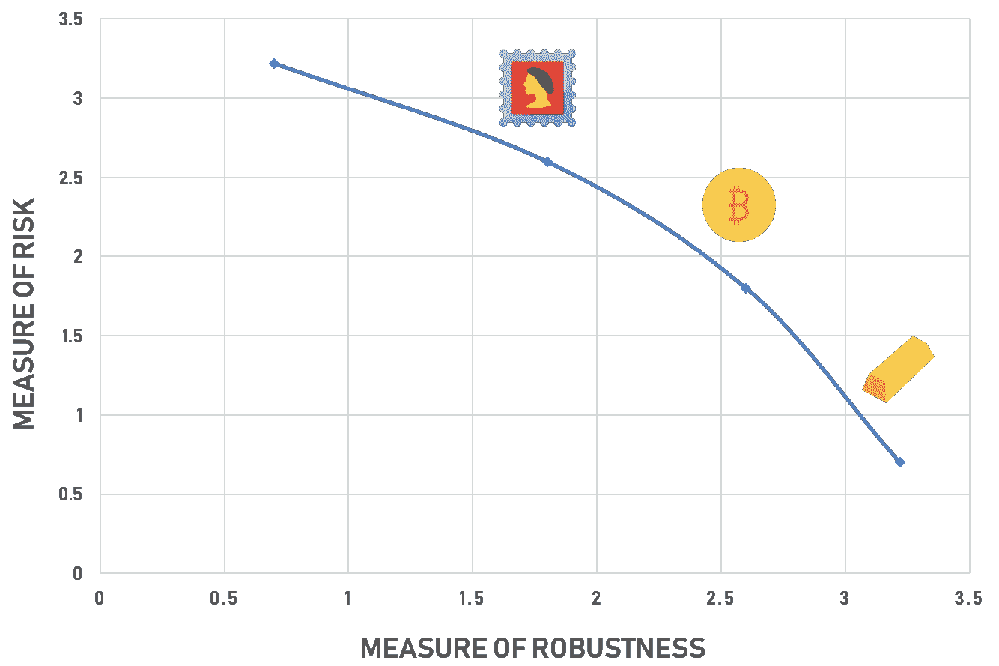
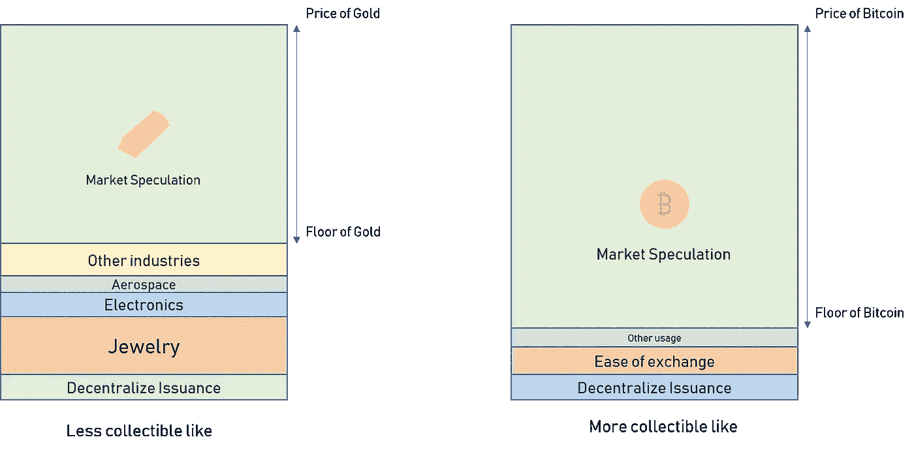
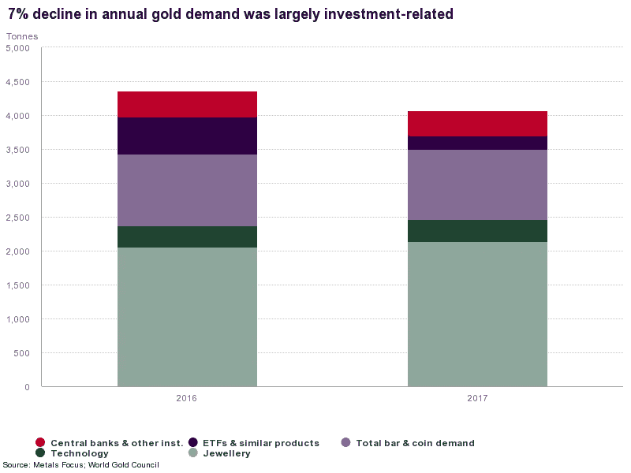

# 比特币作为价值储存手段的评估

> 原文：<https://medium.com/hackernoon/evaluation-of-bitcoin-as-a-store-of-value-2cb0a7961713>

> 人口众多的朋友和拥有大量黄金的朋友哪个更好？—阿尔萨斯特拉

老师说:“一个人口众多的朋友更好，因为这样的朋友会有强大的力量，当他站起来时，可以完成任何工作。”

不是这样的， ***学生说，“一个拥有大量黄金的朋友更好；因为拥有黄金永远是可取的，但军队并不总是必需的。此外，可以用黄金购买军队和其他想要的物品。”***

为什么我们对黄金有如此共同的渴望？我们不能吃金子，穿金子，住金子做的房子，但我们都渴望金子。最有说服力的答案可以从威廉·詹姆斯的著作中发掘出来，“人们珍视他们的黄金，不是因为黄金的独特属性；但是对于黄金背后的力量，购买的力量。真正的利益永远是金钱，而不是黄金。让它不再通用，看看他们能多快摆脱它。”

最近，我们见证了比特币项目叙事的转变。一种点对点的电子现金，现在被宣传为储值手段。在我看来，这样的决定是培育比特币未来增长的一个*的“英明商业之举”。*

**

*The decentralized Store-of-value market dominated by Bitcoin.*

*比特币网络的技术变革代价高昂。它们需要社区的一致认可和严密的安全保证。我们不能忘记，比特币是一种技术，根据经验，我们知道技术会被更好的技术取代。每天都有新的改进建议出现，以应对可伸缩性挑战、更好的智能合同和隐私保护事务。比特币作为一个**点对点** **交易层**与以太坊、Dogecoin、Litecoin、Monero 等改进后的网络对抗，努力维持其市场份额。通过利用更高程度的分散化、原始存在和已建立的网络效应；比特币潜入数字储值蓝海，即数字黄金。*

## *实物黄金*

*一个黄色明亮的物体在埃及人、非洲人和印度河流域文明中被独立发现。这些文明对黄金的独特性感到困惑。在阿尔萨斯特拉的古代文献中，黄金被描述为“莲花的颜色，柔软，有光泽，不会发出任何声音”。黄金被认为是上帝的礼物，最早用于祭祀仪式、器皿和象征宗教或社会重要性的物品。随着黄金购买量的增加，黄金被用于个人物品，如珠宝、饮水器等。天然的稀缺性和光泽的属性有助于作为一个理想的个人之间的收藏品价值，作为财富的象征。对黄金作为理想收藏品的需求甚至持续到今天。*

## *实物黄金和数字黄金之间的重叠相似之处*

*比特币的发行政策与贵金属非常相似，分散且收购成本高昂。诸如审查阻力、信任最小化和轻松突破人为边界的能力等属性有助于它获得应有的光彩。对于黄金和比特币的相似性，一个务实的观点是，这两种物品都可以被描述为**“可替代的收藏品”**。不可替代的收藏品，如艺术品、邮票、纪念品，多年来一直被视为储值手段。与其他不可替代的收藏品相比，比特币和黄金的可替代性有助于**更高的流动性**加强储值用途。*

> *因此，我们可以通过无知的回归定理得出结论，一个对象可以成为一个**稳健的**价值储存手段，只要它在短期内拥有巨大的流动性，并在长期内收敛到稳定性。*

*或者闪光的未必都是金子。比特币未来的潜在价值对我们思想的影响远远超过其实际价值。是否有一个经常被忽视和误解的重要基础支撑着*强健的*储值？*

## *米塞斯的论点*

*路德维希·冯·米塞斯有一个受过教育的观点，“任何物体要成为一个强大的价值储存手段，它必须拥有足够的二次使用。”如今，黄金可以被视为一种稳健的保值手段，多年的经验证据显示了人们对黄金的信心。二次使用的增加推动黄金从收藏领域走向更强劲的价值储存领域。*

## *变得可收藏，变得有价值*

*假设一辆 20 世纪 80 年代生产的汽车正在出售。一辆 1980 年代的质量不错的汽车的实用价值，不考虑品牌和型号，总计为 9000 美元。现在，一名买家支付 19，000 美元购买该车。买家愿意支付两倍的金额，这表明买家更重视汽车的非实用性财产，而不是汽车本身的实用性；从汽车过渡到古董收藏品。内在使用价值与市场价格之间的差距越大，该物品具有收藏价值的可能性就越高。*

*对于金可以观察到相反的行为。黄金开始是一种收藏品；黄金消费只是推动了从收藏品到强劲的储值手段的转变。储值手段是任何能在未来保持购买力的东西。*“一旦我把我的财富放在一个储值物上，我希望将来能恢复同样多的财富”。稳健性水平表示对象符合储值功能的可能性。稳健性与对象的潜在风险程度相关。**

**

*The secondary usage alleviates the underlying risk.*

*对象的潜在风险通过二次使用需求得以缓解。就不可替代的收藏品而言，二次使用可以忽略不计，艺术品的价格完全取决于投机者的感知价值。二次使用的需求创造了一个人为的持续购买墙。买入墙试图建立一个支撑价值储存稳健性的底线。没有二次使用下限的收藏品有自由落体的风险。因此，比特币的一个重要问题是:比特币的二次使用是否足以为价格建立一个坚实的底线？通俗地说，*

> *“我能用我的比特币做什么？”*

**

*The larger the gap between inherent usage value and market price, the higher the probability of the object being a collectible.*

*珠宝的黄金消费继续主导其他黄金消费，如航空航天、牙科、电子等。最近，由于国内需求强劲，2017 年中国的黄金消费量增长了 9.41%，达到 1089 吨。印度和其他中东国家也消费大量黄金用于珠宝和宗教场合。珠宝作为黄金的次要用途，通常会遭到比特币追随者的反驳。*

> *不是因为珠宝可以用黄金制成，因为它是黄金；珠宝是用它制成的，作为财富的象征。*

*同意。尽管如此，我们不能忽视黄金的延展性和光泽属性，这使得黄金在珠宝首饰中的*效用*。吸引力、延展性、稀缺性、共同需求、宗教认可等因素的混合，使得黄金成为有价值的珠宝。*

**

*世界上大约有 170，000 吨黄金。据保守估计，每年消耗 2000 吨，约占有限供应量的 1.1%。按照 1.1%的消费比例，每年至少**37.5+亿美元**的新资本*必须*涌入市场，纯粹是为了消费比特币。我们还没有看到比特币*消费*的明确二次用途。在那之前，比特币将继续走在 ***【可替代收藏品】*** 的道路上，而不是稳健的储值方式。*

> *我们可以选择敌人，但不能选择邻居。我们可以选择我们的关系，但不能选择我们的亲戚。我们可以选择我们的资产，但不能选择我们的利润。*

*安维兰*