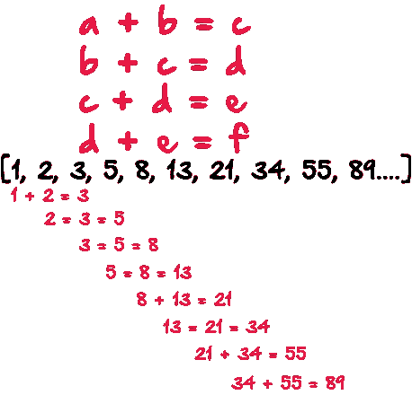
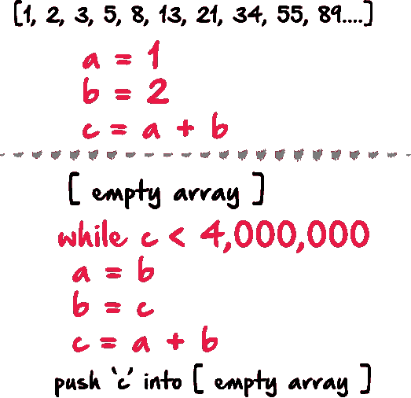

# 偶数斐波纳契数(Python 与 JavaScript)

> 原文：<https://medium.com/hackernoon/even-fibonacci-numbers-python-vs-javascript-55590ccb2fd6>


以某种形式生成斐波那契数列是雇主们普遍面临的技术面试问题。流行的斐波那契数问题的一个变体是生成序列中的所有偶数。在这里，我将研究两种可能的方法，使用 Python 和 JavaScript。为了使事情更简单，我们将只生成序列中低于 4，000，000 的偶数，然后得到所有这些数字的总和。

## 什么是斐波那契数列？

斐波纳契数列中的每一个新项都是通过将前两项相加而生成的。例如，从 1 和 2 开始，序列中的前 10 个数字是:

1, 2, 3, 5, 8, 13, 21, 34, 55, 89

## 我们如何生成序列中的所有数字呢？

我们可以这样开始，考虑通过如下方式生成序列:



这样做的问题是，我们不能为每个数字都创建一个变量，所以更好的解决方案是，一旦我们得到 a + b = c，那么我们就要重置这三个变量的值。所以‘a’现在被设置为‘b’的值，然后‘b’被设置为‘c’的值，等等。可能看起来像这样:



所以基本思想是，在某种循环内部，我们要检查并确保我们没有达到 4，000，000，然后重置 a，b 和 c 的值，然后将 c 推入数组或列表。然后我们可以得到数组或列表的和。

伪代码已经够多了，让我们放一些实际的代码上去，看看会是什么样子:

# Python:

让我们像伪代码一样开始。我将使用 x 作为我的空数组。

```
x = []
a = 1
b = 2
c = a + b
```

接下来，我们将使用 python while 循环来检查并确保`c`小于`4000000.`

```
while c < 4000000:
    a = b
    b = c
    c = a + b
    if c % 2 == 0:
        x.insert(0, c)
```

因为我们只对偶数感兴趣，所以在 while 循环中，我们检查以确保它是一个偶数，然后我们才把它插入到`x.`中。接下来，我们可以添加列表的总和，并用 python 打印总和。

```
numSum = (sum(x))
print numSum
```

# JavaScript:

我想用 JavaScript 和 Python 来解决这个问题。我将首先创建一个空数组，然后设置数组中前两个索引的值:

```
var fib = [];fib[0] = 1;
fib[1] = 2;
```

接下来，我将遍历数组。并通过选择我需要的索引来生成斐波那契数列。在前面的例子中，每次遍历数组时，我们都要重新设置 a、b 和 c 的值。但在这个版本中，我不打算重置任何值，而是像这样做，我取 fib[i]并将其设置为 fib[i-2] + fib[i-1]的值，然后将 fib[i]的值推入数组。

```
for(i=2; i<=50; i++) {
  fib[i] = fib[i-2] + fib[i-1];
  fib.push(fib[i]);
}
```

此时，我有了整个斐波那契数列，而不仅仅是偶数，所以我将使用第二个 for 循环来获得小于 4，000，000 的偶数数组索引。

```
arrUnder4mil = [];
for (var i = 0; i < fib.length; i++) {
  if (fib[i] <= 4000000 && fib[i] %2 == 0) {
    arrUnder4mil.push(fib[i]);
  }
}
```

最后，我将得到数组中所有数字的总和，并记录结果。

```
let fibSum = arrUnder4mil.reduce((a, b) => a + b, 0);console.log(fibSum);
```

# 结论:

尽管我们的 JavaScript 函数更全面一些，但这两个函数都在几毫秒内解决了问题。我的想法是，在这些技术性面试中，用不同的语言用两种不同的方式解决同一个问题，有助于雇主看到你的多面性和创造力。但最重要的是，它展示了你的逻辑思维能力。如果你有任何反馈，请告诉我。谢谢！