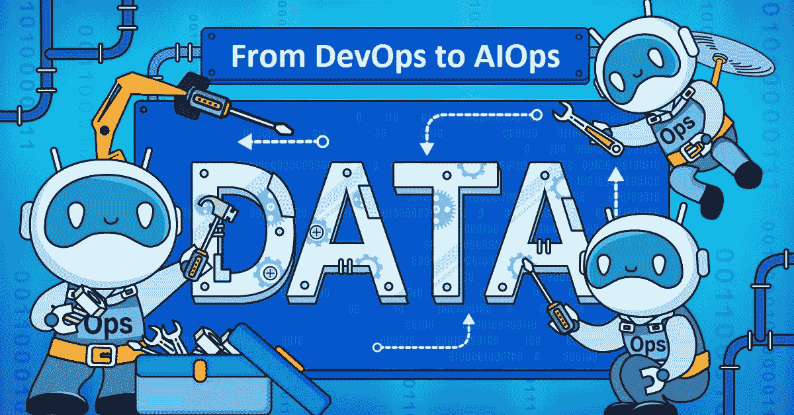
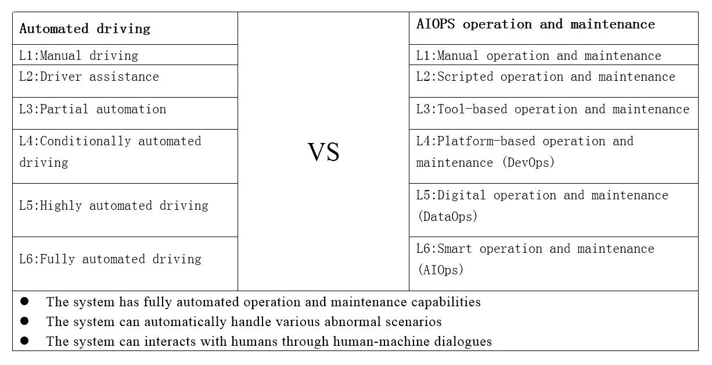
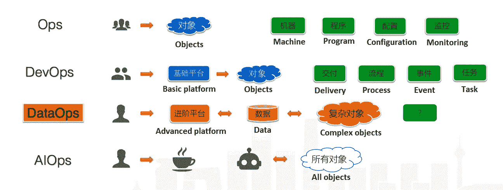

# 更智能:在大数据时代实现 AIOps

> 原文：<https://medium.com/hackernoon/even-smarter-achieving-aiops-in-the-age-of-big-data-8240be07208>

## *数据挑战的新时代如何改变 IT 的运营和维护？阿里巴巴技术团队的最佳实践。*

*本文是大数据*[***AIOps***](/@alitech_2017/aiops-for-big-data-from-alibaba-e147455f71dd)**系列的一部分。**

*人工智能的核心是数据，拥有大量数据的公司正在不断努力提高它能为他们做什么。然而，除了这个简单的事实之外，许多人继续想知道数据参与 AIOps (AI for IT operations)等开发实践意味着什么，或者数据如何被用来代替人类甚至机器驱动的分析。*

*更多的问题比比皆是。如何将机器学习算法与基于大数据的业务运维平台结合使用？机器学习如何增强警报过滤、异常监控、自动化修复和其他任务，以真正解放运维？*

*面对这些问题，阿里巴巴正在摆脱将 AIOps 视为长期进化的信念，转向以数据为中心的 IT 方法。本着这种精神，该集团已经脱离了常见的行业惯例，投资于 DataOps 的强大基础，data ops 是一种自动化、面向流程的方法，数据分析师使用它来提高分析周期的质量和速度。*

*在本文中，我们将探讨运维团队在超越过时的实践并进入数据驱动时代时所面临的挑战和机遇。*

# **从 ScriptOps 到 AIOps，一级一级**

## *L1:脚本程序*

***脚本化运维***

*   *脚本取代手动操作*
*   *执行:人+脚本*
*   *决策:人类*

## *L2:工具*

***自动化运维***

*   *大多数操作和维护工作都是自动或通过流程完成的*
*   *执行力:人+系统*
*   *决策:人类*

## *L3: DevOps*

***高度自动化+单点智能***

*   *运维由数据系统建设完成*
*   *执行力:人+系统(80%)*
*   *决策:人+系统(20%)*

## *L4:数据操作(高级)*

***高度自动化+系列智能***

*   *主要运维场景通过流程实现，无需干预*
*   *执行力:人+系统(95%)*
*   *决策:人+系统(80%)*

## *L5: AIOps*

***全自动智能运维***

*   *可以在成本、质量和效率之间轻松调整*
*   *执行:系统(100%)*
*   *决策:人+系统(95%)*

# *艰难的开端:脚本运行*

*运维工作对技能要求很高，工作范围超过其他 IT 领域。然而，许多人认为它仅限于发布、修改、警报和设备迁移，通常反映了称为脚本运行的过时实践。*

*在某些方面，这是一个不错的想法。所有大型互联网公司都是从小公司起步的，这些问题(以及其他各种各样的问题)威胁着公司的生存。然而，压力和对短期结果的追求导致许多人依赖在线技术论坛甚至个人博客的简单解决方案，留下了误解的遗产，今天的专业人士必须超越这种误解。*

# *工具操作的案例*

*上述观点不仅仅是外界的误解。任何领导过该领域新人的人都可能知道他们倾向于部署一键批量发布软件、一键清理、交互式向导执行或其他“黑屏”脚本。通常，他们只是根据他们个人的感觉重新实现一些这样的解决方案，而没有抓住不同场景中潜在的不幸。这导致了低效率和安全风险，互联网的历史上充满了像输入错误字符这样简单的错误所带来的灾难性后果。*

*今天，人们更好地理解了不应该让新手在他们掌握有限的系统上自由运行。相反，正在推动将越来越多的功能脚本合并到可工作的工具中，这些工具可以确保它们所提供的功能的有效移交——简称为工具操作。*

# *转向基于平台的开发运维*

*当一家互联网公司的商业成功提升了运营规模，量变开始在数据层面产生质变。如今，大型工厂的运营和维护需要全新的计算实践，简单地增加员工不是解决方案。*

*换句话说，当应用从数百个平台单元增长到数万或数十万个平台单元时，数据处理从简单的 CPU、内存和机械硬盘转变为 GPU、FPGAs、ASICs、Optane SSDs 和其他硬件、软件和大数据分布的精心组合。*

*当问题威胁到大型平台的业务和资源时，数据工作者经常面临近乎不可能的任务。在这种情况下，操作和维护工作描述更类似于:*

*全球架构规划*

*资源运作和成本优化*

*自动化平台开发*

*稳定性保护*

*海量数据分析*

*任何无法预见的情况…*

*对于阿里巴巴来说，开发平台来帮助这些情况下的操作和维护人员现在是理所当然的。*

# *进入数据操作阶段*

*随着阿里巴巴业务的增长，其运营和维护能力也在深度和精度上有所提高。通过软件工程和基于数据的创新，操作和维护工具必须适应处理超大规模分布式集群管理，并提高整体产品的稳定性、效率和成本。这对操作和维护人员提出了巨大的挑战，并对他们的技能提出了很高的要求。*

*同时，更广泛的行业也朝着 AIOps 的流行概念发展。该领域作为一个整体正在推动对这些实践的更大认识，这是由一个强大的算法可以取代现在由人类劳动提供的智能的想法所驱动的。完全自动化仍然是一个超越今天现实的雄心勃勃的目标，就像无人驾驶交通一样。*

*在阿里巴巴，普遍的想法是，如果一个算法是核心，那么它的价值取决于致力于实现它的工程数量。这实质上描述了 DataOps 阶段背后的思路，在这个阶段，数据出现在所有运维目标中，数据驱动的运维得到了有效的实施。*

*下图说明了前面提到的与自动驾驶的比较。*

**

# *转变团队*

*在大数据时代，运维人员需要为一个正在转型的行业培养一套新的技能。现在的关键能力包括架构技能、研发、运维商业意识、算法工程、TPM(技术项目管理)能力。*

*开发有效的 AIOps 对阿里巴巴的运维平台和产品至关重要。除了最初的构建，人类的投入和参与将继续定义长期工作模型的进展。这需要大量的工人，以及不同背景和业务口径的专家和分析师。在人之外，它涉及支持可视化技术、机器学习技术、大数据分析、开发场景分析、平台落地，所有这些都有助于开发人员寻求的最终商业价值。*

**

*New trend of operation and maintenance*

*改造整个运维团队往往是一个痛苦的过程。资质变了自然带来组织上的变化，对老牌人员的冲击比较大。从维护到研发，首先改变的永远是意识形态。在技术创新中，总是有最初的原则，然后是新项目的逐步实施，而传统的运维人员则确保持续的稳定性。*

*从灭火到转型运营，这种痛苦也是任何团队都要经历的转型的一部分。最终，这应该是从问题驱动的工作到价值驱动的工作，从运维人工到运维开发，从依靠经验到依靠更聪明的洞察的转变。这不仅意味着技术能力的转变，也意味着以拥抱变化和与时俱进的精神进行业务和系统思维的转变。*

*(Original article by Ke Min 柯旻)*

**本文是* ***大数据 AIOps*** *系列的一部分。**

# *阿里巴巴科技*

*关于阿里巴巴最新技术的第一手深度资料→脸书: [**【阿里巴巴科技】**](http://www.facebook.com/AlibabaTechnology) 。Twitter:[**【AlibabaTech】**](https://twitter.com/AliTech2017)。*