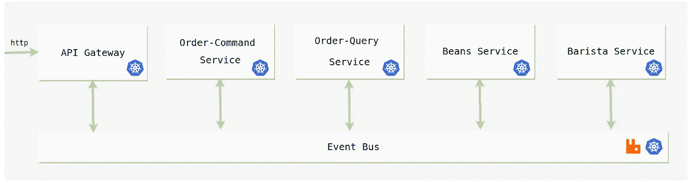
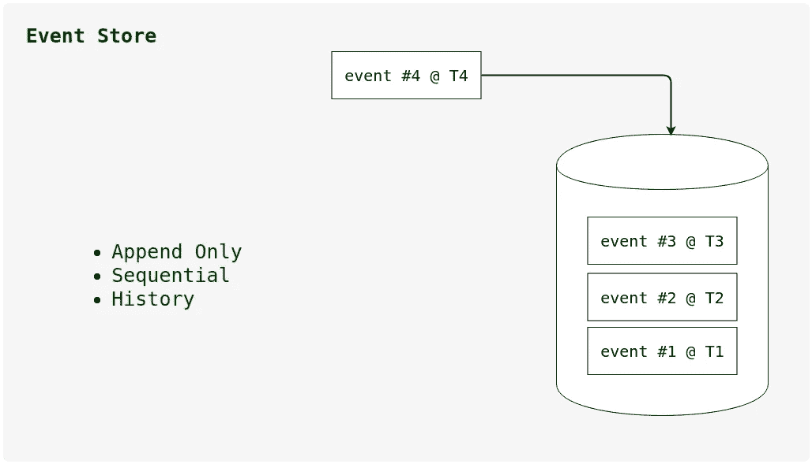
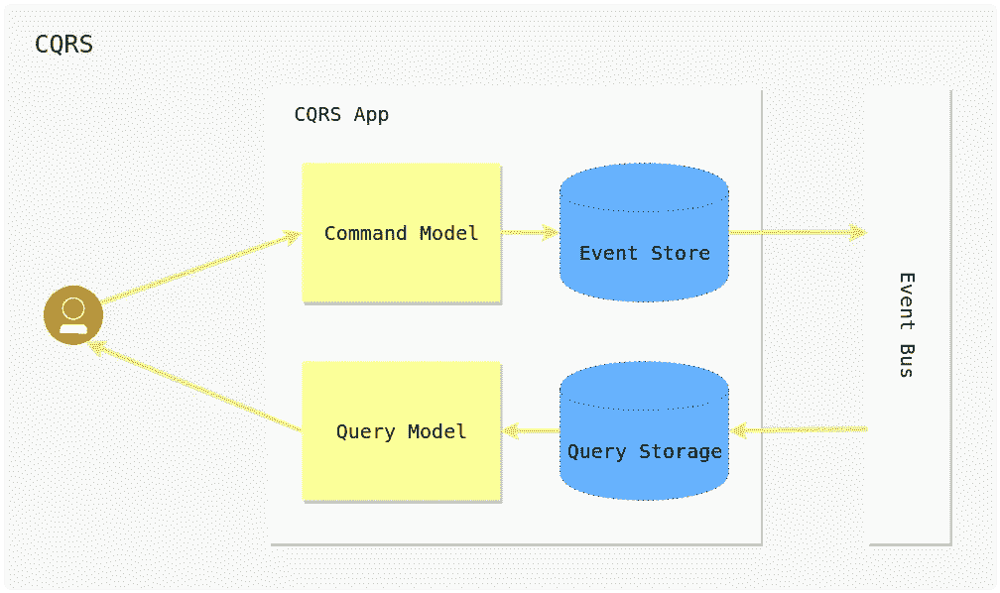
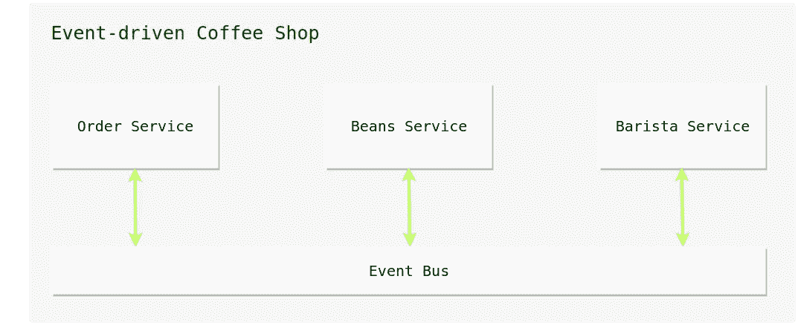
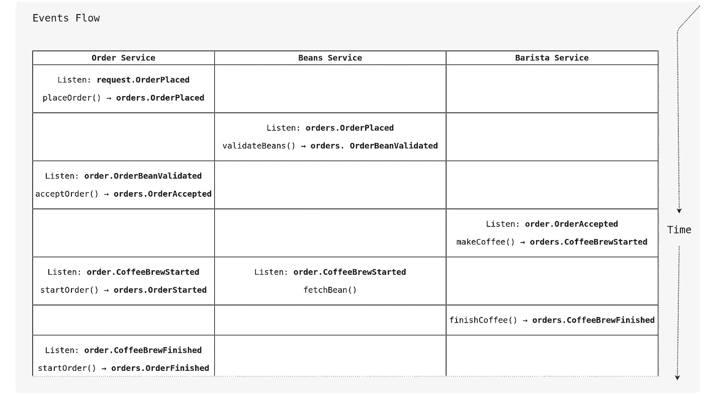
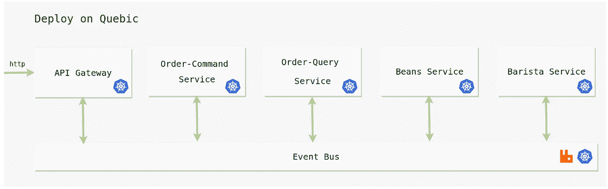

# 采用 Quebic 的事件驱动微服务

> 原文：<https://medium.com/hackernoon/event-driven-microservices-with-quebic-f65f99a5b25a>



嗨，今天我将讨论如何使用 Quebic [框架](https://hackernoon.com/tagged/framework)开发事件驱动的[微服务](https://hackernoon.com/tagged/microservices)。如果你是微服务的新手，你可以参考我以前的[文章](/@tharanganilupul/microservices-implementation-netflix-stack-ba4f4a57a79f)，它涵盖了微服务的主要概念。如果你是 Quebic 的新手，请仔细阅读这份[文件](https://github.com/quebic-source/quebic)。

## 主要话题

1.  为什么我们需要事件驱动的微服务
2.  活动采购
3.  事件驱动的
4.  CQRS
5.  示例应用程序-事件驱动的咖啡店
6.  事件流
7.  Quebic 入门
8.  Quebic - EventBox
9.  履行
10.  如何运行示例应用程序

# **1。为什么我们需要事件驱动的微服务**

## *服务之间没有外键约束*

假设您有两个服务。一个服务是用户服务，另一个是搜索服务，该服务为搜索而优化。当用户服务存储新的用户数据时，它也调用搜索服务来存储相关数据。如果有人从用户服务中删除用户数据，搜索服务并不知道这一删除。

## 分布式事务是困难的

当一些事务通过多个服务发生时，如果在执行过程中出现问题，由于事务涉及多个位置，很难确定谁负责再现/回滚。

## 服务之间的高度耦合

当我们想要在服务之间交换信息时，我们需要了解彼此。然后需要知道如何到达另一个服务以及如何响应它。

## 难以扩展

在传统的微服务架构中，所有服务间的通信都是以请求-响应的方式进行的。如果一个服务变慢了，那么这个服务的所有调用堆栈也会变慢。这使得系统难以扩展。

让我们看看如何使用事件源和事件驱动架构概念来最小化这些挑战。

# 2.活动采购



事件源将每个状态事务作为一个事件存储在日志中。

为特定域存储所有事件。领域事件是事件源架构背后的主要关键概念。

领域事件是一种表示过去发生的某件事情的数据结构。领域事件是不可变的和不朽的。这意味着永远不要改变或从事件存储中删除它。

有了事件源架构，我们就有了一个审计线索来告诉我们过去的事情是如何发生的。现在我们知道如何再现/回滚系统的状态。这确实有助于识别分布式系统中出现的问题。

# 3.事件驱动的

事件驱动架构有助于消除服务之间的高度耦合。每个服务都可以独立运行，不需要知道如何联系其他服务。每个人都在收听他们自己的事件。

有了事件驱动的微服务，所有的操作都以最终一致的方式发生。用户不再等待并得到响应，而是使用跟踪器来跟踪他的请求。但最终他能得到正确的回应。

让我们看看如何使用这些概念实现事件驱动的微服务。

# 4.CQRS



CQRS 代表命令查询责任分离。该模式用于从事件流创建物化视图。CQRS 模式是基于事件源和事件驱动的架构概念构建的。

根据 CQRS 模式，您可以将应用程序的读写部分划分到单独的模块中。读取部分称为查询模型，写入部分称为命令模型。

但是不要求将命令和查询模型保存在单独的项目中。如果你愿意，你可以把两个模块放在同一个项目中，然后这些模块在同一个进程中运行。但是这些模块是完全独立，任何时候你都可以把它们分开。

CQRS 把读和写分开。那么它有助于独立缩放这两个部分。每一面都得到优化。

我想，我们已经讨论了大部分理论。让我们开始实施吧。

# 5.示例应用程序-事件驱动的咖啡店



在这里，您可以看到我们有三个微服务。订单服务、豆子服务和咖啡师服务。来源[位置](https://github.com/quebic-source/quebic-sample-project/tree/master/event-driven-microservice-coffee-shop)。

**订单服务**负责管理来自用户的订单。

**bean-service**负责在处理订单之前存储和验证 bean。

咖啡师服务负责根据订单制作咖啡。

# 6.事件流



我不会解释整个事件流程，但我会解释一些要点。这里的第一步是*订单-服务*正在监听*请求。已下单的*事件。

该事件由 API-Gateway 触发。在 *orders-service* 收到事件后，它创建 *reference-id* 并将该 *reference-id* 返回给 API-Gateway。然后，用户最终可以使用*引用 id* 来跟踪他的订单。

然后*订单服务*调用 *placeOrder()* 方法。该方法负责创建*订单。已订购的*域-事件。 *reference-id* (在之前的步骤中创建)被用作域事件的 *aggregate-id* 。

# 7.**que BIC 入门**

Quebic 是一个用于编写在 Kubernetes 上运行的无服务器函数的框架。你可以用任何语言编写你的函数。目前 Quebic 只支持 Java 和 NodeJS。Github [回购](https://github.com/quebic-source/quebic)。

# 8. **Quebic - EventBox**

EventBox 支持 Quebic 的事件源功能。使用 Eventbox，您可以维护域的事件存储，EventBox 提供了检查特定域下的域事件的方法。这有助于在应用程序中利用事件源的优势。您可以通过使用它的 REST 界面或仪表板 UI 来访问 EventBox。

## 创建域

*   **仪表盘 UI**

转到事件存储部分，然后单击创建按钮。然后它会打开域名创建界面。有三个必填字段。

**名称:**域名。为您的域提供唯一的名称以便识别

**事件组:**这将是事件类型的前缀值。让我们来看一些事件类型。

*下命令。下单*，*订单。订单确认*

这里所有的事件类型都以“订单”前缀开始。那就是那个事件的事件组。通过提到事件组，这个域将只监听*命令。** 事件类型。

**聚合 ID 字段:**域事件的聚合字段名称。您可以设置域对象的身份字段名称。

*   **休息界面**

```
curl -X POST http://<eventbox-host:port>/api/domains
-H 'content-type: application/json' 
-d '{
     "name":"orders",
     "eventGroup":"orders",
     "aggregateIdField":"id"
 }'
```

## 获取域事件

*   **仪表盘 UI**

转到事件存储部分，它将显示创建的域。从其中一个域中打开右键菜单。选择菜单中的域-事件链接。然后它将被重定向到域事件页面。

*   **休息界面**

```
curl http://<eventbox-host:port>/api/domains/<domain-name>/domain-events
```

# 9.**实施**



根据我们的示例项目，我们有三个微服务*订单——服务*、*豆子——服务*和*咖啡师——服务*。根据 CQRS 模式，我们可以将*订单-服务*分为两个模块*订单-普通-服务*和*订单-查询-服务*。我们将使用 Quebic 函数实现每个模块。

在这里，我将解释一些重要的观点。您可以在此处的的[中找到该示例应用程序的完整实现。](https://github.com/quebic-source/quebic-sample-project/tree/master/event-driven-microservice-coffee-shop)

## 订单-命令-服务

在 orders-commond-service 中，只允许用户进行写操作。这是它的[功能规格文件](https://github.com/quebic-source/quebic-sample-project/blob/master/event-driven-microservice-coffee-shop/orders-command-service/function_spec.yml)的一部分。

```
...
replicas: 1
events:
  - request.OrderPlaced
  - orders.OrderBeanValidated
  - orders.OrderBeanCancelled
  - orders.CoffeeBrewStarted
  - orders.CoffeeBrewFinished
```

根据 events 部分，这个函数将只监听*的请求。下单*，*订单。订单确认*等..事件。

让我们检查它的[处理程序实现](https://github.com/quebic-source/quebic-sample-project/blob/master/event-driven-microservice-coffee-shop/orders-command-service/main.js)。它使用 *context.eventID* 将请求映射到特定的方法。

## 订单-查询-服务

在订单-查询-服务中，只允许用户进行读取操作。

当接收到一个从‘订单’开始的事件时(例如:*订单。OrderPlaced* )前缀，则事件的有效负载存储在查询数据存储中。对于这个例子，我只是使用 JavaScript 数据结构作为查询数据存储。但是如果你愿意，你可以使用一些外部数据库来查询数据存储。

让我们检查它的[处理程序实现](https://github.com/quebic-source/quebic-sample-project/blob/master/event-driven-microservice-coffee-shop/orders-query-service/main.js)。你可以看到，它在加载函数-容器时调用 [fetchLatestPayloads()](https://github.com/quebic-source/quebic-sample-project/blob/master/event-driven-microservice-coffee-shop/orders-query-service/main.js#L4) 方法。在其中，它调用 EventBox 来获取特定域的最新事件负载。

```
http://<eventbox-host:port>/api/domains/<domain-name>/domain-events/latest-payloads
```

EventBox 存储所有域事件，这个端点代表系统在特定域下的当前状态。

当*订单-查询-服务*启动/重新启动时，它调用 *fetchLatestPayloads()* 方法。这将有助于用域-事件-存储更新查询数据存储，并确保*订单-查询-服务*的所有实例保持相同的查询数据存储。

您可以使用 *EVENTBOX_URI* 环境变量获得 EventBox 的连接 URI。

## **路由规则**

让我们来看看[下单路由规则](https://github.com/quebic-source/quebic-sample-project/blob/master/event-driven-microservice-coffee-shop/routes/order-place-route.yml)。这是一个下新订单的 http 请求示例。这将返回订单 id 为的已创建订单。

```
<api-gateway-host:port>/orders POSTContent-Type: "application/json"
{
     "beanType":"bean_type_1"
}
```

让我们来看看[订单提取路由规则。](https://github.com/quebic-source/quebic-sample-project/blob/master/event-driven-microservice-coffee-shop/routes/order-fetch-route.yml)这是获取订单详细信息的 http 请求示例。

```
<api-gateway-host:port>/orders/{order-id} GET
```

当用户向 API 网关发送 http 请求后，它就会触发*请求。订单获取*事件。收到*订单-查询-服务*事件，然后从查询数据存储中获取相关的订单细节。

这个*订单 id* 是下单时创建的*参考 id* 。而这个 *order-id* 就是域事件的 *aggregate-id* 。

# 10.如何运行示例应用程序

此[文档](https://github.com/quebic-source/quebic-sample-project/blob/master/event-driven-microservice-coffee-shop/README.md)包含运行示例应用程序的所有说明。

我想你对事件驱动的微服务以及如何用 Quebic 实现它有了相当的了解。如果有任何问题，请与我联系。我真的期待你的宝贵反馈。感谢阅读。祝你好运。

## 参考