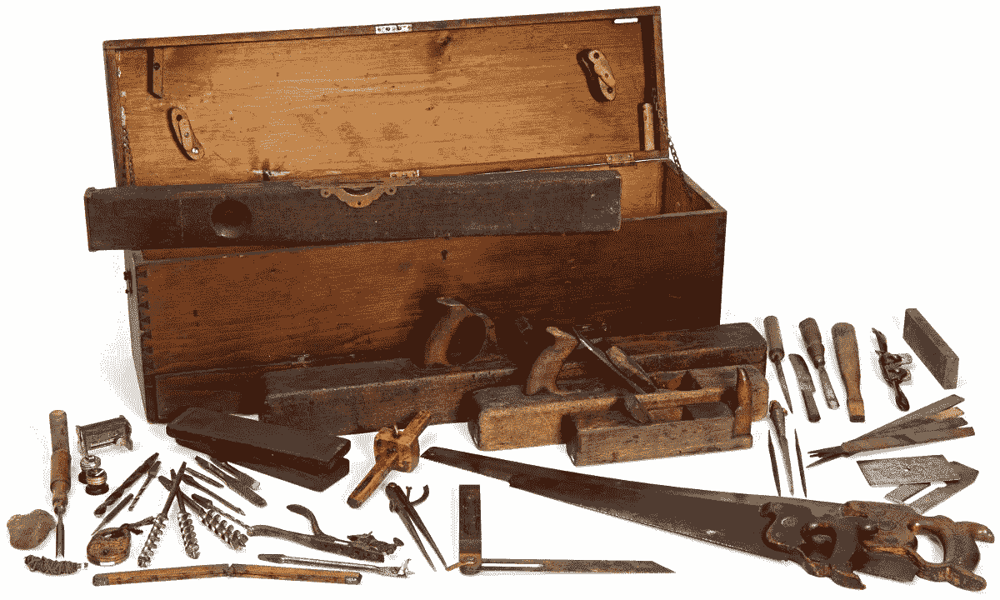

# 作为一等公民的事件

> 原文：<https://medium.com/hackernoon/events-as-first-class-citizens-8633e8479493>

[Image Source](http://www.flickr.com/photos/minnesotahistoricalsociety/5494632378/sizes/l/in/photostream/)

我们都听说过事件和事件驱动的编程，但是根据我的经验，事件在我们([软件](https://hackernoon.com/tagged/software))的生活中用得还远远不够。我们经常没有意识到这个工具在我们的工具箱中有多么强大，因此我们没有在真正应该利用它的时候利用它。

在这篇文章中，我将在 Stitch Fix 上讨论一个“修复”的生命周期，以及我们如何使用事件来建模它。我建议我们应该把事件看作我们系统中的一等公民，因为它们帮助我们分离系统的各个部分，并独立地思考它们。最后，我将讨论在现实世界中使用事件是多么普遍，并使用软件开发本身的隐喻来帮助开发基于事件的系统的直觉。

# **补丁的生命周期**

在 Stitch Fix，工程团队构建并运营 70 多个独立的应用程序和服务，服务于 Stitch Fix 业务的各个方面。我们的销售团队负责购买服装，我们的仓库运营团队负责存储和运输服装，我们的数千人造型团队负责为客户挑选服装。我们有客户使用的应用程序来安排他们的修复，对他们进行评级，并为他们支付费用。我们的客户体验团队使用我们的应用程序来帮助我们的客户获得最佳的服装购买体验。几乎所有这些应用程序和服务都在我们业务中的一个或多个核心实体上运行——客户端、项目、修复等。—以这样或那样的方式。

仅举一个激励性的例子，当客户告诉我们她希望在某一天收到修复时，就产生了一个新生的修复(日程安排)。根据补丁的发货地点和时间，我们将其分配到我们在美国各地的一个仓库(仓库分配)，并让我们的 3500 名设计师之一为其设计风格(设计师分配)。造型师选择了 5 件她希望顾客喜欢的物品(造型)，我们已经准备好发出去了。仓库团队负责挑选、包装和运送修复产品，客户在家门口就能收到。她留着自己想要的，不要的退掉(结账)。循环就完成了。

我们刚刚描述了一个中等复杂的工作流，有许多单独的步骤，都在一个单一的修复上操作。从软件工程的角度来看，建模的直接方式是作为一个状态机，用单独的事件表明修复已经从一种状态转换到另一种状态。这正是我们实现它的方式。以下是此工作流程的简化表示:

*   请求修复
*   ->搞定是*_ 预定*
*   将固定分配给仓库
*   -> Fix 是 *_hizzy_assigned* (我们把自己的仓库叫做“hizzies”；不要问)
*   给发型师做头发
*   ->修复是 *_stylist_assigned*
*   样式修复
*   ->修罗是*_ style*
*   选择要修复的项目
*   ->修罗是*_ 媞*
*   把这些物品装进箱子里
*   ->修复完毕*_ 打包*
*   通过运输公司运输修补程序
*   ->修复是*_ 运出*
*   修复旅行(作为实际的原子！)给客户
*   ->修复已交付*_ 交付*
*   客户决定保留和归还什么，支付修复费用
*   ->修复是*_ 已检出*

几件事立刻浮现在脑海中:

*   随着修复的顺利进行，不同的应用程序或服务对它做了一些事情，通过用更多(元)数据丰富它，通过将它与其他东西连接起来，或者通过对商品或包装做一些物理的事情。做某事会将修复从一个状态转移到另一个状态(*状态转换*)。
*   下一个应用程序或服务只有在前一个已经完成其工作时才能完成其工作，因此需要知道何时升级(*事件*)。
*   我们不能跳过这些步骤中的任何一个，否则就会遗漏一些东西——在许多情况下，确实如此。换句话说，从一个给定的状态，只可能转到其他状态的子集(*状态机*)。
*   如果我们只记得事情的当前状态——修复现在在哪里——我们会错过很多。我们希望能够知道补丁现在在哪里，但是我们也希望知道它在哪里，在那里多长时间，以及何时进入下一步。因此，如果我们只将它的当前状态存储在某个数据库表中，而不存储其他任何信息，我们就会陷入困境。相反，我们还需要记录下一路上的所有步骤。

# **一等公民事件**

请注意，如果我们只拥有经典三层架构的标准工具，我们将会陷入困境。我们都熟悉这三个基本的应用程序构建模块:

*   演示:用户与系统交互的用户界面
*   应用程序:我们工作的“业务逻辑”，通常是无状态的
*   持久性:我们存储东西的地方，通常是在数据库中

我坚信事件代表了第四个基本构件:

*   事件:一件有趣的事情发生的声明，或者，根据维基百科，“状态的重大变化”

在像 Stitch Fix 这样的[微]服务架构中，给定的应用程序或服务可能是事件的生产者、事件的消费者，或者两者兼而有之。例如，造型应用程序监听 *_stylist_assigned* 事件，并向造型师显示她对修复进行造型所需的所有信息。当她完成修复后，她点击“Ship It”按钮，这个按钮(除了别的以外)发布了 *_styled* 事件。仓库服务监听该事件，并可以开始它们的工作，等等。

消费这些事件和产生这些事件是这些应用程序和服务的一流部分；他们需要这些事件来完成他们的工作。因此，当我们谈论这些服务之一的“接口”时，让我们明确这一点。一种服务接口包括:

*   同步请求-响应操作(例如，为了使用，这是 REST/JSON，但是它可以很容易地通过 gRPC、Thrift 等。)
*   服务产生的事件
*   服务消费的事件
*   批量读取和写入(例如，将数据从服务提取到分析系统的 ETL)

更一般地说，服务的接口包括将数据输入或输出服务的任何机制。作为服务所有者或服务消费者，如果我们忘记了这一点，后果自负。

# **事件为解耦**

事件的制作者发布它，零个或多个消费者订阅它。也许没人在听；可能一个是；可能很多都是。制片人不知道也不关心。这提供了生产者和消费者彼此完全解耦的良好特性。我们可以添加更多的消费者，删除他们，或者扩大或缩小他们的规模——而生产者对此一无所知。

# **事件实录**

一旦我们将实体的所有有趣的状态转换表示为事件，我们就可以使用这些事件来记录该实体在何时发生了什么。当我们想回去看看发生了什么时，这是非常有价值的。当我们的客户体验团队(想想“客户支持”，但更多的是微笑和同情)试图帮助客户时，他们通常会查找修复的历史。对于我们的数据科学团队来说，使用围绕修复的事件来优化我们工作流的各个方面是很常见的。我们的工程团队经常将它用作调试和诊断工具。

从这个观点的逻辑结论来看，我们可以想象:“仅仅”,保留事件，而从不费心以任何永久的方式存储当前状态。毕竟，我们总是可以通过向前播放事件来简单地重建它。这是一个如此聪明的想法，人们已经想到了——它被称为“事件采购”(见[格雷格杨](https://goodenoughsoftware.net/tag/event-sourcing/)、[克里斯理查森](http://microservices.io/patterns/data/event-sourcing.html)等的许多著作。)，而且它有很多奇妙的弹性属性，尤其是在分布式系统中。事实上，有基于这种想法的整个软件系统([事件存储](https://eventstore.org/)、[卡夫卡](https://www.confluent.io/blog/apache-kafka-for-service-architectures/)、[阿卡持久性](https://doc.akka.io/docs/akka/2.5.4/scala/persistence.html#event-sourcing)等)。).当然，这也正是复式记账在会计中的运作方式，所以即使是这些(非常聪明的)人在 700 年前也被美第奇家族抢占了先机。

# **事件是真实世界的运作方式**

经常听说开发者很难从事件的角度去思考。如果您习惯于构建经典的三层架构，这可能会有点违反直觉。让人们犯错的是，在任何给定的时刻，我们系统的某个部分可能发生了一些事情，但这种行为的影响在我们系统的其他部分还看不到。我们在这里使用“最终一致性”和“异步”这样的词，它们以难以推理而闻名。但是我想建议你对事件的直觉比你认为的要多得多。如果你能把你的问题想成一个工作流程，你就成功了一半以上。

所以让我们举一个每个软件工程师都熟悉的例子。想象一个典型的现代软件开发过程，其中我们编写代码，将其签入源代码控制，测试它，登台它，并部署它。我们经常称之为“生命周期”或“管道”或“工作流”。嗯，听起来很像事件。让我们看看。

*   写代码
*   ->代码为*_ 已提交*
*   试验码
*   ->代码已通过*测试*
*   将其部署到临时服务器
*   ->代码是 *_staged*
*   将其部署到生产中
*   ->代号为*_ 部署了*

这看起来非常熟悉——我们每天都这样做！它不仅仅是角落里一个无关紧要的东西。对我们大多数人来说，这是我们的工作。

想一想，如果这不像一个异步的工作流，我们同步地做所有这些。想象一下，每次在 IDE 中按下 return 键，您的代码就会被部署到生产环境中。我完全支持持续交付，相信我，但这太疯狂了。

因此，你不能对系统的一部分和另一部分之间存在“不一致”的系统进行推理的想法有点愚蠢。在一天的大部分时间里，您的代码在您的笔记本电脑上有一个版本，而在生产中有另一个“陈旧”的版本，一切都运行良好。

# **结论**

谢谢你读到这里。如果你有，我希望我已经让你想到你应该更经常地使用工具箱中的“事件”工具。它可以在很多方面帮助你。

如果你对事件推理有困难，想想你每天做了 8、10、12 个小时。

# **有用资源**

如果您有兴趣加深对事件和事件驱动系统的了解，请查看:

*   [管理微服务中的数据](https://www.infoq.com/presentations/microservices-data-centric)，来自我在 QCon New York 2017 上的演讲的幻灯片/视频
*   [事件驱动架构的多种含义](https://www.youtube.com/watch?v=STKCRSUsyP0)，Martin Fowler 在 GOTO Chicago 2017 上的主题演讲视频
*   [微服务和事件采购模式](http://microservices.io/patterns/data/event-sourcing.html)，作者 [Chris Richardson](http://chrisrichardson.net/)
*   [CQRS 和活动采购](https://www.youtube.com/watch?v=JHGkaShoyNs)，作者[格雷格·杨](https://goodenoughsoftware.net/)
*   [企业集成模式](http://www.enterpriseintegrationpatterns.com/)，由 [Gregor Hohpe](http://www.enterpriseintegrationpatterns.com/gregor.html) 撰写的经典老掉牙但仍然非常不错的书籍和模式集