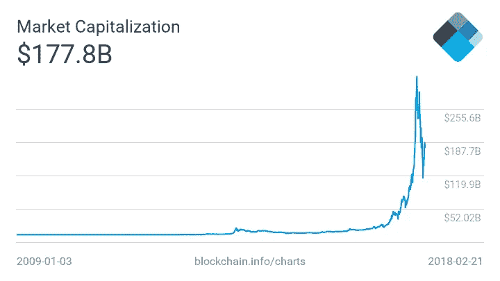

# 每一个缺点都有它的优点:回顾区块链

> 原文：<https://medium.com/hackernoon/every-disadvantage-has-its-advantage-reviewing-blockchain-1965e3462ba4>

[区块链](https://hackernoon.com/tagged/blockchain)现在已经成为一场运动，甚至可能是一场革命。区块链的传播者会让你相信它是灵丹妙药。自 2009 年以来，区块链技术一直在进步，尽管我们仍处于起步阶段，但我们已经走过了漫长的道路。在这个过程中，我们遇到了区块链带来的不完美。

> 正是不完美让事物变得美丽。

The pixelated image is what makes it beautiful

这篇文章是关于重温区块链的不完善之处。学者们一直在研究和开发消除这些缺陷的算法和机制。有成功和失败的意识形态。有一个反复试验的阶段。但是他们说:**只有当你低落的时候，你才会成长。**

因此，让我们深入到混乱中。

## 对地球母亲毫不留情(至少目前如此)

Source: [https://icons8.com](https://icons8.com/icon/set/earth/all)/

区块链目前有自己特殊的*方式* *操作方式* — **工作证明(PoW)和利益证明(PoS)。**这两个都是共识算法。首先是工作证明，这不是维持区块链网络的可持续方式，然后是解决工作证明问题的利益证明。

 [## 比特币采矿现在比包括爱尔兰在内的 159 个国家消耗更多的电力&大多数国家…

### 上面的地图显示了哪些国家消耗的电力少于全球比特币开采消耗的电力…

powercompare.co.uk](https://powercompare.co.uk/bitcoin/) 

在以功率为共识的区块链协议中，每个节点执行计算量很大的计算来获得一个密码。这些节点被称为**挖掘器。**这说明了区块链网络中的以下情况:

1.  容错
2.  零停机时间
3.  存储在区块链上的数据永远不变

这些矿工不断求解复杂的数学方程以获得奖励。获得奖励的人是区块链下一个街区的创造者。但是，一次只能添加一个块。因此，其他矿工所做的计算工作被浪费了。

在 PoS 中，没有“打赏”这个概念。这里，新块的创建者是以预定的方式选择的，这取决于节点在特定时间的财富(也称为赌注)。这里，节点被称为**伪造者。**这是维护区块链网络的一种更经济的方式。

[比特币](https://hackernoon.com/tagged/bitcoin)作用于 PoW，以太坊从 PoW 转向了 PoS。

目前，在撰写本文时，比特币的总市值为 177，782，332，242 美元。所以可想而知市场有多疯狂。

## 可扩展性问题

Source: [https://icons8.com/](https://icons8.com/icon/set/grow/all)

当这个网络上每秒只能发生 7 次交易时，它打破了那些将比特币视为有效货币的人。为了便于比较，Hyperledger 可以处理 10，000 Txn/秒，Visa 可以处理 24，000 Txn/秒。

这些可伸缩性问题使区块链的实际应用受到质疑。由于每个参与节点必须验证网络中的事务，因此每秒发生的事务总数是有限的。比特币交易可能需要几个小时才能完成。如果你希望你的交易迅速，你需要花额外的汽油。

在参与节点数量有限的新网络中，资源的缺乏会导致两个问题(考虑需求-供应场景):

1.  **更高的成本:**节点想要更高的回报
2.  **较慢的事务:**节点希望首先提交具有较高回报的事务，这将导致积压

## **储存**

Source: [https://icons8.com/](https://icons8.com/icon/set/grow/all)

分散式数据库的要点在于，每个参与节点都有一份实际数据库的副本。但是随着事务数量的增加，数据库的规模像宇宙一样膨胀！事务将永远存储在数据库中，因为数据库本质上是只追加不可变的。每个节点如何存储无限量的累积数据？

作为参考，以太坊区块链以每年 55 GB 的速度增长。

## 隐私

Source: [https://icons8.com/](https://icons8.com/icon/set/grow/all)

虽然公共区块链上的数据是加密的，并被吹捧为匿名的，但却掌握在每个参与节点的手中。通过交易模式追踪你的身份是可能的。网络追踪器和 cookies 已经被用于追踪身份的调查中，这证明区块链并不像看起来那么隐私。

 [## 检察官追踪价值 1340 万美元的比特币，从丝绸之路转移到乌布里切特的笔记本电脑上

### 如果还有人相信比特币是神奇的匿名互联网货币，美国政府刚刚提供了可能…

www.wired.com](https://www.wired.com/2015/01/prosecutors-trace-13-4-million-bitcoins-silk-road-ulbrichts-laptop/) 

## 安全性

Source: [https://icons8.com/](https://icons8.com/icon/set/grow/all)

> 如果 51%的节点说谎，谎言就会变成真相。

这被称为“ **51%攻击**”，中本聪在推出比特币时强调了这一点。每个人都必须时刻关注网络，提防不必要的影响。

希望工程技术的进步迟早会解决这些问题。最好的部分是，人们正在以一种好的方式对待这些缺点。没有什么能阻止他们采用这项技术。这些担忧将被解决，这只是时间问题。

## 向区块链致敬！

Source: [http://www.cartoonbrew.com/cartoon-culture/t-shirt-of-the-day-39734.html](http://www.cartoonbrew.com/cartoon-culture/t-shirt-of-the-day-39734.html)

鳍。