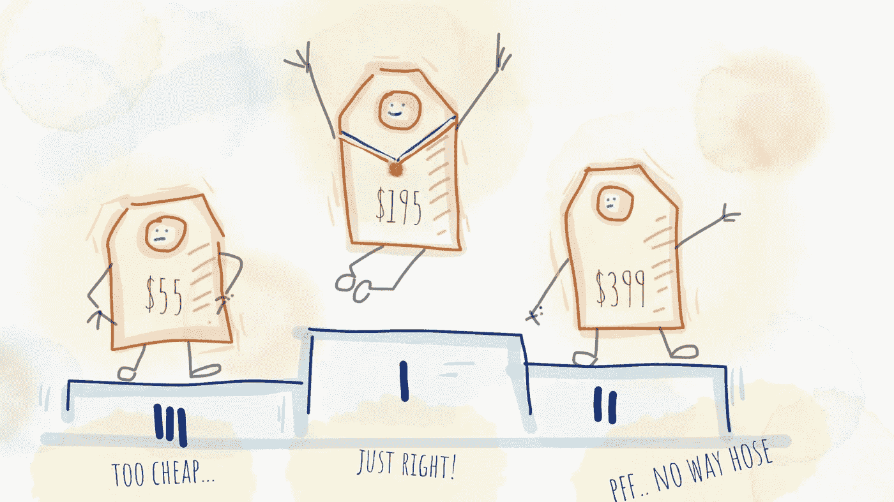
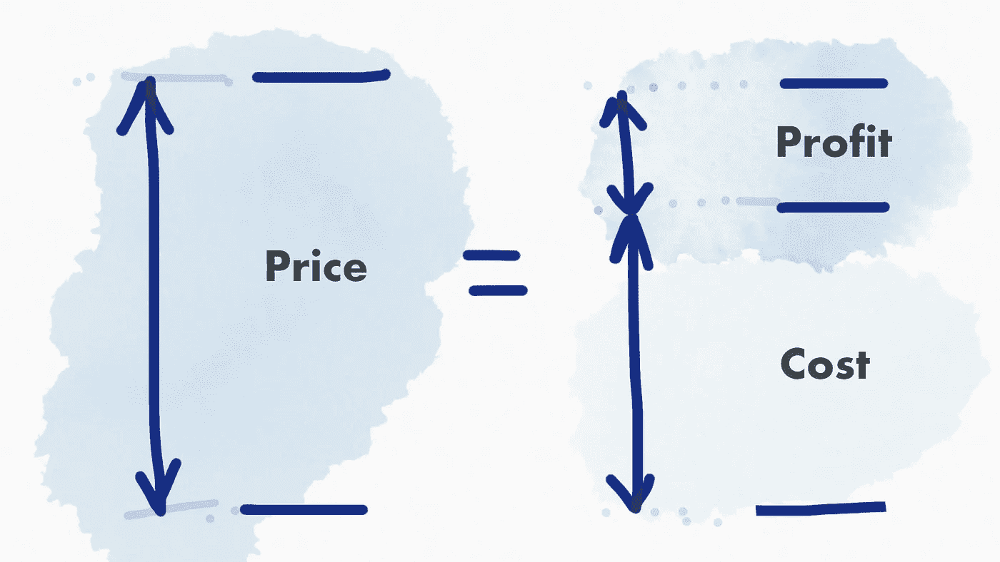
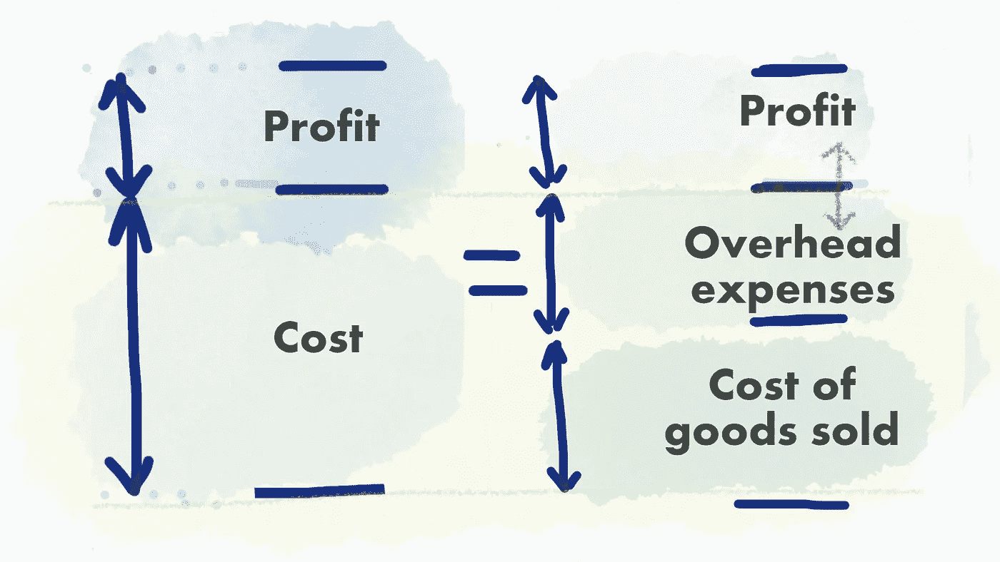
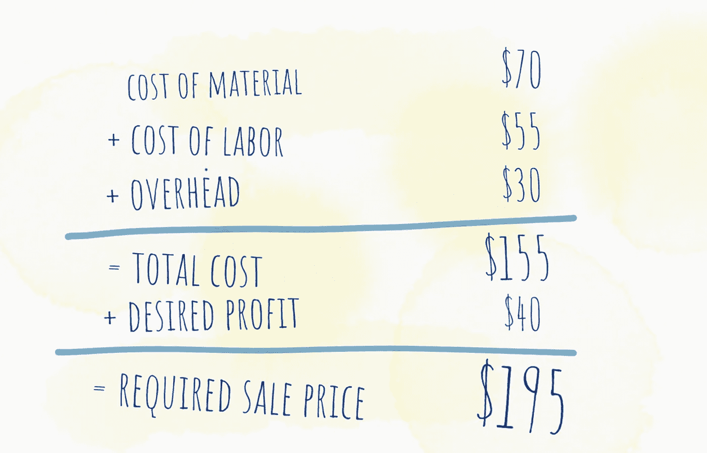
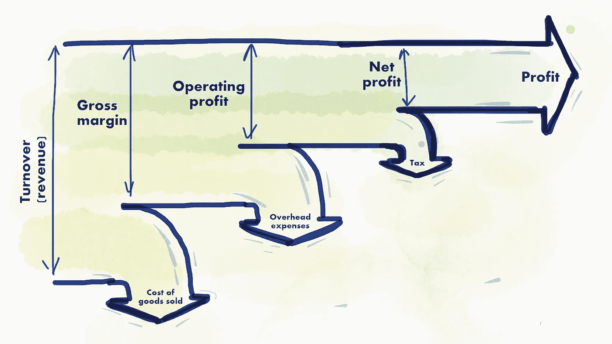

# 人人都卖——如何设定合适的价格？

> 原文：<https://medium.com/hackernoon/everybody-sells-how-to-set-the-right-price-7010c3ccaa32>

第一次创业的人的财务基础知识。销货成本、毛利率、管理费用和金发女郎定价方案。

工程师们(*包括我自己*)喜欢相信产品是如此之好，它会自己卖出去。你只要推出你的产品，顾客就会奇迹般地来敲你的门，把他们的钱放进钥匙孔。不完全是。达成销售需要努力工作。同样，让销售看起来容易也需要努力。

> 让销售看起来容易需要努力。

销售的第一步是为你的产品或服务设定正确的价格。总的来说，开发商、工程师、设计师和艺术家都非常擅长他们的工作，但在确定价格和提交发票或报价方面却相当糟糕。在大多数情况下，我们根据自己的直觉和希望来定价。这篇文章旨在帮助我们(*非金融人士*)理解定价科学的基础知识。理解这些财务术语将有助于我们设定正确的价格，创造积极的现金流，并有望获得一些利润。没有人经营一家企业仅仅是为了收支平衡，所以在你的口袋里放一些额外的现金对你没有坏处。

# 简单定价

定价的基本规则很简单——价格必须涵盖**成本**和**利润**。如果你的价格不能覆盖成本，你将产生一个累积的负现金流。这将最终耗尽你所有的资源(金钱)，并锁定你的生意。除了弥补成本，如果你想赚一两块钱，你还得把预期利润加到总价格中。

The price should account the desired profit

成本和利润结合起来为你的产品或服务定价。这个简单的关系意味着降低成本会产生更多的利润，而增加成本会让你两手空空。是的，到目前为止我所说的一切似乎都很明显。但是不明显的(*至少对我来说*)是如何确定制造产品的成本。

# 成本分析

确定经营企业的成本不仅有助于你设定价格，还能指出你可以改进的地方。成本通常包括财产和设备租赁、工资、库存、材料、办公用品、订阅、软件许可、[营销](https://hackernoon.com/tagged/marketing)、广告……不胜枚举。为了更容易理解，成本结构可以分为两类:

*   销货成本，
*   间接费用。

Underestimating the overhead expenses will decrease your profit

## 商品销售成本

这一类是指购买产品用于转售的成本或制造产品的成本(实物或数字)。如果你有一个实物产品(如智能手表)，你需要支付给供应商的硬件成本、供应商的运输成本、腕带成本、软件开发成本等。如果你有一个数字产品，你必须考虑你的开发者/设计师的工资(劳动力成本)。我们熟悉这一成本类别，大多数情况下，我们对这一类别相当准确。但是管理费用是在定价过程中经常被遗忘的部分。

## 间接费用

这些费用与制造过程没有直接关系(非人工费用)。它们可以是固定的，也可以是可变的。

**固定管理费用**

这些费用每个月都必须满足，不管销量如何。它们包括办公空间租金、工资和会计成本、订阅和软件许可、保险、制冷和供暖等。汽车靠燃料运行，员工靠咖啡运行，所以不要忘记包括补充高辛烷值阿拉比卡咖啡颗粒的成本。这些费用每个月都要支付，不管公司的收入是上升还是下降。

**可变管理费用**

根据销售或促销活动的不同，这些费用会逐月波动。业务量会因季节、需求、供应商短缺等因素而有所不同。这些费用包括电话费、广告费、运费、包装费、差旅费、现场活动费、客户入职费等。由于不建议产品价格频繁变动，可变费用应作为年平均数字考虑。

正如我之前所说，详细的成本分析将导致更准确的定价策略，更重要的是更准确的利润估计和现金流预测。此外，成本意识将表明降低成本的机会，产生更大的毛利润。

> 如果价格固定，成本和利润成负的反比关系——成本越高，利润越低，反之亦然。

# 收入和净利润

理解销售成本和间接成本的**非常重要。这些数字将给出你产品的总成本。将利润加到总成本中会得到所需的**销售价格**，这将确保正现金流。一个好的会计顾问可以通过导出现金流、损益和资产负债表的财务报表来提取成本，从而更详细地了解资金进出公司的情况。**

A simple example and cost breakdown

根据销售额，你的企业将建立一个收入流。收入通常被称为销售额或营业额。收入数字可能会混淆视听，并设定错误的预期。从收入到利润的管道沿途有许多许多漏洞，这就是为什么意识到它们的存在是很重要的。为了避免利润枯竭，你必须最大限度地减少和解决管道中的所有漏洞。

The pipeline from revenue to profits has many many leaks along the way

# 金发女孩定价计划

在考虑了所有的费用、预计的销售量和竞争对手的价格之后，你的产品价格对你来说似乎是显而易见的。为了让价格显而易见，让顾客可以接受，你可以使用金发女郎定价计划。

让我们假设客户偶然发现了你的产品并注意到了价格。他/她如何确定价格是否合适？最有可能的是，他/她会在网上寻找类似的产品并比较价格。购买决定通常是有利于提供最大性价比的产品。

如果你为你的产品提供三种价格而不是一种呢？你可以显著提高客户保持率。第一个价格应该比平时低。自然，顾客以这个价格得到的产品质量较低，功能较少。第二个价格应该是您希望客户选择的价格。这是你最想卖的旗舰产品的价格。第三个价格应该是溢价。你的调色板上最贵的产品，高质量，小批量，手工制作，个性化版本。

这三种变体有什么问题？作为顾客，我喜欢有选择。我喜欢有选择和比较的可能性。这样，我觉得我可以控制自己的开销。最有可能的是，我会选择第二个选项，因为我不想得到最便宜的版本。此外，高级选项太贵，额外的功能是矫枉过正。我认为第二个价格正适合我。我会选择第二个(尽管第二个是为被选择而设计的，那种负责决定的感觉让我忘记了查看竞争产品的价格)。你看我在那里做了什么…

我这样命名这个定价方案是因为，就像童话故事*金发女孩*中三碗粥中的第三碗，不冷不热，但恰到好处！

# 想了解更多？

学习如何将你的想法转化为成功的业务。

这本书为你提供了创建一个成功企业的整个过程的全面指导。它旨在为你展示整个[商业计划](https://treasureroadmap.com/)，让你的起步更加容易。整个过程归结为它的要点，使步骤简单易懂。

如果你遵循我在这本书里揭示的公式，很有可能你可以通过把一个[想法变成一个成功的生意](https://treasureroadmap.com/)来谋生。

 [## 宝藏路线图——如何将你的想法转化为成功的业务——企业家的最佳书籍…

### 如果你选择遵循我在这本书里揭示的公式，很有可能你可以通过转行谋生…

treasureroadmap.com](https://treasureroadmap.com/) 

点击下面的图片获取您的免费图书摘要:

