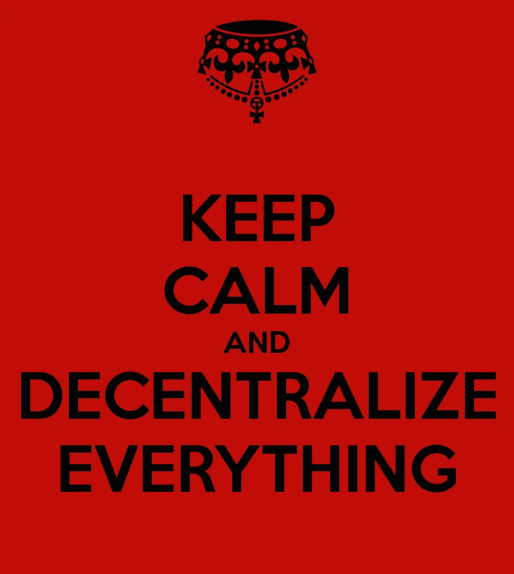
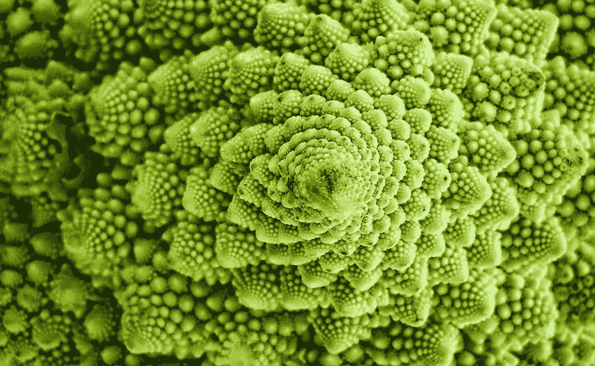
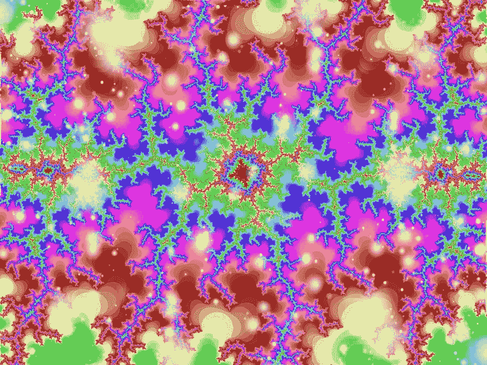

# 创造一个去中心化世界的日常实践

> 原文：<https://medium.com/hackernoon/everyday-practices-to-create-a-decentralized-world-2c8bff84b273>

在区块链的创业公司工作，赢得黑客马拉松，参加聚会之后，区块链最流行的一个词是去中心化。我们知道这实际上意味着什么吗？我们总是谈论这些系统的高层次价值，如透明、平等和效率，但我们很少讨论我们必须单独采取的切实行动来创建这个去中心化的世界。这篇文章是一个练习，帮助我们想象我们希望社会在未来有什么样的行为，并找出今天可以采取什么行动来实现它。那么，为了完全实现我们的乌托邦梦想，密码社区必须遵守的“十诫”是什么呢？

区块链不是答案。将社会责任委托给技术只能让你到此为止。如果我们真的想改变世界，我们就必须每天像人类一样迈出一小步，在我们的想象中重建世界。有些做法在当今世界可能没有意义，因为它们应该将今天的世界塑造成明天的世界。在一个分散化的世界里，你不再是“你”，因为你必须重新想象自己才能在那里生存。*要得到你从未拥有的东西，你必须做你从未做过的事情。*

在这一点上，意见开始大相径庭，有无政府主义者希望废除任何国家代表制，而其他人则希望最低限度可行的中央集权。我个人认为[去中心化并不是目的，一切都是有时间和地点的，我们应该从自然界的自组织原则中获得灵感。每个原子都是它自己的存在，可以带着自己的目标和目的在宇宙中自由旅行。在一个真正分散的世界里，氢和氧永远不会聚集在一起，创造出 H2O，没有它，地球上的水和生命就不可能存在。这是集中化如何为生态系统增加价值的一个完美例子。](/@mattcondon/100-decentralized-probably-isnt-better-cb7200a649f1)

Self-organizing systems are everywhere in nature. Cauliflower creates fractals based on simple instructions in it’s genetic code.

在康赛斯，我们愿意认为我们代表，甚至领导区块链/分权运动。如果是这样的话，我们不能只是说说而已，我们必须行动起来。如果我们不按照我们宣扬的价值观生活，那么我们就永远无法创造出我们想要的分散化产品或社会。

> “设计系统的组织……不得不生产这些组织的通信结构的复制品。”
> 
> [—委员会是如何发明的？](http://www.melconway.com/Home/Committees_Paper.html)，m .康威

# 我的分权原则

那么我对未来世界的愿景是什么？这将需要更多的博客帖子，但我会总结。我对世界的信念受到了生物仿生学、T2、混沌理论和 T4 无政府资本主义的严重影响。(仅供参考，比特币是由无政府主义者[制造的](https://news.bitcoin.com/bitcoin-built-incite-peaceful-anarchy/)，无政府主义者的意思)本质上，这意味着我从宇宙中寻找答案，并支持自组织的开放交换系统，该系统为个人提供反馈回路，以适应他们的行为并优化他们当前的环境。这在人类社会的现实中是相当基本的，以下是我对分散化实践的建议:

*   **我选择合作而不是竞争，**
*   **我有内在动力**
*   **我采取整体观点，避免简单化**
*   **我在沟通时开诚布公**
*   **我只按照我的个人价值观行事**
*   **我拥抱混乱，抓住每一个机会**

如果你注意到我选择描述一个理想的个人而不是整个社会，有几个原因。1)这又回到了这篇文章的原因，我们太沉迷于理想，而不是现实世界的行动，而这些行动是在现实中显化我们的梦想所必需的。2)不是每个人都同意我的乌托邦观点，但我们可以在基本实践上达成一致。想象一下，如果各种宗教都采取这种方式，它们大多拥有相同的价值观，但却没有相同的梦想。在这个世界上，我们可以通过坚持可操作的实践来避免如此多的冲突。3)通过承认只有我能控制我的行为，我必须把我的时间和精力只花在对我来说重要的事情和我能影响的事情上。4)我们对自己越真实，就越能意识到我们只是一个更大的生命和意识互联网络的一部分。

> “从杂乱中找到简单；从不和谐中找到和谐；困难之中蕴藏着机会。”——阿尔伯特·爱因斯坦

Abstract examples of fractals. Chaos can be beautiful too!

# 从原则到行动

从我的原则清单中，我想出了一系列问题，每天问自己，以保持正确的方向。这些是帮助我重新定位人生目标的指南。

我看重什么？
这是北方开始指导你一整天的行动和你的生活。每天我对这个问题的回答都非常简单，比如“我的狗快乐”和“吃健康的食物”。从长远来看，它们更复杂，比如“我工作的质量”和“我与父母的关系”。

我属于哪里？
作为一个人，处在与我互补的地方会影响我的情绪、想法和生产力。知道我真正属于哪里，并能够找到它，这是对我的生活产生深远影响的技能。

身体——在办公室还是在家工作？这个周末我需要森林还是海滩？
*社交* —我是团队成员、教练还是领导者？我适合这个团队和公司吗？我在公司或创业公司会更好吗？

**我能做些什么？** 确切地知道你能提供什么并不总是最容易知道或沟通的事情。留心并列出你喜欢做的和有能力做的事情，让你知道在现代世界的混乱环境中应该把精力集中在哪里。

*功能* —编码、研究、设计。
*—支持，同情，一个可以依靠哭泣的肩膀。
*社会* —领导，我的关系网。
*知性*——发人深省的问题、数据洞察、创造力。*

*我怎样才能更好地被理解？认识到我只是整体的一部分只是第一步。在团队中交流我是谁以及我的目标有助于每个人了解我的优势和劣势，以及我在组织中的位置。敞开心扉，积极挑战那些没有明说的假设和期望，对改善人际关系、组织流程和你的精神状态大有帮助。*

# *外卖*

*这只是我个人信仰的介绍性列表，我很有兴趣看看其他人有什么补充。如果你想投稿，有一个[活文档](https://docs.google.com/document/d/1ws2_Blo2HsF9u9lrxG7tHaF_sTwIpioPQQkAgnbGPws/edit?usp=drivesdk)等着你添加。最初，我的列表中有像主动交流、同理心和自我实现这样的东西，但这些看起来就像我们已经用来描述分权的东西一样抽象，比如透明度。请随意添加您自己的实践，改变为什么它应该存在的目的，或者解释为什么我们应该留在集中式组织中。*

*由 Kiba Gateaux 在 Chris Frazier 的帮助下撰写，灵感来自与 T2 杰夫·席尔瓦和 ConsenSys 品牌设计圈的会谈。*