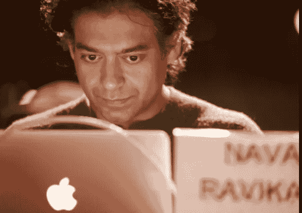
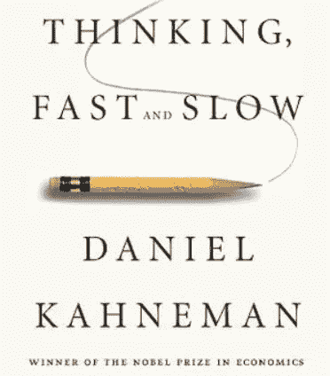
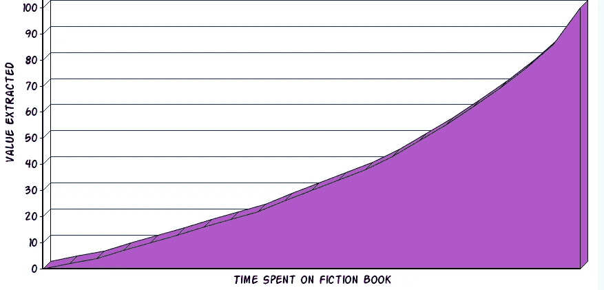
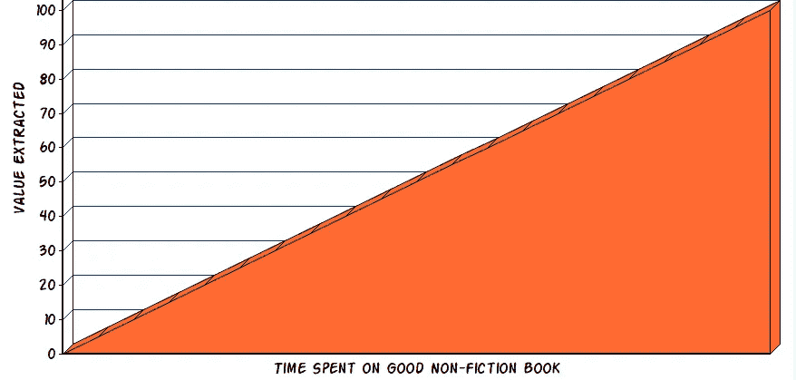
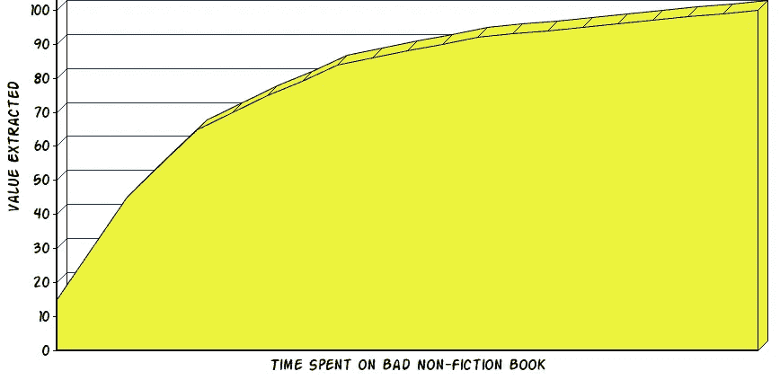
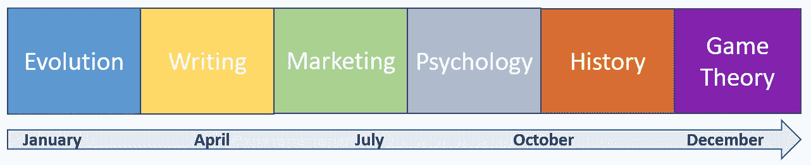
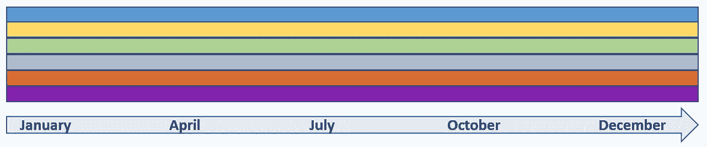
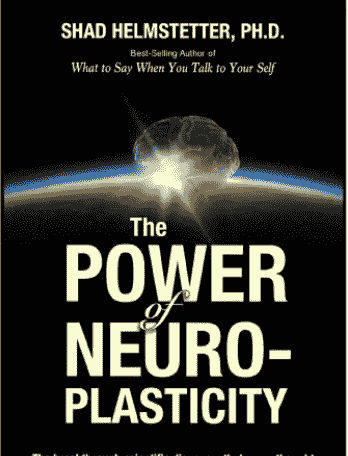
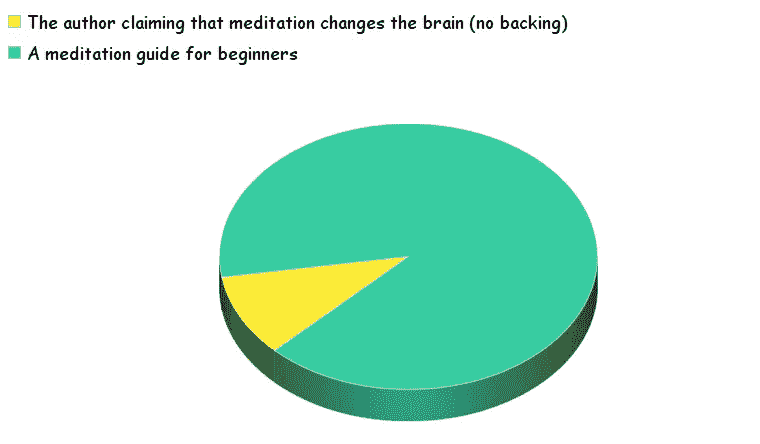

# 我所知道的关于阅读的一切都是错的

> 原文：<https://medium.com/hackernoon/everything-i-knew-about-reading-was-wrong-bde7e57fbfdc>

我所知道的关于阅读的一切都是错的。大约一年前我意识到了这一点。

所有那些我认为理所当然的规则都在拖我的后腿。

一旦我放开了，我重新发现了阅读的乐趣——这是我从十几岁开始就没有过的感觉，逃课去读尼采或阿尔伯特·加缪。

这一切都始于一个播客。这甚至不是我的洞察力。这是少有的一次，你接受别人的建议，并将其应用到你的生活中——结果是立竿见影的。

客人是海军拉维坎特。我已经听了这个[集](https://fs.blog/naval-ravikant/)很多遍了，但是这次我已经准备好要得到信息了。

今天，我想向你们传达这个信息。这篇文章是对海军阅读非小说的方法的探索。

Naval Ravikant

# 定义问题

> “我认识的每个人都沉迷于某本书。我敢肯定你现在正埋头于某本书。这是第 332 页，你不能再往下读了，但是你知道你应该读完这本书，那么你会怎么做？你放弃读书一段时间。这对我来说是一个悲剧，因为我是在书本中长大的，然后我转向博客，然后我转向 Twitter 和脸书，然后我意识到我并没有真正学到什么，我只是整天吃点多巴胺零食。”
> 
> —海军拉维坎特

你现在在看什么书吗？

也许吧。也许不是。不管怎样，你知道那种感觉，因为你曾经经历过。我们都是。

有时候这本书并不坏——只是你永远不想读它。普遍的观点是奋力前行，但这是一个糟糕的建议。

1.  你已经不在学校了——阅读应该是一种乐趣。
2.  没用:依靠意志力是一个糟糕的长期策略。

那么我们能做些什么呢？

# 思维转变#1:允许自己放弃

退出一本书几乎就像结束一段感情。情绪没有那么激烈，但过程是相似的。

我们几个星期都在逃避这个决定，积累罪恶感，并希望事情会有所改善。在内心深处，我们知道我们在拖延不可避免的事情。

是什么让它如此艰难？

> “我们从小就被教导，书籍是你必须完成的东西，书籍是神圣的。当你去上学，你被分配去读一本书，你必须读完这本书……”
> 
> —海军拉维坎特

当这本书广受好评时，就更难了。我在看丹尼尔·卡内曼的《[思考快与慢](https://www.amazon.com/gp/product/0374533555/ref=as_li_qf_asin_il_tl?ie=UTF8&tag=omahwiza-20&creative=9325&linkCode=as2&creativeASIN=0374533555&linkId=08c4af9a73aeeec92ca063de6395e790)》时有过这样的体验。

理论上，这本书似乎很完美:

可靠消息来源推荐的✅

✅诺贝尔奖获得者

✅有趣的话题

大约三分之一的路程，我撞上了一堵墙。我不知道为什么，但我从来不想读它。最讨厌的是什么？这本书其实很好。

我给了它一个月，然后两个月，然后三个月。

没用。

每当我听到一本有趣的书——每周至少发生一次——我会兴奋一秒钟，但随后提醒自己，我必须完成“思考的快慢”，我的兴奋会消退，并转化为内疚。

## 沉没成本谬论

沉没成本对我们的决策有着巨大的影响。

当我们读完一本书时，我们已经花了几个小时。在这一点上，完成这本书似乎是唯一的方法来赎回我们的投资。就好像如果我们没有读到最后，我们读到这里的所有东西都会从记忆中抹去。

让我们好好想想。

从来没有人把一本小说看了 80%就放弃了。如果你走到那一步，你会想知道结局。这是理性的:一本小说的最后 20%通常是最紧张和最激动人心的。

见鬼,《永别了，武器》的最后 3 页给了我如此大的打击，以至于我永远也忘不了它的结尾场景，尽管我几乎不记得这本书的其余部分了。

非小说就不是这样了。没有杀鸡取卵，结尾也没有剧情转折。大多数非小说类书籍遵循以下模式之一:

1.  该值平均分布在整本书中。这些通常都是好的——比如纳西姆·塔勒布的《反脆弱》。
2.  该值是前加载的。那些通常没那么好。作者一开始就奠定了前提，剩下的大多是重复和轶事。

在这两种情况下，如果你中途退出，你会得到这本书提供的公平份额。你不需要翻到最后一页来弥补你投入的时间。

但是还有钱。我们都喜欢物有所值。我们花钱买了这本书，所以我们想读完它。在这样做之前买一本新书似乎是不良的消费行为。

我们缺少的是机会成本。它不像你支付给亚马逊的 12 美元那样有形，但它是真实的，而且是巨大的。

你被卡住或不情愿地阅读一本平庸的书的每一天，都是你本可以用来阅读迷人而有影响力的作品的一天。

我们生活在一个信息丰富的世界。没有稀缺心态的空间，没有内疚的空间。陷入学习的机会成本远远超过一本新书的价格。

> “一本真正好的书价值 10 到 20 美元，它能以一种有意义的方式改变你的生活。我不相信在这上面省钱。这还是在我破产没钱的时候。我总是花钱买书。我从来不认为那是一种花费。那对我来说是一种投资。我花在书上的钱可能是我实际支出的 10 倍。换句话说，对于我买的每本价值 200 美元的书，我实际上最终完成了 10%。我会读价值 20 美元的书，但它仍然绝对值得。”
> 
> 海军拉维坎特

## 放弃不是永远

两周前，我又拿起了《思考的快慢》，我真的被它迷住了。

事后看来，我当时在广泛阅读了关于认知偏见的话题后，对这个话题感到厌倦了。它给我上了宝贵的一课:

给合适的人合适的书是不够的。它必须是在正确的时间为正确的人写的正确的书。

有时候，在你为这本书要给你的东西做好准备之前，你需要走一点弯路。

书的好处是——它们总是在你放它们的地方等着。

# 思维转变#2:一次多读(多读)一本书

给我印象最深的是 Naval 说他一次读 10 到 20 本书。

20.

这个数字听起来很荒谬。他怎么跟得上？

我后来意识到我在学校已经做过类似的事情。我上了大约 15 节不同的课，每节课都有自己的课本，我跟得上从来没有问题。唯一的问题是我不喜欢其中的大部分，因为我还没有亲自挑选。

## 一本适合各种心情的书

关键是要有真正的多样性。不同题材的书，页数不同，风格不同。有些更有趣和轻快，有些更密集和苛刻。我也喜欢有多种格式——Kindle、实体和音频。

> “我打开 kindle，浏览了一遍。根据我的心情，我会翻阅任何符合我心情的书……对我来说，最重要的事情是它让我定期阅读。”
> 
> 海军拉维坎特

在不同的日子里，你会对不同的想法感兴趣。即使在同一天，你的能量也会波动。不要反抗，拥抱它。

多样化意味着我不必等待适合我正在阅读的书的心情。我有适合各种情况的东西:

*   我精力不足，可以带着激励性的有声读物去散步。
*   我精力充沛，想深入一个需要集中注意力的复杂话题。
*   我想用一本厚厚的慢节奏传记来放松自己，让自己进入梦乡。
*   我渴望阅读某个特定领域的书籍，比如写作或心理学。
*   我想尝试一些新的东西。

这是我正在浏览的书单:

1.  托马斯·索威尔的《基础经济学》
2.  [威廉·桑代克的《局外人》](https://www.amazon.com/gp/product/1422162672/ref=as_li_qf_asin_il_tl?ie=UTF8&tag=omahwiza-20&creative=9325&linkCode=as2&creativeASIN=1422162672&linkId=587fd411bb03a633a527ff20a6a754ed)
3.  [如何在一切都失败的情况下仍然大获全胜](https://www.amazon.com/gp/product/1591847745/ref=as_li_qf_asin_il_tl?ie=UTF8&tag=omahwiza-20&creative=9325&linkCode=as2&creativeASIN=1591847745&linkId=9f628342fdaa37b9cded616ea6836436)
4.  纳西姆·塔勒布的《游戏中的皮肤》
5.  [菲尔·奈特的鞋狗](https://www.amazon.com/gp/product/1501135929/ref=as_li_qf_asin_il_tl?ie=UTF8&tag=omahwiza-20&creative=9325&linkCode=as2&creativeASIN=1501135929&linkId=cf62b381f09cd331eb396353c1fc951b)(可闻)
6.  [威廉·斯特伦克的《时尚元素》](https://www.amazon.com/gp/product/020530902X/ref=as_li_qf_asin_il_tl?ie=UTF8&tag=omahwiza-20&creative=9325&linkCode=as2&creativeASIN=020530902X&linkId=d6c66e207ede264af0d87034d3954f09)
7.  迈克尔·刘易斯的《说谎者的扑克》
8.  沃尔特·伊萨克森的《本杰明·富兰克林:美国生活》
9.  丹尼尔·卡内曼的《思考，快与慢》
10.  由尤瓦尔·诺亚·哈拉里撰写的《智人》
11.  [成为 M.L .江武平的写作机器](https://www.amazon.com/gp/product/1985174480/ref=as_li_qf_asin_il_tl?ie=UTF8&tag=omahwiza-20&creative=9325&linkCode=as2&creativeASIN=1985174480&linkId=3e821b2050a31dbf96ff6df1f964bc05)(有声)
12.  阿维纳什·K·迪克西特的战略艺术
13.  理查德·费曼的《六首简单的曲子》
14.  [吃鲸鱼的鱼作者:里奇·科恩](https://www.amazon.com/gp/product/1250033314/ref=as_li_qf_asin_il_tl?ie=UTF8&tag=omahwiza-20&creative=9325&linkCode=as2&creativeASIN=1250033314&linkId=c2765ccb9a63846352f600c8ff6a174c)

如果这份清单上没有任何吸引我的东西，我知道我没有心情阅读，所以我做了其他事情。

## 间隔重复

我痴迷于学习这门科学。

有效学习的基本实践之一是间隔重复。这个概念很简单:与一天学习 10 个小时相比，连续 10 天每天学习 1 个小时，你会得到更好的结果。

研究表明，当涉及到长期记忆和保持力时，尤其如此。因为你读书不是为了通过考试，所以长期记忆是最终目标。

当你一次读一本书时，你的学习过程看起来像这样:

如果你阅读多本书(来自多个学科)，它看起来更像这样:

你将在更长的时间内阅读每本书，这让你的大脑建立更强的神经连接，并将这些想法融入你的长期记忆中。

## 交叉

学习环境中的交错是同时处理不同类型问题的实践。它让学习者看到不同领域之间的联系，从而加深他的整体学习。

知识不是从 A 到 B 再到 c 的线性路径，知识是一个无限的网络，事物之间的联系可能并不明显。

假设你正在读一本关于现代历史的书。

一本博弈论的书可以帮助你更深入地了解冷战，一本市场营销的书可以揭示希特勒是如何迷住整个国家的。而且这不是单向的:历史书会加深你对其他两个领域的理解，因为你已经分析了那些现实生活中的例子。

交错是有效的，因为如果我们隔几天而不是隔几年研究主题，我们更有可能看到这些联系。

## 延迟满足的终结

我最喜欢 Naval 的方法是，现在，每当我听到一本有趣的书，我就可以马上开始读。

不再把它放在我的愿望清单上，和其他 200 本书埋在一起，直到我忘记为什么我会对它感到兴奋，或者是谁推荐了它。

这些天，当我对学习任何东西感到兴奋时，我会利用我的兴奋和好奇开始学习。

# 思维转变#3:你不必按顺序阅读

> 如果这本书有点无聊，我会直接跳到下一页。有时我会从中间开始读一本书，因为某个段落吸引了我的注意力，我会从那里继续读下去，我觉得没有任何义务去读完这本书。
> 
> —海军 Rvikant

这种思想转变是最难接受的，我想很多人会反对。

跳过章节，从中间开始看书——这些事情还是让我不舒服。感觉就像作弊一样。

违反使用条款。

还有就是害怕错过——如果我们跳过了一个精彩的句子呢？或者以后需要的关键信息？

这种类型的思考会耗费你宝贵的时间，我最近通过“[神经可塑性的力量](https://www.amazon.com/gp/product/1499794606/ref=as_li_qf_asin_il_tl?ie=UTF8&tag=omahwiza-20&creative=9325&linkCode=as2&creativeASIN=1499794606&linkId=50510ea238d4803276a49d641f8c2793)”体验到了这一点。

我买了这本书，作为我最近深入研究神经科学的一部分。开头很慢，看起来更像一本轻松的自助书，而不是一本严肃的神经科学书籍。

当我考虑退出的时候，我看了看目录，看了一眼将要发生的事情。后面的一些章节有着很有希望的标题，尤其是第 26 章:“冥想、神经可塑性和大脑”。

我决定继续走下去，这是一个糟糕的决定。

一旦我怀疑这本书的价值，我就应该跳到第 26 章，这样就给了它一个全力出击的机会。如果它是好的，我可以从那里决定去哪里。但如果不是，我会知道是时候继续前进了。

当我最终到达那里时，这就是这一章的结局:

真是浪费时间。

意识到我只是通读了 25 章，只是为了遵守关于如何阅读书籍的不成文规则…

那部分真的打动了我。

我终于准备好摆脱阻碍我的最后一个包袱——我对顺序阅读毫无疑问的信念。

## 填充书籍

如果你读非小说类的，你会遇到很多像《神经可塑性的力量》这样的作品——这些不费力的书有一个很有前途的标题，大部分都是重复相同的观点。

> “书的问题在于，写一本书，出版一本实体的、死树一样的书，需要大量的工作、努力和金钱。有时人们开始用简单的想法来包装长篇大论。那些可能是我最不喜欢的书。这就是为什么我避开了整个商业和自助类别，因为你通常会有一个好主意，而它被埋藏在成百上千页的文章和许多轶事中。”
> 
> —海军拉维坎特

下次当你怀疑一本书属于这一类时，不要怀疑它。看看目录，选择一章，让它给你最好的镜头。

有很多不可思议的书你还没读过。阅读不合格的内容是一种巨大的浪费。

a conservative estimate of the number of great books you haven’t read

## 作为博客档案的书籍

Naval 的非顺序阅读方法甚至比我目前所介绍的更加自由。以下是他对自己庞大藏书的看法:

> “我只是把它看作一个博客档案。一个博客上可能有 300 篇文章，你可以只阅读你现在需要的两、三、五篇。我想你也可以用同样的方式看待一本书。”
> 
> —海军拉维坎特

这让我想起了“及时”与“以防万一”的概念，这个概念来自库存管理，但可以应用于学习:读你现在最需要的书，而不是以后可能有用的书。

Naval 更进一步:阅读你现在最需要的章节。

# 不，这不是贬低书籍

有些人会声称，这种方法将书籍框定为一种不可轻视的商品。

虽然我确实认为我们需要让阅读变得更加流畅和宽松(它应该像玩耍一样)，但我也相信绝大多数的价值将来自对几本名著的深入研究，而名著是离商品最远的东西。

问题是，你永远不知道它们是什么。不能抄别人的单子。这是一个伟大的礼物，因为它给了你自己发现的快乐。

记住:阅读是为你寻找伟大书籍的旅程。

Naval 的方法是让这一旅程更有吸引力和回报。一旦你发现了一个百宝箱，一本改变人生的书——把这些都扔出窗外。尽你所能去吸收它。

全力以赴。

> “你会非常快速地浏览，找到吸引你的、对你来说重要和有趣的内容，然后坚持下去，真正深入下去。有探索，也有剥削。所以你会浏览大量书籍，直到你认定其中有值得开发的东西。”
> 
> 海军拉维坎特

# 重新思考你的阅读方法

遵循这种方法一年后，如果我必须将好处提炼为 3 个要点:

1.  你会读得更多，因为你总会有你想读的东西。
2.  你会更专注于你所读的内容，从而获得更多的乐趣和更好的记忆力。
3.  你会从每一个单词中获得更多的价值，因为你会跳过不必要的琐碎内容，尽早放弃平庸的书籍。

如果你在这篇文章中读到这里，你足够关心这些书，我很乐意假设你打算在余生阅读它们。

给自己一个礼物，重新思考你的方法。

放开不成文的规定。

从零开始，从现在开始。

你不会相信阅读能好到什么程度。

###########################################

## 如果你喜欢这篇文章——你可以使用“中拍手”按钮帮助其他人找到它。这有很大的不同。❤️

## 如果你想看更多我写的东西，请在[媒体](/@Johnny_Uzan)和[推特](https://twitter.com/Johnny_Uzan)上关注我。