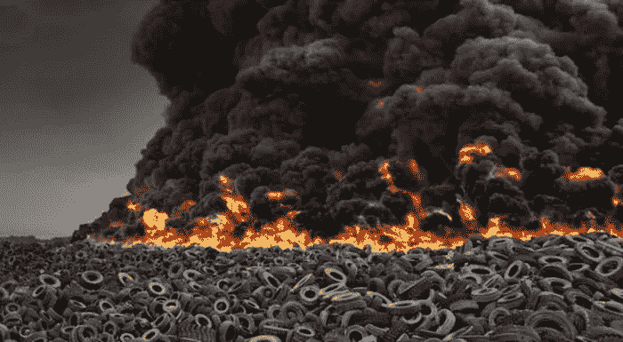

# 一切都坏了。现在怎么办？

> 原文：<https://medium.com/hackernoon/everything-is-broken-what-now-4c1f769055f4>

> 它坏了，是你的错！它坏了，而且一直都是这样
> 它坏了，我们来修理它

世界上有许多问题正在发生，问题和破碎的情况一直在发生。政府崩溃了，这是你的错！金融机构崩溃了，但让我们用加密货币和区块链来修复它们。政府的压迫让人民崩溃，而且一直如此。科技和社交媒体打破了我们的社交圈，将社会划分为部落社区，我们该如何解决这个问题？所有坏掉的东西都与三种基本类型的问题有关。有人是怎么解决自己的问题和身边的问题的？？让我们从讨论这三种类型的问题以及如何处理它们开始。

我 t 坏了，这是你的错。
责备:为过失或错误分配责任。

你们选错了总统，有勾结，都是他们的错！我的回音室比你的声音大，因为我听不见你说话。我的社交信息被操纵了，我没有意识到这是他们的错，因为是他们干的。你为什么将代码变更发布到产品中？你现在修复了它，却破坏了它。看到某个东西坏了，或者错了，马上指责，然后告诉那个人。“你打破了它，现在你来修理它”。归咎责任。虽然也有一些例外，但归咎于他人通常无助于解决问题。对于发现问题的始作俑者来说，归咎于他人可能会提升自我。然而，不提供解决方案通常是一种徒劳无益的行为，不会有利于更大的利益。通常，最终结果只是进一步排斥他们。这个问题仍然没有解决，任何可能建立的关系都被破坏了。这可能是发现问题时最糟糕的结果，问题比发现时更糟糕，不仅有问题，而且现在问题上还有内疚和愤怒。有更好的方法来解决问题，而不是相互指责。然而，首先有另一种类型的问题，有时会成为仅仅责备和让问题燃烧的结果。

失败主义:一个人承认、期待或不再抗拒失败的态度、政策或行为。这是因为坚信进一步的斗争或努力是徒劳的；悲观的辞职。

学生债务被打破了，而且一直如此。金融机构统治世界，无计可施。富人越来越富，穷人欠的越来越多。犬儒主义，可能是一个问题持续太久的结果。也许有人试图修复某些东西，结果却失败了，或者复发了。在这种情况下，一个人应该带着新的想法介入，并尝试重复解决问题，或者提供一组新的视角来从不同的角度看待问题。然而，很多时候，犬儒主义根深蒂固，可能需要很大的努力才能从灰烬中重生。势头可能很难得到滚动，但如果一个人能在战败者中找到盟友，那么随之而来的雪崩可能能够真正取得成就。很多时候，那些被击败的人可以提供一些对他们失败原因的深刻见解。接受他们的建议，看看一个新的观点是否能点燃火种。火花通常可以解决问题，但两个火花总比一个好。

我坏了，让我们把它修好
自助法:利用现有的资源使(自己或某物)进入或脱离某种状况。

人对人的支付被破坏了，让我们用区块链来修复它们。我需要搭车穿过城镇，这里有这么多车，让我们用我手里的这个手持 GPS 和电脑制作一个应用程序，搭别人的车。发现问题，识别问题，了解谁或如何成为问题，然后解决问题。这是与可能是问题根源的人接触，或者与另一个看到问题的人接触。然后，可以有多个视点和更多的迭代来工作。让我们的盟友对指责敌人感兴趣。把自我放在门外，创造一个比发现的更好的环境。阿拉伯之春，#占领华尔街，任何数量的社交媒体风暴。所有这些都是一群人聚在一起解决一个问题。让我们一起努力，找到盟友，我们就能改变世界。事实一次又一次地表明，当今世界没有大到足够多的人找不到解决办法的问题。头脑越多，工作的角度就越多。让我们打破常规，在这个过程中创造出一个全新的行业。现代所有伟大的解决方案都来自于人们一起解决问题。