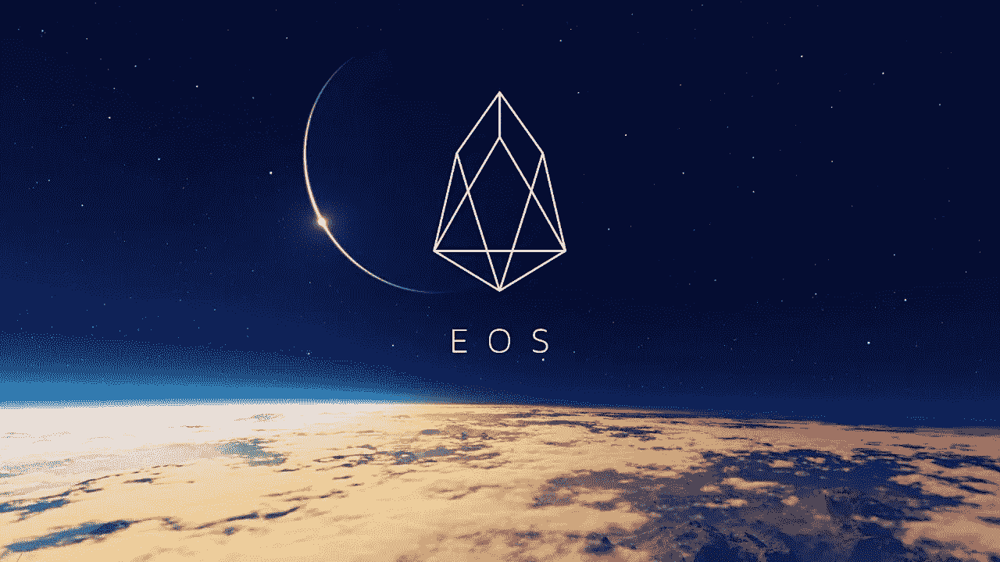

# 他们不想让你知道的关于 EOS 的一切。

> 原文：<https://medium.com/hackernoon/everything-they-dont-want-you-to-know-about-eos-the-ethereum-killer-9939c43aa2df>

如果你去年告诉我，一个没有产品的创业公司可以筹集超过 40 亿美元，我可能不会相信。事实上，我仍然很难相信。然而，EOS，一家没有产品的区块链初创公司，却成功做到了这一点。今天发布的这个平台的一切在纸面上听起来都很棒。然而，事实往往不像看起来那么乐观。

# EOS 承诺

EOS 在区块链领域是一个相对较新的项目，旨在从根本上改进目前市场上的产品。这种去中心化的操作系统将像以太坊一样，允许开发者通过智能合约来构建去中心化的应用程序。

EOS 的独特卖点是，通过免除交易费用和每秒支持数百万次交易的能力，该平台最终将允许工业规模的应用。EOS 开发人员[预计，该平台在推出后每秒至少能处理 1000 笔交易](/@eosforumorg/eos-will-launch-in-a-few-months-heres-what-we-know-b816bd350546)。相比之下，以太坊目前每秒可以处理大约 15 笔交易。

当然，事务吞吐量的这种彻底改进已经引发了对 EOS 的广泛兴趣。EOS 背后的公司 Block.one 已经筹集了 40 亿美元，通过一种叫做首次发行硬币的筹资策略来开发它和它的生态系统。他们设法做到了*，甚至没有一个工作产品……*事实上，当他们开始 ICO 时，他们甚至没有写一行代码。

这应该是不可能的。尽管如此，EOS 承诺对其他智能合约平台进行彻底的改进，以及迄今为止对这种平台的全面宣传，这在一定程度上是合理的。但是 EOS 的目标首先是如何兑现它的承诺呢？

通过一个简单的权衡:EOS 减少了它的分散性，增加了可伸缩性。

去中心化是好的加密货币的主要特征之一。简单地说，分散化提供了审查阻力。这种审查阻力是通过让大量各方参与区块的生产和验证来实现的。基本上这一套聚会越大越好。问题是，所有这些方必须不断地将他们的区块链彼此同步。在智能合约平台的情况下，每个块创建者(无论共识机制如何)还必须执行每个单个智能合约的代码。这是一个非常繁琐的过程，并且极大地限制了网络的整体容量。

EOS 背后的想法是，存储区块链的过程、“块传播”和智能合约代码的执行应该只由 21 方处理，称为块传播方(BPs)。这些 BP 使用优化的硬件，并且只需要彼此同步，而不需要大型网络。这使得 EOS 拥有了一个前所未有的事务输出。

除了这种疯狂的交易吞吐量，EOS 还承诺网络上的交易将完全免费！

听起来很棒，对吧？那么有什么问题呢？

# 第一件事:一辆新的 Maffia

不要误解我的意思:我相信普通大众对可伸缩性比对去中心化更感兴趣。设计一个系统，用两者之间的一点点交换，并不一定是一个坏的设计选择。然而，它必须做得正确。

毕竟，如果你拿走了区块链的去中心化本质，你就拿走了一个公共区块链比传统数据库做得更好的东西:审查阻力。

没有它，使用区块链实际上是没有意义的，因为您还不如使用传统的数据库和遗留计算服务。

那么，21 BP 的足够去中心化吗？

如果制作人是完全匿名的，并且没有办法互相交流，那么也许可以。但事实并非如此。

首先，有必要了解如何选择 BP。实质上，任何拥有 EOS 的人都可以用他们的代币为希望成为 BP 的候选人投票。当选的 21 人可以创建积木，因此，他们也可以获得积木奖励。

做 BP 太牛逼了。按照 EOS 的当前价格(在撰写本文时)，BP 每年将获得 164 万美元的整体奖励。此外，另外的 1 . 02 亿美元将按照 BP 公司获得选票的比例分配给他们。平均来说，假设一个 BP 每年将获得 250 万美元的报酬。

因此，存在购买选票的动机，例如，向任何投票给你的人提供回扣。一旦当选，所有的 BP 都想继续掌权。因此，存在维持既定秩序的激励，这意味着当选的区块生产者将结成联盟，相互投票。在 Lisk，另一个使用非常相似系统的密码，这导致了两个非常强大的类似 maffia 的联盟的出现:[精英](https://liskelite.com/)和 [GDT](https://pool.liskgdt.net/) 。关于这一点，可以在[这里](https://cryptogo.de/en/lisk-the-mafia-blockchain/)找到一篇精彩的文章。

一旦这样的联盟形成，EOS 平台的去中心化将不再是一个神话。因此，审查阻力将不复存在。联盟甚至可以开始以各种方式勒索建立在 EOS 基础上的企业。我们可以想象这样一个场景，一家企业的交易受到卡特尔的审查，除非它以某种方式行事或向 BPs 付款。

现在你可能会说这样的审查会伤害到英国广播公司。这将导致公众的反弹，随后，EOS 的价格下降。由于 BPs 可能自己持有 EOS，这将对他们造成伤害。

然而，有可能“隐藏”你的审查。直截了当地审查一家企业的交易并不是伤害它的唯一方式。例如，英国石油公司的卡特尔可以通过网络运作方式的微小变化，使某项特定业务的运作变得更加困难。毕竟，网络上允许或不允许什么的决定权掌握在“民主选举”的卡特尔手中。

通过以间接、隐蔽的方式进行审查，任何可能的公众反弹都被最小化了。毕竟，BP 唯一要做的事情就是解释他们为什么要修改协议。只要这个理由看似合理，足以愚弄一般不知情的公众，我们甚至不知道是否有任何勒索正在进行...

当然，也许 BPs 会合乎道德。然而，不得不依赖他们的承诺来这样做违背了加密最初被创造出来的初衷。

# 第二条:“免费”从来都不是真正的免费

当 EOS 吹嘘其免费交易时，我们不禁要问:如果这是可能的，为什么其他加密公司不提供它？

交易费通常用于激励区块创建者/采矿者获得区块链。他们激励理性的行为者尽最大努力验证和更新区块链的状态，并希望因此得到回报。

每个区块链都需要这样的激励。EOS 的唯一不同之处在于，这些激励是由我上面描述的给予 BP 的奖励产生的。为此铸造的硬币将达到每年 5%的总通货膨胀率。

所以确定，我汇款的时候不用交交易费。但是，这些费用被隐藏起来，因为它们计入了 BPs 奖励中。

与其说交易是免费的，不如说我的交易费是以通货膨胀的形式强加给每一个拥有 EOS 的人的。

# 其他危险信号

*   EOS ICO 向投资者开放 12 个月。然而，在此期间，支付的资金没有被锁定，EOS 的二级市场以高流动性开放。因此，据我所知，以下场景是 Block 的一种可能性。一:让人们购买 EOS →用他们的资金购买你自己的 ICO 中的 EOS →同时拥有资金和 EOS→重复→看着 EOS 价格上涨，因为看起来对你的 ICO 的兴趣巨大→开始在二级市场上出售你的免费 EOS→获利。
*   EOS 的幕后策划者丹·拉里默有一段有点可疑的历史。尽管他是一位伟大的开发人员和创新者，之前曾创建过 Bitshares 和 Steem 等区块链项目，但也有一些故事给他留下了不好的印象。举个例子，关于 T2 的故事说他[在斯提米特矿业](https://decentralize.today/the-ugly-truth-behind-steemit-1a525f5e156)早期作弊。此外，正如前同事查尔斯·霍金森所说:“拉里默还没有完成一个项目。”然而与此同时，他变得暴富。
*   [EOS 代币购买协议基本上声明](https://eos.io/documents/block.one%20-%20EOS%20Token%20Purchase%20Agreement%20-%20September%204,%202017.pdf)EOS 代币绝对没有价值，并且不向购买者提供任何权利。这无疑引发了一些担忧。然而，这是最有可能的协议，因为块。一种是试图完全远离平台本身的开发。这是否有机会在法庭上站得住脚完全是另一回事。

*   安全性是任何区块链项目中最重要的元素。块的事实。在 ICO 期间，一个人的内部系统遭到黑客攻击，[导致投资者的数百万资金被网络钓鱼者窃取](/@Michael_Spencer/block-one-was-hacked-eos-tokens-worth-millions-scammed-from-investors-ac9b0484515e)，这让人对该公司制造安全系统的能力没有多少信心。
*   继续讨论安全问题，布洛克。一家公司宣布，在其软件中发现的每一个漏洞将获得 10，000 美元的奖金。一周之内，[一名安全研究员就能通过发现和报告漏洞获得 120，000 美元的收入。当然，我并不是说 bug 奖金是一件坏事，我意识到任何软件都会有一些 bug，但这似乎有点太容易了。](https://thenextweb.com/hardfork/2018/06/05/hacker-eos-cryptocurrency/)
*   EOS 写了一个[‘宪法’](https://github.com/EOSIO/eos/blob/ab30b771efa8d5efda3f6746ebe55a2e59085fdf/governance/constitution.md)，对每个使用网络的人都是一套有约束力的规则。这个革命性的概念我就不深究了，它是*绝对*不同于一般术语&条件/s。然而，它是如此的清晰，以至于它不是由一个有法律背景的人写的。事实上，这很搞笑。下面的推特风暴只是触及了表面。我坚信这部宪法缺乏思考是一个巨大的错失机会。一套针对串通 BP 的明确规则和强有力的法律补救措施相结合，将是一种削弱 BP 串通动机的有害机制。

如果您发现了更多危险信号，请告诉我—我很乐意添加它们。我也希望收到对这篇文章中观点的反驳，我会相应地调整它。

# EOS 的当前状态

EOS BPs 已经投票决定今天启动网络！应该在世界协调时 13:00 直播。最新的进展是英国石油公司决定发行新的 EOS 令牌，这显然是为了创建账户所需的 RAM 的[。这真是太搞笑了，因为这是 EOS 出了什么问题的最佳例证。没有哪个正常的加密货币社区会改变代币的总供应量。毕竟，固定/可预测的最大令牌供应量是产生加密值的唯一因素。事实上，EOS BPs 的第一个决定似乎可能会开创一个打破这一基本规则的先例。这只是喜剧黄金。](https://www.reddit.com/r/eos/comments/8pjjsg/why_do_we_need_to_print_12000_new_eos_to_launch/)

**2018 年 6 月 25 日更新:**

自从网络启动以来，发生了很多事情。首先，正如我所预测的，我们没有看到 BP 的任何变化，除了一个 BP 之外，所有 BP 都保持了 BP 的地位。

第二，对 EOS 交易的审查已经开始。“EOS 核心仲裁论坛”(ECAF)，一个新成立的中央集权政党，已经命令所有的 block 生产商冻结网络上的 27 个账户。他们这样做的同时说*“该订单的逻辑和推理将在稍后日期公布”*。这个命令是由一个叫萨姆·萨波兹尼克的人下达的，BPs 毫无疑问地执行了。这表明使用 EOS 是没有意义的，因为使用没有审查抵抗能力的区块链是没有意义的。

A screenshot of the leaked ECAF order

最后，自从我写这篇文章以来，EOS 章程中增加了一些新条款(没有任何分散的决策过程)。这样做是为了让 ECAF 及其做出具有约束力的决定的无限自由裁量权具有某种程度的合法性。所以，是的，审查现在是“符合宪法的”。这开始感觉很熟悉了。:')

如果你很喜欢这篇文章，可以一直读到最后，为什么不留下一些掌声呢！这对我帮助很大。此外，按住那个按钮会让你非常满足。