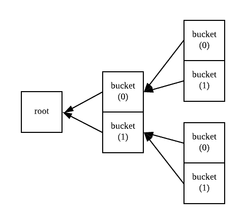

# 关于握手命名系统你所不知道的一切

> 原文：<https://medium.com/hackernoon/everything-you-didnt-know-about-the-handshake-naming-system-how-this-blockchain-project-will-483464309f33>

## 这个区块链项目将如何拆除互联网的守护者


这个项目是由给你带来钱包和私人网络接入的人构思的。

[握手](http://handshake.org)，尽管普遍存在误解，是 ***而不是*** 区块链的一个项目，旨在将现有的 DNS 基础设施完全分散化。这将是任何加密货币支持系统都无法消化的。事实上，这也是为什么握手的前身没有被真正采用的部分原因。

根据[项目文件](https://handshake.org/files/handshake.txt)，

> 握手命名协议不同于它的前身，因为它在共识层没有命名空间或子域的概念。其目的目前不是替换所有的 DNS，而是替换根区域文件和根服务器。”

许多人没有意识到 DNS 已经*去中心化了，除了一个关键的组件，其信任是集中的:根区域，或者简单地说，顶级域名(TLD)的集合。这个信任锚由一个小型的权威机构联盟保管，ICANN 目前是这个联盟的最终权威。*

Handshake 是一个旨在使 ICANN 的角色非中介化的项目，取而代之的是应用一个分散的区块链，使用由 Proof-of-Work 生成的加密签名来操作这一不可或缺的基础设施，以维护互联网本身的安全。

这是足够的乐趣，但表面水平的东西。你来这里是为了原始的、有趣的东西，从项目论文和项目贡献者自己的口中提炼出来的。

我采访了 Christopher Jeffrey，这位多产的系统工程师介绍了另一种比特币客户端 bcoin，我此后称他为 Brain，也就是设计并实现了握手区块链的 brainiac。

此外，我还与 Joseph Poon(T1)进行了多次讨论，他是两个主要的第二层区块链扩展框架([闪电网络](http://lightning.network)和[等离子体](http://plasma.io))背后的疯狂头脑，他是 Handshake 的贡献者，参与设计了提议的分发机制。

准备好了吗？因为你将要深入这项协议。

> 新手当心！这篇文章越读越专业。
> 
> 强烈推荐！尽管它可以独立存在，但为了最大程度地便于理解，这篇文章应该是补充性的，最好作为[项目论文](https://handshake.org/files/handshake.txt)的配菜。
> 
> 对于涵盖 DNS 架构的初级读本，[伊姆兰·汗](https://medium.com/u/59559986d690?source=post_page-----483464309f33--------------------------------)的[文章](/zkcapital/handshake-ens-and-decentralized-naming-services-explained-2e69a1ca1313)提供了坚实的基础。
> 
> [史蒂文·麦基](https://medium.com/u/88e1f9bb5be0?source=post_page-----483464309f33--------------------------------)的[帖子](/amentum/the-case-for-handshake-9b0af0d989fe)另外提供了一个投资者关于握手可行性的观点。

# 证书颁发机构

以目前的方式构建的 DNS 网络中的认证机构是互联网运营的可信管理者。正如项目文件中所解释的，这些管理者是利润最大化的实体。这意味着，ICANN 没有无私的动机诚实行事，但却有充分的动机维持其对管理互联网关键层所带来的财富的自然垄断。即使 CAs 打算成为好管家，去中心化运动的前提假设我们永远不应该*需要*依赖任何单一的权威，尤其是作为所有人类知识高速公路的看门人的权威。

在处于层级最顶端的那些中央机构可以利用无数财富的情况下，如果成功的话，在命名空间上分散信任模型可以分发丰富的资源体，并在由分布式分类帐支持的无许可网络的新模型上分配它，该分布式分类帐可以安全有效地替代现有范例。

# 输入握手

> “握手是一个正在进行的项目，旨在建立一个分散的网络，从而建立加密经济激励机制，以协调关于名称和证书之间关联的共识。”

与普遍的看法相反，我们今天面临的大多数问题都不是区块链能解决的。你们中的许多怀疑论者深刻理解这一点。但是对于握手来说，他们的专用区块链实际上是多么的有用，事实上，就域名而言，**理想的**？

[Zooko 的三元悖论](https://web.archive.org/web/20011020191610/http://zooko.com/distnames.html)认为，对于名称空间，你只能满足 3 个属性中的 2 个:

1.  人类可读的名称
2.  安全的
3.  分布式命名空间

> “区块链最近的创新可能已经解决了这个三难问题，即在一个分散的区块链中，通过验证网络的多个参与者，围绕名称和证书之间的关联创建一个单一的共识点。实现这种安全属性不仅需要重新设计证书颁发机构中的信任锚，还需要在命名基础设施本身中进行深度集成。” *—握手项目论文*

换句话说，区块链是一个理想的机制，可以使全球就域名所有权和转让所有权的规范排序达成共识。在这个解决方案之前，还没有好的方法来颠覆 CAs 的角色，来证明你确实拥有这个资产。事实上，“区块链自己维护这些资产的状态”，因此“这些资产被命名为*”*

***握手作为基础层，区块链不太可能面临任何可扩展性问题。***

*当被问及握手区块链的可扩展性时，Brain 解释说，“它不是为了支付，所以它不需要扩展到签证级别的交易。而现有的根区域只有 1500 个左右的域。因此，为了替换现有的根区域，区块链只需要能够处理 1500 个域，这算不了什么。我们认为它可以处理大约 5000 万到 1 亿笔交易。由于续费和链上的某些限制，它可能永远不会超过 5000-1000 万个域名。最终，更新将包括区块链的大部分区块。每个名字都需要两年更新一次。”*

# *大规模采用的一个软叉*

*每一个寻求获得真正采用的命名协议所面临的关键是解决集成和可用性的问题。*

*你的本来就很慢的基于区块链的应用程序是如何*试图*战胜一个已经有数十亿人在使用的更快、更用户友好的集中式解决方案的？*

*[Blockstack](https://blockstack.org/) 和 [ENS](https://ens.domains/) 是命名系统的两个例子，它们看不到真正的用途。我来解释一下原因。为了使用任一种方法解析域，用户需要运行完全验证节点。现在，当我打开一个网页只需要通过浏览器查询谷歌的 DNS 解析器时，我为什么要这么做呢？*

> *“我们打算与 IANA 和 ICANN 在分散系统上使用的协议透明兼容，同时要求大多数用户零干预。”*

*握手被煞费苦心地实现为现有互联网基础设施的软分叉，因为它知道任何将用户迁移到一个新的、未经测试的系统的尝试都是不切实际的需求，会阻碍广泛使用。在这里，同化战胜了迁移。并且它使得握手命名系统的使用比它的前辈的方法简单几个数量级。*

*该项目用于促进采用的两种方法是:*

*   *名称局部解析的紧凑证明*
*   *激励软件包维护者的集成*

## *SPV 名称解析*

*握手使用工作证明来允许区块链最大限度地无许可、去中心化、安全，最重要的是，抵抗审查。这一设计决定允许那些运行完整和简化的支付验证(SPV)节点的人可信地(并且快速地)解析域名，其速度实际上比查询谷歌的 DNS 解析器还要快。在 full/SPV 节点本地缓存数据的情况下，速度会更快。(我从运行 SPV 客户端就亲身经历过！！)*

*与握手之前的前述协议不同，握手通过实现紧凑的 SPV 证明而开辟了新天地。根据定义，这允许完成验证过程(非常重要！)信任，因为你的 SPV 客户端允许你运行**你自己的**本地递归 DNS 解析器。现有 DNS 中的架构不允许在没有中央权威代理的情况下进行这种直接解析。*

*握手之前使用的是一种记忆硬图形函数，由约翰·特罗姆普创建，被称为[布谷鸟周期](https://github.com/tromp/cuckoo)的[ternity](https://medium.com/u/6d952745da12?source=post_page-----483464309f33--------------------------------)和 [Mimblewimble](https://github.com/mimblewimble/grin) 等项目使用。这是被抛弃的，取而代之的是 SHA3，一个很好的老式哈希函数，即使世界上所有现有的计算(和未来的量子计算)能力也不会被破解。布雷恩非常严肃地建议，即使在人类离开地球之后，也要让握手区块链继续存在。*

## *来自自由/开源软件社区的集成*

> *“…我们的目标是与 DNS 合作，而不是反对它。”*

> *“为了透明地替换根区域，递归解析器必须指向一个权威的域名服务器，该服务器提供提交给区块链的记录，而不是 ICANN 的根区域文件。这是一个很难处理的动态过程，因为目前几乎没有消费类设备附带本地运行的递归解析器。”— *握手项目论文**

*更确切地说,“airdrop”或水龙头发行版通过 GitHub、Internet Relay Chat (IRC)面向整个 FOSS 社区，甚至向长期持有 [PGP 和 SSH 密钥](https://github.com/handshake-org/hs-airdrop/blob/master/README.md)的人空投，目的是在经济上激励，例如，开源开发者和软件包维护者将[握手集成库](https://github.com/handshake-org/libhns)包含在他们的软件中，或在本地添加[握手守护进程](https://github.com/handshake-org/hnsd) (hnsd)软件包。集成越多，采用程度就越高。*

> *这消除了普通用户安装额外软件的需要，而是将责任放在了软件开发人员身上*

*这太有意义了。(为什么其他项目不这么做？)*

*这个想法是，它回报了那些为开源软件贡献自由软件的人，他们并不期待经济回报。类似地，握手会给同一组人带来经济回报，而不期望得到软件作为回报。*

*然而，创建集成了 Handshake 的库集成的软件的社会动机依然存在。*

# *厄克尔的到来*

## *从稀疏的 Merkle 树到 Merklix 树和 MerkleSet(快速说 10 遍！)到高度优化的认证数据存储*

*以下部分摘自我对 Brain 的采访:*

> *“过去的许多命名项目没有很好的 SPV，如果你真的想安全地解析域名，这是一个问题。你必须运行一个完整的节点来完成它；大多数人不会那样做。大多数人不会为了让网络浏览器工作而存储数百张区块链。所以 SPV 的支持对于握手项目是非常重要的。因此，为了做到这一点，我们需要某种经过认证的数据结构。”*
> 
> *—大脑*

*握手的出现带来了许多创新，我预见这些创新将在加密货币领域产生连锁反应。其中一个非常值得注意的是名为 Urkel Tree 的可证明的数据存储。与之前的所有区块链系统不同，Handshake 使用自己的认证数据结构——第一个专门为区块链使用而实现的*数据结构——它不涉及 levelDB 或任何其他现有的数据存储。**

*Urkel 树是项目文件中“平面文件 Merkle 树”一节中描述的树。在提出 FFMT 之前，Brain 花了几个月的时间研究目前在生产系统中使用的数据结构，即以太坊的 base-16 trie 和谷歌的稀疏 Merkle 树。*

*但是因为协议打算取代 DNS 根区域，所以查找的速度必须是无阻碍的和快速的，并且证明必须是紧凑的。这些不妥协的要求导致了[厄克尔](https://github.com/handshake-org/urkel)的出现。“平均 DNS 消息最多只有几百字节。因此，如果你想通过 DNS 匹配现有根区域的速度，并想最小化开销，你*需要*小的校样尺寸，”Brain 说。*

> *“我们的树—因为它在一系列只附加的平面文件中，本质上使树成为自己的数据库(这就是为什么我们不需要 levelDB) —具有您想要的所有传统数据库功能:快照、崩溃一致性、范围查询和迭代。”*

*Urkel 目前是用 JavaScript 编程的，计划在不久的将来开发一个可移植的 C 库。*

*FFMT 是在布拉姆·科恩的( [Chia Network](https://chia.net/) )和阿马里·塞切特的(又名 [deadal nix](https://medium.com/u/ffdf1dd72f1c?source=post_page-----483464309f33--------------------------------) ( [比特币 ABC](https://www.bitcoincash.org/) )的基础上改编的，提出了(尽管没有在生产中实现)Merkelized 数据结构，分别称为 MerkleSet 和 Merklix Tree。*

*在发现以太坊的 base-16 trie 和 SMT 都不适合握手的需求后，Brain 解释道:*

> *“所以我开始研究我自己的 Merkelized base-2 trie。我想以 2 为基数，这样校样就很小了。每个内部节点只有两个可能的子节点。我还想在平面文件中实现它，直接在文件系统上实现——没有 levelDB。简单地说，每个内部节点都有指向下一个节点的指针，这些指针存储在文件的某个地方。对于每个节点，你只需通过读取指针来遍历下一个。这非常有效。代码更简单，速度更快，样张更小。”*

**

*Merkelized base-2 trie (Urkel’s a tiny guy!)*

## *探索以太坊的基数-16 trie*

> *“我们考虑了很多不同的选择；花了几个月研究。我们首先看了以太坊的 base-16 trie——实际上，以太坊使用了其中的几个——它是生产中使用的少数几个认证数据结构之一，所以我们看了一下。这个问题——实际上有几个问题——主要是校样尺寸。以太坊 trie 证明非常大，因为 trie 是以 16 为基数的。这意味着，trie 中的每个内部节点都有 16 个子节点。这使得内部节点变得巨大，所以一旦 trie 变得相对较深，你就开始看到真正大的证据。我们看到了几个 kb，这是我们无法接受的。它的另一个问题是，它是在 levelDB 之上实现的，这会使性能下降到爬行状态，因为您的大部分 CPU 和系统负载都专用于压缩— levelDB 的压缩线程。它一直在变得疯狂，因为 levelDB 的树有太多的更新。所以现在你有了一个树中之树。这不是最理想的。”*

**

*Ethereum base-16 trie (big boy)*

***主要研究发现:***

*   *在性能测试中，Urkel 提供了大约 50-100 倍的加速比，以以太坊的 base-16 trie 为基准。*
*   *Urkel 的 base-2 证明比以太坊的 base-16 证明小 4 倍。*

## *探索稀疏的 Merkle 树*

*在决定实现为区块链量身定制的独立数据结构之前，在测试生产中使用的可用数据结构时，Brain 偶然发现了一种结构，即 [Vitalik 正在与](https://github.com/ethereum/research/blob/master/trie_research/bintrie2/new_bintrie.py)玩的、作为等离子设计选择的认证数据结构，称为[稀疏 Merkle 树](https://eprint.iacr.org/2016/683.pdf) (SMT)。在实现它的过程中，Brain 发现这不是一个可行的选择，**因为数据库查找所需的大量缓存严重阻碍了可用性**。所以那是被禁止的。如果你正在读这篇文章，请考虑这些发现。)*

*Google 的 [certificate transparency](https://www.certificate-transparency.org/log-proofs-work) 项目是唯一一个在生产中使用 SMT 的项目，它也是在现有的数据存储(levelDB)之上实现的。*

> *就磁盘 I/O 和 CPU 周期而言，它非常慢。要插入 5000 片叶子，你必须做一百万次哈希运算，或者做一些疯狂的事情。如果您存储的是证书撤销列表，这没什么问题，因为它不会那么频繁地更新。但是如果你有一个*频繁更新树，这是一个糟糕的解决方案。**
> 
> **它在很多方面都很慢。为了让它更快，它需要大量的缓存。在像 Go 或 JavaScript 或任何内存管理的语言中，把所有这些东西都放在内存中是很可怕的。最终，您会给垃圾收集器施加过多的压力，垃圾收集会暂停，并且开始变得明显。一般来说，不要在内存中放太多东西是个好习惯。对于 SMT，你需要在内存中保存大量的东西，仅仅是为了快速查找。你可以批量插入。意思是，你可以同时插入 5000 片叶子。如果这些叶子彼此靠近，你可以跳过几轮哈希运算。问题是，如果这棵树有 256 层那么深，一个节点有 1/2 的⁵⁶概率会紧挨着另一个节点——这基本上是不可能的。但是，当你沿着树向上走得更远时，你可以节省散列的次数。但是批量插入是不值得的；真是慢得可怜。因为批处理插入的过程实现起来很烦人，也很混乱。但是到了最后，它甚至没有增加那么多，只是因为这种数据结构天生就很慢。如果你像谷歌一样用它来撤销证书，这没问题，但是在区块链上使用它是一个非常糟糕的主意。这就是我们偏离它的原因。"**

****主要研究发现:****

*   **以 Google 的稀疏 Merkle 树实现为基准，Urkel 提供了惊人的 500 倍加速。**
*   **然而，Urkel 的紧凑证明与压缩的 SMT 证明的大小大致相同，因为在这项研究中，<1 KB with tens of millions of leaves. (Bingo!)**

****Brain 得出结论，“在现有数据存储之上实现的认证数据结构在可扩展性方面存在固有缺陷。”****

**那是…厄克尔真实的起源故事，不是他们在电视上给你看的那个。**

# **契约**

**握手区块链不仅仅是保留了域名所有权的历史；它通过规定的“智能合同”实现了一个协议内和链上的拍卖系统，称为[契约](https://maltemoeser.de/paper/covenants.pdf)，最初由[马尔特·默瑟](https://medium.com/u/e6def71ae3e?source=post_page-----483464309f33--------------------------------)、[伊塔伊·埃亚尔](https://medium.com/u/884919734a4e?source=post_page-----483464309f33--------------------------------)和[艾明·居恩·西勒](https://medium.com/u/bc0e1d4ec8a?source=post_page-----483464309f33--------------------------------)描述。**

**这些契约允许动态共识水平的行为，这种行为在高度受限的基于 UTXO 的状态机(如比特币)中通常是不存在的。对契约式行为的渴望催生了应用平台实验的诞生，该实验更广为人知的名字是[以太坊](https://medium.com/u/d626b3859bc9?source=post_page-----483464309f33--------------------------------)，一个基于账户的系统。然而，通过握手，在基于 UTXO 的系统上实现智能合约行为，并在生产就绪代码中使用新的脚本操作码，是为生态系统开辟新天地的另一个创新例子。这种结构，由于是一般实现的，尽管“用一致的代码规定”，使得未来的契约类型能够以与未来的 DNS 网络基础设施向前兼容的方式被软分支到协议中。然而，握手契约仍然是专用的，并不打算用于构建像以太坊上的智能契约那样的分散式应用程序——这是另一个设计决策，允许握手区块链针对其特定的命名应用程序进行高度优化。**

> **“使用我们通用的共识级契约系统，我们能够在区块链层实现几乎任何类型的智能契约。”**

## **拍卖系统如何运作**

**拍卖系统被实现为共识级别的契约，在输出层被分解为描述为`covenant_type`的各种动作(尽可能低的级别)。握手实现了维克瑞拍卖，这是一种以其发明者威廉·维克瑞命名的二级价格拍卖。我们不会进入导致将拍卖结构设置为维克瑞拍卖的决策过程，但我们将进入说明如何在握手时获得名称的过程。**

**举例来说，当您想要对一个名称出价时，您可以使用`bid` covenant 类型。你把钱投入一个契约，你出价的钱被锁定，直到拍卖结束。请注意，这些出价都是盲目的。也就是说，你有一个实际的出价(例如 5 HNS)，但你可能希望产生 10 HNS 的锁定值，这模糊了你的真实出价值。**

**convenant 所做的是获取您的实际出价，将其与一些 nonce 连接起来，对其进行哈希处理，并向您提供该哈希。经过一周的`reveal`期，你`reveal`你使用的 nonce，这揭示了你的实际出价 5 HNS。揭示后，你从约定中取出 5 HNS 作为改变。**

```
**(lockup value) — (actual bid)= your change**
```

**然后，你的 5 HNS 将被锁定 2 周，直到拍卖结束。当拍卖结束时，获胜者被选中，失败者拿回他们的钱——失败者被允许退出契约。**

**然而，赢家的钱——记住，赢家支付第二高的出价——被送到另一个契约路径——T3 契约。`register`契约是为维护和更新域名而设计的。所有被送到这条路径的钱永远不会退出契约，这意味着每个赢家的硬币都被烧掉了。**

## **取消**

**我特别感兴趣的一个`covenant_type`就是它的`REVOKE`功能。与 Plasma 中退出游戏的功能类似，握手时撤销是最后的选择，允许域名的合法所有者撤销或质疑域名转让，以防所有者丢失他或她的密钥。有了这个选项，窃取域名的动机就完全消失了。**

# **用于自举网络的 DNSSEC“所有权证明”**

**Handshake 的前身设计中的另一个缺陷将被证明是致命的，那就是忽略了对现有域名持有者的考虑。如果我是微软，我在我的品牌上投入了大量资金，其价值体现在我的域名中，而这个新提议的 DNS 系统告诉我，我在他们的系统中不再拥有这个名称——我为什么要迁移并使用那个系统呢？**

**考虑到这一点，Handshake 预先保留了 Alexa 前 10 万个域名，这些域名的合法所有者可以在“日出期”或 mainnet 发布之日起的 4 年内提出申请。要声明他们的名字，所有者只需出示一个非常具体的 DNSSEC 证明，握手协议巧妙地将它用作名字所有权的安全证明。但是事情是这样的——他们未经许可就进行了这种权利分配*，*，**，*，*，**， *—* 没有任何人参与这个项目——把名字给了他们合法的所有者。**

**为了在*无许可*发行版中实现这一点，Brain 告诉我们:**

> **“用密码来做这件事很棘手，因为你没有所有这些人的密钥。没有多少人真的有 DNSSEC。我们正在研究 DNSSEC，我们意识到你实际上可以用它来证明所有权——这不是它们的目的。它们旨在确保您不会被夹在中间，确保在数据传输过程中不会有人更改数据。但是你可以用它来证明所有权，使用一个严格得多的 DNSSEC 证明子集，我们称之为“DNSSEC 所有权证明”。**
> 
> **我们所做的是，因为大多数人没有设置 DNSSEC，我们采用 ICANN 现有的密钥签名密钥(KSKs)。他们有两个密钥:一个是他们在 2010 年生成的，另一个是他们在去年(2017 年)生成的新密钥。基本上，将这两个 RSA 密钥硬编码到共识规则中，允许现有根区域中 Alexa top 100，000 中的任何人证明他们拥有一个名称，即使他们当前没有设置 DNSSEC-他们可以稍后设置。区块链将验证 DNSSEC 信任链，从 ICANN 的 KSKs 开始。**
> 
> **这很难实现，因为 1) DNSSEC 很复杂，有很多奇怪的边缘情况，这就是为什么我们只使用 DNSSEC 的一个子集来证明所有权，2)因为大多数密钥是 RSA 密钥。RSA 密钥非常大，签名也和密钥一样大。每种加密算法(包括 ECDSA)都有非常奇怪的边缘情况，你需要注意。此外，特别是对于 RSA，因为密钥可以是不同的大小，所以存在 DoS 向量。因此，这需要我们投入大量精力来研究 RSA 密钥的 DoS 限制和带有 PKCS1 v1.5 签名的边缘情况。我们在 RSA 签名中发现了边缘情况，我认为这在 DNSSEC 还没有被发现。我想我们在整理共识协议的时候发现了一些新的。任何 RFC 中都没有提到。尽管在过去的十年中，DNSSEC 在许多不同的 RFC 中都有详细说明，但没有一个提到我们发现的边缘案例。这表明指定共识协议并没有真正增加多少，因为总会有一些边缘情况。"**

****为了进一步激励现有域名持有者，如果域名持有者赎回他们的域名，握手区块链会给他们一个硬币奖励*。*****

****这就是风投和基金派上用场的地方**。在 ICO 模型可能淘汰它们的地方，丰度模型为它们分配了一个非常相关的功能:根据你的投资金额对这些新创造的硬币进行估值。由于有投资支持，这些硬币拥有内在价值，甚至在它们被释放到自由市场进行价格发现之前也是如此。在撰写本文时，风险投资公司估计一个 HNS 代币价值 0.10 美元。**

*   **总共 13.6 亿枚 HNS 硬币中的 7.5%被预先分配给现有域名持有者，前提是他们提供足够安全的 DNSSEC 所有权证明。**
*   **接下来，总共 13.6 亿枚硬币中的 2.5%将归 TLD 所有者所有，前提是他们声称自己拥有顶级域名。**

**剩下的无人认领，在日出期结束后被烧掉。**

## **名称卷展间隔**

**人们可以对任何名称进行拍卖，只要它不在预先保留的名称列表中，并且在推出时间间隔内。展示间隔是每周展示可供投标的名称。在一年的时间里，所有的名字都可以投标。**

**为了确定一个名称是否在展示间隔内，类似于 ENS 的做法，握手协议对您想要打开的名称进行散列，对字符串运行 SHA3，对散列取模 52，给出特定周的数字，将该数字乘以每周的平均块数，然后得到您的名称将展示的块高度。通过这种方式，对于所有可用的名称，展示间隔确定性地随机且均匀分布。**

# **结束语**

**我写这个是因为我非常看好握手，知道这个项目的工艺水平和细致程度。**

**虽然本文中讨论的许多内容尚未得到自由市场的验证，但提出的观点仍然令人信服。希望有足够多的聪明人见证这一社会实验，了解它是什么以及它有可能成为什么，更多的企业家、聪明人和疯狂的科学家可以带着这些技术和机制设计离开，开始他们自己的正和游戏，玩富足的游戏，而不是剥削的游戏。**

> **“建立一个自上而下的数百万人的层级组织来取代既得利益的成本非常高，因此，有人提议利用礼物经济建立一个自下而上的结构，这种结构只有在没有中央权力机构(区块链)的情况下才能计算价值的新兴技术以及数百万人之间大规模协调的工具下才有可能实现……。握手是一种公开的表演，由世界各地的各方参与，并向更广泛的社会提供一个新的命名系统。”**

**当更多的思想领袖和企业家围绕丰富的游戏构建他们的模型时，生态系统可以开始脱离 ICOs 的模型，而是迎接一个礼物经济学* **、礼物回报** *的新时代。**

****和*那是*你的大主意。****

# **谁**

**我的绰号是被解放的强哥。我是[宇宙网](http://cosmos.network)tender mint 的通信主管，也是[宇宙博客](http://blog.cosmos.network)的首席技术作家和主编。我喜欢写长篇文章，分解协议、分布式系统和区块链技术的真正密集的东西，并将它们转换成可理解的信息块，传播给所有理解水平的读者。**

**半完全披露:如果你不能通过阅读来判断，我是握手项目的大 fangirl，我将成为 HNS 硬币的持有者，因为我已经从水龙头那里收到了一些，但除此之外我不属于握手贡献者。看看你是否也能从水龙头里喝水。**

***鸣谢:特别感谢*[*Christopher Jeffrey*](https://medium.com/u/d8b71ebf5d70?source=post_page-----483464309f33--------------------------------)*接受我的采访并提供文章的技术评论，以及*[*Joseph Poon*](https://medium.com/u/8e671f9c44e?source=post_page-----483464309f33--------------------------------)*进行总体评论。***