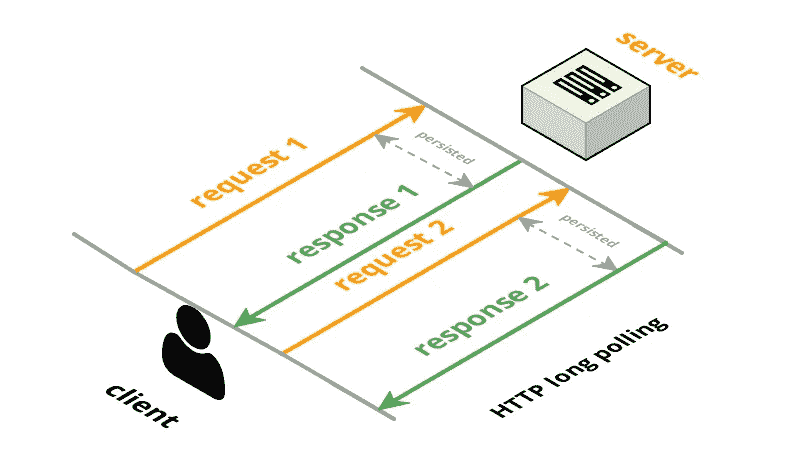

# 你想知道的关于 WebSockets 的一切，真的！

> 原文：<https://medium.com/hackernoon/everything-you-ever-wanted-to-know-about-websockets-literally-a05f36432999>

## 到目前为止，我们已经深入到实时世界中，有如此多的应用程序在处理实时数据。是时候从技术角度解释导致这一结果的所有事件了。所以，现在开始…

如今，应用程序正从利用数据库中的陈旧数据或在事件发生后即时创建的数据，转向在真实事件发生后触发实时体验。说到实时应用，我们首先想到的是“ [WebSockets](https://ably.com/topic/websockets) ”。但是，尽管很多人在技术圈里不断地讨论这个术语，实际上似乎有很多关于它的意义和工作的误解。

让我们打破行话，了解发生了什么！

# HTTP ->长轮询-> WebSockets

过去，HTTP 的无状态请求-响应机制在当时的用例中运行得非常好，允许任意两个节点通过互联网进行通信。因为它是无状态的，所以即使连接断开，您也可以很容易地从那个点恢复通信。

然而，随着应用程序很快转向实时实现，即确保数据的最小延迟共享，就像在现实世界中创建数据一样，传统的请求-响应周期变成了一个巨大的开销。为什么？高频率的请求-响应周期导致更多的延迟，因为这些周期中的每一个都需要每次建立一个新的连接。

从逻辑上来说，下一步将是在相同的数据流量下最大限度地减少这些周期。解决方案？[长轮询](https://ably.com/topic/long-polling)！

使用[长轮询](https://ably.com/topic/long-polling)，底层 TCP 套接字连接可以保持更长一点时间，也就是说，连接可以保持打开的时间比平常长一点。这不仅使服务器有机会在单个响应中而不是在单个响应中核对多条数据，而且几乎完全消除了由于缺少数据而返回空响应的情况，因为现在服务器可以在实际返回一些数据时返回一个响应。

但是，即使是[长轮询](https://ably.com/topic/long-polling)技术也涉及到连接设置和频繁的请求-响应循环，类似于传统的 HTTP，所以当然会导致更多的延迟。

对于大多数实时应用程序来说，数据的速度(精确到毫秒)是绝对关键的，因此以上两个选项听起来都没有用。

# 然后呢？

因为我在文章开始时提到了 WebSockets，所以您显然已经猜到了我的意思。

因此，与 HTTP 不同，WebSockets 是一种基于 TCP 的有状态通信协议。

通信最初以 HTTP 握手开始，但是如果通信双方都同意继续通过 WebSockets 进行，则连接被简单地提升，从而产生全双工的持久连接。这意味着连接在应用程序运行的整个过程中都保持打开。这为服务器提供了一种启动任何通信和向预先订阅的客户端发送数据的方法，因此它们不必不断发送请求来询问新数据的可用性。

实际上，在实时应用程序下发生的事情比我在本文中简单总结的要多得多。您可以在下面找到完整的文章链接，其中谈到了互联网协议的历史，创建这些协议背后的人，概念化这些协议背后的动机，您可以免费实现的开源解决方案，以及通过增加可扩展性将它提升到一个新的水平，等等。你绝对应该读一读！

 [## web sockets——一个概念上的深度挖掘

### WebSockets 只是在最近几年才普遍出现。在它们出现之前,“实时”网络已经存在…

ably.com](https://ably.com/topic/websockets)