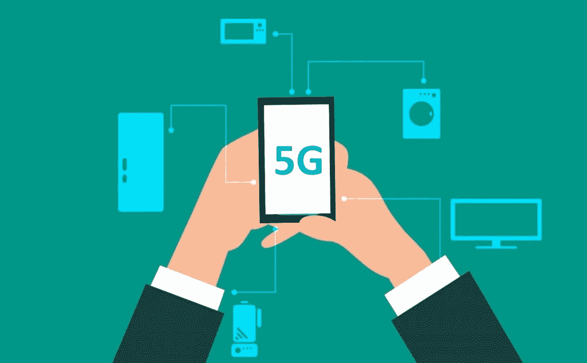

# 关于 5G 技术你需要知道的一切(非技术性)

> 原文：<https://medium.com/hackernoon/everything-you-need-to-know-about-5g-technology-non-technical-99cb095bde7f>

Photo used under Creative Commons license.

人们一直在谈论电信网络的下一次“革命”浪潮开始展开，被恰当地称为“ [5G](https://hackernoon.com/tagged/5g) ”，或“第五代”蜂窝网络标准。然而，对于那些已经能够在手机上轻松传输的人来说，这回避了问题——有什么大不了的，我为什么要在乎？

这篇文章有望澄清 5G 技术实际上是什么，以及它将如何影响我们在火车上观看猫视频的能力之外的更多东西。我将涵盖基本词汇、技术概念，并讨论它将如何/何时实际实现。

> 让我们从基础开始。5G 是什么，为什么比现状好？

为了理解 5G 及其相关性，我们首先需要检查它的前身(每次迭代都被毫无创意地命名为 1G、2G、3G、4G)以及它是如何建立在它们之上的:

1.  在 20 世纪 80 年代推出的 **1G** 是第一个大规模无线通信模式，允许我们在手机之间进行简单的通话。数据传输速度约为每秒 0.01 兆字节。
2.  **2G** 于十年后的 1991 年推出，通过使用数字加密(与模拟信号相反)提供了更高的安全性和更快的速度(每秒 3.1 MB)。它还允许发送普通的纯文本短信。
3.  3G 于 1998 年问世，为最终的智能手机革命铺平了道路，提供了更高的速度(每秒 14.4 MB)，并将移动设备与互联网连接起来。
4.  当前的标准 **4G/LTE** 发布于 2008 年。这里最显著的变化是速度惊人地跃升至每秒 300 MB，允许用户参与高清流媒体等活动。

这就把我们带到了 5G。它提供了与其前辈相同的基本功能(短信、蜂窝语音通话和互联网连接)，主要基于 4G LTE 技术的核心。不过，这里有四个显著的变化:带宽，预计将达到每秒 1 GB，减少的延迟时间(不到一毫秒)，能效，以及更大的网络容量。

速度的相关性是不言而喻的，但要正确看待这个数字，一部完整的 1080p 高清电影通常在 2 GB 到 3 GB 之间。对于像自动驾驶汽车(下面讨论)这样一次可以产生数千千兆字节数据的潜在应用来说，这是一个游戏规则的改变者。

与此相关，延迟的降低也是一件大事，延迟是指数据传输实际过程中的延迟。无论在给定时刻(带宽)您可以传输多大的数据包，速度都受到信息从 A 点到 B 点的实际速率(延迟)的限制。这就是为什么目前即使在高带宽互联网上，你的网飞应用程序可能仍然会暂停和加载以处理更多的数据。如果你不理解这一段，请重读一遍——等待时间很快就会出现！

能源效率相对简单。5G 将降低设备的功耗，这意味着更长的电池寿命，并且可能通过减少设备充电频率来减少碳浪费。

至于更大的网络容量，这很可能是最重要的变化。随着物联网的快速发展，越来越多的设备被设计用于蜂窝网络，这意味着我们*需要*改变基础设施以适应这种(以及未来的)需求。

> **好的，所以 5G 包括了一些相当大的技术改进。尽管如此，我仍然没有看到这将如何影响我的日常生活。**

这是一个公平的说法，也是我最初分享的观点。然而，这种说法背后的核心逻辑可能是一种谬论，即蜂窝网络主要是为手机使用而存在的。虽然 5G 肯定会在这方面带来更快的用户体验，但也有几项非常不同的技术将一起*彻底变革*。以下是对一些最激动人心的(在我看来)的简要解释:

*   **自动驾驶汽车:** 5G 的低延迟(结合强大的边缘计算算法)将允许自动驾驶汽车对任何突然的环境变化做出快速反应，同时还可能与附近的车辆进行通信，以优化交通和路线时间。为了澄清这一点，边缘计算本质上将计算活动的很大一部分指定给汽车本身，而不是在汽车和远程服务器之间不断地来回传递信息(从而减轻蜂窝网络的负担)。即便如此，4G 网络也无法处理如此高速、大容量的信息传输，也无法以足够低的延迟发送数据，以确保乘客的安全。
*   **虚拟和增强现实:**虚拟现实是将用户(通常使用耳机)置于一个完全模拟的数字世界中。增强现实是在真实世界的实时反馈上放置数字结构。在这两种情况下，用户都与其环境进行实时交互。当这是在不需要蜂窝连接的情况下完成的(例如，虚拟世界的景观是本地下载的，或者在世界上分层的 ar 对象是预先配置的)这不是问题。然而，当用户需要通过蜂窝连接与数字环境进行实时交互时(例如:脸书的虚拟现实世界)，只有 5G 的低延迟才能提供无缝、响应迅速的体验。
*   **触觉互联网:**这基本上是实时的，机器上的触觉反馈，也许是最有趣的前景。例如，在外科手术中，外科医生理论上可以控制机器人设备进行手术，这使他/她能够做出比人手更精确的动作。有了触觉互联网，他们使用的设备将能够嗡嗡作响/移动/等等。以便控制设备的医生可以感觉到机器的“感觉”，如骨头的硬度或动脉的泵血。这使得他们可以受益于人的感官，同时使用机器的精度。然而，为了能够在互联网上模拟某些东西*对真实世界事件的反应*的感觉，需要(感知的)即时信息传输，只有 5G 的低延迟才能做到这一点。同样的技术甚至有可能被用于远程手术。
*   **智慧城市:**在这里，它是 5G 核心能力(高速率、低延迟、更大容量)的一般组合，创造了智慧城市的可能性。智能城市基本上是将物联网功能应用于城市的每一项功能/服务，从电网到公共交通。例如，(自动驾驶)公共汽车可以在任何给定时刻瞄准人口密度最高的位置(由连接的安全摄像头确定)，随着系统的发展，不再需要持续、永久的公共汽车站。连接到互联网的所有东西都突然优化为与城市的其他部分互动。

这些只是几个例子，但正如你可能已经注意到的那样，5G 的低延迟是释放相当多功能的关键。认为这些我们已经讨论了几十年的革命性技术主要受到数据速度的限制，而不是产品开发问题本身，这是很疯狂的。更广泛地说，我们现在有机会创造曾经是科幻小说中的东西的整个产业。快速传递信息的能力将很少再成为创新的瓶颈。

通常，当我们无法访问 WiFi 或以太网时，我们会连接到蜂窝网络。然而，在 5G 的世界里，5G 服务成为首选的默认服务(从技术角度来说——定价/一般实施完全是另一回事，如下所述)。

> 听起来 5G 将会无处不在。电信公司需要什么资源才能提供？

提供 5G 将很快成为一个基线预期，这意味着那些跟不上的人将被甩在后面。正如我将在下面解释的那样，跟上并不是一件容易的事情。这里要讨论两个核心资源:频谱和光纤。

频谱是(电磁频谱的)所有频率的集合，在这些频率上，无线信号可以在无线发射塔和正在使用的设备之间部署。它以三种主要形式存在:未授权、授权和共享。

*   **免授权频谱**非常简单，这也是我们通常所期望的。它由任何人都可以使用的频率组成，如 WiFi 连接(在这种情况下，频谱是在设备路由器和路由器之间，而不是塔)。这里的使用并没有真正的限制，因为它是免费提供的，并且在本地托管。
*   **然而，获得授权的频谱**并不容易。政府举行高度竞争的拍卖过程，以便公司(如 AT & T，威瑞森等。)可以拥有其蜂窝网络在全国范围内的特定频率。公司根据他们希望拥有的频率和位置进行投标，这两个变量完全取决于特定公司的意图(不同的频率针对不同的应用/技术进行了优化)。这可能看起来很奇怪，政府基本上是在出售该国的电波，但如果频谱不是以每个公司为基础出售的，在同一地区使用相同频率的多家公司实际上会破坏正在发送的信号。
*   **共享频谱**允许不拥有特定频谱频率的第三方出于自己的目的使用这些频率。尽管获得频谱的过程是竞争的，但有些地方使用的频谱很少，甚至没有购买的频谱。这使得那些拥有频谱许可证的人能够产生被动收入，同时也通过为其他企业创造机会来优化资源的使用(例如，这些企业可能较小，无法在频谱竞标战中竞争)。

FCC 已宣布 5G 频谱拍卖将于 2018 年 11 月 14 日开始，我们可以预计出价将达到天文数字，因为频谱通常被视为相对稀缺的资源。仅移动频谱估计就价值 5000 亿美元。一些人认为，随着通过更多频率进行通信的技术的发展，将会有更多的频谱可供使用，但至少在目前，可用性是稀缺的。与此同时，市场竞争只会越来越激烈。

电信公司提供 5G 所需的另一个关键组件是光纤。光纤是光纤技术的简称，它通过光纤制成的电线发送光脉冲来传输信息。它本质上是有线互联网，速度快得令人难以置信(相当于 5G 的速度)。这似乎有点令人困惑，因为我一直在无休止地谈论 5G 作为无线连接服务的力量，所以需要光缆听起来似乎与我们试图用无线技术做的事情背道而驰。

这实际上是对 5G 的一个相当突出和危险的误解。事实证明，要达到 5G 要求的速度，信号需要非常高的频率(这意味着公司在几个月内竞标的频谱比我们用于 4G 等技术的频率要高得多)。

快速回顾一下高中物理，你可能会记得频率越高表示波长越短。在这种情况下，这意味着 5G 信号在完全没有障碍物(如房屋的墙壁)的情况下，白天最多只能传播约 100 米，有障碍物时则明显更少。

因此，为了让 5G 成为现实，我们将需要在全国各地建立数百万个“站”(本质上是发射 5G 信号的天线)，从我们的社区到我们的高速公路。这些站是建立在光纤电缆上的，这种电缆可以在数百英里的范围内传输我们想要的大量信息，几乎没有退化。由于信号很容易被中断，我们甚至可能在某个时候把电台带进我们的房子。本质上，地下的有线光纤将所有数据带到无处不在的 5G 站，从这些站，“5G 部分”发生在信号无线传输到我们的设备时。

澄清一下，5G 如此之快的原因不仅仅是因为它就在车站旁边。电波本身可以携带比 4G 多得多的信息，并且传输信息的实际过程几乎没有那么高的延迟。这项技术更强大(虽然我承认你可以提出一个有效的论点，说距离限制实际上否定了这种说法)，但它也有限制。

> 看起来光谱已经被大部分处理了。那么纤维呢？要求几百万个站不就让 5G 没用了吗？

它当然不是无用的(否则我不会写这么多)。然而，在一段时间内，我们肯定不会在大众市场应用中看到它。

为了让普通消费者真正接触到 5G，我们首先需要在几乎整个国家铺设光纤。目前，它主要存在于大城市(即使在那时，也没有 5G 的车站)。车站可以被添加到现有的基础设施中，如灯柱，但根据德勤的估计，这项工作仍将耗资 1500 亿美元，耗时约五年。目前的情况也意味着 5G 技术将首先进入城市地区，然后是郊区，很可能在很久以后也进入农村。

虽然美国电话电报公司等公司已经开始为部署 5G 网络做准备，但重要的是要记住这不是真正的 5G。正如制定标准的组织 3GPP 所解释的那样，“5G 将仍然是一个营销和行业术语，公司将在他们认为合适的时候使用”，直到标准公布(这只是去年 12 月)。例证:美国电话电报公司所谓的 5G 网络本质上只是利用了 4G LTE 技术。

> **决策者如何让我们为未来做好准备？**

这实际上已经成为一个相当大的问题，仅在过去的一年里就多次表现出来。5G 实际上是两个国家之间的军备竞赛:美国和中国。也就是说，鉴于目前的形势，大多数人似乎同意中国已经赢了。

当然，两国如此重视 5G 的部分原因是因为它直接应用于自动驾驶汽车等技术及其经济影响。然而，他们真正关心的是人工智能。一旦 5G 网络投入运行，将会有更多的数据被生成、处理和传输，这就是*世界*。人工智能算法是基于数据教授和改进的，这意味着当它们被馈送更多数据(只要是有用的数据)时，它们会变得更好。由于这一优势，无论哪个国家能够首先实现真正的 5G 网络，都将在人工智能领域领先另一个国家数光年，这反过来很大程度上保证了地缘政治优势的永恒(或至少是很长一段时间)。

这让人质疑中国目前到底领先多少。最明显的方法是从基础设施的角度。关于我提到的需要为 5G 投入运营而建立的数百万个地方站，据估计，中国已经建立了超过 35 万个，而美国只建立了大约 3 万个。

不太明显但同样重要的是频谱分布过程。美国众多蜂窝运营商之间高度竞争的频谱拍卖过程给参与者的钱包留下了凹痕，这意味着他们在购买权利后实际投资于技术开发的能力受到了严重伤害。另一方面，在中国，只有几个主要的参与者，而且都是国有的。这意味着他们在拍卖后仍然可以在全国范围内大力投资发展 5G 站，因为最终是中国政府买单。

一些人建议，美国应该改变他们的频谱拍卖流程，基本上将整个网络变成共享频谱，由非运营商第三方分配。特朗普政府似乎对这种“国有化”的 5G 网络概念非常开放，尽管如何支付建设基站等费用的细节尚不清楚(也没有任何取消拍卖的说法)。

这就是特朗普政府阻止博通(一家中国公司)收购高通(一家美国公司)的原因，因为高通被普遍认为是美国 5G 的领导者，与英特尔并列。一些政策专家还认为，这是最近对中国进口产品征收关税的真正原因，其意图可能是阻碍中国在该技术上的大规模投资。

总的来说，美国的情况并不太好。中国的网络预计将于 2019 年初推出，而美国的时间表仍不清楚。竞争需要更大的投资。

> **好了，那么 3000+字之后，这里有哪些主要的外卖？**

5G 允许我们开发各种各样的幻想新技术，但距离成为现实还有几年时间。从地缘政治角度来说，尽快发展成熟的 5G 网络至关重要，这就是为什么我们需要政策制定者在这一领域采取更多行动。

我将引用世界经济论坛的一段话来总结最后的观点:“经济学家估计，随着 5G 将移动技术从连接人与人和信息，转向连接人与一切，到 2035 年，5G 在新商品和服务方面的全球经济影响将达到 12 万亿美元。”

它可能明天就不在了，但毫无疑问的是:5G 就是未来。

来源: [NBC](https://www.nbcnews.com/mach/tech/what-5g-next-wireless-revolution-explained-ncna855816) ，[有线](https://www.wired.com/2016/08/the-next-generation-of-wireless-5g-is-all-hype/)， [CNN](https://money.cnn.com/2018/08/07/technology/5g-china-united-states/index.html) ，[德勤](https://www2.deloitte.com/content/dam/Deloitte/us/Documents/technology-media-telecommunications/us-tmt-future-of-connectivity-transcript.pdf)，[世界经济论坛](https://www.weforum.org/agenda/2018/01/the-world-is-about-to-become-even-more-interconnected-here-s-how/)，[思科](https://blogs.cisco.com/sp/impact-of-5g-on-industries)，[5G.co 1](https://5g.co.uk/guides/5g-virtual-reality-and-augmented-reality/)，[5G.co 2](https://5g.co.uk/guides/what-is-the-tactile-internet/)，[频谱期货](https://spectrumfutures.org/what-is-spectrum-sharing-and-why-does-it-matter/)，[网络世界](https://www.networkworld.com/article/3204150/internet-of-things/not-enough-fiber-to-grow-the-internet-for-5g-says-consultant.html)， [Axios](https://www.axios.com/trump-team-debates-nationalizing-5g-network-f1e92a49-60f2-4e3e-acd4-f3eb03d910ff.html) ，[福布斯](https://www.forbes.com/sites/bijankhosravi/2018/03/25/autonomous-cars-wont-work-until-we-have-5g/)。