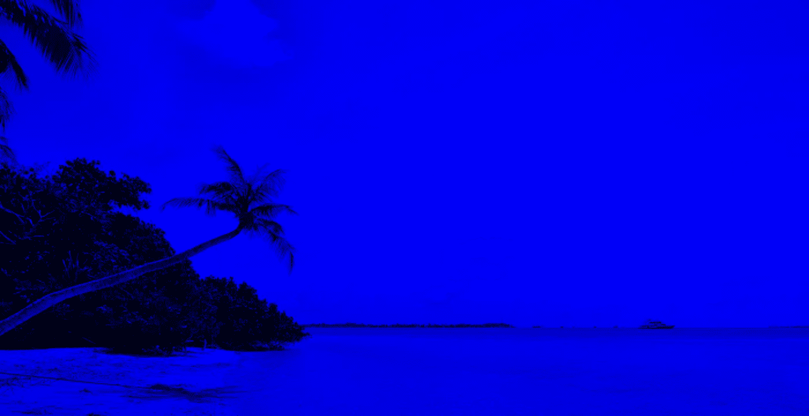

# 你需要知道的关于 CSS 中混合模式的一切

> 原文：<https://medium.com/hackernoon/everything-you-need-to-know-about-blend-mode-in-css-dcfb38336e25>

通常，在网站上添加图像时，首先要做的是在外部软件中编辑图像，如 Photoshop。****混合模式*** *是否消除了使用这类软件的需要？不尽然。但是，在很多情况下，你可以直接用 CSS 给图片**添加效果。****

# *背景混合模式和混合混合模式*

*当使用[背景混合模式](https://www.w3schools.com/cssref/pr_background-blend-mode.asp)属性时，您可以混合元素的背景颜色或图像。混合模式被定义为一个值，它们指定 ***如何将背景图像的颜色*** 与其后面的颜色或其他背景图像混合或混合。*

*另一方面， [mix-blend-mode](https://developer.mozilla.org/en-US/docs/Web/CSS/mix-blend-mode) 属性指定元素 ***的内容如何与其背景*** 及其直接父元素的内容混合。重叠层上的元素将与其下方的元素融合。在这种情况下，提到**隔离**属性很重要——它阻止具有 mix-blend-property 属性的元素与背景混合。*

# *背景混合模式*

*让我们通过**混合**背景图像和背景颜色来展示背景混合模式的基本用法。*

**CSS**

```
*.image-blend{
  background: url(‘beach.png’);
  background-color: blue;
  background-blend-mode: multiply;
}*
```

****

*在顶部，您可以看到原始图像，而底部显示应用了混合模式的图像。*

*首先，**需要指定一个背景图片 URL** ，然后是图片将要混合的背景颜色。有许多混合模式可供选择。这里，添加了**乘**混合模式来演示它将如何影响图像。除了纯色背景外，[背景渐变](https://kolosek.com/everything-you-need-to-know-about-gradient/)也可用于混合。*

*现在，让我们看看你如何使用背景混合模式将两张图片混合在一起。我们将下面两张图片融合在一起:*

**

*半铸钢ˌ钢性铸铁(Cast Semi-Steel)*

```
*.two-images-blend {
  background: url(‘beach.png’), url(‘house.png’);
  background-color: blue;
  background-blend-mode: lighten;
}*
```

**

**CSS**

```
*.two-images-blend {
  background: url(‘beach.png’), url(‘house.png’);
  background-blend-mode: lighten;
}*
```

**

*在这种情况下，你可以看到两个例子。第一个添加了背景色，而第二个没有背景色。*

*我已经为背景混合模式演示了两个可能的值，但是它们有很多:*

*   *屏幕，*
*   *覆盖，*
*   *变暗，*
*   *减轻，*
*   *颜色-减淡，*
*   *烧色，*
*   *强光，*
*   *柔和的光线，*
*   *区别，*
*   *排外，*
*   *色调，*
*   *饱和度，*
*   *颜色和*
*   *光度。*

# *混合模式*

*这种效果的一个流行用法是**创建剪切文本**。这样做的时候，记住使用[行高](https://kolosek.com/css-line-height/)属性是很有用的。*

**HTML**

```
*<div class=”container”>
  <h1 class=”header-text”>Hello world</h1>
</div>*
```

**CSS**

```
*.container {
  background-image: url(‘beach.png’);
  background-size: cover;
}.header-text {
  font-size: 7rem;
  text-transform: uppercase;
  color: #fff;
  text-align: center;
  background-color: darkcyan;
  mix-blend-mode: multiply;
}*
```

**

# *支持*

*在使用这个属性之前，请务必查看[我可以使用](https://caniuse.com/#search=background-blend-mode)来获得更多关于它对这些属性的支持的详细信息。目前，**背景混合模式**属性有一个稍微好一点的支持，希望混合混合模式能很快跟上。*

*我已经解释了这两个属性的基础，现在就看你如何利用这些属性，为你的网站创造漂亮有趣的视觉效果了。*

*你有过这方面的经验吗？*

**原载于 2018 年 4 月 5 日 kolosek.com*[](https://kolosek.com/css-blend-mode/)**。***