# 关于 GraphQL 您需要知道的一切

> 原文：<https://medium.com/hackernoon/everything-you-need-to-know-about-graphql-a5bc3622e54>

## 还有一个用 GraphCool 搭建的聊天 App！

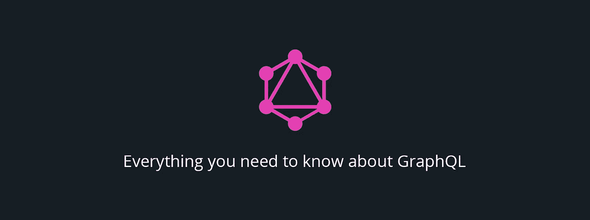

> # REST APIs 现在是# RestInPeace APIs |万岁#GraphQL

这是萨梅尔·布纳发的一条推特。我非常同意这一点！

自从脸书在 2015 年首次发布以来，GraphQL 的社区支持呈指数级增长。如今，成千上万的公司在其生产级应用中使用 GraphQL。

在进入它的甜蜜之前，让我先来定义 GraphQL:

> GraphQL 是一种数据查询语言，它是 REST API 和 ad-hoc webservice 架构的更好的替代方案。

GraphQL 的一个伟大之处在于，客户端可以定义所需数据的结构，服务器将以完全相同的结构返回数据！简单来说:

*   它让客户端确切地指定它需要什么数据。
*   这使得从多个来源(服务器)收集数据变得更加容易。
*   它使用类型系统来描述数据。

GraphQL 服务器支持多种语言，包括 JavaScript、Python、Ruby、Java、C#、Scala、Go、Elixir、Erlang、PHP 和 Clojure。

# 对 GraphQL 的需求 REST API 的限制

比方说，你正在创建一个移动应用程序，它有一个`movies`列表，在每部电影下面，你想要一个主`actors`列表。

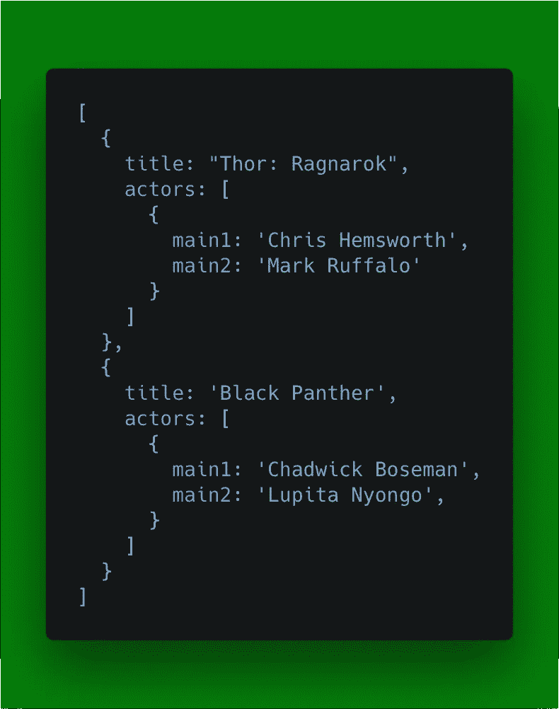

似乎很容易。但当你试图将这些数据加载到你的移动应用程序中时，你会发现事情开始变慢。

这里我只有两部电影，每部只有两个演员。实际上，我的应用程序可能需要管理数百部电影，每部电影肯定都有两部以上的`actors`。

## 解决办法

这个问题的解决方法相当简单。与其有多个端点，不如有一个可以接受复杂查询的端点，然后将数据输出更改为客户机需要的任何结构。

这正是 GraphQL 所做的。它位于客户机和数据源(服务器)之间，接收客户机请求，并根据客户机的指令获取必要的数据。

下面是 REST 模型如何将数据传递到我的应用程序:

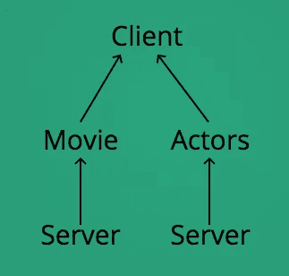

另一方面，GraphQL 就像有一个私人助理，它只是简单地问你想要什么，然后为你得到它！

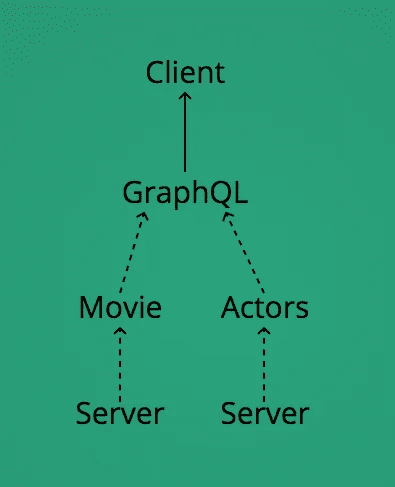

# GraphQL 的优势

*   次要代码
*   更具声明性或优雅的数据检索
*   避免多次 REST 调用
*   向后兼容且无版本限制
*   灵活的
*   更好的性能
*   强大的开发工具
*   可以随着版本发展

# GraphQL 提供了什么？

## 菲尔茨

从根本上来说，GraphQL 就是询问对象上的特定字段。因此，如果我想知道`superhero`的`name`和`abilities`，我的查询应该是这样的:

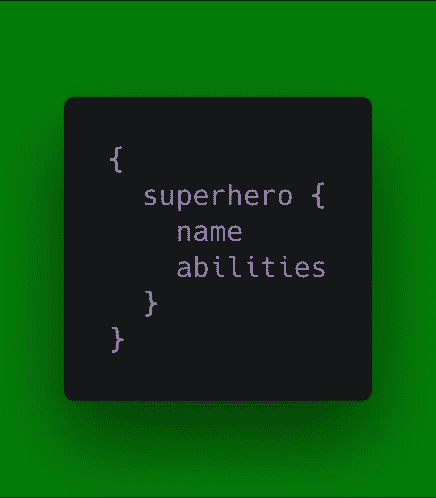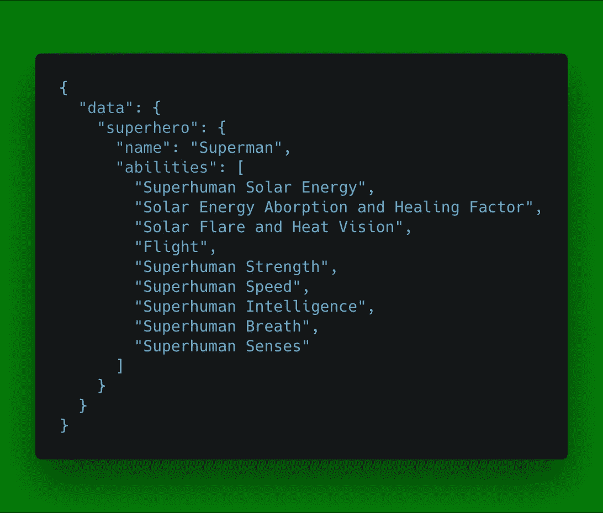

GraphQL query and its response

正如您所注意到的，结果的形状与查询完全相同。通过使用 GraphQL，您将总是得到您所期望的，因为服务器知道客户端需要什么字段。

在 GraphQL 中，这些字段还可以引用其他对象。您所需要做的就是为该对象制作一个字段的子选择。GraphQL 查询还可以遍历相关对象及其字段，让客户端在一个请求中获取大量相关数据，而不像 REST API 那样需要多次往返。

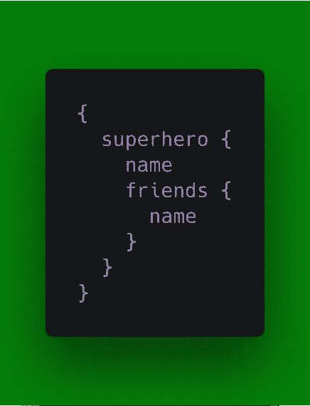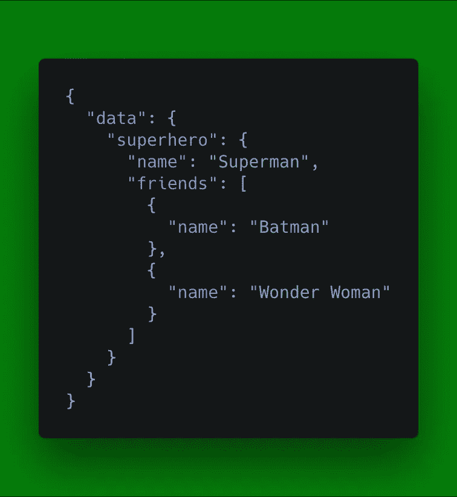

## 争论

除了让我们遍历对象及其字段，GraphQL 还让您能够向字段传递参数。

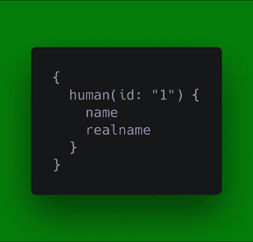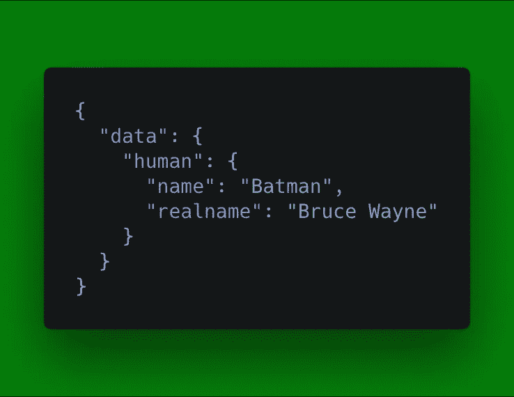

与 REST 只能传递一组参数不同，在 GraphQL 中，每个字段和嵌套对象都可以获得自己的一组参数。

## 别名

别名在查询具有不同参数的相同字段时非常有用。

## 突变

虽然 GraphQL 查询可以帮助客户机获取任何形状的数据，但客户机还需要某种方法来修改服务器端数据。

任何请求都有可能对服务器造成某种副作用。通常建议不要使用`GET`请求来修改数据。REST 和 GraphQL 都是类似的。

为了在服务器端写/修改数据，GraphQL 为我们提供了一个叫做**突变**的特殊字段。

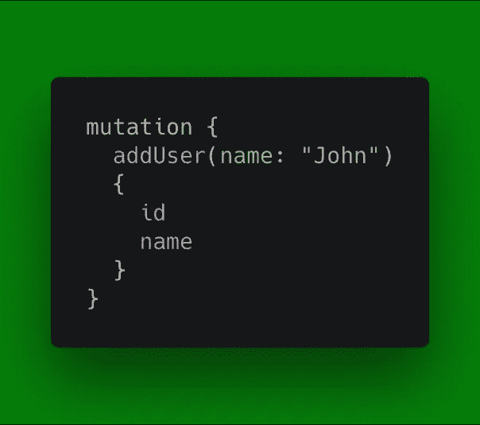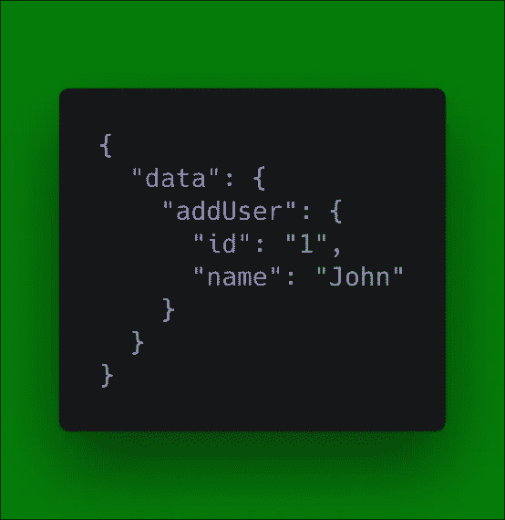

类似于查询，如果一个突变字段返回一个对象类型，您也可以要求嵌套字段。如果您想在更新后获取对象的新状态，这非常有用。

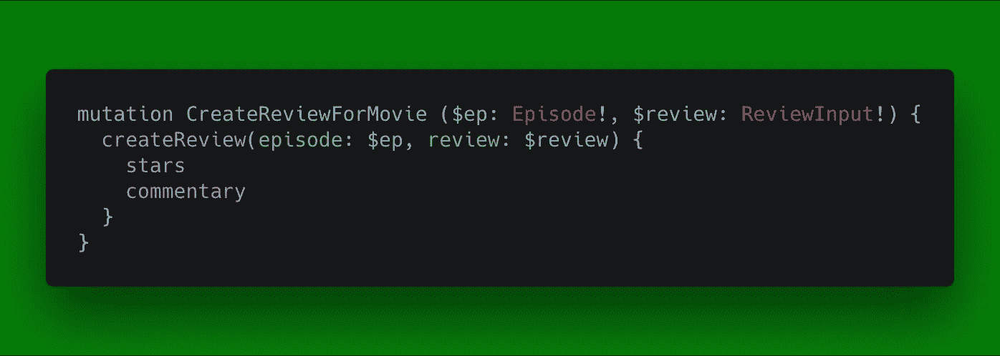

`createReview`字段将向`stars`和`commentary`字段返回一个审查。当您需要更改现有数据时，这将特别有用。

## 捐款

订阅允许开发人员通过近乎实时的更新为他们的应用程序引入新的交互水平。通过添加订阅，您可以根据不同用户之间的最新变化来更新您的应用。

客户端在查询中指定他们想要“订阅”的数据，如下所示:

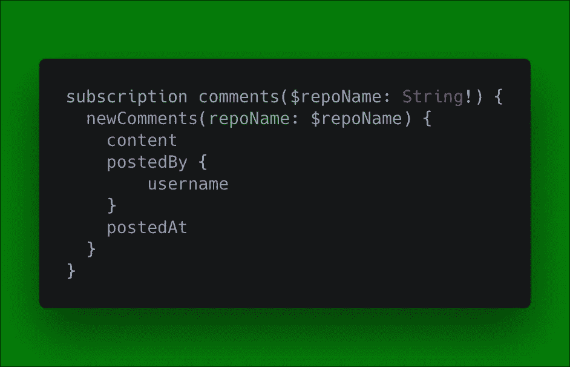

当某个内容发布到订阅的通道时，服务器将运行订阅中指定的 GraphQL 查询，并向客户端发送一个完整的新结果。

与查询或变异不同，订阅可以提供多个结果，因此长期连接是必要的。我建议使用 WebSocket 连接。

# 如何在 React/React 本地项目中设置 Apollo 客户端

在 React/React 本地项目中设置 Apollo 客户端相当容易。你所需要做的就是在你的`App.js`文件中写下这段代码:

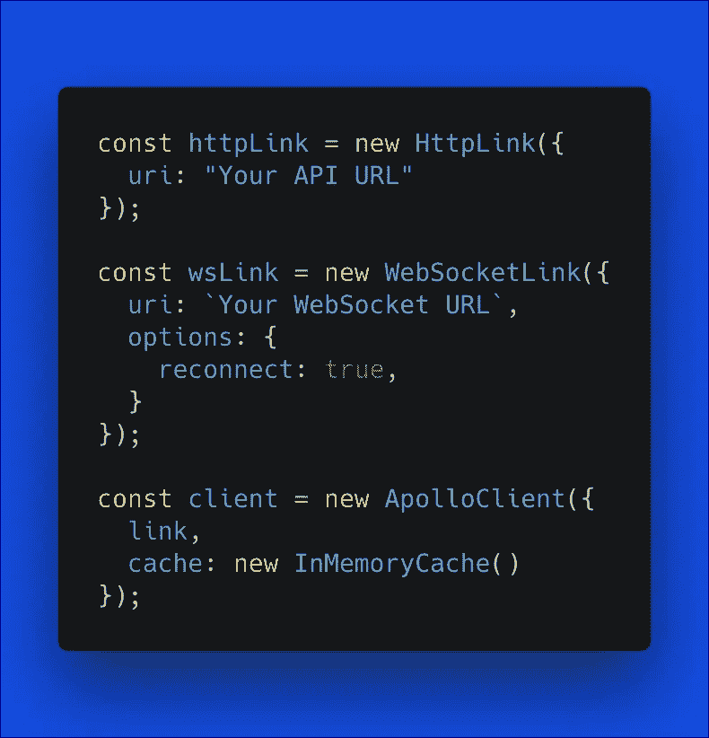

瞧啊。您已经成功地在 React 或 React 本地项目中设置了 Apollo 客户端。

您所要做的就是将您的`App`组件包装在一个`ApolloProvider`组件中。

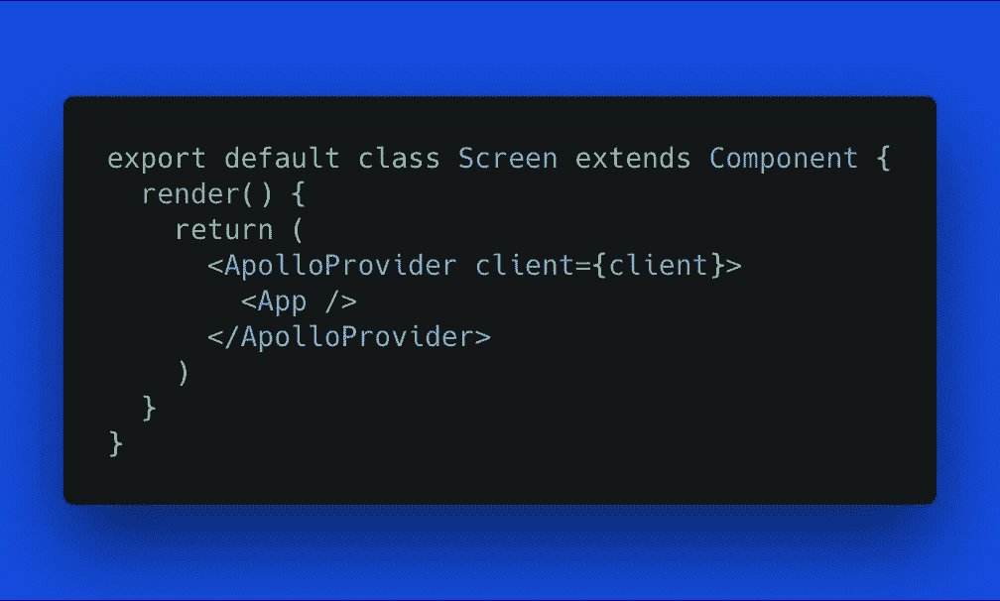

没有更多的事情要处理。请确保已将下列依赖项添加到项目中。

*   阿波罗-客户端预设
*   反应-阿波罗

通过这样做，查询的数据现在在同一个组件的 props 中是可用的。

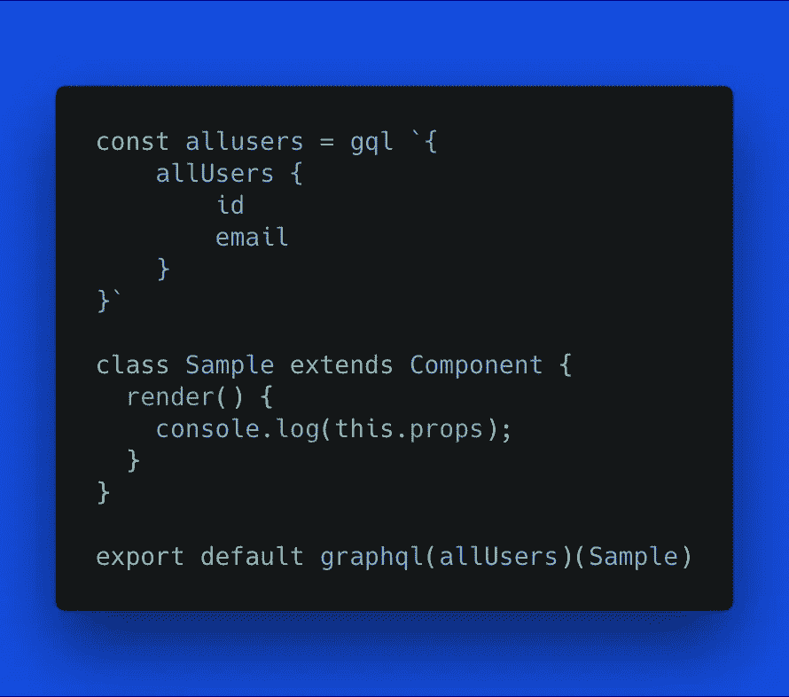

# 用 GraphQL 构建一个 ChatApp

GeekyAnts 的软件工程师 Prameet Chakraborty 构建了这个令人敬畏的 React 原生聊天应用程序，并使用 GraphQL 作为后端。

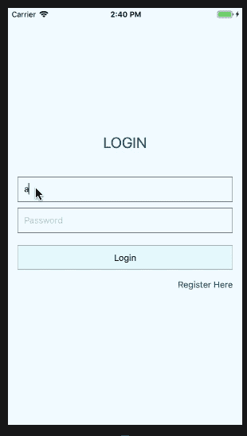

## 属国

**GraphCool** 是 GraphQL 发展的下一个重要步骤。更“酷”的是它是开源的！

GraphCool Framework 是一个全面的构建块集合，涵盖了开发现代的、以数据为中心的 GraphQL APIs 的整个范围，包括:

*   **GraphQL 数据库**:graph QL 数据库，允许你通过 [GraphQL CRUD API](https://www.graph.cool/docs/reference/graphql-api/overview-abogasd0go) 查询、突变&流数据。它还包含一个强大的数据库迁移工具，允许您使用 GraphQL SDL 定义和发展您的数据模型。
*   **强大的权限系统:**使用强大的权限系统保护您的 GraphQL API，该权限系统基于您根据简单的 GraphQL [权限查询](https://blog.graph.cool/reinventing-authorization-graphql-permission-queries-f2bd041bcd76)定义的规则。
*   **GraphQL 订阅 API:** 使用 Graphcool 框架，实时功能(基于 GraphQL 订阅)是免费的。您的突变会自动将订阅事件发布到事件网关，事件网关会将更新转发给所有订阅的客户端。

**Apollo Client** 是一个超灵活的、社区驱动的 GraphQL 客户端。它是从头开始设计的，目的是使构建使用 GraphQL 获取数据的 UI 组件变得容易。

这是一个由社区驱动的努力，旨在构建一个强大、灵活和生产就绪的 GraphQL 客户端，并支持各种前端框架，如 React、Angular 和 Vue。

**NativeBase** 是 GeekyAnts 为 React Native 开发的开源 UI 组件库。就 UI 组件而言，NativeBase 是开发人员的首选之一。

## 它是如何工作的

GraphQL 提供了一种更简单的方法来构建一个简单而有效的聊天应用。下面是 Prameet 的聊天应用程序的工作方式:

*   一个**突变**被发送到服务器，以便创建一个新用户(注册)。

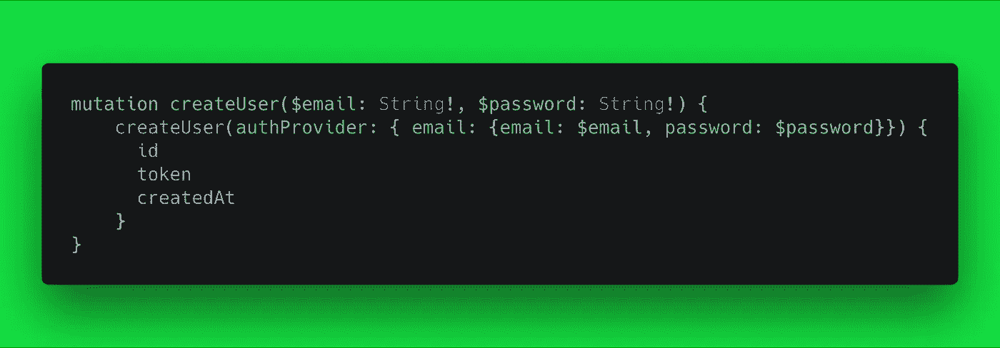

*   当用户试图登录时，包含用户凭证的**突变**被发送到服务器。

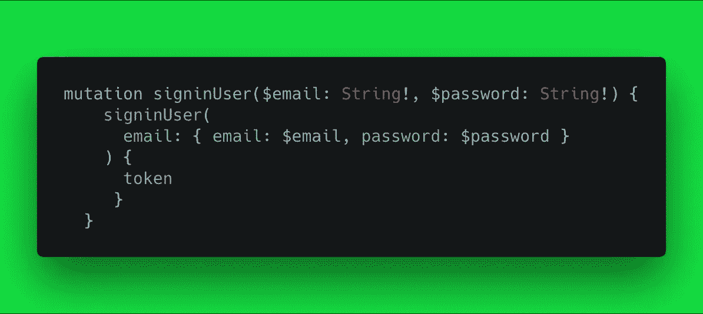

*   一旦用户使用他们的凭证登录聊天，应用程序就向服务器发送一个**查询**，以获取所有已经在应用程序上注册的用户。

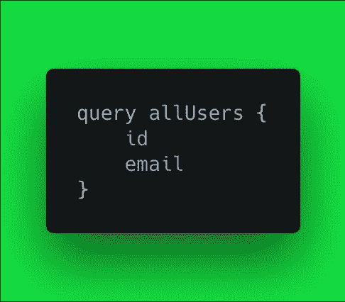

*   该应用程序还发送一个**查询**获取所有的消息，并根据发送者和接收者的`id`进行过滤。

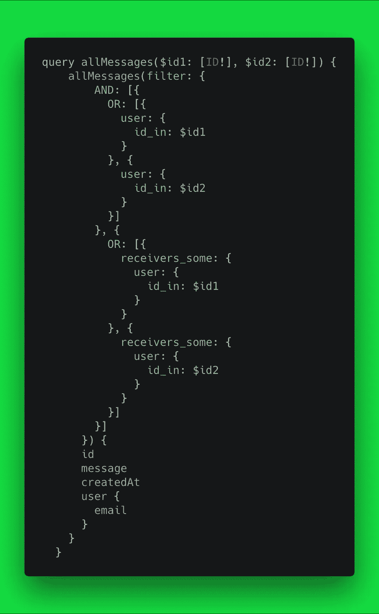

*   当用户发送新消息时，该消息通过**突变**被注册到服务器上。

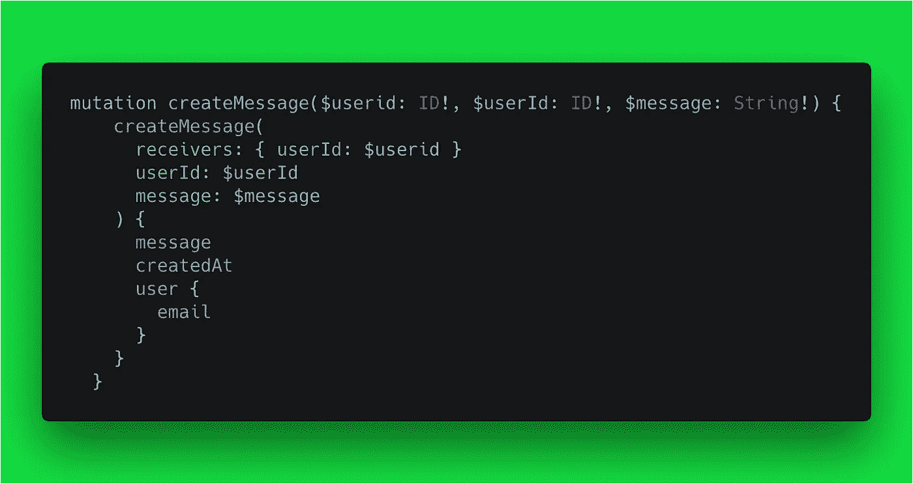

*   所有这些都包装在一个**订阅**下。

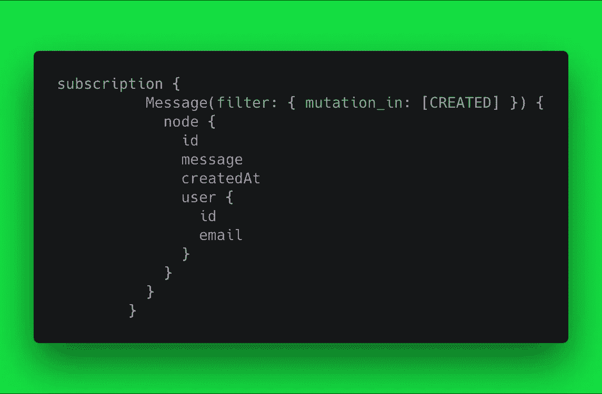

Subscription to listen for any new created message

我是 [Rajat S](https://medium.com/u/ae259dddfc25?source=post_page-----a5bc3622e54--------------------------------) ，是 [GeekyAnts](https://geekyants.com/?utm_source=medium&utm_medium=article&utm_campaign=blog) 的技术内容撰稿人。有抱负的程序员还有很长的路要走。一个热爱漫威电影的铁杆 DC 漫画迷。😛在 [Twitter](https://twitter.com/rajatk16) 上关注我，了解[极客之家](https://geekyants.com/?utm_source=medium&utm_medium=article&utm_campaign=blog)正在发生的所有令人惊奇的事情。

感谢 Prameet Chakraborty 对这篇文章的帮助，以及帮助我理解关于 GraphQL 和 GraphCool 框架的一切。Prameet 是 [GeekyAnts](https://geekyants.com/?utm_source=medium&utm_medium=article&utm_campaign=blog) 的软件工程师。这篇文章的灵感来自于他关于 GraphQL 的演讲。

感谢你阅读这篇长文！请吧👏如果你喜欢的话。