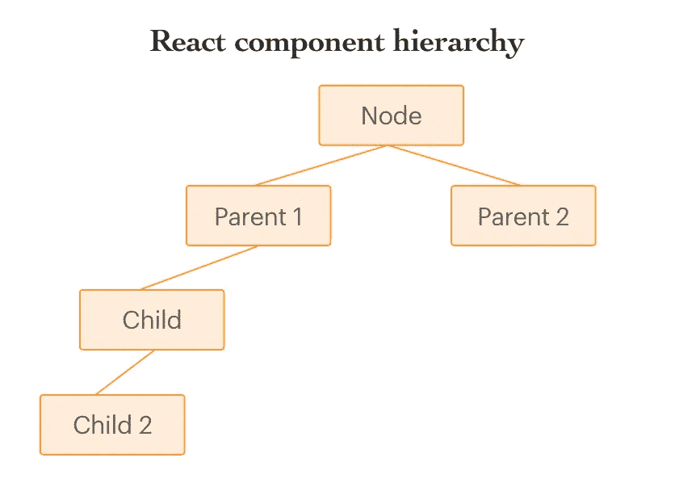
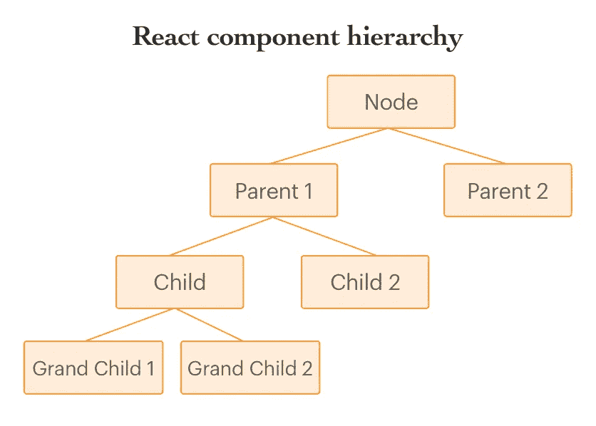

# 关于 React 的上下文 API 你需要知道的一切

> 原文：<https://medium.com/hackernoon/everything-you-need-to-know-about-reacts-context-api-e5c8c32ef202>


Image credits: [https://www.robinwieruch.de](https://www.robinwieruch.de)

React 就是这样一个用户界面库，它在几个月内频繁升级新的特性和概念。在[版本 16.3](https://reactjs.org/blog/2018/03/29/react-v-16-3.html) 中的一个额外的概念或特性给了我们上下文 [API](https://hackernoon.com/tagged/api) ，它是 React 中旧的上下文概念的升级版本，允许组件在父子关系之外共享数据。

在本文中，我将向您介绍新的上下文 API 的基础知识，以及为什么要在下一个基于 React 的项目中使用它。

让我们开始吧！

# React 中为什么需要上下文 API？

在我们深入研究 React 升级到 Context API 的原因之前，让我们先熟悉一些用于介绍 React 中的数据操作和更新的基本术语。

在 React 中，通过使用一些我们称之为道具和状态的术语来更新和操作数据。

属性可以理解为从父组件传递给子组件的数据或信息。

而状态可以很容易地理解为在组件本身中被管理的数据。

那么，如果每个组件管理自己的状态，如何在嵌套组件之间共享数据呢？是的，我们确实有传递数据的道具，但这只在父子关系的情况下有效。

举例来说，让我们以一个由不同类型的嵌套组件组成的应用程序为例:



如上图所示，Child2 是 Child 的孩子，Child 也是 Parent 的孩子。这使得 Child2 成为 Parent 的孙辈。

现在，让我们用更简单的方式来理解一些代码:

```
class Parent extends React.Component {
 state = {
 value: ‘Some value’
 };

 render() {
 return(
 <Child value={this.state.value} />
 );
 }
}

const Child = (props) => (
 <Child2 value={props.value} />
);

const Child2 = (props) => (
 <div>{props.value}</div>
);
```

在上面的例子中，我们从父组件(这里是父组件)通过它的子组件 child 发送值，这个子组件应该在组件 Child2 中使用。在这里，子组件不关心值(prop)，它只传递要在组件 Child2 中使用的 prop。现在，这个例子对你来说可能看起来很简单，你可能会想这有什么问题。

让我们想象一下，如果我们不仅有一个子组件，还有孙子 1 和孙子 2，或者在父组件和子组件之间有更多的组件。在这种情况下，您需要将道具进一步向下传递到树的每个组件。但是，根据上面提到的道具的定义，值只能在父节点和子节点之间传递。



这种可能对[反应性能](https://www.simform.com/react-performance/)造成严重破坏的问题被称为适当钻孔。简单来说，它涉及到从上层(即父级)到下层组件(如子级、孙级等)的属性传递。在组件树中，中间的组件不关心这些属性。

虽然你有像 Redux 这样的库来减轻这种复杂性，但是在这种情况下使用 Redux 是没有价值的，因为它会使你的应用程序的逻辑更加复杂。然而，这正是 React 中上下文 API 的概念发挥作用的地方。

# 什么时候应该使用 React 的新上下文 API？

使用上下文最适合这样的用例:您的代码库由许多依赖于单个数据的组件组成，但是这些组件嵌套在组件树的深处。

下图将让您了解上层、中层和下层组件在组件树中的嵌套深度:


# 使用 React 新的上下文 API 之前需要熟悉的事情

如上所述，React 的新上下文 API 提供了一种方法，可以在 React 组件树中传递和存储数据，而无需将数据写入组件层次结构的每一层。它通过利用两种类型的组件来做到这一点:

**提供者** —提供者组件用于树的更高层次。它接受一个名为 as Value 的属性。它充当分层树中的根组件，使得树中的任何子节点都可以访问由上下文提供者提供的值。

```
render() {return (
<Provider value={this.state.contextValue}>
{this.props.children}
</Provider>
);
}
```

**消费者**——顾名思义，消费者消费被传递的数据，不管它在组件树中的嵌套有多深。这意味着，消费者不一定是提供者的孩子。相反，它可以从组件树的任何地方访问数据。

消费者通过使用 render prop API 来呈现数据。

```
render() {return (
<Consumer>
{contextValue => <Child arbitraryProp={contextValue} />}
</Consumer>
)
}
```

# 如何在 React 应用程序中使用上下文？

既然您已经非常熟悉新的上下文 API，现在是时候让您了解如何在应用程序中使用上下文了。

在 React 中，您有一个预定义的函数来创建上下文:

```
const Context = React.createContext();
```

React.createContext 用于初始化上下文，并传递初始值。它返回一个带有提供者和使用者的对象。提供者和消费者是成对出现的，也就是说，对于每个提供者，都有一个相应的消费者。

上面解释的例子非常容易理解。但是，您总是需要处理更复杂的数据，并找到一种方法将这些数据存储在组件树中，以便其他组件可以使用。

现在让我们用上下文 API 重新实现上面的例子:

```
const Context = React.createContext();
class Parent extends React.Component {
state = { x: 1 };
handleContextChange = x => this.setState({ x });
render() {
const contextValue = {
data: this.state,
handleChange: this.handleContextChange
};
return (
<Context.Provider value={contextValue}>
<Child/>
</Context.Provider>
);
}
}
const Child = props => <div><GrandChild/></div>;
const GrandChild = props => (
<Context.Consumer>
{({ handleChange, data }) => (
<div>
<button onClick={() => handleChange(2)}>Change</button>
<Child2 text={data.x} />
</div>
)}
</Context.Consumer>
);
const Child2 = props => <p>{props.text}</p>;
```

在上面的代码片段中，我们从初始化一个上下文开始。然后我们在属于父组件的顶层使用它。父组件的状态是 Context.Provider 的值。提供程序获取新值。父组件也被用作我们的状态存储的存储，以便上下文可以将它向下传递到层次结构。

在组件孙中，我们使用了上下文。通过其子渲染属性接收函数的消费者。Upn 改变上下文的值。提供者，这个函数被反复调用，最后用新值呈现。

这里，位于父代和孙代之间的组件子代不知道整个上下文安排。子组件 2 和按钮元素也是如此，因为它们也不知道上下文。这些组件只接收通过它们的 prop 传递的数据和 changeHandler 函数，并可以像使用任何其他 prop 一样进一步使用它们。

# 最后的话

React 的新上下文 API 绝对不是 Redux 或 MobX 等状态管理库的替代品。两者都不依赖于沿着组件树向下传递上下文。相反，它提供了提供者-消费者组件对来在层次结构中的嵌套组件之间进行通信。

顶层组件提供数据，底层组件使用数据，而不必将数据一层一层地向下传递到组件分层树。

通过这篇文章，您可以开始在应用程序中使用 React 的上下文 API。如果你想进一步了解更多关于 API 的相关信息，不要忘记阅读官方文档。