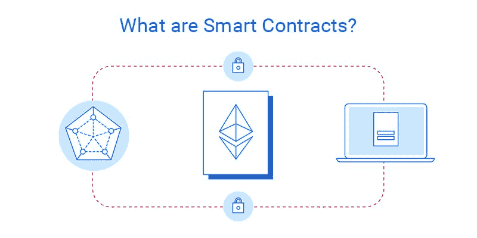
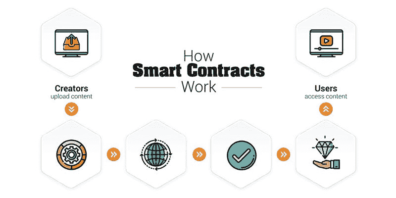
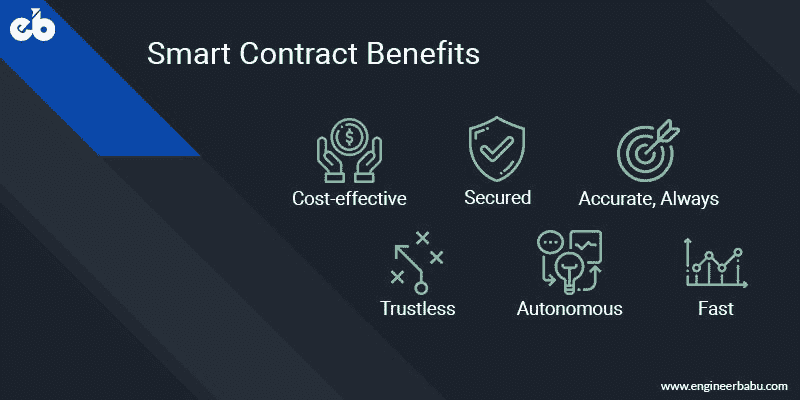
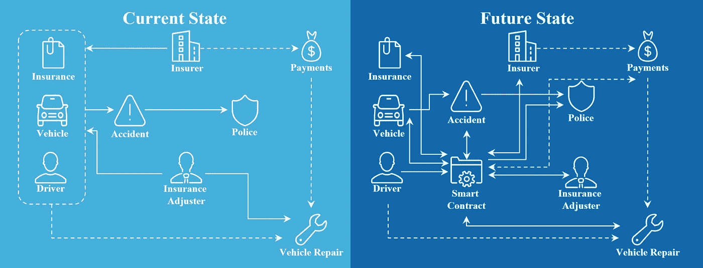
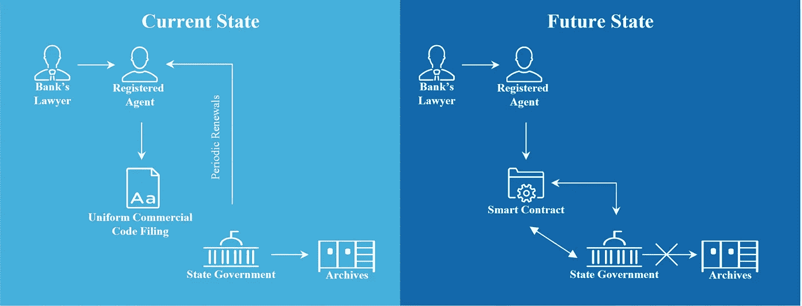

# 关于智能合约你需要知道的一切:初学者指南

> 原文：<https://medium.com/hackernoon/everything-you-need-to-know-about-smart-contracts-a-beginners-guide-c13cc138378a>

## 以高效的方式介绍智能合同及其功能

Image Source — [EngineerBabu](https://engineerbabu.com/)

区块链最独特的特征之一是其作为网络各方共享的分散机构的性质，从而消除了中间人或第三方中介的参与。这个特性特别有用，因为它避免了任何进程冲突的机会，并且节省了时间。虽然区块链有自己的一系列问题有待解决，但与传统系统相比，它们提供了更快、更便宜和更有效的选择。由于这个原因，这些天甚至银行和政府机构都转向区块链。

智能合同可以被称为当前区块链技术最常用的应用。智能合同的概念是由法律学者和密码学家 Nick Szabo 在 1994 年提出的。他得出一个结论，任何分散的分类账都可以作为可自我执行的合同，后来被称为智能合同。这些数字合同可以被转换成代码，并允许在区块链上运行。

尽管智能合同的想法很早就出现了，但我们生活的当前世界是基于纸质合同的。即使使用了数字合同，也不能排除系统中受信任的第三方的参与。虽然我们已经用这种方法定义了一个功能系统；我们不能确定它是否总是一帆风顺。第三方的参与可能会导致安全问题或欺诈活动，并增加交易费用。

随着区块链在数字技术领域的引入，这些问题可以得到有效解决。基于区块链的系统允许网络中的所有实体以分布式方式彼此交互，从而消除了对任何可信第三方的需求。简单来说，区块链是一种在分布式账本上存储数据的技术。记录和交易的存储数据对网络中的所有各方都是实时可用的。随着比特币的推出，区块链技术受到了关注，比特币是迄今为止第一种也是最成熟的加密货币。除了加密货币的应用，区块链也在发展，其用例正在不同的行业出现。

智能合约是区块链技术最成功的应用之一。使用智能合同取代传统合同可以显著降低交易成本。以太坊是最流行的创建智能合同的区块链平台。它支持一个称为图灵完整性的特性，允许创建更多定制的智能契约。智能合同可以应用于不同的行业和领域，如智能家居、电子商务、房地产和资产管理等。

# 什么是智能合约？

What are Smart Contracts — [Image Source](https://perfectial.com/blog/smart-contracts-and-industries-they-will-affect/)

智能合同是运行在区块链之上的两方或多方之间的一组计算机代码，由相关方同意的一组规则组成。在执行时，如果满足这些预定义的规则，智能合约会自动执行以产生输出。这段代码通过促进、验证和执行底层协议的条件，允许分散的自动化。智能合约允许你以透明的方式交换任何有价值的东西，包括金钱、股票、财产等，消除了对中间人的需要，并保持系统无冲突。

在一个正常的世界过程中，获得一份法院注册的文件作为证明，你需要先去找律师或公证人，给他们钱作为他们服务的回报，然后等到你得到你需要的文件。然而，智能合约完全改变了这种情况。当您使用智能合同运行此流程时，您只需付费即可获得您需要的文档，这将在没有任何第三方(如本案中的律师)参与的情况下完成。此外，智能合同不仅限于定义任何协议的规则，还负责自动执行这些规则和义务。

换句话说，智能合约是存储在包含预定规则的区块链上的可自动执行的代码行。当满足这些规则时，这些代码会自动执行并提供输出。最简单的形式是，智能合约是根据其创建者设置的格式运行的程序。智能合同在商业合作中最为有益，在这种合作中，智能合同被用来就双方同意的既定条款达成一致。这降低了欺诈的风险，并且由于没有第三方参与，成本也降低了。

总而言之，智能合约通常基于一种涉及数字资产和多方的机制，其中所涉及的参与者可以自动管理他们的资产。这些资产可以存放起来，并根据合同的规则在参与者之间重新分配。智能合约有可能跟踪实时绩效并节省成本。

智能合同属性:

*   自我验证
*   可自我执行
*   防篡改

# 智能合同是如何工作的？

How Smart Contracts Work — [Image Source](http://ikiguide.com/2017/12/31/successlife/smartcontract02/)

为了理解智能合同是如何工作的，让我们举一个例子，你想出售自己的房产。出售房产的过程需要大量的文书工作以及与多方的沟通。除了通信的复杂性，它还涉及欺诈的风险。在当今时代，大多数想从事房地产交易的人都是通过房地产经纪人取得成功的。这些代理商负责处理文书工作和市场。他们在整个过程中充当中间人，参与谈判并监督交易。

在这种情况下，你不能依赖与你交易的人，因此，这些机构提供托管服务，将资金从一方转移到另一方。当交易完成后，你必须按照确定的百分比向代理和托管服务双方支付佣金。这导致卖方额外的金钱损失和更多的风险。

输入智能合同。在这种情况下使用智能合同可以通过减轻负担来提高效率。智能合约旨在基于条件的原则(如果这那么那)，只有在货币和其他条件达成一致时，才能通过将所有权转移给买方来解决所有权问题。此外，谈到托管服务，智能合同也可以取代这些服务。

金钱和财产占有权都可以存储在分布式系统中，相关各方可以实时查看该系统。由于所有网络参与者都将见证资金转移，因此消除了欺诈的机会。此外，没有中间人介入的机会，因为双方之间的信任不再是一个问题。房地产代理执行的所有功能都可以编码到智能合同中，从而为买卖双方节省大量资金。

# 为什么当今需要智能合同？

Benefits of Smart Contracts — Image Source: [EngineerBabu](https://engineerbabu.com/)

通过在我们的日常生活中应用智能合同，我们可以实现显著的变化，因为它们提供了优于传统合同的多种优势。智能合同更加方便快捷，这使得人们可以接受智能合同来简化他们的工作流程。

当您需要交换任何有价值的东西时，无论是财产、金钱还是共享物，它们都能为您提供安全性和易用性的完美结合。

消除对中介的需求使得智能合同在我们生活中的应用更具吸引力。智能合约的使用可能会随着技术的进步而加速。让我们来看看智能合约提供的好处:

## **透明度**

区块链技术的一个基本特征是透明性，这也是智能合约所共有的。如前所述，智能合同充满了绝对详细的条款和条件，这些条款和条件也由协议中涉及的各方进行检查。

这消除了在后期阶段发生争议和问题的可能性，因为只有在所有参与者都同意的情况下，条款和条件才会得到彻底检查和落实。智能合约的这一特点允许相关方确保交易过程中的透明度。

此外，合同细节需要精确，使所有信息对每个人开放，最终解决任何与沟通不畅有关的问题。因此，在智能合约的帮助下，沟通差距中损失的效率可以得到恢复。

## **省时**

为了继续进行任何涉及文档的过程，通常至少需要几天以上的时间。过程中的延迟是由于过程中的许多中间环节和不必要的步骤。另一方面，智能合约是借助互联网运行的，因为它们只不过是一些软件代码。

因此，通过智能代码完成交易的速度太快了。与任何传统业务流程相比，智能合同可以节省数小时甚至数天时间。此外，还消除了由于人工参与造成的时间延迟。

## **精度**

智能合约以明确详细的形式编码。在最终投入使用之前，它需要包含所有的条款和条件。契约中遗漏的任何条件都可能导致执行时出错，因此在创建智能契约时，所有条件都放在详细的表单中。

由于这个原因，智能合同成为一个全面的协议，当自动执行时，几乎可以完成所有事情。在手动合同的情况下，有可能出现错误，因为负责制定合同的人可能会错过一个或另一个条件。此外，在错误发生之前，甚至没有办法跟踪它。因此，在实现准确性和精确性方面，智能合约是一个更好的选择。

## **安全和效率**

就当前时代的数据加密技术而言，具有自动编码功能的智能合同是最安全的选择。由于它们符合最高的安全标准，它们的防护等级允许它们安全地用于关键过程。

此外，由于智能合约如此准确和安全，其效率水平太高，从而在交易中产生更多价值。

## **数据存储**

智能合同准确无误，精确到协议的最小级别。任何交易的所有细节都存储在合同中，参与方的任何人都可以在任何给定的时间访问它。此外，这些交易以未来记录的形式存储在区块链上。这对于将来有关合同条款的任何争议特别有帮助。

## **储蓄**

使用智能合同代替传统协议可以节省大量成本。首先也是最重要的，因为智能合同只涉及作为协议一部分的当事人；消除了对中间商的需求，也节省了相关费用。

当使用智能合同时，所有的律师、证人和中介都没有作用。此外，如前所述，智能合同还可以节省资金，因为纸质文件不涉及任何流程。

## **信任**

透明和安全的特性使得智能合同在商业中值得信赖。它们消除了任何操纵和人工错误的可能性，并建立了执行的信心。所有条件达成一致后，合同自动生效。

这些合同的另一个独特之处可能是它们能够大大减少对诉讼和法庭的要求。自动执行的智能合同允许双方承诺并遵守合同中规定的条件和规则。

## **无纸化**

由于智能合同是计算机编码的文件，在整个过程中不再使用纸张。一方面，这节省了成本，另一方面，这对全球的公司都是有益的，因为这有助于他们在合同方面节省纸张用量，并促进他们对社会的贡献。

# **智能合约的应用**

无论是一份新工作还是购买任何新产品，合同协议都是这类事情的证据。然而，传统文书工作和合同的复杂流程涉及高成本、第三方以及此类流程中出现人工错误的可能性。

随着数字化和技术的进步，我们可以在智能合同的帮助下使这些流程更加可靠和经济高效。其理念是避免任何中介和第三方系统，使系统更加有效和高效。智能合同可以应用于不同的行业和部门。下面让我们来看看其中的一些:

## **保险**

Insurance as an Application to Smart Contracts — [Image Source](https://www.ccn.com/smart-contracts-12-use-cases-for-business-and-beyond/)

保险管理缺乏自动化，索赔处理可能需要很长时间，从几周到几个月不等。这对客户和保险公司来说都是一个问题，因为客户的资金受到时间的限制。另一方面，公司不得不面对不必要的管理成本、不满意的客户和低效率等问题。

通过在此类流程中使用智能合同，当客户和公司的协议满足特定条件时，可以自动触发索赔付款，从而简化流程。例如，在自然灾害造成损失的情况下，智能合同可以及时执行，人们可以要求他们的钱，并在需要时使用它们。任何具体细节，如损坏造成的损失程度，都可以保存在区块链上，赔偿金额可以据此决定。

## **物联网**

物联网技术正被用于将日常设备连接到互联网，以便在传感器的帮助下提高系统的互联性。这些设备可以连接到自动区块链系统，以跟踪环路中的所有产品和过程。例如，在一般情况下，你可能会在网上购物时收到错误的订单，但通过区块链和物联网的结合，可以在包括仓库、运输、送货上门在内的每一步跟踪产品及其位置。全自动系统将确保正确的产品交付给正确的人。

该系统中的传感器在区块链上创建自己的节点，在智能合同的帮助下，可以跟踪各个产品的位置和拥有情况。智能合同会一直更新位置状态，直到产品交付。这有助于确保产品从最初装运到交付的正确性。

## **抵押贷款**

抵押贷款协议是复杂的，因为其中包括许多细节，如抵押权人的收入，信用评分以及支出。为了进行抵押贷款，对这些细节进行检查是非常必要的。这一过程往往掌握在中间人和第三方手中，这使得贷款人和贷款申请人都感到冗长和麻烦。

由于多种原因，在这种情况下使用智能合约是有益的。最重要的是取消中间商，以避免任何冗长的过程和混乱。此外，所有细节都可以存储在一个位置，供双方随时访问。

## **雇佣合同**

雇佣合同是另一个需要智能合同的领域。如果任何一方，即雇主或雇员未能达到设定的期望，协议的条款可能会受到影响。这导致了信任的缺失，而智能合约可以解决这个问题。通过为双方使用单一的智能合同，条款和条件可以变得清晰，这将有助于提高公平性。这些记录可以是任何东西，如工资金额、工作职责等。一旦这些交易被记录在智能合同上，就可以在发生任何冲突的情况下对其进行调查。这将改善劳资关系。

此外，智能合同可以用来使工资支付处理更容易，以便期望的员工在特定时间段内收到商定的金额。此外，在雇主、雇员和代理机构都参与的临时工的情况下，智能合同可以用来引入透明度。这将防止代理机构在雇员被公司雇用后干涉他/她的合同条款。在智能合约的帮助下，可以检测到条款的任何变化。

## **保护受版权保护的内容**

Copyrighting as an Application to Smart Contracts — [Image Source](https://www.ccn.com/smart-contracts-12-use-cases-for-business-and-beyond/)

在当今的数字世界中，内容不仅限于文字。它可以是任何东西，从书面文件到视频到音频剪辑。当一段内容被商业发布时，内容的所有者理论上可以获得版税。然而，创作过程涉及多方，因此，他们都有责任付款或版税。实际上，这一点并没有得到保证，因为没有明确的方法来澄清权利方面的混乱。智能合同可以通过在区块链上记录所有权来确保预期贡献者获得版税，从而解决这一问题。

## **供应链**

供应链管理涉及货物和产品从初始阶段到最终阶段的流动。作为许多行业的重要组成部分，供应链的正常运行对企业至关重要。供应链管理不是一个人的工作，因此，有不同的实体参与其中。供应链中的智能合同可以在产品通过供应链转移时记录所有权。网络中的每个人都可以在任何给定时间跟踪产品的位置。

最终产品可以在整个交付过程的每个阶段进行检查，直到到达最终客户手中。如果一个项目在这个过程中丢失了，智能合同可以用来检测它的位置。此外，如果任何利益相关者未能满足合同条款，整个系统都可以清楚地看到。智能合同为整个供应链系统带来了透明度。

智能合同对许多行业都有一定的优势，例如降低管理费用、提供透明度和节省时间。虽然与书面合同相比，它们更加可靠、安全、高效和值得信赖，但需要注意避免代码损坏的风险，并且随着企业向前发展并接受数字化流程，风险意识也是不可或缺的。

# **结论**

智能合约的潜力是不可限量的。它们可以用于小型常规协议，也可以用于政府和企业的合同。他们允许交易者和购买者在供应链中追踪他们的购买，这增加了信任。

而律师、政府机构等第三方。以签订协议的费用的形式在我们的口袋里打洞；智能合约通过消除对这种中介的需要来节省这笔钱。当谈到使用智能合同时，我们需要做的只是在执行前检查代码，之后的一切都将以电子方式完成。智能合同为我们提供了一个机会，使我们的日常交易和流程更加简化和自动化。

智能合约的基础是接口、业务规则和数据。随着技术的发展，智能合同也需要更新，以消除与操作系统的任何兼容性问题，并正确执行其指定功能。虽然智能合约仍处于开发阶段，但它们可能会面临某些漏洞攻击。为了让智能合同成为我们日常生活的一部分，网络安全实践以及创建智能合同的平台都需要不时更新。

— — — — — — — — — — — — — — — — — — — — — — — — — —

## 看我的其他相关文章

**1。** [**区块链技术讲解:简介、意义、应用**](https://www.engineerbabu.com/blog/what-is-blockchain/) **，也上**[**hacker noon**](https://hackernoon.com/blockchain-technology-explained-introduction-meaning-and-applications-edbd6759a2b2)
**2。** [**区块链是如何彻底改变银行和金融市场的**](https://www.engineerbabu.com/blog/blockchain-revolutionizing-banking-financial-markets/) **，也上**[**hacker noon**](https://hackernoon.com/how-is-blockchain-revolutionizing-banking-and-financial-markets-9241df07c18b) **3。** [**区块链在医疗保健:机遇、挑战、应用**](https://www.engineerbabu.com/blog/blockchain-in-healthcare-opportunities-challenges-and-applications/) **，也上**[**hacker noon**](https://hackernoon.com/blockchain-in-healthcare-opportunities-challenges-and-applications-d6b286da6e1f) **4。** [**区块链是如何颠覆供应链行业的？**](https://www.engineerbabu.com/blog/how-is-blockchain-disrupting-the-supply-chain-industry/) **，也上** ****5。** [**十大知名区块链开发公司**](https://www.engineerbabu.com/blog/top-10-reputable-blockchain-development-companies/) **，也上**[**hacker noon**](https://hackernoon.com/top-10-reputable-blockchain-development-companies-7c6eba562b90)**

> ***我是 Mayank，*[*engineer Babu*](https://www.engineerbabu.com/)*的联合创始人。随时联系我*[*LinkedIn*](https://www.linkedin.com/in/mayankpratap/)*| mayank@engineerbabu.com(关于 EngineerBabu —* [*中*](https://hackernoon.com/how-mayank-pratap-built-engineerbabu-a-profitable-it-service-company-generating-more-than-50-000-per-month-bcd3006bdbb5) *)。***

**此外, [EngineerBabu](https://www.engineerbabu.com/) 通过构建高级 IT 解决方案，帮助初创公司、企业和所有者发展业务。他们开发的项目 95%都按时完成了。 [30+由风投](https://www.engineerbabu.com/casestudies)资助，获得最具创新总理设计奖，入选 Y-Combinator 2016 & 2017。**