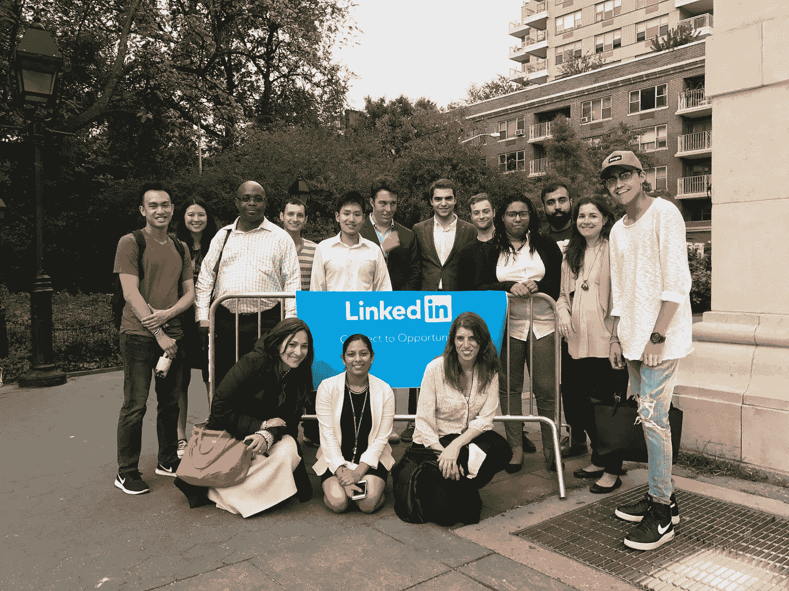

# 关于新 LinkedIn 你需要知道的一切🔮

> 原文：<https://medium.com/hackernoon/everything-you-need-to-know-about-the-new-linkedin-60c1161a117f>

image credit: [Aaron Fawzy](https://www.linkedin.com/in/aaronfawzy/) (congrats on the LinkedIn [In]ternship!)

# 老 LinkedIn 死了。☠️

每隔几周检查一次的日子一去不复返了。

我们正在见证社交媒体世界的下一次重大结构性转变，令许多人惊讶的是，引领潮流的是新的 LinkedIn。

对大多数人来说，LinkedIn 是他们最少使用的网络，他们只会在那里发布简历或寻找求职者。现在还是那样，但它已经准备好成为第一个地方。

# 终于！吸引年轻观众

现在有 5 亿多用户，[在微软 260 亿美元收购](http://www.businessinsider.com/microsoft-buys-linkedin-2016-6)后，这个以商业图表为中心的网络已经准备好成为千禧一代和 Z 世代心中的领跑者，他们将谨慎进入，主要有两个原因:

***1 —实用性*** —千禧一代/Z 世代想要真正的工作，而不是他们目前的失业/半失业。随着他们的到来，我们将会看到巨大的人口变化。

***2 —功能*** —原生视频和活动状态消息都在这里，更不用说重新设计的桌面 UI 和移动应用了。

这是一个杀手组合——一个完美的个人品牌形象。

# 新的 LinkedIn 成为你的新脸书(没有噪音)

一旦你每天在 LinkedIn 上呆上几个小时，而不是脸书，你就会消费内容、分享和制作你自己的内容。原生(并最终直播)视频将扩展这一点。

LinkedIn 全是商业，这令人难以置信地耳目一新。这不是像脸书那样的政治粪坑。

# 如何在游戏中领先

确保您准备好了:让您的个人资料适应新环境:

[**第 1 步—修复您的个人资料标题**](https://www.linkedin.com/feed/update/urn:li:activity:6307578983265427456)

[**第 2 步—修改您的个人资料摘要**](https://www.linkedin.com/feed/update/urn:li:activity:6308258844858474496)

[**第三步——如何用表情符号(对，表情符号)恰当地发帖**](https://www.linkedin.com/feed/update/urn:li:activity:6308615283552636928) 😂

# 你应该分享什么？

👉LinkedIn 原生视频

👉活动状态/消息

👉通过 LinkedIn publisher 平台发布的长篇帖子

👉通过基于文本的更新来讲述个人故事

# 不要试图玩弄制度

随着 LinkedIn 的发展，一些人试图滥用关系是不可避免的。人们对此已经非常敏感。避免试图兜售你的服务。相反，让你的个人资料自己说话，你给谈话带来的价值会让人们接触到你。

你唯一应该积极推销的是你的信誉。

# 需要关注的人(以及原因)

# 1.米凯拉·亚历克西斯

**风格:**大胆独特

**期待什么:**一反 LinkedIn 保守派的一贯作风，自拍以及所有人们认为“错误”的事情，米凯拉在一年内从[被解雇成为首席执行官](https://www.cnbc.com/2016/12/06/5-traits-youll-need-to-survive-in-a-world-that-thinks-unemployed-means-unworthy-spoiler-alert-it-doesnt.html)！

米凯拉定期发布图像丰富的内容(通常涉及咖啡)，刚刚发布了她的第一个视频。

# [2。奥列格·维什内波尔斯基](https://www.linkedin.com/in/vishnepolsky/)

**风格:**老派文字大师

**期待什么:**作为《每日邮报》的全球首席技术官，奥列格有几十年的励志商业故事要分享。他是基于文本的帖子的大师。所以如果你想成为一名作家，去看看奥列格吧。每天都是。

# [3。乔希·费希特](https://www.linkedin.com/in/joshuafechter)

风格:记录故事

**期待什么:**乔希经营着一个庞大的脸书集团(15k)，并一直在记录他的巅峰之旅。乔希不怕拐弯抹角，也不怕说出他故事中的低谷。看他放大他的视频游戏！

[4。布莱恩·华莱士(你真诚的)](https://www.linkedin.com/in/nowsourcing)

这不是自我诱饵。我致力于在发布平台上以基于文本的状态更新、原生视频和更长形式的帖子的形式发布常规内容，比如你现在正在阅读的内容。😂

# LinkedIn 上的病毒式成功是什么样子的？

**这个。**

[我一周前写了这篇文章](https://www.linkedin.com/feed/update/urn:li:activity:6306232514977546240/)它仍在增长，浏览量超过 845，000 次。

# 要避免的事情

👉不要给你的 100 个朋友加标签。你在 FB 上不再这样做了，对吗？

👉不求人家分享。

👉不求评论。

👉不要添加垃圾评论。

一旦你的帖子开始获得关注，用有意义和有见地的评论吸引你的读者。准备好回应！

# LinkedIn 的下一步是什么？

# 视频直播🎬

这似乎是显而易见的下一步。

一旦发生这种情况，预计一些主要的社交时间将从 Snapchat、Instagram、脸书直播和 Twitter 的 Periscope 上流失。

我的朋友 [String Nguyen](https://www.linkedin.com/in/stringstory/) 有一个[病毒 LinkedIn 视频](https://www.linkedin.com/feed/update/urn:li:activity:6302930268097478656/)，正在混合一些值得一看的原创内容。

# LinkedIn IRL 会议😱

留意 Linkedin 上的聚会。是的，亲自！

[Manu“Swish”Goswami](https://www.linkedin.com/in/swishgoswami/)在这方面一直处于领先地位(也是一个令人惊叹的追随者)，已经在纽约和中国成功举办了见面会。

这是他在纽约的最后一次聚会。

💡安娜·迈克菲一直在澳大利亚做聚会。谈论全球社区！

💡Rob Humphrey 在大学校园推出了 LinkedIn 日。比如去找辅导员😂

# 你如何看待 LinkedIn 的未来？请在评论中告诉我！

________________________________________________

***关于作者:*** 布莱恩·华莱士(Brian Wallace)是全国排名最高的信息图表机构 [NowSourcing](http://nowsourcing.com/high-quality-infographic-design/) 的创始人。在 [LinkedIn](https://www.linkedin.com/in/nowsourcing) 、 [Twitter](https://twitter.com/nowsourcing) 上和他联系，如果你真的喜欢他做的事情，[预约一个时间](http://bit.ly/brian-15)聊聊。

*(特别感谢* [*【扬冬】*](https://www.linkedin.com/in/thinkjanwinter/)*[*Doc Sheldon*](https://www.linkedin.com/in/sheldoncampbell/)*，以及*[*Chuck Hester*](https://www.linkedin.com/in/chuckhester/)*对本帖的贡献。这篇文章最初出现在*[*LinkedIn*](https://www.linkedin.com/pulse/everything-you-need-know-new-linkedin-wallace-infographic-expert-/)*上。)**