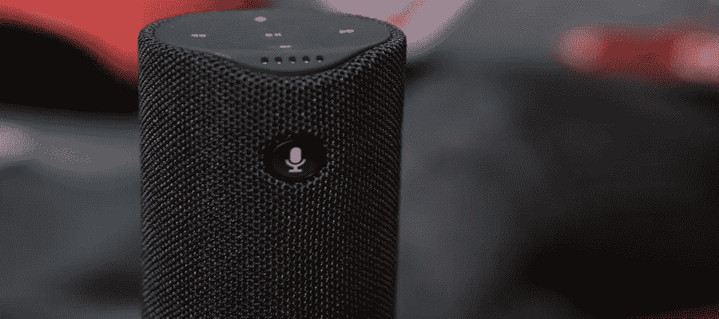
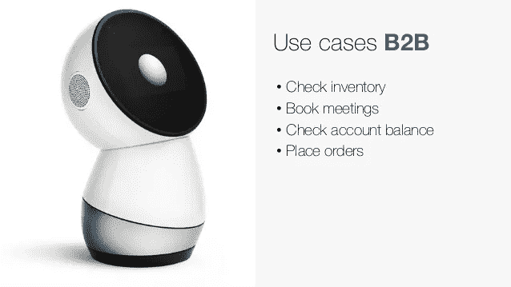
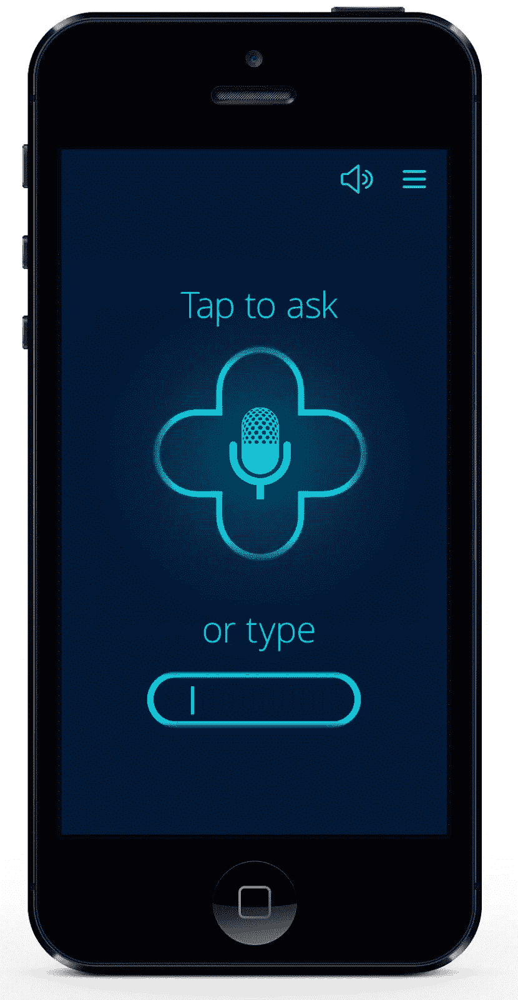
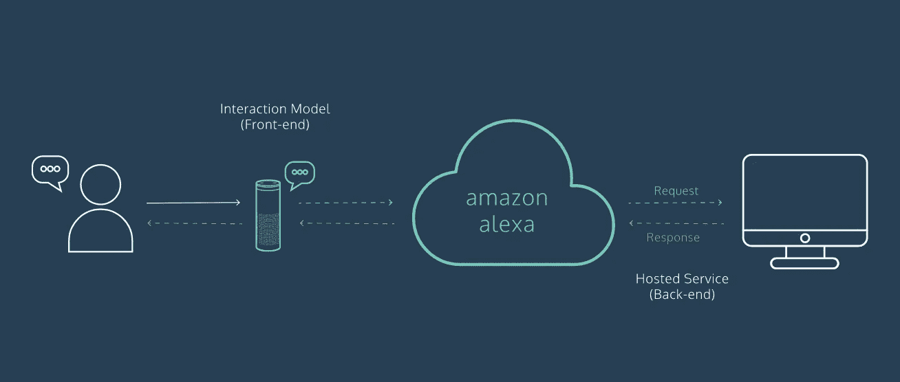
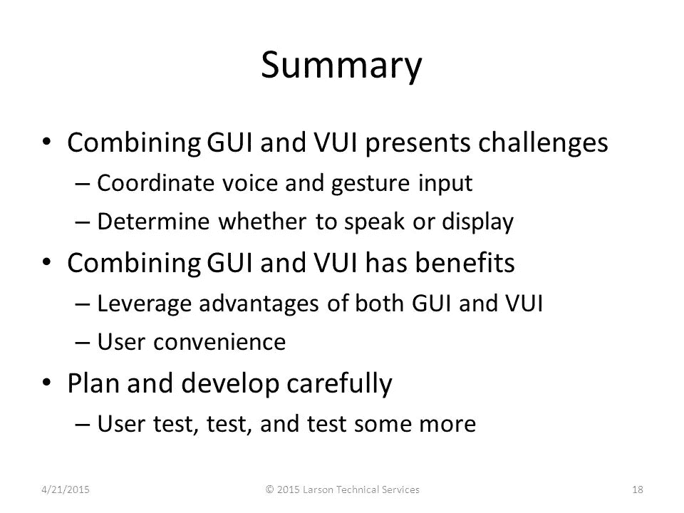

# 2018 年语音用户界面设计你应该知道的一切

> 原文：<https://medium.com/hackernoon/everything-you-should-know-about-voice-user-interface-design-in-2018-2384451f2f5b>

语音用户界面(VUI)在我们的日常生活中起着越来越重要的作用。VUI 设计师应该创造一个语音用户界面，可以提供更好的用户体验。

语言是人类特有的交流方式。我们现在处于[人工智能](https://www.mockplus.com/blog/post/ai-affect-ui-ux-design)飞速发展的时代，必然会通过语音用户界面(VUI)的使用解放我们的双手。**语音用户界面是 2018 年的一大趋势**，已经成为我们日常生活的一部分。VUI 用于智能手机、智能家居、智能电视和一系列其他产品。在世界各地，人们正在习惯于与 Siri、谷歌助手、Cortana 或 Bixby 交谈。

随着 VUI 的快速发展，设计师需要创造一种产品来提供卓越的用户体验。也就是说，如果他们想在竞争中领先。

# 1.什么是语音界面设计(VUI)？

“语音用户界面(VUI)使得人们可以通过语音/言语平台与计算机进行互动，以启动自动化服务或流程。”VUI 设计侧重于为用户和语音应用系统进行[交互设计](https://www.mockplus.com/blog/post/what-is-interaction-design-and-how-it-works)的过程。VUI 是一个面向用户的界面，所以它满足用户的需求是至关重要的。

# 2.VUI 是你的私人语音助手

VUI 将成为你的私人助理。新技术的发展将使设计者和开发者更容易提供定制的数字体验。VUI 不仅会成为你的私人助理，了解你目前的需求，而且还会预测你未来的需求。它涉及到你生活的方方面面，甚至是你想象不到的领域。

# 3.语音用户界面设计师的工作是什么？

VUI 设计和“传统的”网页设计没有太大的区别。然而，VUI 设计师应该关注 3 个主要方面:

*   进行[用户调研](https://www.mockplus.com/blog/post/user-experience-researcher)了解用户是谁，在哪里(环境)。设计人员还应该从头到尾了解系统与终端设备之间的整个通信过程；
*   设计师应该负责产品[原型设计](https://www.mockplus.com/blog/post/what-is-a-wireframe-what-is-a-prototype) (Mockplus 是原型设计工具的一个很好的例子)和产品描述，描述系统和用户之间的交互。
*   设计者在描述系统和用户之间的交互行为时，应该考虑需要处理的请求。分析数据，了解系统哪里出了问题。最终，设计师需要不断检查和改进系统。

# 4.设计语音用户界面的 6 个基本原则(VUI)

*   降低认知负荷，获得更好的用户体验

人类将音频储存为短期记忆。人是不可能一下子记住很多新信息的，所以不要让短期记忆负担过重。

语音设备必须准确理解用户的主要需求，并快速提供答案。

比如语音系统问用户:“你的主要症状是什么”。用户回答:“一个发烧，一个感冒。”

系统必须理解用户谈论的是两种症状。然后，它必须为这两种症状提供解决方案。

信息和用户界面组件必须以可感知的方式呈现给用户。

创建可以以不同方式呈现的内容(例如简单的布局)，而不会丢失信息或结构。

提供不同的方法来帮助用户导航、查找信息并确定其位置。

# 5.[图形用户界面(GUI)](https://www.mockplus.com/blog/post/gui-design-principles) 和语音用户界面(VUI)打造更好的产品

GUI 的内容主要是图形和文本，而 VUI 的内容主要是文本。人们通过点击和手势与 GUI 交互，而人们通过对话与 VUI 交互。VUI 必须明白人们在说什么，然后给出正确的回应。

VUI 结合 GUI 有助于简化整个导航过程以及选择和确认操作。

# 结论

语音用户界面设计是一个很有前途的全新领域，它通过语音控制提供解决方案。通过 VUI 和 GUI 的结合，可以使用通过面部表情、手势和音频的输入来增强和简化人机交互。