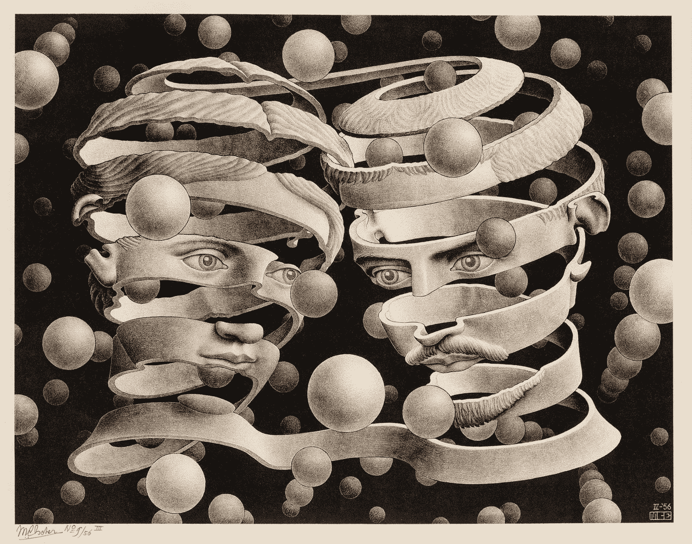
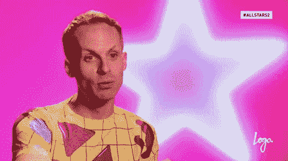
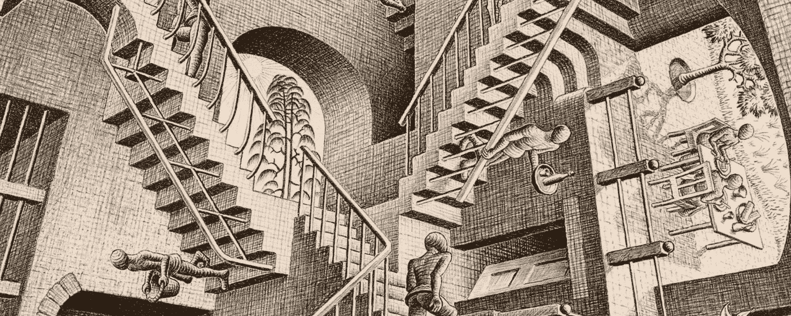

# 有证据表明我们生活在模拟环境中

> 原文：<https://medium.com/hackernoon/evidence-were-living-in-a-simulation-yanny-laurel-audio-illusion-79ebf0461b9c>

本周二，我们都看到了我们确实生活在模拟环境中的证据。就像 2017 年的礼服灾难一样，当我们看到眼前的一件蓝色礼服，我们的同事、爱人或朋友发誓说它是金色的，Yanny/Laurel 让我们怀疑自己和他人的基本理智。如果你还没看过，互联网发现并随后失去了他们对一个音频剪辑的想法[有些人听到的是 Yanny，有些人听到的是 Laurel](https://www.nytimes.com/interactive/2018/05/16/upshot/audio-clip-yanny-laurel-debate.html) 。有些人甚至会同时听到这两个名字。

## 你这辈子见过的都不是客观现实。

我们生活在我们对世界的心理模型中。我们如此完整地生活在其中，以至于很难意识到在我们的模拟之外还有一个世界。Yanny/Laurel 剪辑打破了你的大脑，因为我们的大脑想告诉我们，它已经解决了现实问题。它说你听到了所有能听到的，你看到了所有能看到的。Yanny/Laurel 打破了这种幻想。

> "耳听为虚，眼见为实."
> ——马克·吐温

# 我们的大脑在做假账。

我们的大脑尽最大努力从声音中获取意义。Yanny/Laurel 的录音之所以如此，是因为它的质量很低。令人震惊的是我们的大脑填补感官数据空白的程度。我们没有注意到原始的感官信息和我们的大脑收集的数据之间有差距。Anil Seth 解释了我们的大脑如何处理低质量的音频。

如果你跳过了视频，你真的需要回去播放它。它真的会增强这一点。当你第一次听音频时，你不明白他在说什么。然后你听到高质量的音频，理解他的话。现在，当你再次听到低质量的音频时，你的大脑会把书煮了。你听到的比实际听到的要多。你的大脑填补了空白，因为你有了一个更准确的世界模型。

同样的事情也发生在我们的视觉上。数据来自视网膜，然后进入眼球。这是最近神经科学的惊人发现——thalmus**将原始数据乘以 5 倍。thalmus 输出的视觉信息是输入的五倍！所有这些额外的信息是从哪里来的？科学家称之为“前科”在这一刻之前你所见过的一切都被用于你的视觉能力中。**

婴儿在第一次出生时看不见东西，因为他们没有足够的视觉经验来理解视觉数据。婴儿必须学会如何看东西。这意味着…你也必须学会如何看。你必须观察这个世界，收集许多环境和情感背景的经验。

Bond of Union by MC Esher, 1956

你此刻看到的大部分都不在这里。你的视觉系统正在根据你刚刚看到的和在相似环境中看到的来构建场景。你的视觉皮层在烹饪书籍，填充你所感知的东西。

## 你对过去相似经历的信念和联想会改变你现在的感知。

当高尔夫球手自信时，球洞看起来会更大。当人们疲惫时，他们会觉得前面的山比休息好的时候更陡。[白人认为黑人比他们实际上更高、更强壮](https://www.apa.org/pubs/journals/releases/psp-pspi0000092.pdf)(因此更具威胁性)。

我，你，一名奥林匹克运动员，你的爱人，同事和 Lyft 司机在现实中有一些共同点——比如小狗是温暖和毛茸茸的，天空是蓝色的，但我们每个人对现实的模拟都是不同的。我们过去的经历和情感联系各不相同，这从根本上塑造了我们的所见所闻。

你很少看到物体或音频片段在它们的基本属性上有如此明显的分歧，这迫使我们注意到你的现实不像另一个。如果我们不能认同裙子是蓝色的，或者音频剪辑在说 Yanny，我们怎么知道我们看到的、听到的、摸到的、闻到的或尝到的东西是一样的？让我们把这个留给诗人和哲学家，而我们冒险更深…因为它变得更糟。

> “你感知为现在的时刻已经过去了。”
> –[大卫·伊格尔曼博士](http://longnow.org/seminars/02016/oct/04/brain-and-now/)

## 最新的神经科学显示了另一个奇怪的事实——我们对周围发生的事情的意识落后于客观现实大约半秒钟。

视网膜中的视杆细胞和视锥细胞收集的视觉数据沿着视神经传播需要时间，然后由 thalmus 处理，然后传递到视觉皮层，以检测边缘，确定空间深度和轮廓，检测物体的位置，为物体指定速度，确定哪些物体是人-等等等等。理解这整件事并不重要。我正试图让你明白，许多极其缓慢、复杂的工作碰巧给你带来了一个有意义的世界视觉呈现，让你可以走下楼梯、洗碗、解开耳塞。

与此同时，从脚底开始，你皮肤中的所有神经都在向腿部发送关于温度、压力和疼痛的信息，通过脊柱，进入大脑进行处理。耳膜将振动输入大脑的声音处理区域。来自五种感官的所有数据在不同的时间到达，必须协调成一个连贯的、可操作的对此刻的理解。

RuPaul Drag Race brings the snap.

如果这种协调没有发生，它就不会看起来像是同时发生的事情在同时发生。因为视觉信号和音频信号到达的时间不同，所以在你看到手指移动之前，你会听到啪的一声。克雷克雷，对吗？！！

## 如果这一切都是模拟，那么我们如何生活在其中？

身体必须立即采取行动，否则我们就无法做需要微秒级精度的事情，比如下楼梯。如果在你感觉到脚下的地板和你发出命令让肌肉运动并保持直立之间有半秒钟的延迟，你将无法行走。当你有意识地意识到感觉数据来自你的脚时，调整已经太晚了。

Relativity by MC Esher, 1953

我们依赖于我们的心理模型，这个模型描述了之前每一次下楼梯的情形。只要现在的楼梯和以前的楼梯足够相似，你走下一个楼梯没有问题。如果你对现实的模拟有偏差，比如楼梯踏板松动，你很可能会滑倒。这是模型中的一个错误。当模拟与环境不匹配时，我们会密切关注错误，以便更新我们的世界模型。下一次你走下楼梯时，要小心翼翼地绕着它走，以免身体受到损伤。这样，客观现实不断地通知和更新我们的模拟。我不是说不存在客观现实，我是说我们从来没有对它的纯粹体验——真的没有。

## 如果这是模拟，那我们可以黑进去。

如果你是一名高尔夫球手，你可以改变你的感觉来增加你的自信，让球洞看起来更大。所有职业运动员都知道他们的表现在很大程度上是一场心理游戏。白人可以改变他们的认知来减少他们对黑人的恐惧，这导致他们认为黑人比他们实际上更具威胁性。

这些过程是自动发生的，但这并不意味着它们是不可改变的。我们的大脑不断更新对世界的模拟。如果你考虑过我的任何论点，你现在正在更新你的模拟。一路都是乌龟。

问题是——你想生活在哪个现实中，你如何着手改变你的模拟来实现它？我正在制作一套卡片和随附的指导手册，解释如何用神经科学的原理来做实际练习。如果你有兴趣成为这些练习的[阿尔法测试者，在这个框](https://airtable.com/shrKvnM7NfOWtTPWa)中弹出你的电子邮件。如果这篇文章用好的方式打破了你的大脑，请鼓掌并分享，以帮助他人找到这一点。

## 更多来自我的信息:鼓掌，上[我的列表](https://airtable.com/shrKvnM7NfOWtTPWa)或者看看我的播客[具体化的现实](http://crisbeasley.com/podcast)，关于技术、爱和创造力。我们采访了每一个人，从天体物理学家和谷歌的创始人，到耶鲁大学毕业的律师，他在中国建立了一个佛教尼姑团，到虚拟现实游戏的创造者，以诱导恍惚状态。

❤危机

 [## 逃离焦虑的大脑化学指南

### 多巴胺让你对快乐上瘾。催产素建立可持续的满足感。

medium.com](/@crisbeasley/the-brain-chemistry-of-moving-beyond-metoo-dopamine-endorphins-oxytocin-ac38e939d83c)  [## 3 个迹象表明你对人工智能数据着迷

### 相信自己的眼睛，不要只看小数点。

hackernoon.com](https://hackernoon.com/3-signs-youre-in-the-ai-cult-of-data-c429327cf577)  [## 身体是一种算法:构建健壮人工智能的 3 课

### 你从出生起就生活在一个算法中——人体。

hackernoon.com](https://hackernoon.com/the-body-is-an-algorithm-3-lessons-for-building-robust-ai-8a7afd388bbe)