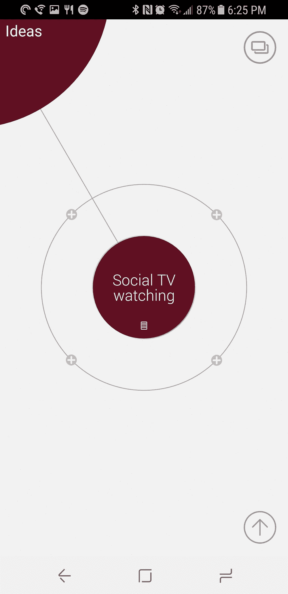
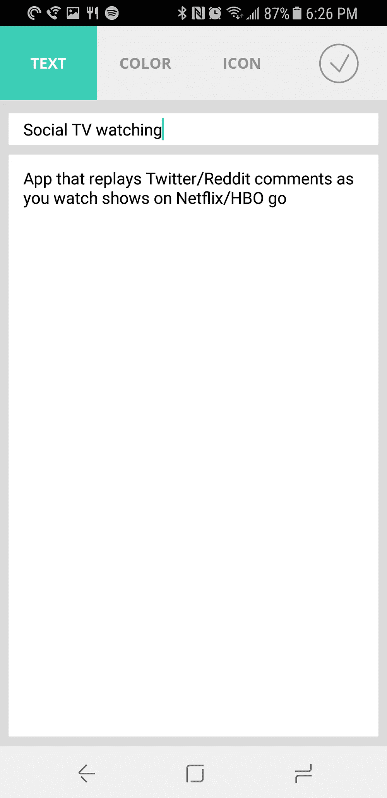
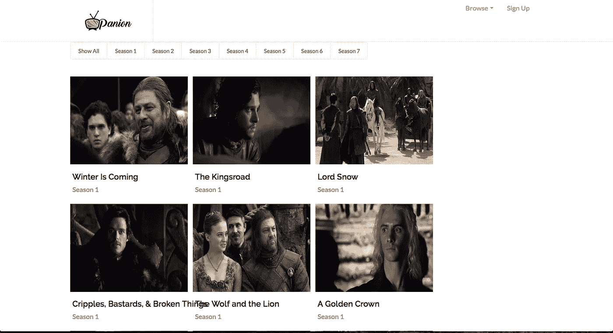
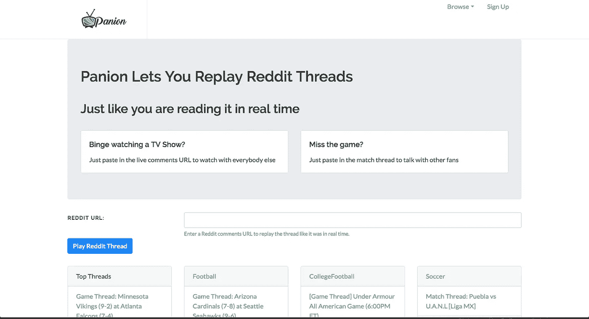
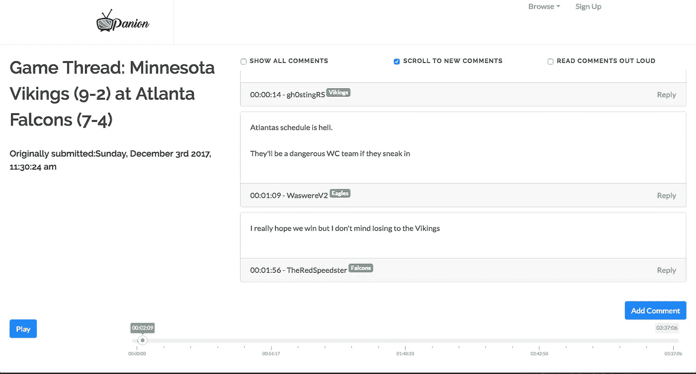

# 一个副业项目——帕宁的发展

> 原文：<https://medium.com/hackernoon/evolution-of-a-side-project-panion-b4059814b2f7>

这就是我最近的一个副业项目， [Panion，](http://www.panion.tv)的由来。如果你在观看体育或电视节目后，Panion 可以帮助你利用社交媒体。**我在 reddit 上发了 4 篇帖子，获得了大约 4500 张投票、248 条评论和大约 20000 名用户。**感谢各种子主题帮助我测试了这一点！

大约三四个月前，我开始重新观看《权力的游戏》。整个系列。从一开始。我通常喜欢《权力的游戏》直播集的一个原因是，我让 Reddit 和 twitter 保持在线，看看人们在说什么(同时避免剧透！).对于不熟悉的人来说，reddit live threads 是人们在观看电视节目、体育、颁奖典礼或其他任何直播活动时发表评论的特定评论线程！我看到的问题是，如果你正在看一个已经播出的节目，你就不能这么做。社交媒体现在如此关注**,以至于没有任何人想知道人们*在说什么*。**

**Reddit 仍然有评论，但它们不是以“实时查看”的方式显示的。你可以按顶级、最佳、新、有争议来排序，但没有“实时”选项。那是第一版帕宁登上舞台的地方…**

********

**I use [Mindly](http://www.mindlyapp.com/) as my note taking application for the past couple years, and love it!**

**我有一个完整的想法列表，但一直回到这个特定的想法，并设想它将如何工作。尤其是当我继续看《权力的游戏》的时候，我一直在想我有多想要这个*。有许多节目([谈论坏，](https://en.wikipedia.org/wiki/Talking_Bad) [谈论死，](https://en.wikipedia.org/wiki/Talking_Dead)和许多其他克里斯·哈德维克节目)完全基于人们想要对他们刚刚观看的节目进行评论。***

**我认为从技术角度来看，这个想法很容易测试。我写了一个 scraper 去 [Game of Thrones subreddit，](http://reddit.com/r/gameofthrones/)找到所有的“直播剧集线程”并保存它们，它们的评论，以及它们发布的时间。然后，使用 Python + Django + reactjs，我组装了一个应用程序，该应用程序将根据用户在 live comments 线程中发表评论的时间来回放这些评论。这应该允许我像实时刷新 reddit 帖子一样查看评论，即使我是在多年后才看到的。**

****

**This version was entirely focused on Game of Thrones.**

**我把应用贴在了《权力的游戏》subreddit 上，在[这个线程](https://www.reddit.com/r/gameofthrones/comments/7d6y20/everything_for_anybody_who_likes_the_live_episode/)里，得到了一些不错的反馈。我想测试是否有其他人有兴趣使用这个，并把这个线程作为验证。看了一些评论后，比如…**

> **“老兄谢谢你这太棒了！作为开发人员，这非常有用。我想知道它是否可以重新用于另一个子编辑。我喜欢在周日观看多场 NFL 比赛(DVR)，喜欢关注直播。”**

**和**

> **“这是一个非常酷的概念，我会对在 GOT 之外使用这样的工具非常感兴趣(摔跤和体育会很棒)。”**

**我决定把它扩展到其他子领域，特别是体育领域。我意识到我可以让“播放器”为任何 reddit 评论线程工作。创建当前版本的 Panion 并没有太多额外的工作(感谢 [Jayme Hoffman](https://medium.com/u/99dd51b6688e?source=post_page-----b4059814b2f7--------------------------------) 想出了这个名字！).在这个版本中，我想看看《权力的游戏》之外的人是否会对此感兴趣。**

****

**Home Screen lets you play any reddit URL**

****

**The Player is where the most important page of the app… press play at the same time you start your show**

**我第一次在/r/CFB(大学橄榄球)上发布这个，有[1200 张赞成票和 76 条评论，](https://www.reddit.com/r/CFB/comments/7haw4g/miss_the_game_thread_i_made_a_tool_that_replays/)在/r/NFL 上有[3000 张赞成票和 149 条评论，](https://www.reddit.com/r/nfl/comments/7hhcem/miss_the_game_thread_i_made_a_tool_that_replays/)和/r/soccer 有 [223 张赞成票和 14 条评论](https://www.reddit.com/r/soccer/comments/7ixdep/miss_the_match_thread_i_made_a_tool_that_replays/)。有些人甚至非常喜欢它，以至于他们自己把它发布到了[其他子编辑](https://www.reddit.com/r/reddevils/comments/7hio0c/did_you_miss_the_match_thread_heres_a_tool_that/)上！这在几天内有大约 20，000 名用户，但它已经急剧下降。不过，不用担心，我已经在这次测试中证明了我想要的东西。**

**现在，正如你可能从这些截图中看出的…我是*而不是*设计师。在确认人们对此感兴趣之后，我决定雇佣一名设计师。我开始面试，本周晚些时候，我聘请了一名设计师来彻底重新设计网站，并与我一起思考用户体验。我很期待这一天的到来！我不得不继续测试未知……我的下一个未知是，人们是否会回到*回到*网站，它可以开始产生一个稳定的用户群。我还增加了允许人们在网站上添加评论的功能。一旦重新设计完成，我一定会在这里发帖！**

**你可以在 [www.panion.tv](http://www.panion.tv) 关注任何改进。有什么建议吗？想法？改进？？让我知道！**