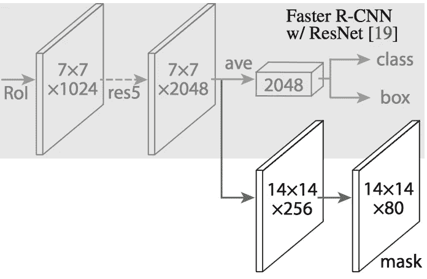

# 图像识别和目标分割的发展:从猿到机器

> 原文：<https://medium.com/hackernoon/evolution-of-image-recognition-and-object-detection-from-apes-to-machines-580ed4247f1e>

很长一段时间以来，我们一直在思考如何利用视觉的神奇天赋，因为我们可以实现新的高度，开辟无限的可能性，就像自动驾驶汽车一样。沿着驾驭这种力量的道路，我们已经找到了无数的算法。从简单的边缘检测算法到像素级物体检测。

我们可以做的是将图像识别与深度学习结合起来，使用一个简单的神经网络，它可以接受图像作为输入，然后在隐藏层中对该图像执行操作，并在输出层中给出输出(向量)，其每个节点代表一个类，它接收的数据将是该类成为图像的概率。

这对于较小尺寸的图像来说会很好，但当使用较大的 HD 1080p 图像时，例如在一层中将有大约 1166400 个节点或神经元！

# **CNN(卷积神经网络)**

自从 [Alex Krizhevsky、Geoff Hinton 和 Ilya Sutskever 在 2012 年获得 ImageNet](https://papers.nips.cc/paper/4824-imagenet-classification-with-deep-convolutional-neural-networks)以来，卷积神经网络(CNN)已经成为图像分类的黄金标准。事实上，从那时起，CNN 已经改进到现在在 ImageNet 挑战赛上胜过人类的地步！

在分类中，通常有一个图像以一个物体为焦点，任务是说明这个图像是什么。但是当我们观察周围的世界时，我们执行的任务要复杂得多。

我们能够分别识别环境中的所有多个对象，甚至能够分离图像中的所有重叠对象！

上面提到的这种类型的问题，在高层次上，被称为对象检测，其中我们主要检测、分类和定位(在图像周围绘制边界框)对象。

# R-CNN

RCNN 是 2014 年提出的解决对象检测任务的早期算法或架构

Source: [https://arxiv.org/abs/1311.2524](https://arxiv.org/abs/1311.2524).

由 Ross Girshick、Jeff Donahue 和 Trevor Darrel 组成的团队发现，通过在 PASCAL VOC Challenge(一种类似于 ImageNet 的流行对象检测挑战)上进行测试，可以用 Krizhevsky 的结果解决这个问题。

现在让我们了解一下 R-CNN 的架构

# R-CNN 的体系结构

R-CNN 的目标是摄取图像，并正确识别图像中的主要对象。

但是我们怎么做呢？R-CNN 也做了我们可能会凭直觉做的事情，**在图像中提出一堆方框，看看它们中是否有任何一个实际上对应于一个物体**。

R-CNN 使用一种叫做[选择性搜索](http://www.cs.cornell.edu/courses/cs7670/2014sp/slides/VisionSeminar14.pdf)的过程来创建这些边界框，或者区域提议。在高层次上，选择性搜索通过不同大小的窗口查看图像，并针对每个大小，尝试按纹理、颜色或强度将相邻像素分组，以识别对象。

Source: [https://arxiv.org/abs/1311.2524](https://arxiv.org/abs/1311.2524).

一旦创建了提议，R-CNN 将该区域扭曲到标准的正方形大小，并将其传递给 AlexNet 的修改版本，如上图所示。在 CNN 的最后一层，R-CNN 增加了一个支持向量机，它简单地分类这是否是一个对象，如果是，是什么对象。

R-CNN 的最后一步是对区域建议进行简单的线性回归，以生成更紧密的边界框坐标，从而获得最终结果。

# 问题是

R-CNN 确实工作得很好，但由于一些简单的原因，它确实很慢，

它需要 CNN 为每一个区域提案转发一次，这使得每幅图像大约转发 2000 次，这使得它很慢

它必须分别训练三个不同的模型 CNN，预测类别的分类器，以及收紧边界框的回归模型。

# 快速 R-CNN

2015 年，R-CNN 的第一作者 Ross Girshick 解决了上述两个问题，导致第二个算法 Fast R-CNN 比它的前身更简单、更快。

# 1.RoI(感兴趣区域)池

对于 CNN 的前向传递，Girshick 意识到对于每幅图像，图像的许多建议区域重叠，导致它一次又一次地运行相同的 CNN 计算(大约 2000 次！并且也不太可行)。

快速 R-CNN 使用一种称为 RoIPool(兴趣池区域)的技术解决了这个问题。在它的核心，RoIPool 分享了一个 CNN 的图像在它的子区域之间的向前传递。通过从 CNN 的特征图中选择相应的区域来获得每个区域的特征。然后，将每个区域中的要素汇集在一起(通常使用最大汇集)。因此，我们只需对原始图像进行一次处理，而不是数千次处理！

# 2.**将所有模型合并成一个网络**

Source: [https://www.slideshare.net/simplyinsimple/detection-52781995](https://www.slideshare.net/simplyinsimple/detection-52781995).

在 R-CNN 的早期，我们有不同的模型，CNN，SVM，回归者，快速 R-CNN 使用一个单一的网络来计算所有三个**。**这使得模型速度更快

# 问题是

即使有了所有这些进步，快速 R-CNN 模型仍然存在一个问题，即区域提议器。在 Fast R-CNN 中，使用**选择性搜索**提出了感兴趣区域的建议，这是一个相当慢的过程，被认为是整个过程的瓶颈。

# 更快的 R-CNN

2015 年年中，微软研究院的一个由任、何、罗斯吉斯克和组成的团队找到了一种方法，通过一种他们命名为 fast R-CNN 的架构，几乎无成本地改进了求婚步骤的区域。

更快的 R-CNN 的见解是区域提议依赖于已经通过 CNN 的前向传递计算的图像特征(分类的第一步)。

Source: [https://arxiv.org/abs/1506.01497](https://arxiv.org/abs/1506.01497).

如上所示，仅使用单个 CNN 来执行区域提议和分类。这样，**只需要训练一个 CNN！**

# 区域生成

更快的 R-CNN 在 CNN 的基础上增加了一个完全卷积的网络，创建了所谓的**地区提议网络**。

Source: [https://arxiv.org/abs/1506.01497](https://arxiv.org/abs/1506.01497).

区域提议网络通过在 CNN 特征地图上传递一个滑动窗口来工作，并且在每个窗口处，输出 **k** 个潜在边界框以及这些框中的每一个的预期有多好的分数。我们知道我们想要一些类似于人的形状的矩形盒子，而不是非常非常薄的盒子，所以我们创建了 **k** 这样常见的纵横比，我们称之为**锚盒**。对于每个这样的锚定框，我们输出一个边界框和图像中每个位置的分数。

然后，我们将可能是对象的每个这样的边界框传递到快速 R-CNN 中，以生成分类和收紧的边界框。

# 屏蔽 R-CNN

到目前为止，我们只使用了边界**框**，但是如果我们能在像素级的物体检测上更进一步呢！取代边界框，检测图像中可能成为对象的每个像素。

Source: Mask R-CNN paper.

与快速 R-CNN 和更快的 R-CNN 非常相似，Mask R-CNN 的基本直觉是直接的，对象的区域或位置

architecture of mask-rcnn. Source: [https://arxiv.org/abs/1703.06870](https://arxiv.org/abs/1703.06870).

掩模 R-CNN 通过向更快的 R-CNN 添加分支来进行像素级对象检测，该分支输出二进制掩模，该掩模表示给定像素是否是对象的一部分。分支(上图中的白色部分)是一个完全卷积的网络，位于基于 CNN 的特征地图之上。

# **RoiAlign**

面具 R-CNN 的作者不得不做一个小的调整，使这项工作的预期。

在 RoIPool 中，我们将向下取整例如 2.9 个像素，并选择 2 个像素，导致轻微的错位。然而，在 RoIAlign 中，我们避免了这种舍入**。相反，我们使用双线性插值来获得像素 2.9 处的精确概念。这在很大程度上使我们能够避免由 RoIPool 引起的失调。**

一旦生成了这些掩模，掩模 R-CNN 就将它们与来自更快的 R-CNN 的分类和边界框相结合，以生成如此精确的分割

联系人: