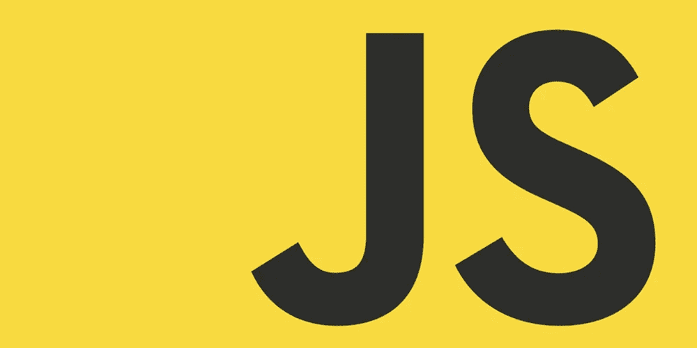

# JavaScript 编程语言的演变

> 原文：<https://medium.com/hackernoon/evolution-of-javascript-programming-language-51d8e9ba5d5>

当你环顾当今的软件开发世界，有一种语言似乎无处不在，那就是 JavaScript。JavaScript 已经流行了很多年，尽管面临着各种各样的障碍，这种语言已经成为当今世界上最流行的语言。

由于这个原因，我对语言的演变感兴趣。低点，高点及其强度。事不宜迟，让我们开始吧。

## 战前天数

在 20 世纪 90 年代中期之前，网络并不是主要力量。没有主要语言，HTML 是制作网页的主要手段。

然而在 1995 年，国家超级计算应用中心(NCSA)采取行动改变了这一状况，他们发布了世界上第一个流行的网络浏览器。

它被称为 NCSA 马赛克。

为了挑战 NCSA Mosaic，马克·安德森将 NCSA Mosaic 的大部分开发人员召集到一家名为 Netscape 的公司。

在网景公司，开发人员建立了另一个名为 Mosaic Netscape 的网络浏览器，而没有任何用于建立 NCSA Mosaic 的代码。

Mosaic Netscape 挑战 Mosaic Netscape，为了避免版权问题，该公司重新命名了该产品。

它的新名字是:网景导航器。

## 灵感

马克·安德森在网景浏览器成功后，觉得网络并不完整。

它缺少一种主要的编程语言。用他的话说，网络需要一种“粘合语言”。

为了克服这一挑战，网景公司与 Sun 公司的微系统公司签订了许可协议，该公司拥有一种流行的编程语言 Java。

“粘合语言”与 Java 没有任何关系，除了语法上的一点相似。

Brendan Eich

Brendan Eich 于 1995 年 5 月受雇帮助创建这种语言，他在 10 天内创建了一个原型。

## 早期

原型开发之后，这种新创造的语言被称为 Mocha。

1995 年 9 月发布了一个更好的版本，同时也更改了名称，新名称为 LiveScript。

最终的名字是在 1995 年 12 月 beta 3 发布后得到的，该语言将被称为 JavaScript。

不过应该知道，这并没有侵犯任何版权，因为 Sun 公司和网景公司早就达成了协议。

然而，JavaScript 这个名字确实有助于该语言从 Java 编程语言本身的流行中获益。

## 采用和版本发布

1995 年，网景公司希望被程序员采用，于是将 JavaScript 提交给欧洲计算机制造商协会(ECMA)进行标准化。

这就产生了 ECMAScript，它使用了 JavaScript 的大部分原始语法，并从此成为 JavaScript 的标准。因此，ECMAScript 可以用来代替 JavaScript。

当这种语言因客户端开发而出名时，JavaScript 的服务器端实现在 1995 年 12 月发布，被称为 Netscape Enterprise Server。

1996 年，微软在互联网信息服务(IIS) web 服务器上开发了 ASP 和. NET 中的 JavaScript 实现，并将其命名为 Jscript。

Jscript 是 Netscape 的 JavaScript 的反向工程实现。

在将 JavaScript 交给 ECMA(JavaScript 的第一个标准版本)大约两年后，ECMAScript 1 于 1997 年 6 月发布。

ECMAScript 2 于第二年发布，对之前的版本做了最小的改动，以符合该语言的 ISO 标准。

虽然 JavaScript 现在开始被程序员采用，但为 Netscape Navigator 和微软的 Internet Explorer 建立网站却很困难。

打算构建跨平台网站的程序员开始遇到用 JavaScript 开发这类网站的问题，因为浏览器对开发代码的反应不同。

1999 年 12 月，在 ECMAScript 2 发布 18 个月后，ECMAScript 3 发布了，并做了大量的修改。ECMAScript 3 引入了该语言的正则表达式和异常处理特性。

ECMAScript 3 发布后，ECMAScript 4 的开发计划于 2000 年开始。然而，在 2003 年 ECMA 发布了一份包含 ECMAScript 4 的一些功能的中期报告后，整个过程随着这个项目的结束而终止了。

2005 年，Eich 和 Mozilla 加入 ECMA，以便能够协助 E4X(ECMAScript for XML)，这导致了与 Macromedia 的合作。Macromedia 决定采用 JavaScript，并在 ActionScript 3 中使用 E4X。

那年晚些时候，在 Jesse James Garrett 的论文发表后，JavaScript 的采用进一步飙升，他在论文中描述了 JavaScript 作为 web 主干支持的技术，并引入术语 Ajax 作为构建现代网站的一种方式。

虽然 ECMAScript 4 被放弃了，但 ECMAScript 3 的继任者终于在 2009 年 12 月发布了。这是 ECMAScript 3 发布 10 年后的事了，当时被称为 ECMAScript 5，它有很多新特性，包括对 JSON 文件解析的支持。

2013 年，计划发布 ECMAScript 6，但就像 ECMAScript 4 的情况一样，该过程减缓了。然而，该项目并没有随着 2015 年 6 月的发布而彻底消亡。

ECMAScript 6 更名为 ECMAScript 2015，这一命名模式在标准 JavaScript 的后续版本中得以延续。

ECMAScript 还看到 ECMAScript 2016、2017 和 2018 版本都在各自年份的 6 月发布。

如今，JavaScript 被广泛采用，因为你几乎看不到任何网站的客户端不是由 JavaScript 驱动的，像谷歌和脸书这样的大公司很大程度上依赖于这种语言。

截至撰写本文时，ECMAScript 2018 是 JavaScript 的最新版本，具有异步迭代器、异步生成器和新的正则表达式等新功能。

## JavaScript 框架

虽然 JavaScript 已被证明是一种强大的语言，但它的框架是其发展和流行的关键部分。

2000 年，第一个流行的 JavaScript 框架发布了。它被称为动态 HTML (DHTML)。DHTML 用于对网页进行基本的修改。如今，你可以很容易地用 CSS 做出这样的改变。DHTML 于 2000 年发布。

2006 年，发布了许多框架和库。最流行的是 jQuery。

创建 jQuery 是为了帮助开发人员构建复杂的网页。这个框架非常强大，挑战了开发人员在浏览器实现中面临的微妙差异问题。jQuery 同时还抽象了客户端 web 开发的所有复杂性，使开发人员易于学习和使用。

自从 1995 年 Netscape live wire Proweb(Enterprise Server)实现了用于服务器端开发的 JavaScript 以来，直到 2009 年 Node JS 发布，才出现了用于此目的的其他实现。

今天，Node JS 作为世界上最常用的服务器端开发技术之一，为 JavaScript 客户端特性带来了更多的活力。

2010 年，Jeremy Ashkenas 创建了 Backbone。

单页应用程序对现代 web 应用程序产生了巨大的影响。Backbone 是一个有助于提升 spa 的框架，Backbone 开发者可以很容易地构建单页面应用程序。

Angular JS 也是由 Adam Abrons 和 Misko Hevery 在 2010 年创作的。Angular 是一个帮助 JavaScript 更受欢迎的框架，因为它为开发者提供了一个完整的前端应用程序架构。

2013 年，Knockout，Meteor，React 走进了聚光灯下。这三个框架让 JavaScript 更受欢迎，尽管 React 仍然是三个框架中最成功的。脸书旗下的 React 已经成为最受欢迎的 JavaScript 框架之一，拥有庞大的用户群体。

# 结论

JavaScript 已经走过了很长的路，从一种仅用 10 天就写出原型的语言到世界上最常用的编程语言。幸运的是，对于 JavaScript 来说，网络会继续繁荣，语言会继续变得更好。

[作者安东·沙列尼科夫](https://www.linkedin.com/in/anton-shaleynikov-45812a1/)