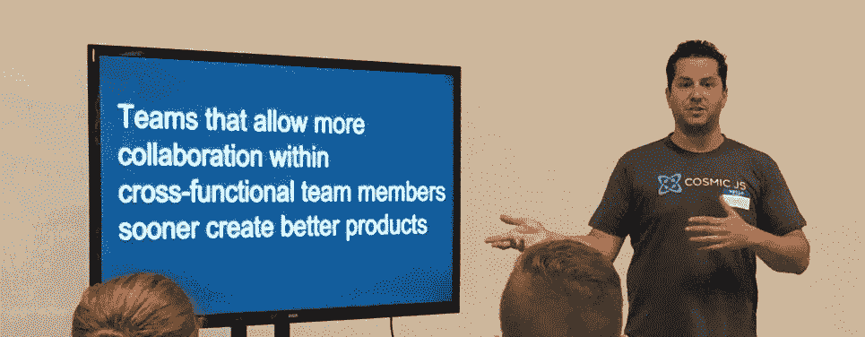

# 内容管理系统和 CMS API 的发展

> 原文：<https://medium.com/hackernoon/evolution-of-the-content-management-system-and-the-cms-api-bfdfff86fc5b>

## 创始人访谈

[Tony Spiro, speaking at a local ReactJS Dallas Meetup.](https://cosmicjs.com/articles/building-for-team-success-with-content-powered-apps)

*有请* [***宇宙 JS***](http://bit.ly/2uBU5X5) *来到骇客正午！*[***Cosmic JS***](http://bit.ly/2uBU5X5)*是一个 API 优先的内容管理平台，帮助开发者和内容管理者团队一起更快地构建应用。我个人很喜欢他们的产品，没有它，***就不可能有。* [***宇宙***](http://bit.ly/2uBU5X5)**提供了一个 web 仪表板来管理内容，并为开发人员提供了强大的 API 来将内容交付给以任何编程语言构建的任何新的或现有的应用程序。***

***今天我们将采访 Cosmic JS 首席执行官* [*托尼·斯皮罗*](https://tonyspiro.com/) *来讨论内容管理的趋势，他从代理行业到创办自己的科技公司的职业道路，以及创业生活的平衡*。**

**大卫:嘿，托尼！能否分享一些关于宇宙 JS 牵引力的数字？(客户/使用/版本/团队/等等。)**

****

**[Tony](https://medium.com/u/f65dbbc79b6?source=post_page-----bfdfff86fc5b--------------------------------) :自 2016 年推出以来，我们已经看到来自 120 多个国家的数千名开发者使用 Cosmic JS 进行应用开发和团队协作。许多使用 Cosmic JS 的团队也在成长，包括来自不同部门的新用户团队，他们现在更有能力在内容管理过程中发挥作用。我们已经看到管理内容的使用案例数量在增长，从简单的博客内容开始，发展到包括跨平台内容、原生应用程序、AR / VR 和针对 20 多种语言和地区的本地化内容。在我们的应用和扩展生态系统的开源提交方面，我们已经看到我们的社区有了很大的增长。**

**自从有了互联网，就有了对管理内容的系统的需求。你能给我们介绍一下内容管理系统的历史吗？也许还会涉及到你认为软件会向何处发展？**

**内容现在是，将来也永远是王道。内容管理系统是一个组织的重要组成部分，因为它可以减缓或加快业务发展。所有内容管理解决方案都试图让开发人员和内容管理人员团队更好地合作来制作内容。这是一个很重要也很难解决的问题。**

**在我的软件开发生涯中，我使用过许多不同的安装内容管理解决方案:WordPress、Drupal、ModX、Joomla、构建 LAMP-stack 网站。但是这种安装 CMS 的方法有一个主要问题:管理基础设施很糟糕。我记得在非核心任务上浪费了很多时间。管理数据库、CMS 服务器端代码、版本控制、扩展问题、维护都是一场噩梦。我注意到每个新项目我都在做很多相同的工作。我知道一定有更好的方法。**

**宇宙 JS 就是从这个痛点进化出来的。CMS API 或 Headless CMS 提供了一个 web 仪表板和 API 服务。这使得开发人员可以专注于在他们的应用程序中构建出色的用户体验，而不必管理 CMS 代码。对于每个新项目，您只需启动一个新的存储桶，它会立即提供一个 web 仪表板和开箱即用的 API，您需要做的只是将数据源连接到您的应用程序。这是一个梦想的 CMS。**

> **尽管 headless CMS 解决方案相当新，但具有 web 仪表板的最佳 API 服务已经存在了一段时间，包括用于支付的 Stripe、用于电子邮件的 SendGrid、用于电话的 Twilio 和用于搜索的 Algolia。它们都在卸载非核心开发工作方面提供了类似的价值，因此开发人员可以专注于构建应用程序，而不是基础架构。这些 API 服务正在为我们的现代数字世界提供动力。**

**令人吃惊的是，Wordpress 现在为 30%的互联网网站提供服务，但是用户的满意度参差不齐。我用了一些，以前用得更多。Wordpress 做对了什么，获得了如此大规模的采用？也就是说，Wordpress 的弱点在哪里？**

**在过去的代理世界里，我曾在 WordPress 工作过。**

> **作为一个产品，WordPress 获得了巨大的流行，因为它能够为非技术人员抽象出技术。没有 WordPress，我们可能没有世界上的购物中心和广场。**

**所以它做得很好，让任何人都有可能拥有一个网站，并支持他们的社区建立模板和插件。这是我们与社区贡献的应用程序、扩展和 API 优先云开发集成的 Cosmic JS 不可或缺的一部分。**

**但是我确实同意开发者对 WordPress 的热情在过去几年里已经减弱了。他们很晚才采用我们现在正在进入的 API 服务/前端应用程序革命。他们确实有 WP REST API，但是我们被告知它还有很多需要改进的地方。**

****你最近一直在建立你的应用开发者市场。有多少开发人员是在 Cosmic JS 之上构建的？为了在开发人员社区中达到这一点，您发现了哪些误解和突破？****

**我们有一个由数百名开发者组成的活跃社区，他们定期为我们的生态系统贡献优秀的教育内容、应用和扩展。这个策略有两个目的:1 .一种出于教育目的演示使用案例和窥探幕后的方法，2。这是一种为客户提供高质量现成应用程序的方式，可以进一步节省他们在 Cosmic JS 平台上构建应用程序的时间。**

**我们已经有数百名开发人员在构建 Cosmic JS 平台，其中一些人分享了他们的经验，并与我们的社区一起工作。我们有世界上最优秀的开发人员来开发 Cosmic，我们真的为他们的工作感到骄傲。我们会第一个最大声的炫耀。**

> **一种误解是，“如果你建造了它，他们就会来。”更好的说法是“如果你建造了它，你将需要去得到它们。但如果他们喜欢你做的事情，你给他们一个好的体验，他们就会留下来……”哈哈。**

****你最喜欢的用 Cosmic JS 搭建的应用和网站有哪些？****

**我喜欢所有的应用程序，但我最喜欢的是那些推动宇宙 JS 所能做的边界的应用程序。其中一些是 [Algolia 商店](https://cosmicjs.com/apps/cosmic-store-with-algolia-search)、[电子商务应用](https://cosmicjs.com/apps/ecommerce-app)和[用户管理应用](https://cosmicjs.com/apps/user-management)。**

****你能解释一下首先使用 API 的 CMS 的战略和技术优势吗？****

**开发人员可以专注于应用层，而不是基础设施或 CMS 代码。内容存储在 API 中，可以交付给任何联网设备:web、原生 iOS / Android、IOT、VR 等。这是一个巨大的商业优势，因为它节省了将内容推向市场的大量时间。**

**你有一个年幼的女儿，大部分时间在家工作——就像我一样。你有哪些平衡/优化父亲身份和工作负荷的生产力诀窍？**

> **我保持一致的时间表。每天我们早上起来，看《爪子巡逻》或者《粉红猪小妹》，我带她去学校。我一直工作到必须去接她。当我拥有她时，她吸引了我所有的注意力。把工作时间和爸爸时间分开很重要。它让我保持平衡和快乐。**

****

**你认为每个开发者都应该尝试过编写自己的内容管理系统吗？**

**是啊！如果有的话，去体会它有多复杂。我从零开始为我曾经建立的第一个网站之一建立了一个 CMS。**

**你做的第一个网站是什么？**

**我是一个音乐家。我从 10 岁起就开始打鼓，我做的第一个网站是达拉斯/沃斯大都会的本地音乐网站。起初，它只是一个静态的 HTML 日历，用来记录当地即将到来的演出。我变得有点着迷，它最终成为乐队和粉丝的互动社交网站。在巅峰时期，它有带媒体上传、活动管理、在线售票的乐队简介(这是用 Authorize.net 的[预先剥离的！)，一个自制的内容管理系统，用于创建文章和节目评论，最重要的是，一个付费的横幅广告网络。](http://authorize.net/)**

****你对互联网最早的记忆是什么？****

**我记得我 12 岁的时候，图像加载非常慢。我就不说了。**

**制作宇宙 JS 最大的收获是什么？制作宇宙 JS 最可怕的事情是什么？**

**最大的收获是看到团队每天都在使用这个平台，并且知道我在帮助他们改善生活。最可怕的是担心我们为顾客做得不够！这是一个很好的担心，我们一直在努力提供更好的服务。**

****Cosmic JS 的长期愿景是什么？****

**在可预见的未来，一些事情不会改变:软件正在吞噬世界。API 是互联世界的交付系统。内容永远是王道。能够更快地协作和交付内容的团队将会胜出。继续构建产品，帮助世界各地的团队在这个新的 API 驱动的经济中更快地构建更好的应用程序。这是我们的北极星。**

> **[**Cosmic JS**](http://bit.ly/2uBU5X5) 是一个 API 优先的内容管理平台，帮助开发者和内容管理者团队一起更快地构建应用。 [**Cosmic**](http://bit.ly/2uBU5X5) 提供了一个 web 仪表板来管理内容，并为开发人员提供了强大的 API 来将内容交付给以任何编程语言构建的任何新的或现有的应用程序。 [**了解更多。**](http://bit.ly/2uBU5X5)**