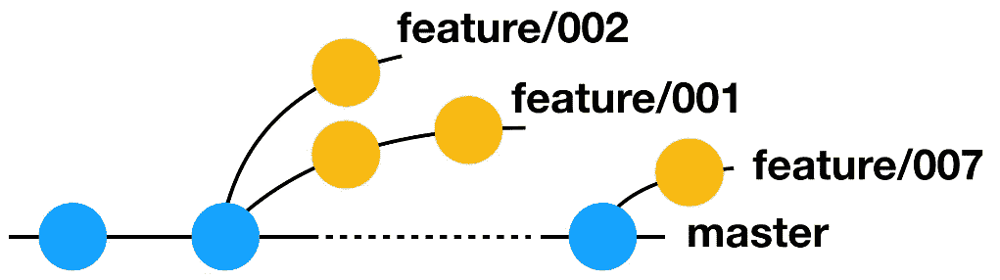
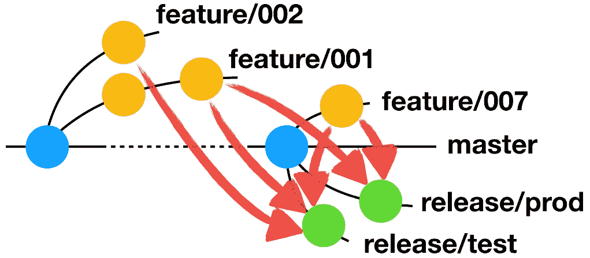
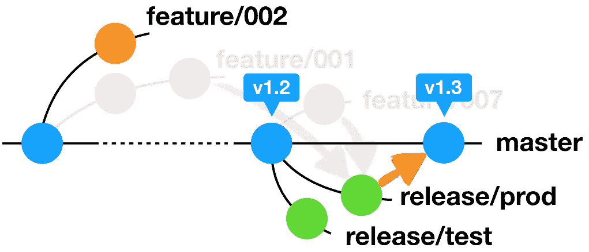

# 利用阿里巴巴的信息流改进分支机构管理

> 原文：<https://medium.com/hackernoon/evolved-branch-management-with-alibabs-aaoneflow-212be856efd3>

*自动化和新的分支管理流程正在革新软件开发*

TrunkBased 和 GitFlow 在易于集成和可管理的需求功能方面能够满足大多数开发人员的分支机构管理需求，但阿里巴巴需要一个更高效的系统，没有繁琐的手动操作，并具有改进的分支机构管理工具。这促使阿里巴巴科技团队开发了他们新的分支管理模式 AoneFlow。AoneFlow 结合了 TrunkBased 和 GitFlow 的优点，同时引入了新的自动化和分支管理工具，以确保高质量软件产品的及时发布。

# 分支管理基础:TrunkBased 和 GitFlow

AoneFlow 部分基于 TrunkBased 和 GitFlow 的结构和功能，这是软件开发人员最常用的分支管理方法。这两个系统都提供了有用的功能，并且基于现有系统的信息流对于软件开发人员来说有着额外的好处。

## 基于集群的

基于 trunk 的优势是持续集成。其结构由一个主干分支和多个释放分支组成。每个发布分支都是在特定版本的提交点从主干创建的，用于在线部署和修补。没有明确的特征分支。TrunkBased 并不排斥短命的特性分支，而 GitFlow 允许每个开发者都有一个本地分支。然而，这个函数并没有被基于 trunk 的开发人员广泛使用。

由于几个缺点，TrunkBased 近年来已经不受 GitFlow 的欢迎。首先，过多的团队在同一个主干上编码会在发布时导致错误，特别是在多版本并行开发期间。FeatureToggle 是作为一种补救措施实现的，但是它对频繁集成和充分测试覆盖的要求对开发团队的能力提出了过高的要求。因此，TrunkBased 最常用于不需要维护多个同步历史版本的 SaaS 项目。这些项目主要是经历了微服务转型的小型服务。

基于集群的模式有两种演变:单流和多集群。OneFlow 使用了许多与 TrunkBased 相同的功能，但它更严格地定义了操作流，并添加了像热修复分支这样的功能。除了双干线和固定开发分支之外，多干线还使用固定发布分支。

## GitFlow

GitFlow 在结构上不同于 TrunkBased。它的结构由一个主干分支和许多功能、发布和修补分支组成。GitFlow 以前是面向流程的公司的首选方法，因为它对每个阶段都有清晰的操作定义。然而，GitFlow 对用户不太友好，并且包含过多繁琐的合并规则。合并冲突和集成测试问题经常受到批评。

一种不太为人所知的分支管理方法是 GithubFlow，它本质上是基于 trunk 的，添加了个人仓库和拉请求代码合并操作。这个过程类似于在同一个仓库中添加单独的分支，非常适合分布式团队。GithubFlow 也有自己的发展，包括 GitlabFlow，它利用多环境部署，并在其环境内关联仓库和分支机构。

# 一种新的进化:一种内流

AoneFlow 的结构、功能和流程在几个关键方面与 TrunkBased 和 GitHub 不同。

像它的前辈一样，AoneFlow 努力实现简单的持续集成(基于 trunk)和可管理的需求特性(GitFlow)。它还维护了三种分支类型的相似的基本结构:主干分支、特性分支和发布分支。

然而，AoneFlow 不同于它的前辈，它为分支机构管理工作流建立了三个核心规则:

1.开始工作之前，从主干创建一个特征分支。

2.通过组合特性分支形成发布分支。

3.发布到在线正式环境后，将对应的发布分支合并到主干，给主干添加标签，删除与发布分支关联的特征分支。

## 规则 1:特征分支创建

AoneFlow 的特征分支是从 GitFlow 中采用的。当一个新任务开始时(例如创建一个新功能或解决一个错误)，从代表最新发布版本的主干中创建一个带有前缀“ *feature/* 的特性分支。代码修改在该分支提交。每个作业对应一个特性分支，修改不能直接提交到主干，如下图所示。

*Feature branch creation*

## 规则 2:释放分支形成

这个规则是 AoneFlow 最具创新性的成果。

就现有的分支管理方法而言，GitFlow 将已完成的功能分支合并回公共主线(开发分支)，并从公共主线中拉出一个发布分支。类似地，基于 trunk 的方法等待在主干分支上开发所需的特性，然后从主干分支上的特定位置拉出一个发布分支。

相反，AoneFlow 从主干中拉出一个新的分支，并通过合并所有等待发布或集成的特性分支来创建一个发布分支(通常由前缀“ *release/* ”表示)。

这很简单，但其应用却很广泛。发布分支是灵活使用的，并且它们使用一个装配线工具与一个特定的环境相关联(例如，发布/测试分支与部署测试环境配对)。这个工具将代码质量扫描和一系列不同环境中的自动化测试水平联系起来。最后，输出部署包被直接发布到适当的环境中。

*Release branch formation*

在更高级的层次上，发布分支可以与多个任务环境相关联，比如链接阶段发布和正式发布。这增加了额外的人工检查步骤，以确保可靠性。通过根据迭代计划关联特性分支，通过迭代演进创建固定的发布分支，并将一系列环境连接到发布分支的装配线，也可以创建持续集成装配线。基于集群的效果也可以通过将所有特性分支关联在一起，并在所有提交时将它们专用于集成测试来实现。

此外，发布分支特性的组成是动态的，很容易调整。

例如，使用“敏捷运营”的小公司有时必须由于市场策略的变化而放弃一个功能发布，或者由于错误而在最后一刻取消一个功能。通常，这需要手动地“标记代码”，或者一个接一个地消除合并到开发或主干分支中的相关承诺。手动“滴答”可能很麻烦且效率低下。

相反，AoneFlow 允许在不到一分钟的时间内构建一个发布分支。这是通过删除原始的发布分支，从主干分支中拉出一个同名的新发布分支，然后合并任何需要保留的特性分支来完成的。这一系列的行动可以自动化，他们是干净和无污染的，因为没有代码滴答记录留在仓库里。

最后，发布分支是松散耦合的，这允许基于不同的特性组合来集成和测试多个集成环境。这也便于管理不同环境中特性的部署时间。尽管是松散耦合的，发布分支之间仍然存在关联。测试、集成、预发布、分阶段和在线正式环境的发布步骤通常是按顺序执行的。这意味着用户可以设置需求，以便只有在其先前环境中通过验证的特征才能传输到下一个环境进行部署。结果是创建了一个漏斗形的特性发布流。

此外，阿里巴巴已经创建了一个统一的平台，用于在发布分支之间自动化和迁移功能组合，这将在下一节中解释。

## 规则 3:发布分支机构在线部署

当发布分支的装配线完成在线正式环境的部署时，这意味着其相应的功能已经发布。发生这种情况时，发布分支应该合并到主干中。为了避免在代码仓库中积累大量的历史特性分支，已经在线的特性分支也应该被清理。

使用 AoneFlow，主干分支上的最新版本总是与在线版本相同(类似于 GitFlow)。如果用户希望追溯历史版本，他们只需要在主干分支上找到相应的版本标签。

*Structure: Rule 3*

## 附加规则

除了规则 1–3，AoneFlow 还包括几个额外的实际操作。例如，当 Hotfix 上线时，通常的处理方法是创建一个与上线环境相对应的新发布分支(相当于 Hotfix 分支)。然后为发布分支创建一个临时装配线，以确保发布前检查和冒烟测试可以自动执行。

AoneFlow 允许用户在主干分支上找到版本标签的位置，然后直接在同一位置创建热修复分支。这允许用户有效地执行几个重要操作:

基于发布分支对应的在线正式环境，清除发布分支的特征分支。

直接修改发布分支。

利用现有装配线进行自动发布。

# 用户体验优化

阿里巴巴一直在寻求优化我们的分支机构管理流程。最近，我们记录了一些 Java 开发的最佳实践，并把它们汇编成一本阿里巴巴 Java 开发手册。这有助于我们跨团队标准化 Java 开发，并提高我们工作的质量和效率。

标准化也有助于解决基于任务的问题，比如重建发布分支。重新构建发布分支需要合并，然后必须编译代码来生成新的部署包。但是，如果该软件的功能依赖于第三方软件包，它的性能可能会不一致。

作为解决方案，我们在编码指南中增加了一条规则，规定在线发布的代码不能使用包含“快照版本”或非官方发布的依赖包。这个指导方针允许我们的团队对他们生产的产品质量有更多的控制。

我们还添加了许多工具来简化开发人员的工作。例如，AoneFlow 平台消除了开发人员使用 Git 命令手动创建、合并和修改分支的需要。手动操作容易出错且耗时。AoneFlow 平台通过控制整个 R&D 流程并添加大量内置服务组件来提高 R&D 效率，从而解决了这些问题。该平台提供了几个显著的优势:

全过程自动化

改进的释放分支组件

改善分行相关管理

## 全过程自动化

AoneFlow 平台为分支管理过程引入了自动化功能，例如提出需求、将需求分解为任务、在线创建功能分支、通过功能分支聚合生成发布分支、基于模板自动创建测试环境以及后期操作和维护(O&M)。

在前端，AoneFlow 通过控制特性分支关联和监控需求来确保标准化的特性分支命名。在后端，它处理发布分支关联和部署，这确保了源版本的可靠性。总体而言，AoneFlow 处理阿里巴巴集团约 80%的在线部署。

## 改进的发布分支装配线

在 AoneFlow 生命周期中涉及到许多代码分支。创建和更新这些分支涉及一系列复杂的操作。这一过程的自动化确保了质量和效率不会因人为错误而损失。

AoneFlow 使用自动化的 CI/CD 装配线来创建和更新代码分支。这条装配线链接了生命周期中所有独立的代码分支，以更有效地将它们导向预期的功能(例如，提交代码进行集成测试)。对于发布分支来说尤其如此，发布分支可以与特定的部署环境相关联。合并到分支中的新代码可以被更有效地检查和部署。

在理想的分支管理场景中，每个分支都应该配有与其角色相匹配的装配线。AoneFlow 的发布分支相对固定，比 GitFlow 更容易集成，这意味着几乎所有可用的装配线工具都与 AoneFlow 兼容。

AoneFlow 还包括额外的功能，如代码审查、安全检查和在线装配线部署，这些功能可以为我们的开发团队增强用户体验和优化。

## 改进的分支机构关联维护

特征分支和研究分支关联的维护是由 AoneFlow 解决的独特问题。

当对现有的特性组合进行变更时，记住一个发布分支来自哪个特定的特性分支是很重要的。例如，当一个特性从一个特定的发布分支中退出时，多个特性分支——包括不包含该特性的分支——将被合并以替换原来的发布分支。手动记录合并的分支既困难又耗时。

AoneFlow 包括几个自动化的特性来改进这个过程。当某些特性组合在低级发布环境中得到验证时(例如集成测试)，我们将内容直接迁移到高级环境的相应发布分支(例如预发布)。这确保了在线版本已经通过了预发布验证，预发布版本已经通过了集成验证和其他必要的过程。这将所有的发布分支串联在一起。这个过程可以使用普通的 Git 命令来完成，但是 AoneFlow 的可视化工具使这个过程更加直观。

AoneFlow 还提供代码仓库中分支状态的统一显示，包括分支的相应部署环境的机器信息和操作记录。

# 摘要

阿里巴巴的 AoneFlow 是分支管理的一种发展形式，它借鉴了 TrunkBased 和 GitFlow 的优势。

这种新的分支机构管理方法的优势包括:

基于 trunk 的简易集成模型

模仿 GitFlow 的易于管理的需求特性

确保效率和质量的既定规则和流程

自动化功能

改进的发布分支管理

改进的分支机构关联维护

AoneFlow 提供了一个灵活的平台，允许软件开发人员适应动态的分支管理生命周期，高效地工作，并发布高质量的软件产品，从而为他们的产品提供了更多的控制。

( Original article by Lin Fan 林帆)

# 阿里巴巴科技

关于阿里巴巴最新技术的第一手深度资讯→在**上搜索 [**【阿里巴巴科技】**](http://www.facebook.com/AlibabaTechnology)**