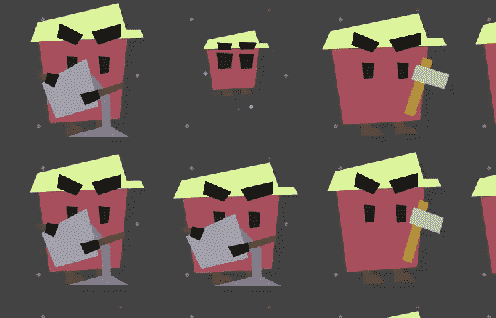
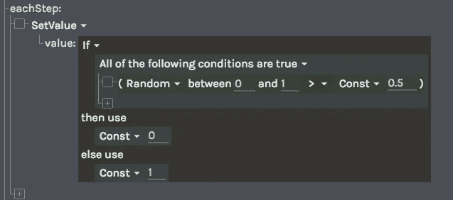
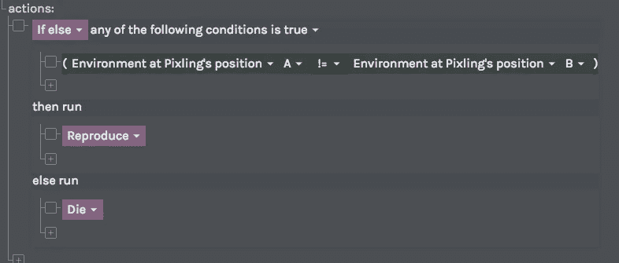
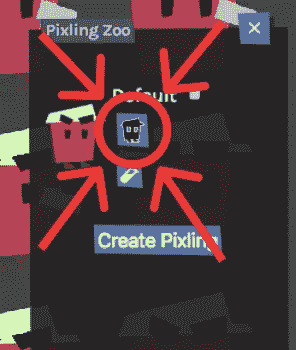
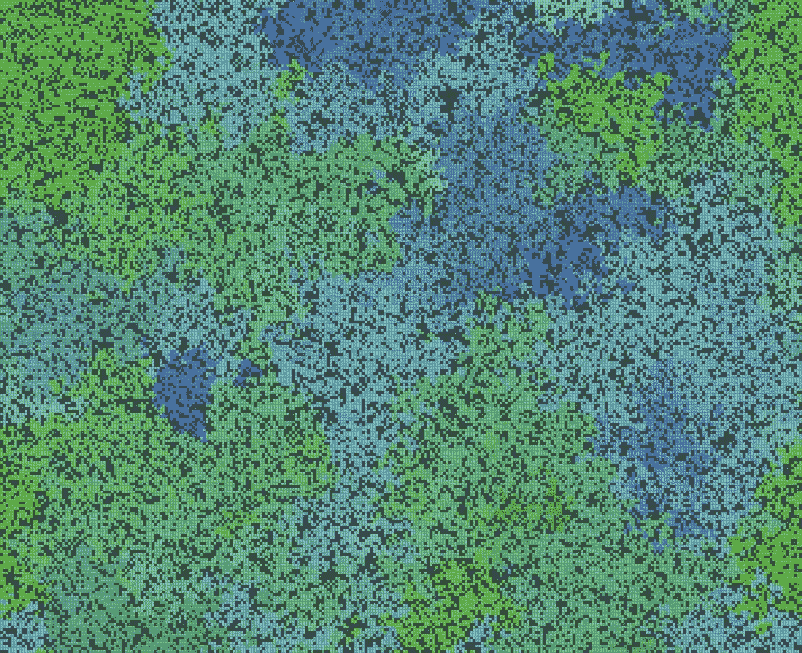
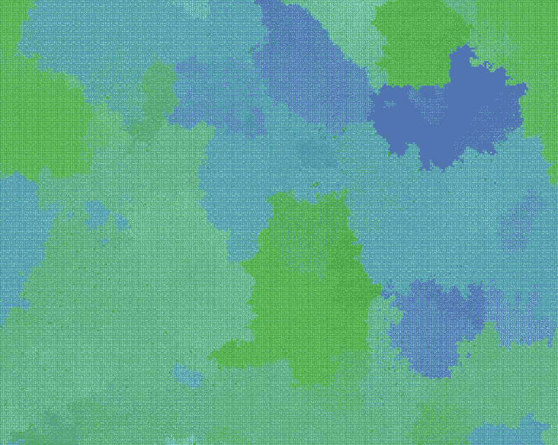

# 进化智能体解决像素世界中的异或问题

> 原文：<https://medium.com/hackernoon/evolving-agents-to-solve-xor-in-pixling-world-6460c71e7840>

训练一个神经[网络](https://hackernoon.com/tagged/network)来执行[异或](https://hackernoon.com/tagged/xor)基本上是机器学习的 Hello 世界，由于我的进化模拟器中的像素(代理)都有神经网络作为大脑，我认为在我的游戏中实现它应该非常简单。这篇博文会告诉你怎么做(别担心，真的很简单)。如果你想继续，你可以在 [https://pixling.world](https://pixling.world) 创建一个账户，它是免费的，完全在浏览器中运行，所以不需要安装任何东西。你也可以在这里看到这个[的完成版本](https://pixling.world/KXHEQJnqlGCFmMALGgHlb)。

Pixlings performing XOR (True is ax, False is bucket, the small one is a newly born Pixling). You can have up to 1M of these guys running at 60 updates per second on a decent gaming machine, as the whole simulation runs on the GPU.

我们要做的事情的概要是，我们将在每一步给每个像素一个 XOR“问题”,如果他们解决了问题，我们将通过让他们繁殖来奖励他们。如果他们回答错误，我们会杀了他们。这给了他们很大的动力，让他们很快变得非常擅长异或运算。

## 为我们的像素解决一个问题

我们将使用所谓的“环境”来创建像素的异或问题。对于世界上的每个单元，每个环境都有一个浮点值，所以如果我们创建两个浮点值，并将值随机化为 0 或 1，我们就可以得到像素需要对其执行 XOR 运算的两个值。然后，他们必须使用我们将给予他们的两个能力中的一个来给出答案(稍后将详细介绍)，例如，如果像素化的环境值是 0 和 1，如果他们不想被杀死，他们应该使用真实能力，因为 0 xor 1 是 1。

如果你还没有创建世界，点击“创建世界”，然后点击顶部的绿色编辑按钮，创建一个名为“A”的环境(或者你想要的任何东西，只要记住它就行)。在 eachStep 部分，我们将首先添加一个带有 If 开关的“SetValue ”,它根据随机数的结果将值设置为 0 或 1。这将创建一个环境，其中每个单元在每个步骤中随机为 1 或 0。您可以将“displayMaxValue”设置为 1，以便更容易看到值，或者更改“visibility”以完全隐藏环境渲染，因为过一会儿闪烁的颜色会有点烦人。

This is the configuration we’re going for. You can check that it’s working by hitting run in the panel to the right.

复制这个环境，这样网络就有两个输入。你可以通过右键点击左侧边栏中其名称旁边的小方块，选择“复制”(惊喜惊喜)来复制。点击更新保存这些更改。

## 解决问题的工具

接下来，我们将为像素创造两种能力，名为“真”和“假”。我们希望他们根据当前细胞的输入选择一个或另一个，如果他们选择正确，我们会奖励他们。进入技能编辑器，添加一个新技能。在 Actions 部分，我们需要一个“If else”语句来判断他们是否猜对了，所以对于“真正的”能力，您需要如下所示的内容:

If the Pixlings use this ability in the correct situation (when they’re on a cell where A != B) they’ll be rewarded by getting to Reproduce. If they use the ability in the wrong situation they die though.

复制能力来创造“假”能力，除了比较应该是==而不是！=.

快好了！接下来，我们只需要创建一个新的像素，我们可以使用克隆到世界上。转到“小精灵动物园”标签，添加一个新的小精灵。将它的能力设置为你刚才创造的两个能力。我们也希望我们的世界比默认的要大一点，所以在高级选项卡中至少将它更改为 300x300。点击更新，将您的更改写入您的世界。

## 让我们运行它！

太好了，你现在可以开始模拟了！如果它还没有运行，点击顶部的播放按钮，设置速度至少超。然后点击“Pixling zoo”面板中的“Spawn Pixlings”按钮(图标是一个小 Pixling baby)(这个与编辑世界对话框中的不同)。点击世界来产生一些小精灵。你可以改变底部的“半径”设置来同时繁殖很多。

Use this button to spawn new Pixlings.

最初它们的体重完全随机，所以它们很可能会很快死去。如果你生了一堆，你应该会有一些表现不错的，很快你就会有一个充满像素的世界，就像这样:

Pixlings are colored to make it easier to see which “species” they belong to. Each time they reproduce their color is slightly changed, so you can easily see which ones are closely related and not. Video of this here: [https://youtu.be/-7U5f7XrzuE](https://youtu.be/-7U5f7XrzuE)

但是没有填满。为什么？事实证明，我们的世界有一个非常基本的问题。默认的神经网络只有一层，我们需要至少两层来执行 XOR。再次点击“编辑世界”按钮，浏览到“像素动物园”标签，在这里你可以将大脑图层设置为 2。再运行一段时间，您应该会得到类似这样的结果:

Much better. Video here: [https://youtu.be/sbf-Mnk1njo](https://youtu.be/sbf-Mnk1njo)

即世界上几乎没有剩余空间。这意味着像素在执行异或运算方面非常出色！(记住，如果他们错了一次，就会被处以死刑，所以他们有很多动力去做好这件事)。就是这样，如果你已经跟着做了，你现在应该有你自己的 XORing Pixlings 种类了！

## 最后一点

我在构建时遇到的一件奇怪的事情是，较小的网络似乎表现更差(即需要更长的时间来发展)。我猜这是因为一个更大的网络有更多的方法来解决这个问题，而一个小的网络只有少量的“解决方案”,所以需要更长的时间来找到这些。

最后，这只是一个小的，相当技术性的，演示你可以在 Pixling 世界中构建什么。但是你可以做更多的事情。你可以创造任何东西，从有植物、食草动物和食肉动物的生态系统到复杂的天气动力学，从 T2 到 T4，只是简单美丽的模拟。看你的了！要了解更多，你可以[阅读我是如何实现它的](https://hackernoon.com/how-to-run-1m-neural-network-agents-at-60-steps-per-second-in-a-browser-183c6213156b)，或者查看 [wiki](http://wiki.pixling.world) 。

希望你喜欢！

弗雷德里克