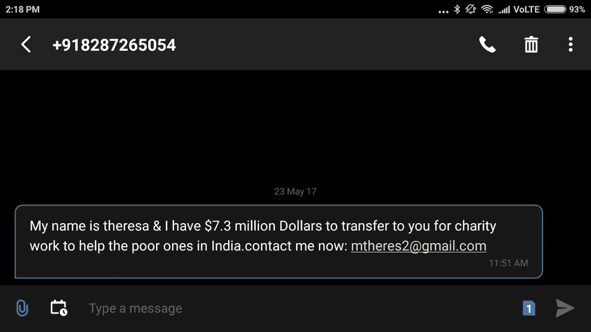

# 在假新闻的洪流中进化生存

> 原文：<https://medium.com/hackernoon/evolving-to-survive-the-flood-of-fake-news-4dd98b8e2c2e>

We can’t change the world, but we can change the way we view it

今天，我学习了一个新单词，Webqoof。根据《城市词典》的解释，*“网民是指相信互联网和社交媒体上的每一句话或每一条信息的人。”*

我首先想到的是，我是否是一个相信这个词确实存在的网民。但是城市词典是可信的。或者可能吗？我快速搜索了一下维基百科，上面说《城市词典》是一部众包[词典](https://en.m.wikipedia.org/wiki/Urban_Dictionary)于 1999 年成立，其创始人是唯一的员工。我想如果它已经存在了那么久，只有一个雇员，那么它就不是他想象出来的。

## 虚构变成事实

我是不是有点多疑了？有可能，因为我刚刚从被一个叫约翰·柯尼希的人带着[兜风](https://www.youtube.com/user/obscuresorrows)中恢复过来，约翰·柯尼希花了几年时间创作了一本原创的造词词典，名为[《隐晦悲伤词典](http://www.dictionaryofobscuresorrows.com)。有些像“sonder”这样的词实际上已经变成了真实的词。

这是我不介意被带去兜风的一个罕见的例子。但这并不能改变我曾经是这样的事实，这只能证明我和 Webqoof 部落的联系。

## 虚构变成了事实

事实是，我总是很容易被愚弄，因为我认为大多数人说的是实话。我知道我很天真，所以当我第一次看到 Webqoof 这个词时，我有种不祥的感觉，它指的是我。

曾几何时，我的轻信并不重要，因为真相终将大白。但在最近一段时间，事实和虚构之间的界限开始变得模糊。事实上，有很多聪明人对最近的发现感到非常兴奋，如果一个谎言被不断地重复，它很快就会被当成真理。

社交媒体在淡化事实的过程中扮演了重要角色。启发我关于“Webqoof”这个词的存在的同一幅漫画，暗示了社交媒体的这种力量(讽刺的是，我是通过 WhatsApp 消息收到它的)。

## 失控的病毒

在印度，Whatsapp 正从一个笑话源逐渐变成一个严重的担忧。这是因为人们经常把他们在 WhatsApp 上看到的任何东西都视为真理。由于 WhatsApp 是数百万印度人的默认通讯工具，事情往往会失控。点击“发送”按钮有点像打开潘多拉魔盒——你永远无法把出来的东西放回去。

与传统媒体不同，在传统媒体中，编辑对出现在其中的内容有一定程度的控制，在 WhatsApp 这样的社交媒体中，任何人都可以畅所欲言。在印度，这已经导致了一个危险的趋势，发生了几起无辜的人被暴民私刑处死的事件。煽动暴民的是 WhatsApp 上流传的未经证实的儿童举重运动员之类的病毒视频。稍后会详细介绍。

## 匿名能让孩子变成杀手

1839 年，爱德华·布尔沃·利顿创造了这个短语，*笔锋胜于武力。*‘21 世纪版本的笔，键盘，功能更加强大。坐在电脑或智能手机屏幕后面的一个匿名的灵魂不需要很长时间就可以编辑一个视频，将其扭曲成一个煽动性的交流，并将其释放到当今互联网的狂野西部。

让键盘变得危险的是匿名性。这使得消息的创建者可以避免为其创建的结果承担责任。更糟糕的是，他甚至不能被追究责任，因为互联网使他很容易保持匿名和无法追踪。

巧合的是，在我写这篇文章的时候，我收到了一条 WhatsApp 的消息，内容是关于一个假的绑架视频是如何制作出来的。

评论员提到的视频是导致私刑的原因。请记住，制造假新闻的过程是普遍的，即使这个绑架视频的背景是印度农村，那里的穷人往往没有受过教育，因此容易受到谣言的影响。因此，他们的情绪很容易被一群忧心忡忡的村民煽动起来。最终，对家人的威胁导致这些村民对外来者做出暴力反应。

## 谁制造假新闻，为什么？

对付假新闻的第一步是理解它。为什么有人会制造假新闻？它是如何传播的？是什么让我们这么容易上当？

让我们从谁开始。这里有几个我能想到的。

**骗子**:这是一名网络罪犯，其目标是赤裸裸的盗窃。当你点击他们发来的虚假信息或访问虚假网站时，这些小偷就能获取你的私人信息，并利用这些信息从你那里窃取一些东西。一个例子是，你收到消息，宣布你是一百万美元的幸运赢家，你需要支付一小笔转账费用来领取你的奖金。这里有一条来自我的私人母亲特里萨的关心的信息。

If they have so much money, why do they want me to send them a money transfer fee?

奸商:这些家伙把假新闻视为简单而有利可图的生意。他们从高浏览量网站上的广告中获得收入。他们完善了复制官方或流行新闻网站的外观和感觉的艺术。标题非常吸引人，甚至吸引了精明的网民点击标题来核实新闻的真实性。这就是假新闻提供者所需要的，因为更多的浏览产生更多的美元。

这类新闻也经常被巧妙地做为对现有真实新闻的轻微扭曲。例如，夏威夷州的基拉韦厄火山因其火山爆发和[熔岩流过街道](https://youtu.be/mlB_yT62oB4)而成为新闻。因此，一个假新闻创作者会发布一个假标题，说“客机差点被火山撞出天空”，并在一些网站上发布，这些网站有一个看似可信的 url，如 usatodaylive.com(我假设这不存在)。很难不点击这样的新闻，因为标题是每个飞行员的噩梦，这似乎是一个真实的故事，因为我们知道火山真的爆发了。请注意，这架飞机没有命名，也没有坠毁，所以你不能真的通过谷歌搜索飞机坠毁来反驳新闻。

正是创造这些东西的人可能影响了上次美国大选。可怕的是他们还没有完成。这篇 CNN 财经[的文章](http://money.cnn.com/interactive/media/the-macedonia-story/)讲述了马其顿的韦莱斯市准备在 2020 年美国大选期间赚大钱，文章展示了为什么对一些人来说这只是“简单的生意”。

分享者:如果人们不点击指向他们假新闻网站的链接，那些奸商就不会存在。这就是从这些网站的广告中获得收入的原因。人们不相信来自陌生人的东西，但倾向于相信从朋友那里得到的东西。这就是为什么分享者对假新闻的成功至关重要。

他们没有意识到的是，通过在他们的社交媒体上有益地分享假新闻，他们成了假新闻创造者的无薪雇员，这些人肯定会笑着去银行。马其顿人声称从这项活动中赚了数百万，任何人对此都无能为力，因为他们没有做任何违法的事情。

**政客**:川普当选期间，俄罗斯通过剑桥分析与脸书广告[的联系现在是众所周知的。](https://www.theguardian.com/news/2018/mar/17/cambridge-analytica-facebook-influence-us-election)

A lie when repeated endlessly becomes an alternate fact

我记得当时教皇支持川普的假新闻传遍了脸书。事实上，这是不真实的并不重要。因为在反复看到它之后，许多脸书用户会下意识地开始相信它。我敢肯定，这些用户中有相当一部分会投特朗普的票，因为他们受到了一位受人尊敬的宗教领袖相信特朗普这一“事实”的影响。这只是选举期间网络上流传的大量假新闻中的一个例子。假新闻影响美国大选结果的唯一积极结果是，大多数人已经意识到假新闻的规模和力量。

这种情况正在世界各地发生。这是印度的一个政治噱头，目的是在印度选民中制造宗教分歧。

基本上，一个十年前的录像显示了在遥远的印度邦的一个教堂里过度的警察暴力，这个录像被循环播放，以使它看起来像是政治煽动的暴乱正在当地的一个教堂里发生。相当粗糙的东西，但足以骗过一个不懂技术的 WhatsApp 用户。

*(题外话，我对 YouTube 上的*[*boomnewtv 频道*](https://www.youtube.com/channel/UCunauRvuGMTUWkzIp20Goeg) *印象深刻。他们正在用自己的方式处理印度的假新闻。我们需要这个部落更多的人。)*

恶作剧的人:这些人从创造看起来真实的东西中得到乐趣。下面这则促销广告是斯堪的纳维亚家居用品零售商 Clas Ohlson 在愚人节开的玩笑。

April Fool ad

虽然这通常是无害的乐趣，但有时事情会失控。疯传的绑架视频就是一个很好的例子。当恶作剧者编辑它使它看起来像一次真正的绑架时，他们一定笑得很开心。但接下来发生的事情并不好笑，因为这些视频煽动无知的村民对他们怀疑是绑架者的无辜者施以私刑。

乐于助人的编辑:这些人用自己的补充来美化故事，可能是为了更有效地说明问题。比如，我收到了一条 WhatsApp 信息，上面有一张血淋淋的图片，一具烧焦的尸体躺在路边的一辆汽车旁。伴随的音频要求人们避免在雷暴期间打电话，声称显示的男子在雷暴中开车时使用手机被闪电击中。原来，原始信息中受害者的面部肖像照片被某个不知名的人烧焦的尸体的图像所取代。第二张图像是一名在交通事故中被烧死的男子的图像。真正的受害者确实是被雷击死的，当时他在一个养虾场试图用手机拍摄这个地方。

我相信改变图片的人一定觉得如果有一张烧焦尸体的照片，这个故事会更有冲击力。对他来说，这可能比两个相关家庭的感受更重要。

或者，他只是生活在虚拟世界的新一代人的一种症状，他们已经与情感和感受至关重要的现实世界失去了联系。

**十字军**:这类假新闻制造者可能不以盈利为动机。例如，他们可能认为 9-11 是一个阴谋论，并把任何与他们的理论相关的事情都当作真理。因为他们对自己的信仰充满热情，所以他们竭尽全力用细节充实自己的故事，让故事看起来非常可信。

行善者:这种人会分享他们觉得对朋友有帮助的东西，即使他们不确定这是不是真的。下面的链接指向一些骗子。我不能证实这一点，因为我不想冒险访问那个网站，让我的设备或电脑感染病毒或恶意软件。

A fake offer on WhatsApp on WhatsApp (and that’s not a typo ;-)

隐藏的议程:我必须补充一点，假新闻实际上早在互联网发明之前就存在了。我想到了烟草行业。在上个世纪的这则广告中，好彩公司表面上是想用它的香烟来保护你的喉咙。

烟草业的精神传人是制糖业，制糖业成功逆转了哈佛研究人员的一项重要研究的结果，该研究称[认为是糖](https://www.npr.org/sections/thetwo-way/2016/09/13/493739074/50-years-ago-sugar-industry-quietly-paid-scientists-to-point-blame-at-fat)而不是脂肪导致了心脏病。这帮助糖找到了进入几乎每一种包装食品的途径，使它成为有史以来最赚钱的假新闻。

## 为什么有人会制造假新闻？

人们这样做有许多原因。这可能是一个试图破坏邻国形象的国家。这可能是一个以迷惑选民为目的的政党。可能是有人试图通过诋毁一家公司并压低其股价来赚钱。在印度，这可能是一个宗教政党试图描绘一个反对宗教的负面形象。

也可能是纯粹的无知。例如，可能是一个孩子编辑了绑架视频。对他来说，这只是一个游戏，它的回报是创造了一个像病毒一样传播的视频。这些孩子尚未成熟，也不明白他们行为的后果。每天都有成千上万精通技术的新孩子上网，几乎不可能阻止这些喜欢触发快乐的年轻人发出这种可能产生不可预知后果的信息。

或者也许造物主是一个完全不道德的老人，他根本不在乎有人被杀。他唯一的困扰就是向世界证明他有多聪明，能够愚弄所有人。

我认为我们可以得出结论，我们永远不会真正弄清楚所有制造假新闻的不同人的所有动机。以互联网的方式，我们可能甚至无法追踪谁制造了假货，更不用说阻止它们了。

## 控制你自己，否则别人会

假新闻泛滥的一个结果是政府的审查。在震撼印度的周期性骚乱期间，政府现在关闭了受影响地区的互联网，以防止谣言进一步煽动骚乱者。

有很多关于假新闻的[研究](https://www.npr.org/2018/04/11/601323233/6-facts-we-know-about-fake-news-in-the-2016-election)正在进行。但我们不需要任何人告诉我们，这个问题的解决方案不是政府或中央机构的审查。任何拥有这种权力的政府都将很快滥用这种权力为自己谋利，这可能比假新闻更糟糕。此外，政客可以被收买，或者可能已经被收买了。

这让我们只有一个选择。我们必须改变自己，以免被假新闻所控制。

## 打击假新闻从家里开始

我们每个人都必须通过进化和适应时代的变化来对抗假新闻。一旦我们开始弄清楚事情，并分享我们的学习，我毫不怀疑我们可以解决这种谎言的流行。

首先，我认为在这个充满交替事实的新世界中生存的唯一方法是开始质疑我们的眼睛。这需要彻底改变观点。我们的默认必须改变，从相信我们看到的一切，到假设一切都是谎言，除非证明不是这样。

以下是我识别假新闻遵循的几条规则。

## 规则 1:如果它触动了你的心弦，它会让你的大脑瘫痪

当我们看到触动我们的新闻时，我们更容易上当，并分享它。假新闻传播者知道人类的这一弱点，并总是试图利用它。

例如，我厌恶腐败，这是印度的通病。因此，当不久前 WhatsApp 上出现一条消息，称印度正在铸造带有芯片的新纸币，这种芯片可以让它们被追踪时，我兴奋不已。而且我还很开心的转发给了我在 WhatsApp 上的圈子。

我最后脸上挂满了鸡蛋。如果我花点时间考虑一下，我会意识到这在生理上是不可能的。但问题是当情绪开始起作用时，我会变得迟钝。我唯一的安慰是，我不是唯一上当的人，因为即使是著名的印度新闻网站也发布了同样的消息。

一朝被蛇咬，十年怕草绳。自从那次经历之后，我对任何通过网络渠道获得的新闻都变得极度怀疑，而且已经有相当长一段时间没有被愚弄了。摸木头！

## 规则 2:要过滤“假新闻”，使用“暂停”按钮

几天前的晚上，我收到了这条信息:

伊姆兰·汗作为赢得世界杯的巴基斯坦板球队的队长而闻名。由于巴基斯坦和印度在过去的 50 年里除了都是疯狂的板球国家外，还一直处于战争状态，每个印度人都知道伊姆兰·汗是谁。事实上，巴基斯坦目前充斥着各种暴力恐怖分子，从基地组织到塔利班，再到其他各种分裂组织，这也使得这则新闻很容易让人相信。

在我的纸币羞辱之后，我通常会忽略这些信息。但由于是一个关系密切的家庭成员发来的，我就发了一个回复，表示我已经看过了。然后，我在谷歌上搜索这条新闻，以确认其真实性(这已经成为一种习惯)。谷歌上出现的都是伊姆兰·汗在 2014 年被枪杀的谣言和受伤的可汗被抬走的[视频](https://www.youtube.com/watch?v=Tl7tKIOplhU)(警告:图片)。

由于没有得到证实，在我看来，这可能是 2014 年被回收的同一视频，直到它成为病毒。我决定等到第二天早上。当我醒来时，我已经忘记了这一切，因为重大新闻是梅西在对阵尼日利亚的比赛中的精彩进球，这一进球帮助阿根廷队在最后时刻获得了世界杯淘汰赛阶段的资格。

## 规则 3:跟着钱走

当我回忆《伊姆兰·汗新闻》时，我回头查看了前一天晚上看过的[视频](https://www.youtube.com/watch?v=Tl7tKIOplhU)的细节。它于 2018 年 6 月 26 日发布，截至 28 日已获得 23，989 次浏览(29 日为 28，652 次浏览)，据称是为一份名为《孟买亮点》的出版物。作者化名为“湖畔花园”,他没有费心撤下这段视频。尽管新闻被证明是假的，甚至视频中的评论也这么说。在我看来，这个机会主义者(也许只是个孩子)希望通过搭乘任何病毒式新闻的便车，从 YouTube 上收集足够的点击量，赚几美元。

我们生活在一个没有道德的世界里，人们会为了一点钱做任何事情。

## 规则 4:检查源代码

这已经成为我的第二天性。当我在网上看到一些令人惊讶的东西时，我会检查网址，看看是否是熟悉的。如果不是，我会在 snopes.com 这样的事实核查网站上核实。这里有一个这样的“科学新闻”让我有点困惑。

 [## 证据显示，水力压裂法导致夏威夷火山爆发

### 科学数据已经将夏威夷火山活动的激增与普纳地热压裂活动的增加联系起来…

yournewswire.com](https://yournewswire.com/hawaii-eruptions-fracking/) 

这个故事触动了我的心弦，因为我憎恶那些为了利益而破坏我们星球的大公司。但就像我前面提到的，诉诸我的情感是假新闻传播者的惯用伎俩，让我的天线嗡嗡作响。我查看了 snopes 上不熟悉的网址“yournewswire ”,发现[的故事](https://www.snopes.com/fact-check/did-fracking-cause-volcanic-activity-hawaii/)被列在他们的 50 大假新闻中。

令我惊讶的是，该网站没有广告，尽管他肯定有很多浏览量(在 Snopes 上的特写可能有所帮助)。我猜这个故事的作者不是为了钱。他可能很适合我的“十字军”类别，他的事业是环境。他真的建立了一个令人信服的故事，有很多细节支持。像绿色和平组织一样，他可能觉得稍微变通一下规则是没问题的，因为这是一场不公平的战斗，对手是不择手段的企业。

坦率地说，我实际上半信半疑这个家伙，并试图认为 snopes 可能有一次弄错了。

这对我来说是真正的挑战。

## 规则 5:掐掉了，打孔了

事实是“事实是不断发展的。”就事实而言，我们不再生活在一个非黑即白的世界里。绝对的事实很少。从不同的角度和时间线来看，大多数事实都会改变。例如，如果拿破仑说他将空袭英国，他就不会说真话。但希特勒正是这么做的。

或者以 NYT 写的[糖与脂肪](https://www.npr.org/sections/thetwo-way/2016/09/13/493739074/50-years-ago-sugar-industry-quietly-paid-scientists-to-point-blame-at-fat)的故事为例。半个世纪以来，那份被哈佛大学研究学者收买而伪造的报告让全世界都把脂肪贴上了不健康的标签。这在当时是“真理”,但最近的研究表明，少量的脂肪在你的饮食中是必不可少的。这里有一篇由哈佛大学撰写的关于这个“事实”的[文章。](https://www.health.harvard.edu/staying-healthy/the-truth-about-fats-bad-and-good)

如果你问我，Snopes 对反水力压裂斗士的反驳可能是基于支持水力压裂社区提供的“事实”。那句话的关键词是“可能”我们无法确定真正的真相在哪里。简而言之，在这个真相不断演变的世界里，只有一种生存方式。

吃什么都要加一大口盐。