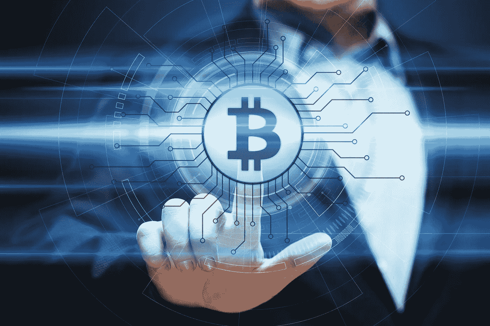

# 检查中国的秘密镇压

> 原文：<https://medium.com/hackernoon/examining-the-chinese-crypto-crackdown-61cdcc5bd8b8>

世界上对加密货币监管采取更明确立场的国家数量似乎有了显著增加。中国是首批禁止 ico 的国家之一，这一举动震惊了整个市场。2017 年对于加密货币来说是多事之秋。尽管今年年初交易价格不到 1000 美元，但比特币的价格几乎达到了 2 万美元大关。ICO 凭借多项破纪录的 ICO 活动统治了众筹领域。然而，夹在比特币迅速崛起和 ICO 众筹之间的是中国政府禁止 ICO 的决定。不仅 ico 被禁止，加密货币交易平台也被禁止。

这一决定的后果是，市场陷入了短暂的不确定时期。随着投机水平下降，比特币和其他替代货币的价格大幅下跌。或许监管最深刻的方面是禁止交易平台。加密货币交易所是加密货币交易市场的支柱。这是影响加密硬币价格和价值的大部分投机和其他市场活动发生的地方。由于中国政府的禁令，大量交易者无法参与市场。随着交易量大幅下降，这极大地影响了许多加密货币的价格。

# 禁令背后的原因

2017 年 9 月 4 日，世界上很大一部分人被中国禁止 ico 的消息惊醒。中国当局发布的声明的要点指出，政府将 ICOs 视为非法集资活动。政府将 ico 比作金融欺诈、非法证券发行和传销。禁止 ICOs 的决定是由多个中国政府机构联合做出的。参与决策的机构有:

1.中国人民银行(中国中央银行)

2.中国银行业监督管理委员会

3.中央网络办公室

4.国家工商行政管理局

5.工业和信息化部

虽然没有给出禁令的具体原因，但仔细研究声明的某些部分以及中国政府政策的历史影响，可以做出一些假设。这些假设的原因如下。

## 泵和转储 ICO 骗局

ico 不受监管的特性使得各种各样的企业都可以向投资者出售代币，而不管这些企业计划承担的项目的经济可行性如何。这就创造了一种环境，在这种环境中，泵和倾卸方案成为了日常的秩序。一家初创公司会提出一个可能没有任何财务价值的想法。投资者将被说服通过投资 ico 来增加股本。随着加密货币的流行，似乎每个人都在寻找下一个比特币。这些诈骗 ico 利用了加密狂潮，让很多人上钩。随着大量现金流入初创企业，代币价格大幅上涨，“企业家”纷纷套现。随后，投资者只剩下毫无价值的代币。这种情况在中国的 ICO 舞台上经常发生。

## 金融领域的混乱

区块链技术，总的来说，是一种颠覆性的技术。它的功能主要是通过在应用它的任何业务领域引起一个重大的范式转变。ico 构成了完全相同的东西，尽管在某种程度上影响了市场的一个关键部分；筹款。许多国家对企业筹资采取严格的监管措施，以遏制金融违规行为和其他犯罪活动。ICOs 通过利用众筹规避了所有这些制衡。借助白皮书和社交媒体营销，一家初创企业可以向市场推出一种代币，投资者就会购买。这开始以该国历史上前所未有的方式扭转商业局面。

## 重新控制商业领域

中国是一个以牢牢掌控国家存在的方方面面为荣的国家。一切都受到严密的控制和监视。不要过多地卷入政治辩论，ico 完全是既定秩序的对立面。**摘自中国人民银行发布的公开声明，** [**ICOs 极大地扰乱了经济金融秩序**](http://www.pbc.gov.cn/goutongjiaoliu/113456/113469/3374222/index.html) **。政府无法控制 ICO 流程，这是政府不愿意看到的。**

# 禁令的影响

许多加密货币交易平台将业务转移到了国外。当时只有几个月大的币安不得不采取创造性的措施来避免受到禁令的影响。由于其大部分客户位于中国，它不得不与拥有更多样化客户群的其他平台竞争。

加密货币的价格大幅下降。然而，这是短暂的，因为价格在几周的波动后开始回升。消息公布后，比特币的价格立即下跌了 200 美元。消息公布后的 3 个月内，比特币价格攀升至略低于 2 万美元。以太坊在宣布后市值损失超过 6 美元。绝大多数 ico 都建立在以太坊区块链上，因此加密货币似乎受到了最严重的打击。

许多注意力随后转移到日本，日本一直在为加密货币创造有利环境。日本金融服务厅(FSA)开始向一些加密交换平台发放运营许可证。亚洲舞台上秘密贸易的天平开始从中国转向日本。就加密货币而言，日本的地位有所提高。日本官员已表示，他们更倾向于加强市场忠诚度、而非抑制其增长的监管。

外部的观察家、监督者和专家不知道中国在加密货币方面的幕后发生了什么。ICO 和 crypto 交换禁令是永久性的，还是政府会出台严格的规定，还有待观察。只有时间能证明一切。

*渴望了解更多关于 FundYourselfNow 的信息吗？在我们的* [*电报*](https://t.me/fundyourselfnow) *群上加入我们的众筹革命对话，或者在* [*Twitter 上关注我们。*](https://twitter.com/fundyourselfnow)