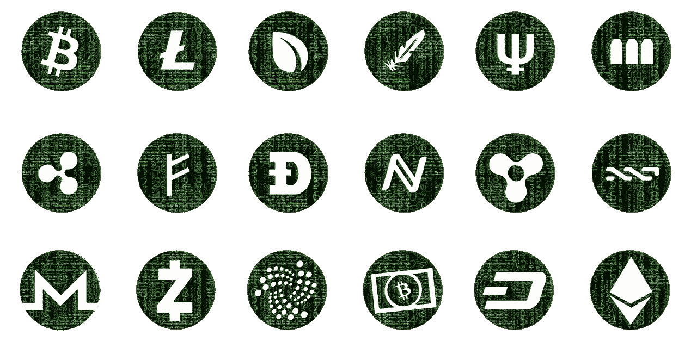

# 支持加密到加密交易的交换

> 原文：<https://medium.com/hackernoon/exchanges-that-support-crypto-to-crypto-transactions-83cc7fee5520>

近年来，加密货币已经成为许多投资者的可行资产类别。对于那些希望从传统资产类别中分散投资组合的人来说，这个市场提供了另一种选择。[加密货币交易所](http://news.fundyourselfnow.com/2017/09/19/heard-about-cryptocurrency-exchange/)服务为这些人提供了一个加密货币交易的平台。在这些服务上，投资者可以购买 BTC、ETH 和其他加密硬币，并开始交易。这一过程与投资者交易法定货币对的外汇市场没有太大不同。

互联网上有许多交易平台。他们每个人都试图提供不同的东西，以获得更多的客户。本文的重点将是支持加密到加密交易的加密货币交易所。在进入主题之前，检查什么是加密到加密事务是很重要的。

## 加密货币对加密货币交易

这些交易涉及一种加密货币与另一种加密货币的直接交换。美元、日元和英镑等法定货币在促进这些交易中不起任何作用。加密货币对加密货币交易有 3 种基本形式。

## 比特币到 Altcoin

这涉及到用比特币换 Altcoin。在这里，个人将比特币兑换成类似以太币、莱特币和瑞波币的替代币。Altcoin 是指除比特币之外的所有其他加密货币。它是由“**Alt**ernative to Bit**coin**造出来的

## Altcoin 转比特币

这涉及到用一个类似以太的替代币来换取比特币。该交易过程的一个流行应用是为投资 ico 并获得 Altcoin 代币的人。如果 ICO 成功，代币最终变得更有价值，投资者可以将它们兑换成比特币。

## Altcoin 到 Altcoin

这包括用一枚替代硬币交换另一枚替代硬币。通过关注当前的市场价格并对未来做出有用的预测，交易者可以通过兑换替代硬币来获利。

下面的交易平台支持许多不同的替代硬币，除了像 BTC、瑞士联邦理工学院和 LTC 这样的常见嫌疑人。

## [北海巨妖](https://www.kraken.com/signup)

北海巨妖由 Jesse Powell 于 2011 年创立。交易所的总部设在美国的旧金山。

北海巨妖加密交换服务支持多达 15 种不同的加密货币。用户可以使用美元、日元、加元和英镑等法定货币从该平台购买加密硬币。存款和取款可以通过电汇和 SEPA 转账。

与交易所市场的大多数主要参与者相比，北海巨妖提供了一些最低的费用。所有通过 SEPA 转账的提款都要收取 0.90€的手续费。对于平台上的其他交易，费用取决于涉及的金额。金额越高，收费越低。一般来说，平台上的费用范围在 0%到 0.26%之间。

平台上有不同的分层账户选项。每一层都有自己的存款/取款限额以及账户验证要求。北海巨妖安全协议包括 PGP 电子邮件加密和双因素认证。

## [Bittrex](https://bittrex.com/)

Bittrex，由专家安全工程师创立；Bill Shihara 是一个位于美国西雅图的加密交换平台。该平台自 2014 年以来一直提供加密交换服务。

该平台以提供全面的加密货币清单而闻名。有数百种硬币和代币可供交易。还有 400 多种 BTC 货币对。

Bittrex 仅支持加密货币支付方式。然而，运行增强型验证账户的交易者可以通过电汇购买 BTC、瑞士联邦理工学院和 [USDT](https://tether.to/) 。这些采购订单必须超过 10，000 美元。

平台上没有隐性费用。Bittrex 对所有交易收取 0.25%的固定费用，不管交易价值如何。exchange 服务的安全功能包括硬币冷藏和双因素认证协议。

## [币安](https://www.binance.com/)

币安是亚洲加密货币市场的主要参与者。该平台承载了亚洲 BTC 和 ETH 交易量的很大一部分。该平台总部位于中国，成立于 2017 年。

该平台专注于中国加密货币交易市场。世界各地的用户仍然可以使用这项服务。币安平台也有自己的名为 BNB 的加密硬币，可以在平台上交易。

有许多加密货币可以在这个平台上交易。新币也定期添加。提供的大多数硬币可以与 BTC 和瑞士联邦理工学院交易。所有交易的交易费都固定在 0.1%。币安不支持通过法定货币支付。所有的支付和取款都是加密货币。

## [Bitfinex](https://www.bitfinex.com/)

Bitfinex 被誉为市场上最大的比特币交易服务，其交易量令北海巨妖和比特币基地等服务相形见绌。该平台位于香港，自 2014 年以来一直提供加密货币兑换服务。

它支持所有主要的替代硬币以及 BTC。用户可以用这些 Altcoins 进行交易，换取美元或比特币。尽管过去由于黑客攻击和 BTC 丢失而遭受了一些挫折，但这项服务已经设法经受住了所有的风暴。它仍然是密码交易市场的主要参与者。

Bitfinex 是许多经验丰富的交易者的最爱。这是由于先进工具的可用性，如 TWAP，停止和限制订单，以及填充/杀死。还有一些市场图表功能，允许专业交易者在平台上进行有用的分析。

平台上需要进行账户验证。验证需要照片身份认证。这个过程需要 15 到 20 个工作日。除了网站版本，Bitfinex 还有一个移动应用程序用于即时交易。这款应用兼容 iOS 平台和安卓平台。

## [Bitstamp](https://www.bitstamp.net/account/register/)

Bitstamp 是 Damijan Merlak 和 Nejc Kodri 的大脑产物；一个是比特币挖矿爱好者，另一个是电脑销售员。该平台成立于 2011 年，如今是西欧最值得信赖的加密交换服务之一。

该平台最初的功能是仅提供比特币交易服务。然而，到 2017 年初，LTC 和 XRP 被添加到受支持的加密硬币列表中。8 月，Bitstamp 更进一步，将 ETH 纳入其 exchange 服务目录。

Bitstamp 交换平台通过网络和移动应用程序运行。该移动应用程序可分别在 iOS 和 Android 应用商店下载。平台收取的费用取决于交易的性质。所有加密货币交易都不附带任何费用。这同样适用于通过 SEPA 进行的存款。然而，通过 SEPA 提款将收取 0.90€的手续费。

该平台支持的支付方式包括借记卡/信用卡以及 SEPA 转账。安全性方面，平台要求账户验证。其他安全功能包括双因素身份验证和冷钱包存储。

## 最后的话

在加入一个交流平台时，进行尽可能多的研究是很重要的。就像任何其他资产类别一样，加密交易市场也存在风险。这些服务中的许多都提供钱包功能。最好不要把你的硬币放在这些在线钱包里。只有当你想交易或交换其他硬币时，才把硬币移到那里。硬币冷藏总是更安全的选择。

渴望了解更多关于 FundYourselfNow 的信息吗？在我们的 [*电报*](https://t.me/fundyourselfnow) *群上加入我们的众筹革命对话，或者在* [*Twitter 上关注我们。*](https://twitter.com/fundyourselfnow)