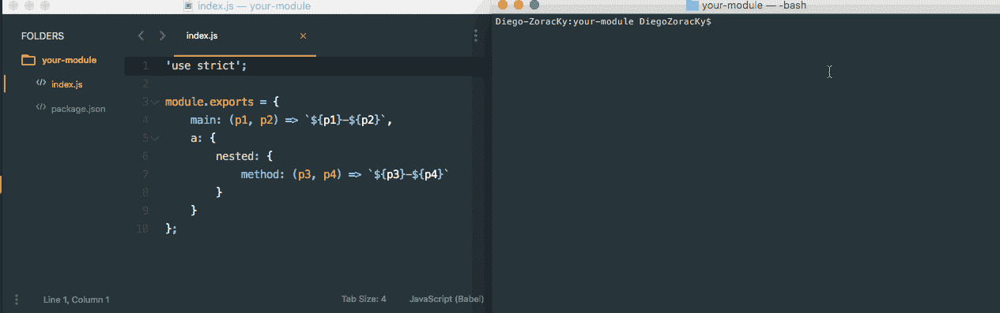

# 执行任何 Node.js 模块或。js 文件，而无需创建任何命令行界面

> 原文：<https://medium.com/hackernoon/executing-any-node-js-module-or-js-file-via-cli-without-creating-any-command-line-interface-at-all-6f3a125fdf5a>

最近我发布了 [MagiCLI](https://github.com/DiegoZoracKy/magicli) ，这是一个为任何给定模块自动创建 [CLI](https://hackernoon.com/tagged/cli) 的模块。只需要把它作为一个依赖项包含进来，需要这个模块，然后一个 CLI 就准备好了。然而，即使有了这个工具，如果开发人员(最终用户)想要通过 CLI 执行 npm 上发布的一些现有模块，仍然存在依赖性。一个模块的维护者必须包括 [MagiCLI](https://hackernoon.com/tagged/magicli) 以提供命令行界面。嗯，不再是了😉。

MagiCLI 现在可用于执行任何模块或。js 文件(包含 module.exports)。只需将它作为一个全局模块安装(或者使用 npx 调用它),并将模块或文件的路径作为参数传递。通过 CLI 查看文档以更好地了解其[用法。](https://github.com/DiegoZoracKy/magicli#usage-via-cli)