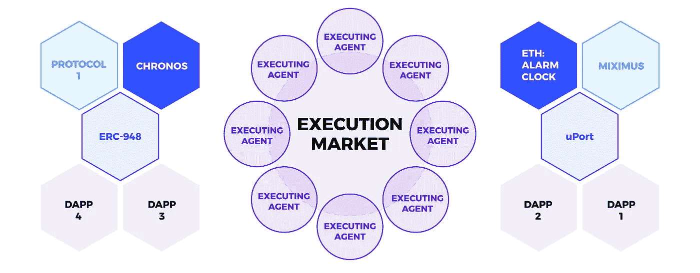
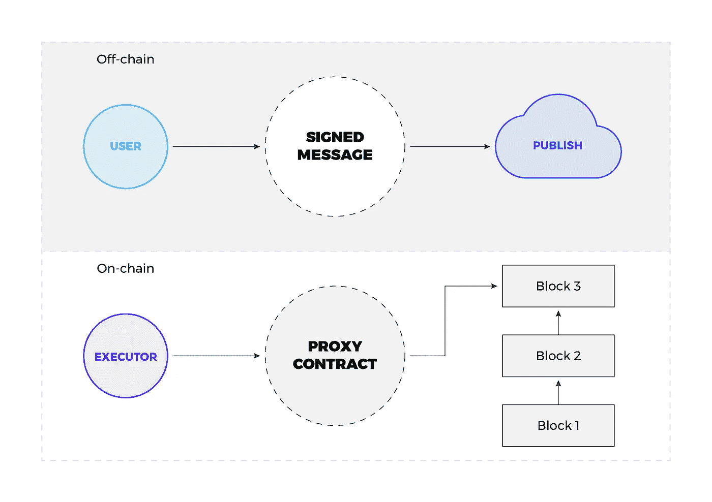

# 执行市场—自动化协议并获得加密

> 原文：<https://medium.com/hackernoon/execution-markets-automate-protocols-and-earn-crypto-67f64911010e>

在这篇文章中，我想谈谈最近讨论最多的话题之一，即基于[区块链](https://hackernoon.com/tagged/blockchain)的项目开发——执行市场。

为什么有趣？嗯，至少有三个原因。首先，这是自动管理区块链协议的方法。其次，它让这些平台的用户更容易上手。第三，这种制度中的执行者从参与中获利。

让我们从头开始——什么是执行市场？

Many applications can use one execution market

其工作方式如下:**一方在区块链**为执行交易向另一方付款。这种系统的例子是 [**以太坊闹钟**](https://www.ethereum-alarm-clock.com/) **，在这里人们为在给定时间**执行他们的交易而付费。

时间在事务执行中的重要性只是这个项目特有的，它不是一个规则。值得注意的是，交易被延迟并保存，例如，在智能合同中。

# 协议自动化

我们来谈谈执行市场在协议自动化中的用处。让我们设想这样一种情况，某人创建了一个基于区块链的应用程序，该应用程序在每个月的第 10 天向某一组人发送工资。目前，要做到这一点(不依赖于集中系统，如 cron ),您需要在每月的第 10 天坐在您的计算机前发送该事务。

舒服吗？更确切地说，如果可以自动化，为什么要多次重复这个过程呢？让我们用一个执行市场来说明。它允许您为下一年安排这样的交易。我们可以安排 12 项交易，为执行交易的人支付汽油退款和奖金。这样，我们的应用程序管理可以实现自动化。

顺便说一句，这样的系统是可以信任的——一切都在区块链确认——尤其是交易可以执行的条件。唯一的问题可能是缺少执行事务的参与者。当至少有几个时，网络将正常运行。

Presentation about execution markets by [ChronoLogic](https://chronologic.network) Tech Lead from ETHIS Hong Kong

# 用户入职

目前，基于区块链的应用面临着吸引用户的挑战。在这种情况下，很自然，社区的目标是消除一些障碍。其中一条就是要求有以太坊钱包，有部分资金。因此，用户必须知道如何创建一个钱包，得到一些[密码](https://hackernoon.com/tagged/ceypto)和拥有基本的技术知识，如何所有这些一起工作。这对新用户来说是个挑战。

然而，有一种解决方案，用户可能甚至不知道他们在使用区块链式的解决方案。对获得新用户感兴趣的应用程序所有者可以支付执行交易的汽油费用。

由于这一点，用户不需要有自己的以太钱包。我们可以为用户生成无线私钥。它将仅用于签署交易和验证交易是否来自该用户。当存储这种私钥时，它可以专门存储在用户的机器上。这确保了用户对帐户的完全控制，并且应用程序所有者在未经批准的情况下不能以用户的名义行事—数字签名。

应用程序所有者可以收集并立即执行事务，但也可以在执行市场上提交事务。这使得执行部分去中心化。用户也可以将他的交易直接放到执行市场上(无需付费)，应用程序所有者将执行它们。然而，在后一个例子中，我们需要知道哪些交易真正来自我们的用户。实现这种系统的人所要求的另一件事是防止滥用服务。

这里我想提一下 [Origin Protocol](https://www.originprotocol.com) ，它允许创建分散的市场，比如分散的 Airbnb。该系统的一部分是注册，例如，主机需要提交他的文件和连接他的社交媒体帐户。在区块链创造这样的身份需要支付汽油费，也需要有钱包、资金等。但是，应用程序所有者可以代表用户执行此事务。这需要给运行应用程序的公司带来价值。所以，让我们从一个问题开始——什么时候值得去做？也许当主人为房屋出租创造第一个报价的时候？也许在每个用户在我们的平台上注册的情况下？这真的需要集思广益，找到一个具体的业务模型，毕竟，这对应用程序维护人员来说是一个额外的成本。

We might see a situation in future, where each application would have its own execution market

# 如何在执行市场赚取密码？

正确运作的市场的关键方面是满足各方的需求。因此，一方面，我们希望人们利用市场，另一方面，我们奖励执行代理人。这种执行代理的一个简单例子是程序，它可以在本地(或云中)运行。如果它一直在运行，那是最好的。代理商需要了解市场上的交易——这就是我们需要互联网连接的原因。在执行交易的情况下，也需要少量的 [crypto](https://hackernoon.com/tagged/crypto) 才能上手。代理人执行交易赚取奖金和汽油退款。赏金由市场决定。

On the one hand, we have a user who submits the transaction, on the other — executing agent

人们可以在这里找到挖掘加密货币过程的相似之处。就我个人而言，我认为未来的执行代理将是区块链客户端的插件——比如 Parity 或 Geth。你可以运行你的节点，在你挖矿的同时，你也可以运行一个执行代理，获得更好的投资回报。根据目前的一些信息，有一个 Python 以太坊客户端正在开发中，它将支持这样的插件。也许我们在 Geth 和奇偶校验中看到类似的可能性只是时间问题。

User publishes a transaction by submitting a signed message, but the transaction will be executed by executing agent

# 将来的

这个话题在以太坊被强烈讨论，很多项目都感兴趣。说到标准化，我们仍然没有一个统一的方法来实现它。它带来了分散的风险——太多的架构和独立的市场，以及不同数量的代理执行交易。少量的代理商会破坏市场的稳定，使其崩溃。这就是为什么我在这里强调了几件事，这可能有助于创造和采用执行市场:

*   链上和链下架构的标准化——标准 [EIP-1077 可执行签名消息](https://github.com/ethereum/EIPs/blob/master/EIPS/eip-1077.md)和 [ERC-1228 委托执行](https://github.com/ethereum/EIPs/issues/1228)
*   代理商奖金的标准化— [ERC-1197 元支付](https://github.com/ethereum/EIPs/issues/1197)
*   执行代理的许多实现

一方面，执行市场可以帮助应用程序获得客户，另一方面，它们依赖于客户的数量。这意味着人们需要使用区块链系统并发送交易，因此其中一部分可以在执行市场上结束。目前，通过观察以太坊最近的交易我们可以看到，人们宁愿使用分散的交易所，参加 ICO 和 CryptoKitties 这样的游戏。似乎我们仍然需要等待真正让世界变得更美好的应用程序的流量。