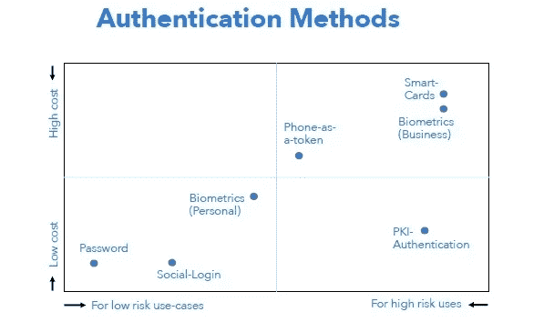
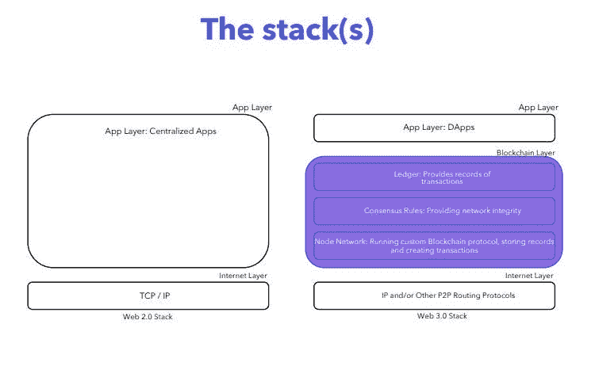

# 昂贵而过时:为什么企业在区块链寻求网络安全创新

> 原文：<https://medium.com/hackernoon/expensive-and-outdated-why-businesses-are-seeking-cybersecurity-innovation-in-the-blockchain-cdda8fe29e37>

我们每个人每天都会出于个人或商业目的使用 10 到 15 个应用程序。我们还使用一定数量的软件、网站、在线服务和移动应用程序，这些都需要我们注册。在数字经济中，认证已经成为我们生活的一部分，通过 OAuth 协议在谷歌或脸书上注册你的社交账户是可以理解和熟悉的。如果在私人生活中，我们只拿自己的数据和客户偏好信息冒险，那么当我们在类似的系统中注册业务时，风险就变得更大了。如果我们的公司数据暴露，从财务和声誉的角度来看，损失可能是巨大的。

**网络安全落后于网络犯罪创新**

当被迫在便利和安全之间做出选择时，大多数用户会选择前者，尽管网络安全专家多次警告说，忽视安全会给他们带来危险。统计数据显示，大多数面临密码要求的用户要么使用简单的密码组合，要么想出三个或四个密码组合，然后在任何地方重复使用。更高级的用户发明了复杂的密码，但随后可能会通过将它们记在靠近办公桌的贴纸上来弱化这些密码，这也从安全角度提出了问题。

在企业环境中，使用智能卡和生物识别访问，最便宜和最常见的解决方案是基于数字证书的公钥基础设施。不幸的是，尽管这项技术很流行，但它本身并没有完全优化来抵御网络攻击和黑客的破解能力。

对 CA 的网络攻击的一些例子包括 2011 年的 [Comodo 黑客](https://www.infoworld.com/article/2623829/authentication/weaknesses-in-ssl-certification-exposed-by-comodo-security-breach.html)，2012 年的 [Adobe 系统黑客](https://www.adobe.com/support/security/advisories/apsa12-01.html?red=a)，以及 2015 年的[卡巴斯基实验室黑客](https://www.wired.com/2015/06/foxconn-hack-kaspersky-duqu-2/)。

**您需要什么来提供集中式解决方案的替代方案**

公司部门希望看到解决安全认证问题的三个基本要素:简单性、可访问性和所有与之交互的员工的可理解性；该系统的可信性，它将负责访问的安全和保障；以及这个决定必须付出的代价。

在第一种情况下，关键问题是人的因素。我们必须确保无论用户做什么，都不会使系统变得非常脆弱。网络安全培训活动的经验表明，普通用户无法抵挡经验丰富的黑客，我们必须在第一层消除漏洞。

在第二种情况下，我们说，我们当然应该能够信任向我们出售安全的大型组织和公司，因为它们有巨大的能力和声望。但是我们真的能信任他们吗？当涉及到存储在中央服务器上的数百万个访问密钥时，泄漏、失控或各种其他攻击的可能性非常高。这些中央集权的机构，一个接一个地，证明了他们无法有效地应对那些旨在获取有价值信息的高级团队。

在第三种情况下，我们讨论的事实是，每个公司的网络安全预算有限，并且遵循既定的做法，因此潜在的解决方案必须适合他们开始使用它。

**智能和自我调节的存储作为安全保障**

通常，区块链只是作为公关的一个解决方案，或者在没有大规模应用潜力的地方被推荐。然而，在网络安全和公司数据安全的情况下，传统公钥基础设施解决方案的系统维护和改进成本显然是合理和必要的。从技术角度来看，你可以在 [REMME 开源](https://remme.io/)中看到这样一个解决方案的实现。

区块链由四个重要组成部分组成:密码学、共识、账本和商业模式。加密技术提供了存储数据的保密性、完整性和真实性。共识是一种协议，该协议激励分散式网络支持区块链功能，并防止潜在的共谋或危及网络的恶意行为。Ledger 包括智能合同逻辑和数据规范，可通过网络(区块链体系结构本身)存储，最终必须是此类信息的可靠且方便的存储。业务逻辑将所有组件联合在一起，并允许分散的网络长期稳定运行，同时保持数据处于不变状态。

以区块链为基础的解决方案的主要特点是增加了一个分布式和独立的网络，保证某些信息在数据交换的某一阶段不会被更改或篡改。

出于安全原因使用区块链的传统 PKI 的主要附加价值是:

*   由权力分散的机构管理；
*   高可用性；
*   无 DoS 可能性或 DoS 可能性降低；
*   抵制不必要的修改；
*   更多的定制机会(定制属性)；
*   准匿名性，因为身份用数字表示。

**结论**

任何旨在成为企业替代安全访问解决方案的创新都应该满足几个要求:它应该简单，用户可以访问，独立的网络安全审计应该确认其可靠性，价格应该与企业立即采用它的意愿相匹配。

对于那些使用密码的人来说，你需要考虑 2FA，最好开始一个逐渐过渡到允许你不使用密码进行认证的解决方案的过程。

尽管黑客积累了大量的漏洞，PKI 仍然是提高企业网络安全的最有效的工具。这项技术与公钥的分散网络相结合，使我们能够解决许多与 CAs 相关的问题。