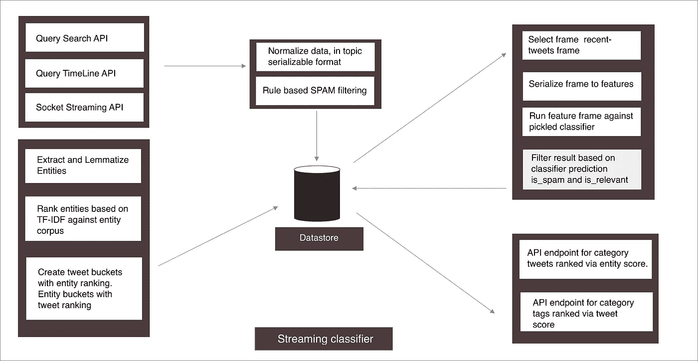
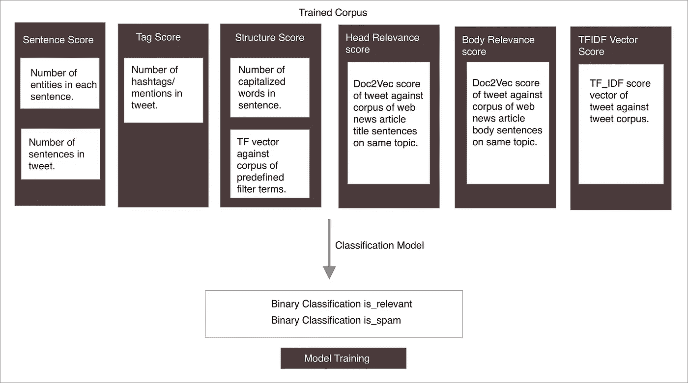

# 从 twitter 流中构建新闻源的经验

> 原文：<https://medium.com/hackernoon/experiences-building-a-newsfeed-out-of-twitter-streams-fdcaee7542d1>

## 对不仅仅是流行指数主题的汇总视图进行建模

消息从[推特](https://hackernoon.com/tagged/twitter)传播出去..比其他任何地方都快…令人惊讶的是，我们每天看到或听到的“突发新闻”有多少是从推特开始的。从[的推文](https://twitter.com/elonmusk/status/1026872652290379776)让我们质疑现实的本质，到推特政治，一直到加密推特，显而易见的是，推特是一切的起点。

从某种意义上来说，Twitter feeds 非常好用，我们可以看到我们关注的人的推文，以及我们关注的人喜欢的推文..但是除了日常活跃账户，我们大多数人从链接分享或来自推特的新闻媒体获得新闻。各行各业都在努力创建 Twitter 数据流的有意义视图，结合统计分类模型和其他 ML 技术来提取独特和有趣的信息。

在 Snip，我们的作家推荐引擎运行分类/聚类/主题建模管道，为作家生成实时新闻推荐。当前的实现提取有意义的推文，并在接近实时的基础上将它们分组到上下文集群中。它使用逻辑回归进行相关性分类，通过 NMF 对主题聚类进行建模，并通过加权进一步提取文本摘要。

通过这篇文章，我将概述系统设计中的一些基本原理和挑战。

# 除了 Twitter 搜索，过滤来自相关实体的流和上下文信息

高层技术架构由聚合器前端和[机器学习](https://hackernoon.com/tagged/machine-learning)后端组成。该系统的目标是为用户提供个性化的 twitter 新闻源，根据他们的兴趣定制基准和功能，基于以下指标—

## 准确(性)

1.将状态和时间线结合起来，并根据新闻价值和准确性进行排序。
2。从主题提要中删除垃圾/营销推文。
3。结合互补来源的数据，过滤固执己见的推文，以创建对事件的公正看法。

## 关联

1.视图应该提供事件发生的时间顺序，并结合主题中的热门事件和新兴事件。
2。针对新闻语料库对推文进行矢量化，以过滤出新闻推文。
3。该系统不应包括固有的偏见，结果显示应包括仅基于语义和交互的话语。

## 质量

1.新闻文章应该是最近的和最新的。
2。如果新闻文章已经被上游编辑，尽快从流中删除它。



**Machine Learning Backend**

# 围绕一个话题聚集推文

Twitter 为我们提供了三个基本的查询端点，搜索、时间轴和流。每一个都给出了一个主题的不同观点，我们可以用来创建有趣的功能。为了创建包括语义相似性(人和相关实体)的近乎完整的主题视图，主题的基本结构应该允许获取最大量的数据，同时能够扩展到数百个主题，而不会达到速率限制。

```
[{“topic”: topicName, // Search topics
  “handles” : [], // Search timelines
  "keywords": keywords, // Sample Realtime stream
}]
```

然而，解析和分配上下文信息给推特带来了独特的挑战。简单的基于流行度的指数通常不足以计算一篇文章的“新闻价值”，推文默认不是新闻文章，自动化账户的泛滥扭曲了任何试图仅基于流行度指数和用户反馈来确定一篇文章的新闻价值和准确性的系统的结果。

# 相关性分类器

这一挑战的核心是一个分类问题，从有意义的“有新闻价值”的文本中过滤僵尸流/有观点的推文和用户帖子。这是为了防止众所周知的“垃圾进垃圾出”问题。然后，可以通过聚类和主题建模管道处理分类数据，以创建围绕主题的新闻的可消费视图。监督学习方法对于精心选择的特征向量工作良好。

## 模特培训

对于我们的模型训练，我们已经根据两个指标训练并标记了每个类别中几千条推文的语料库——垃圾邮件和相关性。该集合将用于训练我们的模型，并验证每个类别的分类器的准确性。

## 特征向量

特征向量结合了文本特征、帖子度量特征，结合了用户度量和推文的时间窗口。对于文本特征，我们可以将词条的 TF-IDF 向量与(1，2) n 元文法和命名实体相结合。

除了文本处理，通过观察一个类别中的推文，我们可以识别垃圾推文的语义(例如包含赠品、奖励等术语)。或者大量的标签和提及)。我们可以构建垃圾邮件特征的附加索引，并将其传递给分类引擎。

可以通过针对给定类别中可靠新闻文章的语料库对该类别中的推文进行 word2vec 索引来构建附加特征，以确定推文的新闻价值。



## 模型生成

我们发现，创建一个通用的训练模型来对不同类别和主题的推文进行分类，往往会牺牲准确性。
另一方面，为每个单独的主题手动标记训练数据非常耗时，并且不太具有可扩展性，但却可以获得更高的预测准确性。我们通过提供与相关性和垃圾邮件高度相关的特征集来建立监督的类别分类模型。对给定主题/类别语料库中的 tweets 样本的观察给出了关于特征的想法，这些特征可以是一般化的或者特定于给定类别的。

通过从标记样本创建特征向量来创建模型。标记的语料库(大约 1200 条推文)被分成训练集和验证集(0.33 * len(lebelled_set))
特征向量如上面的架构图所述被创建。特征包括稀疏 TF-IDF 向量、针对关于该主题的新闻文章语料库的 Doc2Vec 相似性向量以及其他语言语义特征。

## 流分类-

一旦模型被生成和处理，我们就可以用它来预测准确性和垃圾邮件分类，以实时收集推文样本。
我们可以定义一个整数常数 N 或时间戳 T，这样我们就可以过滤数据帧，以查询最近 N 条推文或在> T 插入的推文。
我们使用基于 Cassandra/Spark 的分布式计算集群来近乎实时地标记和标注推文，并通过 API 层提供服务。

# 主题建模和聚类

主题建模可以基于具有时间戳衰减函数的文本和余弦相似性来完成。主题建模系统的目的是根据语义度量对主题进行分组，而不仅仅是文本。对于主题建模，我们对 NMF、LDA 和 LSI 算法进行了基准测试。在无人监督的情况下，NMF 的结果在很多领域都是最适用的。为了使主题的数量尽可能相关，我们从一个初始近似值开始，即在一个干净的数据集中，主题的数量=记录的数量/ 10。我们可以根据散度的语义相似度进一步合并主题。

```
 num_topics = int(len(topic_frame)/10)model = TopicModel(‘nmf’, n_topics=num_topics)for topic_idx, top_terms in model.top_topic_terms(vectorizer.id_to_term, topics=-1, top_n=8, weights=True):
    // Top 8 Terms for each Topic, further filter by weightsfor topic_idx, top_docs in model.top_topic_docs(doc_topic_matrix, topics=-1, top_n=6, weights=True):
    // Top 6 docs in each topic.
```

管道的最后阶段是提取文本摘要，通过提取语料库中具有最高权重的句子。权重通过加权术语的频率和句子语法分数来计算。

# 实施—

在管道的末端，我们能够根据“新闻价值”桶以高准确度将主题分类为相关/不相关，并通过无监督主题建模和实体提取算法的组合，以合理的准确度将分类的推文聚类到建模桶中。

建立一个高度精确的分类器的代价是，它在不同的类别之间不太通用，因为决定相关性的特征在不同的类别之间通常是不同的。我们希望建立一个单一的分类器来对不同类别的推文进行分类，但这样的分类器会牺牲预测的准确性来实现泛化。相反，我们选择了几个分类器来对类别桶进行分类，这些分类器可以以很高的准确度对类别桶内的主题进行分类。可以在情感和时间衰减度量的基础上进行进一步的探索性聚类，以提供更细粒度的聚类。我还要向下面这些让基于文本的 ML 变得如此有趣的软件包的维护者们大声疾呼——sk learn、Spacy、Textacy、Gensim