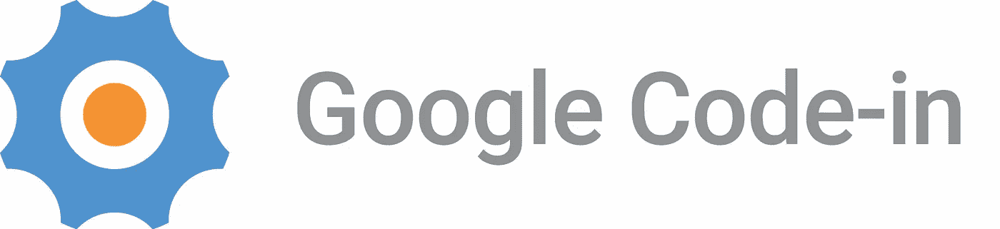
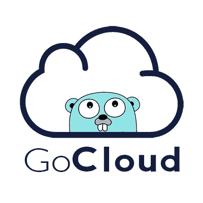
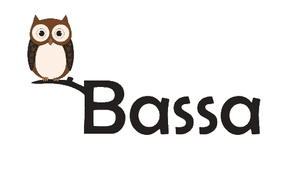
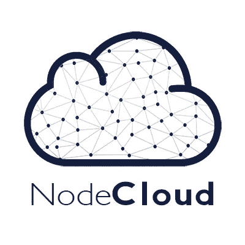

# 体验谷歌代码-2017 年有分数

> 原文：<https://medium.com/hackernoon/experiencing-google-code-in-2017-with-score-4afdb53dc5e1>

## 我对代码、错误和(是的)睡眠剥夺的第一次体验。

2017 年 11 月 29 日，晚上 12 点，我躺在床上。手机在我手上。准备打字。然后，我打开 codein.withgoogle.com*并注册成为参与者。这就是一切开始。*

在大约 46 天的时间里，我探索了开源开发的世界。我以前从未听说或了解过开源开发。我所知道的唯一关于开源的东西是一个由非盈利组织制作的免费软件。但是我有一个梦想，在一家 T4 科技公司工作。它把我带到了这里，[谷歌](https://hackernoon.com/tagged/google)代码——在 2017 年。开源开发的全球竞赛。

在 2017 年之前，我也参加过 Google Code——2016 年。但是我没有把目标放在上面，因为我只是想尝试一下，介绍一下自己。现在在 Google Code 上——2017 年，我给自己定了一个目标，努力做到最好。从 25 家机构中，我选择了 SCoRe。我选择 SCoRe 是因为在我看到所有组织的任务后，我觉得我有足够的能力加入 SCoRe。

**第一周**

我在 Google Code-in 上注册后不久，我就开始做一些小而基本的任务。我的第一个任务是 Fork GoCloud 项目仓库。这很容易。

[https://github.com/scorelab/Soundcom](https://github.com/scorelab/Soundcom)

总之，在我完成初学者任务(只有 2 个任务)后，我为登革热设计了 logo——stop，DroneSym，和其他。我真的很喜欢设计标志，因为平面设计是我的爱好之一。当然很难找到标志的灵感，但当它出现时，一切都变得有趣。我的导师也给了我积极的评价，让我在 Google Code-in 上不断前进。(非常感谢评论！)

**强调指出**

我继续为应用程序、项目等设计图标。但是这一次，我压力太大了。为什么？因为除了参加谷歌代码，我必须为我的学期考试学习。我发现在学校和谷歌代码之间进行多任务处理非常累。有时候，因为做作业和谷歌代码输入任务，我一周几乎有 5 天没有睡够。所以在 12 月的第一周，我离开了谷歌代码，直到学期考试通过。

**回到谷歌代码输入**

就在我的假期开始的时候，我回到了谷歌代码。我感到欣慰的是，我仍然是 SCoRe 的领导者。我的假期在 1 月 2 日结束，所以我尽可能地赶着完成任务。花了很长时间完成的任务之一是为 Soundcom 应用程序设计素材按钮。

[https://github.com/scorelab/Soundcom](https://github.com/scorelab/Soundcom)

我在做纽扣之前做了大量的研究。我搜索了应用目的、功能、特征。然后我搜索按钮的想法。关于形状、颜色和许多其他东西的想法。幸运的是，经过两天的设计，导师们接受了我的作品！我睡了 9 个小时的好觉来庆祝我工作的成功。

**新的一年新的挑战**

2018 年初，我发现我的名字不在 SCoRe 的排行榜上。我慌了。在那一刻，我认为我完成的任务量足以让我留在排行榜上。可悲的是，事实并非如此。所以我制定了一个计划。一项计划，以回到领先董事会，并留在它，直到谷歌代码结束。我不再做设计任务了。我开始在 Git 上工作。在 4-5 天的时间里，我在排行榜上一进一出。每一天。我写问题，提出拉动式请求，并努力跟上另一位领导。最后，我的计划成功了。在我打出这篇报道之前，我一直在排行榜上。我很开心，非常开心。

**玩 Git、Python 等**

接近谷歌代码的尾声——2017 年，我在做更多的编码任务。我认为编码任务比设计任务更快完成，尽管我更喜欢设计任务。我开始在 Bassa 项目上编码，使用 Git Bash 作为我的终极工具。

[https://github.com/scorelab/Bassa](https://github.com/scorelab/Bassa)

我在 Bassa 上写了很多代码。首先，我学会了如何克隆、配置和推送在线存储库到本地机器，反之亦然。接下来，我使用*上游*特性，用在线存储库自动更新我的克隆存储库。最后但并非最不重要的，我玩了*精选*。当我运行命令时很有趣，但当我看到“错误”时就不有趣了。

我参与的另一个项目是 NodeCloud 和 BellyDynamic。

[https://github.com/cloudlibz/nodecloud](https://github.com/cloudlibz/nodecloud)

在 NodeCloud，我创建了 Git Pre Commit Hook。(注:之前不知道，创建后还是很困惑😐)幸运的是，我创建它时没有任何错误。

最后一项编码任务是最难完成的任务。这项任务是在本地建立的。我看了 BellyDynamic 的维基，我想这很简单。然后，我安装了 Python，并开始设置。

 [## score lab/腹部动态

### BellyDynamic:一种处理在线和离线动态图形对象的可扩展数据结构

github.com](https://github.com/scorelab/BellyDynamic) 

36 小时后，我完成了。(将近 2 天)

我在设置的时候犯了很多错误。文件权限、找不到命令、属性错误等等。这些步骤我重复了 8 遍才想通。我差点就放弃了，放弃了这个任务。奇迹发生了。这很有效，我的导师也接受了。我如释重负，心存感激，同时也很高兴。

**结论**

最后，这是一次非同寻常的经历。我觉得和 SCoRe 一起工作既有趣又有挑战性。我很乐意在开源开发社区工作，而不仅仅是 SCoRe。因为我认为开源开发有无限的可能性。最重要的是，我在这个世界上找到了我的激情。