# 尝试为 PM 举办黑客马拉松

> 原文：<https://medium.com/hackernoon/experimenting-with-a-hackathon-for-pms-2e28a7111e85>

## Headlight 试图发掘纽约最杰出的产品经理的结果

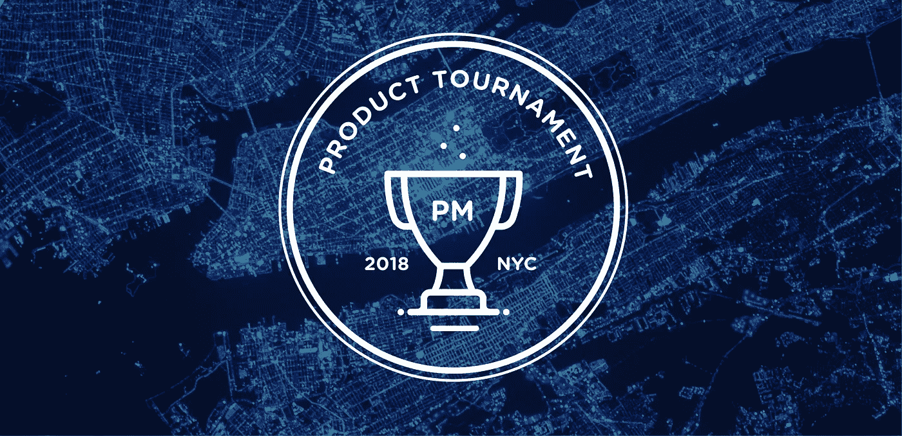

*注册成为*的竞争对手或雇主👩🏾‍💻 [*NYC 工程锦标赛*](https://www.headlightlabs.com/tournament/engineering-nyc-apr-2018) 👨🏻‍💻*(4 月 20 日至 23 日)*

产品管理是技术领域最令人向往也是最难获得的职位之一。这是一个多学科的角色，需要技术知识、产品洞察力、组织能力和人际交往能力——在某些人手里可以给公司带来巨大的成功，而在错误的人手里则会造成重大伤害。

对于应聘者来说，很难明确证明你有能力胜任这份工作。

对于雇主来说，招聘一个如此重要却又如此难以定义、衡量或表达的职位可能会让人感到麻痹。

这意味着大多数[产品管理](https://hackernoon.com/tagged/product-management)职位会给那些简历上已经有“产品经理”头衔、有知名科技公司或教育机构工作经验的人，或者是内部雇员(通常是工程师或设计师),希望能就他们缺少的技能对他们进行指导。

这使得人们几乎不可能闯入该领域。

我自己在打入产品时也面临这些挑战(你可以在 [FastCompany](https://www.fastcompany.com/3063844/getting-turned-down-by-google-helped-me-get-hired-at-etsy) 中阅读整个故事)，这也是激励我共同创立 [Headlight](https://www.headlightabs.com) 的部分原因，这是一个绩效招聘平台。我们帮助雇主招聘、筛选和雇用工程师、产品经理、营销人员和其他角色。

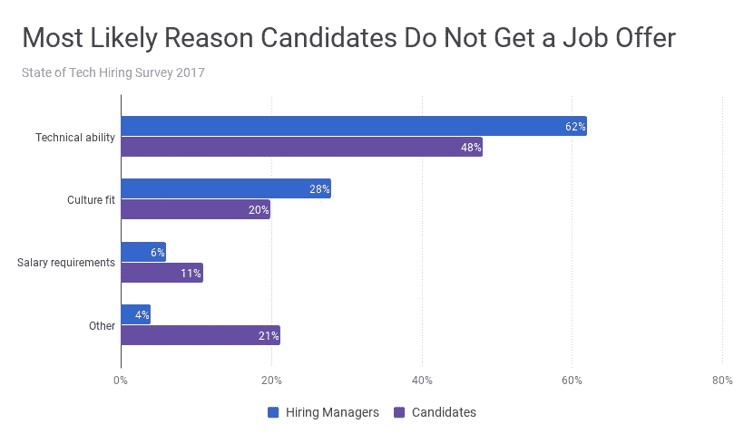

Source: [The State of Tech Hiring 2017](/headlight/the-state-of-tech-hiring-in-2017-793afafd1181)

# 帮助项目经理因能力而非血统被录用

我们公司的一个重要原则是，我们应该根据人们实际能做的事情来招聘，而不是被他们简历上有或没有的闪亮的东西分散注意力。事实是，几十年的研究表明，工作样本比多年的经验或教育更能预示工作的成功。

我们自己关于技术招聘的研究发现，大多数技术候选人找不到工作的最大原因不是人/文化技能，而是缺乏(或被认为缺乏)技术技能。虽然带回家的任务在筛选开发人员时越来越受欢迎，但项目经理候选人并没有太多的机会来展示他们成功胜任该角色的能力。

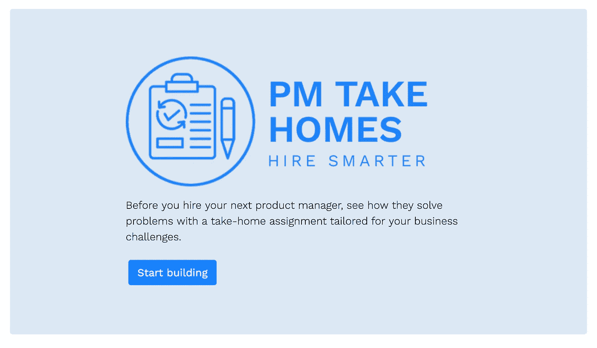

In December 2017, we released 9 PM take-homes across B2B, Consumer, and E-Commerce business scenarios.

2017 年底，Headlight 推出了 [PM Take-Homes](https://www.pmtakehomes.com) ，这是一个免费的评估/迷你项目库，雇主可以用它来筛选 PM 候选人。我们从尝试这些任务的人那里得到了一些很好的反馈，但我们发现他们仍然严重依赖简历，因此过早地减少了候选人。

几个月前，我举办了一个为期一天的产品研讨会，发现纽约市的技术社区非常渴望有更多的机会来发展他们的技能，并让他们的工作得到认可。

所以我们决定更进一步，设计了也许是有史以来第一次在线产品经理锦标赛。

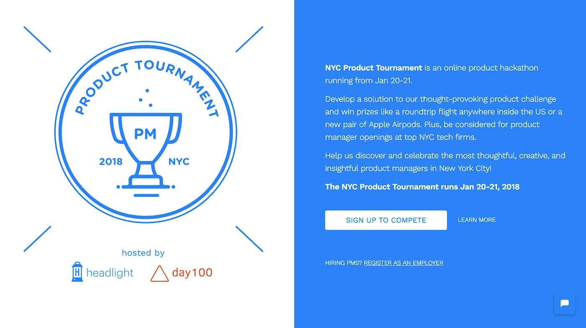

# 纽约产品锦标赛

2018 年 1 月，我们宣布与基于心理学的招聘技术平台 [Day100](https://www.day100.me) 合作举办纽约产品锦标赛。该比赛的目标是帮助确定谁是大纽约地区的顶级项目经理，并帮助技术雇主找到他们的下一个产品雇员。

## **产品挑战**

我们想创造一个有趣的、有内涵的、开放式的产品挑战，给人们以他们自己的方式解释和解决问题的灵活性。

我们从中得到了一点乐趣，把挑战变成了漫威同人小说的一部分。

*   参与者被安排扮演斯塔克实验室新雇佣的产品负责人的角色，这是一个(虚构的)斯塔克工业内部的孵化器项目。
*   投资组合中的一家公司正在努力应对其 FaceID 竞争对手 SecureSmile 的试点项目。
*   最初的试点是将一个安全的微笑放入自动取款机中，要求消费者设置他们的微笑数据，这样他们就可以通过微笑获得现金
*   在试点项目被有限采用后，该公司现在想知道是否应该重复体验，再试一次，或者进入一个新的垂直领域，如豪华公寓大楼，与智能手机制造商合作，或者完全做其他事情

挑战赛要求参赛者制定一份产品计划(以演示文稿的形式)，几个小时后，当 Tony 来到办公室时，他会拿给自己看。

他们得到了一套[模板](https://drive.google.com/open?id=1uSrgsB1sEijfFJCFp4dcwGI98bSlMwVpC3XCNnfMiWo),里面有大约 15 种不同的幻灯片格式(大报价、列表、2x2 框架等),他们可以使用这些模板开始工作。大约一半的完成者选择使用这个，这就是为什么一些甲板有类似的风格。

这是一段 5 分钟的视频，介绍了我们向竞争对手展示的产品挑战。他们有三个小时的时间提交他们的陈述。

[点击此处跳转至最终演示。](#d1ab)

## **奖品**

为了激励人们参与其中，当然不仅仅是胜利的荣耀，我们还为顶尖选手设立了一些奖项。从 Ellen K. Pao 的 *Reset* 、Nir Eyal 的 *Hooked* 和 Yuval Noah Harari 的 *Sapiens* 的一套科技读物，到世界上最成功的产品组织之一 Airpods 的最新创新，再到美国境内任何地方的往返飞行，我们希望这场比赛有一些切实的利益和成果。

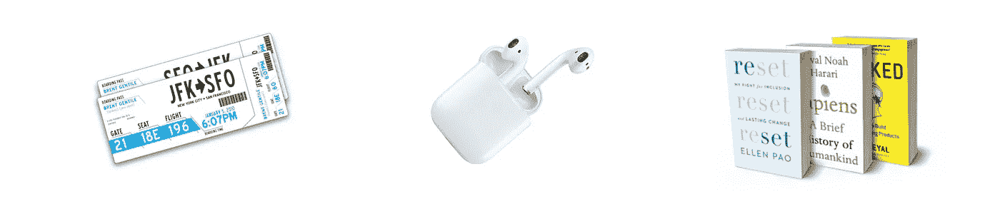

## **评估标准**

我们之前谈到了找出谁可能在产品角色中取得成功的挑战，因为它需要许多不同的能力。

出于锦标赛的考虑，我们将其分为四类:

*   商业机会:他们如何为这种产品定义一个清晰而有说服力的市场和商业案例？他们欣赏竞争格局吗？
*   **客户洞察:**他们对客户需求、痛点和世界观的了解程度如何？他们将如何利用研究来传达这种理解？
*   产品开发:他们实际上对产品解决方案的阐述有多好？他们了解设计和技术问题吗？他们定义了成功的样子了吗？
*   **项目管理:**你对这个产品的发布和以后的执行计划有多强？你能切实有效地组织工作吗？

## 第 100 天的心理评估

由于我们正在试验一种新的招聘流程，其中我们隐藏了候选人的姓名甚至简历，我们希望给雇主一个机会来更多地了解候选人，所以我们求助于我们在 Day100 的朋友，这是一个基于心理学的招聘技术平台，采用了心理学家最广泛接受的五大人格框架。

每个竞争者都完成了一个第 100 天的评估，这个评估是根据我们在 Headlight 创建的“理想 PM 气质”进行的。这并不完美，因为每个公司和经理对他们想要什么有不同的想法，但它至少有助于揭示候选人是什么样的。

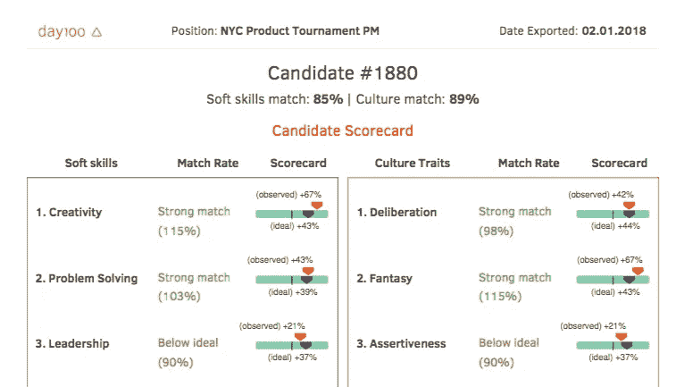

## 《士师记》

为了将所有这些整合在一起，我们需要有能力和受人尊敬的人来审查参与者的工作。我们召集了一个小组，成员来自四个领域:产品、工程、营销和设计。通过让多名评委评审工作，我们可以对参与者的能力有一个更加平衡和健康的看法。

我们从不同规模的公司——初创公司、中型科技公司和上市公司——以及不同行业——电子商务、SaaS、媒体、开发工具和社交网络——招募了法官。

我必须对[克里夫·金](https://www.linkedin.com/in/cliff-kim/)、

[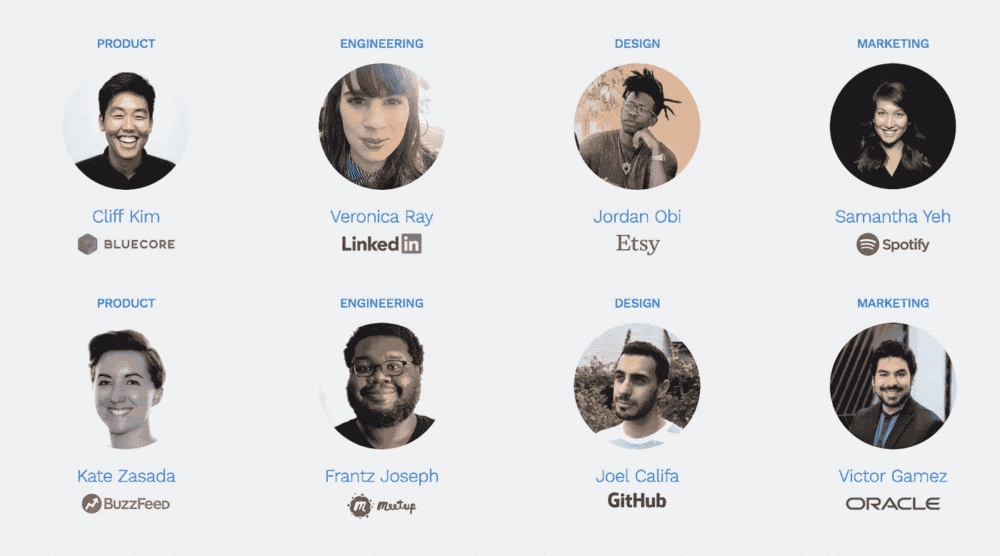](https://medium.com/u/77c5a00639bc#YouTheRealMVP
<figure class=)

# [竞争](https://medium.com/u/77c5a00639bc#YouTheRealMVP
<figure class=)

[1 月 4 日，我们宣布了纽约产品锦标赛。我们通过网络、私人 Slack 和脸书团体、社交媒体以及电子邮件列表与人们分享了这场比赛。](https://medium.com/u/77c5a00639bc#YouTheRealMVP
<figure class=)

[在短短两周多的时间里，我们有 153 PM 的注册量来竞争！](https://medium.com/u/77c5a00639bc#YouTheRealMVP
<figure class=)

## [这些人是谁？](https://medium.com/u/77c5a00639bc#YouTheRealMVP
<figure class=)

[他们中的大多数已经是产品经理了，剩下的大部分都在从事与产品相关的工作，比如工程或产品营销。](https://medium.com/u/77c5a00639bc#YouTheRealMVP
<figure class=)

[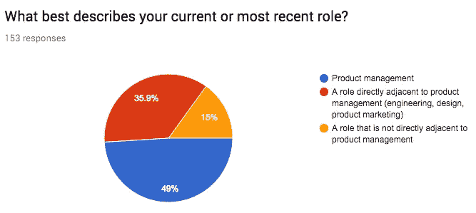](https://medium.com/u/77c5a00639bc#YouTheRealMVP
<figure class=)

[他们几乎男女各半，其中 75%的人年龄在 25 至 34 岁之间。大约一半是亚裔美国人，另外 35%是白人，16%是黑人或拉丁裔。](https://medium.com/u/77c5a00639bc#YouTheRealMVP
<figure class=)

[让科技成为一个更具包容性的地方，让各种背景的人都能茁壮成长，这是我们非常关心的事情，我们将继续努力让我们的比赛变得更容易接受，特别是对传统上代表不足的群体。](https://medium.com/u/77c5a00639bc#YouTheRealMVP
<figure class=)

[最后一个数据——大多数受访者都在积极寻找新工作(60%)，而其余的人则对新机会持开放态度。这与我们的调查结果相差不远，我们的调查结果显示，75%的科技工作者在过去的一年里要么换了工作，要么认真考虑过跳槽。](https://medium.com/u/77c5a00639bc#YouTheRealMVP
<figure class=)

[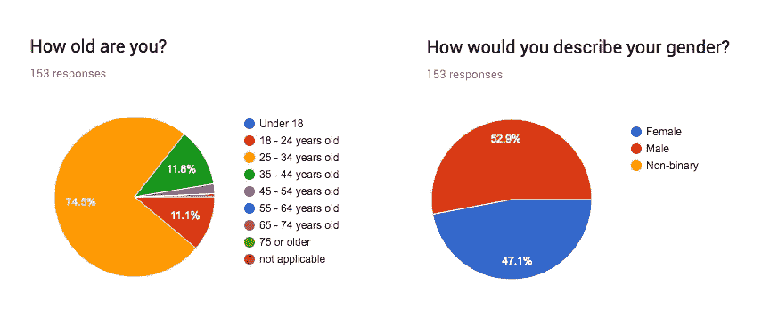](https://medium.com/u/77c5a00639bc#YouTheRealMVP
<figure class=)

## [雇主](https://medium.com/u/77c5a00639bc#YouTheRealMVP
<figure class=)

[我们联系了几十家纽约雇主，他们都有项目经理的职位空缺，大约有 14 个人说他们有兴趣见见最优秀的候选人。](https://medium.com/u/77c5a00639bc#YouTheRealMVP
<figure class=)

[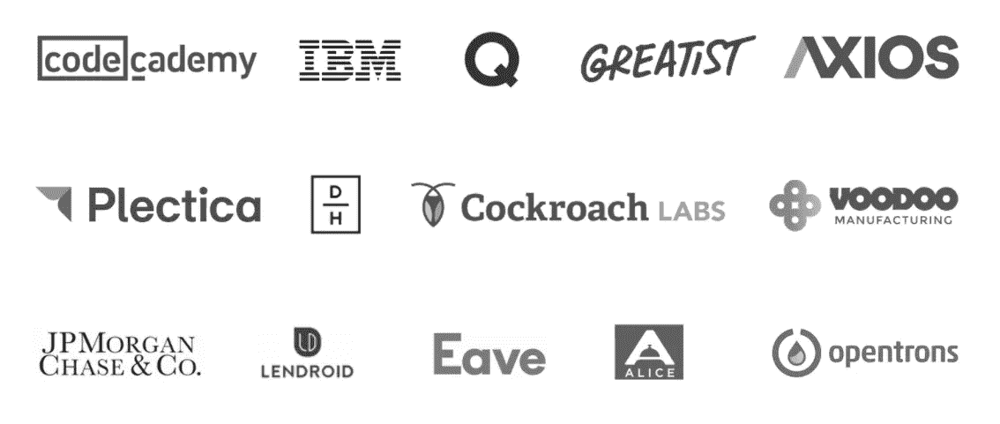](https://medium.com/u/77c5a00639bc#YouTheRealMVP
<figure class=)

## [决赛成绩](https://medium.com/u/77c5a00639bc#YouTheRealMVP
<figure class=)

[在 1 月 20 日至 21 日期间，我们有 53 人参与了产品挑战。每位参赛者只有三(3)个小时的时间来回顾提示，制定计划，并进行演示以传达他们的想法。](https://medium.com/u/77c5a00639bc#YouTheRealMVP
<figure class=)

[每份提交的作品都经过至少两名评委的评审，并确定得分最高的作品(针对难评分者和易评分者进行标准化)。](https://medium.com/u/77c5a00639bc#YouTheRealMVP
<figure class=)

[因为我们强调盲检，所以除了候选人的作品，评委们没有其他的判断依据。我们甚至用《星际迷航》中的星球来给这些候选人起代号，这样他们的种族和性别就被隐藏了。](https://medium.com/u/77c5a00639bc#YouTheRealMVP
<figure class=)

[确定了前 14 名竞争者，这代表了前四分之一的完成者。](https://medium.com/u/77c5a00639bc#YouTheRealMVP
<figure class=)

[我们让所有的评委仔细检查前 14 名选手，他们一起独立投票选出他们的大奖和一等奖得主。到目前为止，其中一个项目经理已经通过比赛被雇主雇佣了。](https://medium.com/u/77c5a00639bc#YouTheRealMVP
<figure class=)

## [分析我们的最佳完成者](https://medium.com/u/77c5a00639bc#YouTheRealMVP
<figure class=)

[我很乐意告诉您为什么我们所有的顶尖选手(所有竞争对手中的前 25%！)都很棒，为了简洁起见，我将只讨论我们的前四名。](https://medium.com/u/77c5a00639bc#YouTheRealMVP
<figure class=)

*   [**🏅一等奖:底栖生物。**这位竞争对手提出了一条面向音乐节的新产品线。我们的评委觉得有一点跳跃，希望了解更多关于商业模式的细节。也就是说，他们非常清楚地展示了特性集，并对 MVP 进行了工作/影响评估。他们的成功关键绩效指标也考虑周全，总体而言，这一概念很强。](https://medium.com/u/77c5a00639bc#YouTheRealMVP
<figure class=)
*   [**🏅一等奖:奥娜拉。**该竞争对手提出了一条围绕豪华公寓的新产品线。评委们认为他们为新市场做了一个很好的案例，并欣赏用户角色(即使他们可能是根据 3 小时的时间表编造的)。该演示还包括对收入模式的良好思考，并很好地使用了演示模板，尽管项目计划可以使用更多的细节。](https://medium.com/u/77c5a00639bc#YouTheRealMVP
<figure class=)
*   [**🏅一等奖:Finnea Prime**——这位竞争对手提出了一个围绕游轮的新产品线。该演示介绍了一些关于不同组织如何使用面部识别的可靠研究，并包括对不同市场机会的 2x2 矩阵分析。也就是说，实际的游轮提案，尽管很有创意，却没有得到充分的论证，产品计划也很简单。](https://medium.com/u/77c5a00639bc#YouTheRealMVP
<figure class=)
*   [**🏆大奖:Talax。**我们的大赢家选择了坚守银行市场。他们对最初试点失败的原因提出了深思熟虑的想法，并围绕客户细分和清晰的产品概念进行了扎实的思考。他们也是少数几个确定项目风险以及如何减轻风险的人之一。唯一真正的丁在这一个是甲板上是极其沉重的文字与很少的视觉介绍-但由于重点是他们的想法的力量，这最终没有伤害 Talax 太多。](https://medium.com/u/77c5a00639bc#YouTheRealMVP
<figure class=)

## [所有演示文稿](https://medium.com/u/77c5a00639bc#YouTheRealMVP
<figure class=)

[下面你可以看到我们所有顶尖选手的](https://medium.com/u/77c5a00639bc#YouTheRealMVP
<figure class=)[排行榜](https://airtable.com/shrTM4eHcbmsmg8Z5)。有兴趣见见他们吗？在 team@headlightlabs.com 给我们发一封信，附上你的公司和相关的职位描述，我们会保持联系的！

# 经验教训

我们开始了这次旅程，想知道是否有可能为产品经理举办一场黑客马拉松式的比赛，我想答案是:**肯定的！**

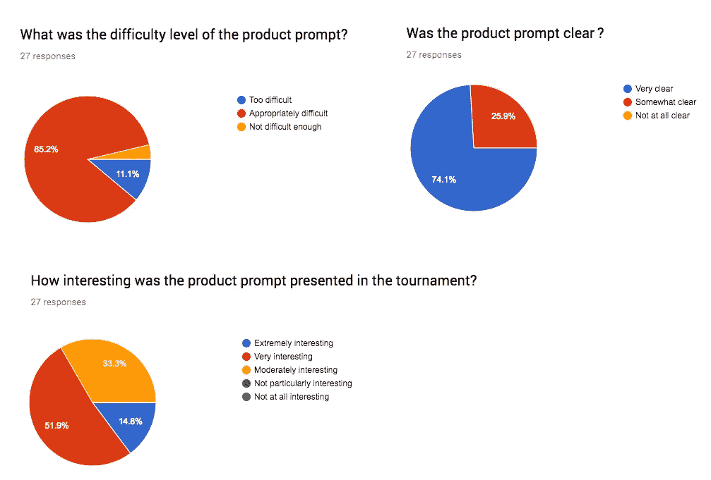

总的来说，我们的竞争对手认为产品提示是清晰的，具有适当的挑战性和趣味性。也就是说，我们仍有可以改进的地方:

1.  给人们更多的时间/灵活性。我们想给这个挑战与[黑客马拉松](https://hackernoon.com/tagged/hackathon)一样的时间压力。三个小时显然是很紧的时间，我认为这会使人紧张。我们也可以延长你的比赛时间，从周末开始。我给许多从来没有提交过任何东西的人写了一张便条，绝大多数的回复表明，那个周末发生了一件意想不到的事情，使他们无法参加比赛。我们的[工程锦标赛](https://www.headlightlabs.com/tournament/engineering-nyc-apr-2018)将时间延长至 4 小时，并将开放天数(周五至周一)增加一倍。
2.  **给评委更多语境。**我们试图让我们的评委了解提交材料的范围，并认为我们的标题/评估标准是明确的，但一旦他们真正开始评分，他们发现很难确定实际分数。有时一个演示的商业思维对高级项目经理来说是 3 星，但对初级项目经理来说是 5 星。
3.  人们渴望得到反馈。作为一个两人团队，我们试图做很多事情，包括与雇主介绍顶级完成者、在 Headlight 平台上支持我们的用户，以及与投资者交谈。也就是说，让我感到震惊的是，有多少参赛者一直在问他们什么时候会收到评委的反馈(我们必须组织和整理这些反馈)，还有多少人打开并点击了我们的顶级选手的演示文稿。很明显，了解他们如何改进(以及研究顶尖选手做了什么)是许多人参赛的关键原因。
4.  **雇主需要便利和背景。**由于糟糕的雇主 UX(实际上是一个带链接的电子表格)和对我们的候选人没有足够的背景知识，只有 5 名雇主真正花时间审查了所有的候选人并要求介绍。这就是为什么我做了 Airtable 来更好地展示作品。我们还将要求优秀者写一份简短的个人陈述，说明他们的职业目标是什么，以帮助雇主了解他们对下一份工作感兴趣/期待什么。

总而言之，产品锦标赛需要做很多工作，但我真的很高兴我们能够完成它。最好的反馈可能是，81%的竞争对手会向他们的同事/同行推荐这样的东西。

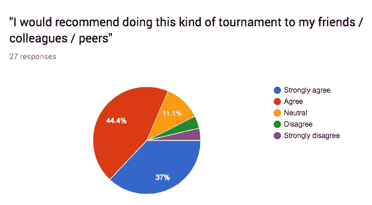

我们很高兴能够将我们从这场比赛中学到的东西应用到我们的下一场比赛中——2018 年 T4 纽约工程锦标赛。

*如果你对更好的现场面试和减少筛选过程中花费的时间感兴趣，请查看* [*大灯*](https://www.headlightlabs.com) *。请把这一块👏这样别人也能找到！*

*有想法、问题、反馈吗？在*[*@ Jason Shen*](https://www.twitter.com/jasonshen)*找我。*

# 进一步阅读

 [## 参加 2018 年纽约工程锦标赛

### NYC 工程锦标赛是一项针对 fullstack 和移动开发人员的在线编程活动，将于 2018 年 4 月 20 日至 23 日举行…

www.headlightlabs.com](https://www.headlightlabs.com/tournament)  [## 现在是招聘劳动力杂志的比武时间

### 忘记简历吧。候选人挑战是发现顶尖人才的新工具。黑客马拉松和新兵训练营是……

www.workforce.com](http://www.workforce.com/2018/03/01/tourney-time-hiring/)  [## 设计更好的外卖

### 如何让带回家的作业对雇主和候选人来说更加公平、愉快和有效

medium.com](/headlight/designing-better-take-homes-f892cdd4317c)  [## 产品管理生活-黑客正午

### 产品管理处理确保产品发货的所有废话。项目经理负责战略…

hackernoon.com](https://hackernoon.com/product-management-life/home)