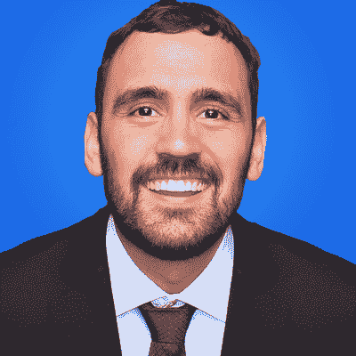
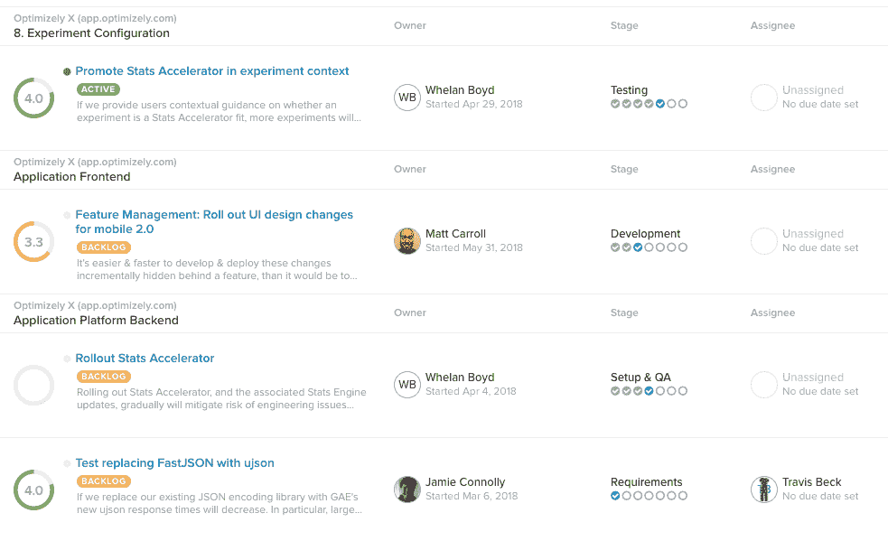
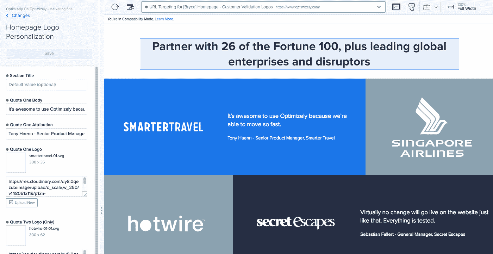

# 尝试一个更好的网站

> 原文：<https://medium.com/hackernoon/experimenting-your-way-to-a-better-performing-website-15115aba3e3c>

*今天，我们将与*[*Optimizely*](http://bit.ly/2zrY2Ui)*产品管理总监、*[*Jon no ronha*](https://blog.optimizely.com/author/jonnoronha/)*一起探讨数据实验、Optimizely 的产品开发，以及他自己在网站实验空间的职业历程。Optimizely 是数字体验优化领域的全球领导者，允许企业通过其一流的实验软件平台大幅提升其数字产品、商业和活动的价值。*

[David](https://medium.com/u/7f91547ce9c9?source=post_page-----15115aba3e3c--------------------------------):**Optimizely 的规模和范围是什么？**

乔恩:Optimizely 是世界上最大的在线实验平台，迄今为止已经运行了超过 100 万个实验，并且每天都有 600 个新的实验开始。我们为超过四分之一的财富 100 强企业提供 A/B 测试和特性标记，包括微软、Visa 和惠普等公司。我们还为 Blue 围裙、Sonos 和 Missguided 等数字颠覆者提供应用实验。有可能每天你浏览互联网，你都会遇到上百个由 Optimizely 驱动的不同实验。

**“双样本假设检验”可以追溯到 1908 年(** [**根据维基百科**](https://en.wikipedia.org/wiki/A/B_testing) **)，谷歌工程师在 2000 年进行了他们的第一次 A/B 检验。Optimizely 年开始，你 2014 年加入。你能给我们介绍一下你如何看待互联网上 A/B 测试的历史和未来吗？**

> 我可以追溯到更远——在艾萨克·牛顿之前，科学方法就已经推动了人类的进步！在线实验只是将同样的思维模式应用于产品开发和网站设计。更让我吃惊的是，它花了这么长时间。正如你所指出的，自从谷歌进行第一次 A/B 测试以来，已经过去了将近 20 年。

但在 2018 年，大多数公司仍然没有对他们的大多数关键决策进行试验——他们通常被亚马逊和网飞这样的少数公司击败，这些公司以坚持不懈地进行试验而闻名。

Optimizely 的使命是通过将谷歌级别的实验技术带给其他人来改变这种平衡。我们已经相当成功了:在过去的十年里，大多数在线企业已经开始在网上进行试验，那些还没有这样做的企业意识到他们已经落后了。有趣的是，在线 A/B 测试主要是在营销团队中开展的。现在，在电子邮件主题、广告文案和登陆页面布局上进行试验以提高转化率已经成为惯例。

我认为未来几年更大的趋势是实验扩展到产品和工程团队。顶级科技公司已经有了一种模式，即每一项新功能都是作为实验推出的，但我们开始看到这种思维模式在更传统公司的小型初创公司和技术团队中有所发展。我认为在几年内，每个有能力的产品团队都将采用[功能标记](https://www.optimizely.com/resources/drive-quality-velocity-feature-flags/)并在发布后试验他们的功能。

**在 Optimizely 的 4 年里，你最自豪的产品作品是什么？**

当我加入时，Optimizely 已经有了一个强大的产品，但它专注于一个非常特殊的实验者:一个半技术性的独狼，运行零星的增长 A/B 测试。我们雄心勃勃，要扩展到更大的团队，在他们产品堆栈的所有部分进行更基础的实验。因此，在 2016 年，我们彻底改造了我们的平台，以适应拥有更现代化网站和应用的企业团队的需求。结果是 [Optimizely X](https://blog.optimizely.com/2016/09/16/optimizely-x-experimentation-platform/) ，一款完全重新设计的产品，为营销人员和开发者打造。看到这项产品工作转化为世界上一些最重要的企业的文化变革，真是令人惊讶。

你认为 Optimizely 对互联网的影响是什么？

直到几年前，唯一进行大量实验的网站是脸书或亚马逊这样的科技巨头。这些公司建立了一种实验文化，这种文化让他们能够颠覆一个又一个行业。我认为公平竞争是最理想的。我为我们通过实验帮助标志性公司保持竞争力而自豪。例如，我们通过测试和个性化付费墙体验，帮助《纽约时报》实现了重大的数字转型，并成为数字订阅领域的领导者。我还对我们如何帮助 Blue 围裙和 Rocksbox 这样的小公司发展业务和完善信息传递感到兴奋。

> 最重要的是，作为这些产品的最终用户，我对这意味着什么感到兴奋。互联网上充满了坏掉的应用程序、简基·UX 和没人要的愚蠢功能。通过帮助更多的公司进行试验，我们帮助使这些用户体验对我们所有人都更加有效。

关于数据驱动实验，你最喜欢/最不喜欢的误解是什么？

> 我讨厌在实验环境中使用“数据驱动”这个术语。除非你是方向盘后面的那个人，否则你的数据会把你直接推下悬崖。数据是告知权衡和了解客户的工具，但它不能替代愿景或战略。你应该是数据知情的，而不是数据驱动的。

有一种误解，认为实验都是微小的、渐进的变化——就像谷歌著名的为他们的链接测试 40 种蓝色。但是最好的实验实际上是大胆的——比如亚马逊引入 Prime，或者脸书建立新闻订阅。实验让你把有争议的想法从会议室带到现实世界，同时降低出错的风险。做对了，实验会让你在尝试大胆的想法时无所畏惧。

**哪些行业从 Optimizely X 平台中获得了最多的关注？我认为行为定位对于电子商务网站来说是开创性的。**

我们当然看到了零售和旅游领域的强劲增长，在这两个领域，公司可以很快看到来自实验的在线收入的显著影响。作为一个典型的例子，我们合作的一个电子商务网站重新设计了它的分类页面，转化率增加了 20%,每季度产生超过 25 万美元的额外收入。我们也看到实验在媒体公司蓬勃发展，它可以应用于从应用程序设计到编辑内容到订阅流和广告的一切。

最近，我注意到金融服务和食品饮料等行业的增长更多。这两个行业都有强大的实体存在，但并不总是转化为 web——但我们看到移动领域的采用迅速增长，在移动领域，实验对于改善用户体验和降低开发风险都是必不可少的。

**在你的系列文章** [**产品实验陷阱**](https://blog.optimizely.com/tag/product-experimentation/) **中，你讨论了选择一个“北极星指标”，以及在 Bing 工作时选择一个错误指标的代价(搜索查询总数)。承认你的团队的假设是错误的有多难？以及车队是如何重拾对一颗新北极星的信心的？真正的北极星度量标准可能存在吗？**

选择正确的指标对于有效地进行实验至关重要。两家业务类似的公司，比如 Airbnb 和 Booking.com，通过针对不同的事情进行优化，最终可能会获得完全不同的用户体验。正如我在文章中描述的，Bing 花了几年时间才意识到我们在为错误的结果进行优化——当真正的用户想要减少搜索时，却推动了更多的搜索。

> 但事实是，很容易看出哪里出了问题，因为我们的定量数据与实验的定性反馈不符。

这是一个强有力的暗示，表明有些东西不对劲，追踪这个链条清楚地表明，我们需要一个更符合用户期望的指标。这是为什么不能“数据驱动”的另一个例子，你必须驱动数据！

我认为大多数团队都没有一个固定的衡量标准。相反，我们应该选择几个不同的指标，并每 6-12 个月重新评估一次，以确保它们仍然符合目的。当你改变度量标准时，不要忘记重新测试一些旧的想法！这是你能做的最便宜的实验。

你在微软工作了两年半。你为什么决定离开微软去 Optimizely？

我在微软的时光直接展示了实验的力量。我在那里的时候，我们从每周只运行少量的 A/B 测试到数百个实验，在这个过程中转变了公司的整个文化。我看到了在线实验如何推动敏捷开发的更广泛趋势，并弯曲业务的增长曲线。

我也看到了有多难。在我们的内部平台上构建实验花费了巨大的努力，并且我们在这个过程中遇到了很多统计、性能等方面的问题。我想，“每个人都应该尝试，但如果这么难的话，他们是不会尝试的。”当我发现 Optimizely 时，这是一个很容易的事情——这是一个加入一家成长中的公司，致力于解决我已经热衷的问题的绝佳机会。

**在您的客户中，您能分享一个产生重大结果的意外变化的轶事吗？**

有一种误解，认为 A/B 测试就是寻找“一个奇怪的技巧”来获得大的结果，比如改变按钮的颜色和加倍你的转换率。也有类似的真实实验，但它没有抓住重点。最大的好处来自于许多实验的*复合*影响，以及它们促成的无畏发展文化。

这种集体影响可能非常大。我们的一位客户计算出，在第一次 500 次实验后，他们的收入增加了 2100 万美元。

> 不要问，“什么样的实验会对我产生重大影响？”我建议改为问:“我们如何扩展到 100 个实验以获得有保证的收益？”

[**Optimizely X 全栈**](https://www.optimizely.com/products/full-stack/) **是针对产品开发团队的 A/B 测试和特性管理。你见过的客户基于优化构建的最先进的算法有哪些？**

全栈非常适合测试后端更改。我们已经看到它被有效地用于产品分类、搜索算法、动态定价和报价。也许最常见的是推荐算法。几乎每个电子商务网站都有产品推荐，但我总是惊讶地发现它们很少经过测试。我们已经运行了几个实验，在这些实验中，由于分散用户体验或低质量的结果，推荐实际上会降低转化率。相反，我们已经看到，测试位置、算法、标签和推荐数量可以为每个访问者带来 5-10%的增量收入！

互联网上的个性化会走多远？我访问的每个网站会不会很快说，“你好，大卫，你今天看起来很帅”？

个性化是一个热门话题，但我认为炒作大多没有抓住重点。“你好，大卫”并没有对用户体验产生有意义的影响，如果有什么影响的话，那就是看起来令人毛骨悚然或具有侵犯性。我是做搜索出身的，考虑的是相关性。我希望看到更多的互联网类似于网飞的显示列表或脸书的新闻提要。每个来到这些应用程序的用户都会看到为他们量身定制的不同东西，但不会尖叫“这是个性化的！”。实现这种相关性的关键是不断地对算法进行实验，这些算法为这些体验和围绕它们的用户体验提供动力。

**迈克尔菲尔普斯是今年 Opticon 18** **主题演讲的有趣选择。但是我想他的训练是数据驱动的…你认为他会说什么？**

实验和个性化是流行语，但真正的重点是胜利！迈克尔·菲尔普斯就是一个活生生的例子，说明了获得第一意味着什么。黄金和青铜之间的差异可以归结为仅仅几毫秒。我们每天都在我们的客户身上看到这一点:市场领导者和其他人之间的差异可以归结为对用户体验的一些有影响的变化。

**我们可以看一下 Optimizely 仪表盘上 Optimizely.com 正在使用的产品的截图吗？**

当然，以下是我们在自己的用户身上进行的一些实验:

这里有一个活生生的例子，展示了我们如何个性化我们自己的主页——在这种情况下，是给一个来自旅游业的潜在客户的:

你认为什么样的心态或特质会推动有效的产品开发实验？

你必须对你的用户非常好奇，并且对他们如何使用你的产品持开放态度。你必须怀疑传统智慧和对数据的天真解读。最重要的是，你必须有信念。

> 把实验看作是建立新的和大胆的东西的工具——它是让你尝试新事物而没有太大风险的安全网。所以要无所畏惧！

**你目前招聘的职位是什么？组建产品团队时，你看重哪些特质？**

我们一直在寻找优秀的工程师，我们正在旧金山和奥斯汀招聘！我们还在旧金山、纽约、阿姆斯特丹、伦敦、科隆和慕尼黑招聘一系列面向客户的职位，如销售工程、客户成功和技术支持。[查看我们的招聘页面](https://www.optimizely.com/careers/)了解更多信息。如果你想了解更多关于我们产品团队的文化，看看我们的[工程博客](https://medium.com/engineers-optimizely)的 Q &和我们的一些开发人员。

## 在 [Twitter](https://twitter.com/thatsjonsense?lang=en) 或 [LinkedIn](https://www.linkedin.com/in/jonnoronha/) 上与乔恩联系。

> [**Optimizely**](http://bit.ly/2zrY2Ui) 是数字体验优化领域的全球领导者，允许企业通过其一流的实验软件平台大幅提升其数字产品、商业和活动的价值。

*披露:* [***优化地***](http://bit.ly/2zrY2Ui) *此前曾赞助过黑客正午。*