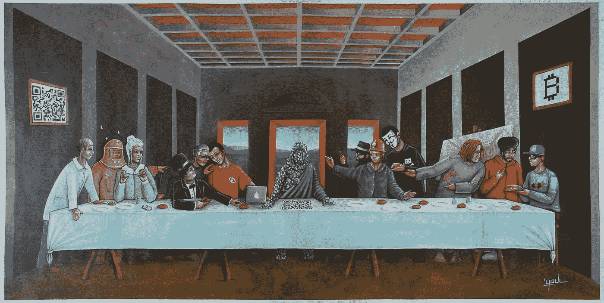
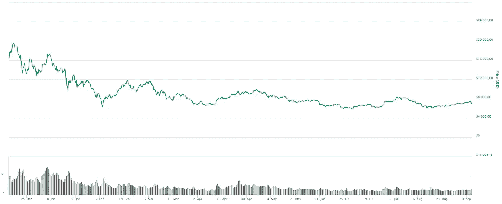

# 行业专家对比特币价格的 16 种预测

> 原文：<https://medium.com/hackernoon/experts-forecast-bitcoin-will-rise-by-2019-f4af8807036b>

了解 2019 年的比特币汇率可以让你规划加密货币的投资，并从中获取最大利润。2019 年，我们可以期待比特币的价格是多少？专家怎么说？投资者应该关注什么？

Source: [https://www.deviantart.com/youldesign/art/Last-Supper-Bitcoin-Project-440037908](https://www.deviantart.com/youldesign/art/Last-Supper-Bitcoin-Project-440037908)

2017 年 12 月，比特币的成本超过了 2 万美元大关，这使得即使是那些之前对加密货币没有兴趣的人也开始考虑投资它。专家们宣布了虚拟货币的美好未来。许多人对 2018 年的比特币汇率做出了积极的预测，保证了 BTC 价格的未来上涨，对采矿的兴趣不断增加，以及不同国家对地下墓穴的可能认可。

然而，在 2018 年初，一些意想不到的事情发生了——利率大幅下降。到 2 月初，BTC 的价值已经跌破 7000 美元。尽管涨幅不大，但虚拟硬币的价格受到了熊市趋势的冲击，这严重警告了潜在和当前的投资者。到了仲夏，价格趋于平稳，2018 年 7 月，终于出现了看涨趋势。

Source: [https://coinmarketcap.com/](https://coinmarketcap.com/)

这种波动性给预测 2019 年比特币的美元汇率带来了许多困难。普通投资者想知道如何进行最好——他们应该持有虚拟货币以期待价格上涨吗？还是在 BTC 价格暂时上涨时卖出？

我与专家和行业领袖交谈过，令我惊讶的是，几乎所有人都预测，到 2019 年 1 月 1 日，比特币的汇率将几乎增加两倍。总的来说，我收到了 16 位专家的内部消息，平均来说，他们预计价格会增长到 21，000 美元。一般来说，预测从每个比特币 7700 美元(T2)到难以想象的 15 万美元(T4)不等。而且奇怪的是，没有一个受访者预计汇率会下跌。

应该指出的是，16 位专家中有 6 位直接将积极的预期与今年秋天 SEC 即将做出的比特币 ETF 决定联系起来。比特币 ETF 是一种交易基金(交易所交易基金)，将比特币作为基础资产，即买入比特币，然后将其份额出售给投资者。

投资者将不会直接使用数字货币，这意味着他们的资产将得到可靠的保护。与多次被黑客窃取数亿美元的交易所不同，比特币交易所交易基金的发行者有责任照看客户的资产并为其提供保险。

比特币交易所交易基金的推出预计将导致大型机构投资者，如投资和养老基金，开始投资于这一领域。这些基金现在被降级为将资本投资于受监管领域的资产。

# 行业专家对比特币价格的 16 种预测

1。【Bitcoin.com】**:**

> 作为一名业余交易员和自称的市场心理学家，由于强大的市场力量和价格图表模式，我对 1 月份比特币价格的最佳猜测是“大幅上涨”。爆发似乎迫在眉睫，这将是一个非常强大的牛市。到 1 月 1 日，BTC 为 10，500 美元，BCH 为 1，500 美元。

2。 **Khaled Khorshid，**[**Treon ICO**](https://www.treon.io/)**:**联合创始人

> 在我看来，我们没有看到 BTC 被抛弃，也没有看到它自 8 月 15 日以来突破了关键的阻力点。我相信，如果美国证交会在 9 月底之前批准 BTC ETF，我们将看到价格涨势在 2018 年底前达到约 2 万美元的历史高点。

3。 [**亚历山大诉范·迪吉尔**](https://www.linkedin.com/in/avandijl/) **，金融专家:**

> 今年年初，我预测比特币价值为 15 万英镑。虽然这在今天看起来很多，但我相信在(非常)近的将来会发生一些坚定的价格变动。会有大事发生，也许大型零售商会接受比特币，也许成人广告会接受比特币作为支付。会有大事发生，导致价格再次暴涨。150.000 是我对 1 月 1 日的预测。

4。 **Ronald Shi，**[**Virtuse Exchange**](https://virtuse.com/)**:**

> 比特币通常被称为“数字黄金”，我们经常发现两者之间的相似之处。如今比特币的波动性和价格走势类似于上世纪 80 年代金价的走势。我们认为，比特币价格正处于熊市后期，如果一只比特币 ETF 在 10 月前获得美国证交会批准，比特币人气将会逆转，重新回到 10，000 美元至 12，000 美元的区间。

5。**[**PlayChip**](https://www.playchip.global/)**:**区块链负责人卢克·隆布**

> **2018 年全年，我们一直处于强烈的看跌趋势中。机构资金一直在低点积累，我预计在未来 6-9 个月内 ETF 会有一些积极的发展。如果我们能够打破这波熊市，突破 8500 美元，到 2019 年 1 月，比特币应该会是现在的两倍左右= 12600 美元。**

**6。**[**阿里安支付系统**](http://www.aliantpayments.com/) **:** 创始人兼首席执行官埃里克·布朗****

> ****我对 2019 年 1 月 1 日比特币价格的预测是 23000 美元。我们实际上曾经处于这个价格，我们知道如何让它回到那里。我们在很大程度上处于这种货币的初级阶段，随着技术的发展，这种货币的价值也在增长。未来是技术，比特币是技术的货币。****

****7。 **汉斯·巴特尔，**[**Incremint**](https://incremint.io)**:**联合创始人兼首席财务官****

> ****1 万美元——“经过一段时间明显的疯狂猜测，我们现在看到，在实际商业应用中，对我们的比特币托管服务的请求有所增加。这将为支撑比特币的价值提供支撑****

****8。 **Sam Russell，**[**wor bli**](https://www.worbli.io)**:**联合创始人/战略与创新执行副总裁****

> ****如果比特币的基本面在 9 月份随着美国证券交易委员会(SEC)即将批准的 ETF 提案而发生积极变化，我们可以预计购买压力将增加，推动价格升至之前的市场结构高点 11400 美元，测试该区域的阻力。如果发生这种情况，比特币的趋势将会发生有效的改变。我猜是 17，000 美元。****

****9。 **PK 银行，联合创始人**[**c blocks**](https://www.cblocks.io)**:******

> ****使用一个非常保守和合理的框架，很容易看出相对于其历史平均水平，比特币目前被低估了。比特币的交易价格通常是其 200 天移动平均价格(200 DMA)的 1.30 至 1.75 倍。当比特币均值回复到 1.25–1.40 200 DMA 时，在未来 4–5 个月内达到 9420 很容易。****

****10。 **柯林斯布朗，** [**联合创始人市场协议**](http://www.marketprotocol.io/) **:******

> ****14，000 BTC/美元。随着价格下跌，比特币相对于市场其他部分表现出了巨大的弹性。随着我们继续度过这个熊市，情绪最终会转变，BTC 将是短期内最大的捐助者。****

****11。 **凯尔·福尼尔，** [**的密码分析师，密码狂**](http://cryptomaniaks.com/) **:******

> ****2019 年 1 月 1 日，我预计比特币的价格约为 1 万美元。****
> 
> ****比特币和加密市场经历了牛市和熊市的清晰循环。以太坊的创造者 Vitalik Buterin 今年 7 月 31 日在推特上说，我们已经处于这个加密泡沫的末端。比特币将很快开始逐渐回升。****

****12。 [**詹姆士**](https://www.linkedin.com/in/james-stefurak-cfa-5168814/) **，国君研究创始人:******

> ****O 你的年终比特币目标是 7700 美元。这种需求有两个主要来源****
> 
> ****1)关税紧张增加了对进出口业务更快执行的需求****
> 
> ****2)比特币交易所交易基金(ETF)不可避免地获得批准，可能在 12 个月内。****

****13。 **凯尔·阿斯曼，** [**BX3 资本**](https://bx3.io) 联合创始人****

> ****我相信比特币将在今年 1 月达到 24500 美元。当比特币 ETF 在 9 月底获得批准时，比特币应该在 7，000 美元左右，并将像黄金 ETF 获得批准时一样上涨约 350%。整个 2019 年，比特币的价格将继续走高。****

****14。 **山姆·奥姆斯特德，顾问为** [**佩里肯**](https://www.pelicoin.com) **:******

> ****2019 年初，比特币预计将徘徊在每枚 1 万美元以上。随着像委内瑞拉这样的全球货币市场出现恶性通货膨胀，对比特币和其他加密货币的信心将增加并抬高价格。****

****15。 **大卫·汉森，游戏发行平台** [联合首席执行官**超**](https://ultra.io/)****

> *****我认为比特币的价格将略有回升，到 2019 年 1 月将升至 8500 美元。*****
> 
> *****继美国证券交易委员会(SEC)上月否决文克莱沃斯交易所交易基金(ETF)后，比特币和其他加密货币的价格下跌，但其影响不会持久。同样，我相信 SEC 将在今年剩余的时间里拒绝所有的 ETF，但这不会导致比特币的价格崩盘。*****
> 
> *****事实上，这将有利于投资者，鼓励他们回归基本面，着眼长远，而不是投机于短期。*****
> 
> *****在 5400 美元触底后，比特币将横盘几个月，然后缓慢回升，爬回 8500 美元。*****

****16。**[**首席执行官兼联合创始人丹尼·斯科特**](https://www.coincorner.com/) **:********

> ****根据我们现有的数据并结合行业趋势，我们预测比特币的价格将在 2019 年 1 月 1 日达到 15000 美元左右。我们持这种观点，因为该行业正以健康的速度增长，零售市场稳步发展，高净值个人和机构的新兴趣不断增加。****