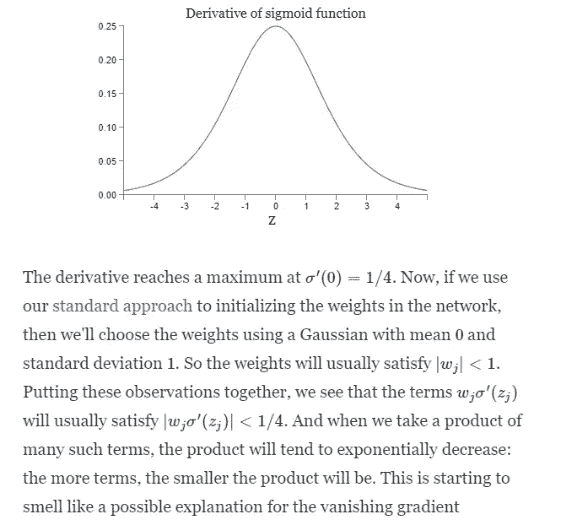

# 爆炸和消失的梯度问题:真相背后的数学

> 原文：<https://medium.com/hackernoon/exploding-and-vanishing-gradient-problem-math-behind-the-truth-6bd008df6e25>

**Gamma Ray burst**! source: Google

你好，星尘！今天我们将看到爆炸和消失梯度问题背后的数学原因，但首先让我们简单地理解这个问题。

通常，当我们使用梯度下降通过反向投影训练深度模型时，我们计算输出 w.r.t .到权重矩阵的梯度，然后从相应的权重矩阵中减去它，以使其(矩阵的)值更准确，从而给出正确的输出

***但是如果梯度变得可以忽略不计呢？***

当梯度变得可以忽略时，从原始矩阵中减去它没有任何意义，因此模型停止学习。这个问题被称为消失梯度问题。

我们将首先在头脑中想象这个问题。我们将使用具有 1、2、4 和 5 个隐藏层的 MNIST(你知道这一点)数据集来训练深度学习模型，并查看使用不同架构对输出的影响(准确性并不总是增加！😵).

**DNN architecture with 3 hidden layers**

你可以在这里获得完整的代码。对于这篇文章，我只是使用代码的快照。我用过 ***深度学习工作室的 Jupyter lab*** *来执行代码。如果你不知道这个令人敬畏的深度学习工具，可以看看我关于这个*的文章。

 [## 鸢尾属分类|DeepCognition| Azure ML studio

### 界:植物界分支:被子植物目:天冬目:鸢尾科亚科:环烯醚萜族:环烯醚萜属:鸢尾

towardsdatascience.com](https://towardsdatascience.com/iris-genus-classification-deepcognition-azure-ml-studio-4b930f54435a)  [## 主页

### 我们想邀请您在 3 月 26 日至 29 日的 GPU 技术大会上加入 Deep Cognition 的团队，展位号为 1035…

deepcognition.ai](https://deepcognition.ai/) 

> **带 1 个隐藏层的模型。**

第 1 行:784 表示输入神经元，30 表示隐藏层 1 中的神经元，10 表示输出的数量。

**Accuracy of the model with 1 hidden layer.**

*这里的术语‘第 I 个’隐藏层的权重矩阵的长度***是第一个隐藏层的权重矩阵的大小。可以认为是特定隐藏层学习特征的速度(大致)。
我们将使用这个术语来比较不同模型的不同隐藏层的速度。**

***第一个模型中第一个隐藏层的速度:0.103165(记住这个！)***

> ***有 3 个隐藏层的模型:***

**

***DNN with 3 hidden layers.***

*观察结果:*

*   *第一个隐藏层的学习速度:0.09983(小于先前模型的第一个隐藏层的速度)。*
*   *第 I 层的学习速度一般大于第(i+1)层。*

> *让我们继续到 MNIST 的 4 层和 5 层*

****

*LEft **:MNIST with 4 hidden layers,** Right**:MNIST with 5 hidden layers.***

*第 I 个隐藏层的学习速度随着我们拥有更多更深的模型(即具有更多隐藏层的模型)而不断降低。*

*在 5 个隐藏层中，我们甚至失去了模型的准确性。*

> ***数学上的原因。***

*考虑一个具有 4 个隐藏层的神经网络，每个矩阵中有一个神经元。*

**

***Neural Network***

*上述神经网络的计算图为:*

**

***Forward Propagation***

*在前向传播中，我们只是将输入与权重矩阵相乘，并添加偏差，如上所示。然后我们找到输出的 sigmoid。*

**

***Backpropagation.***

*在反向投影过程中，为了使我们的输出更加精确，我们找到了输出相对于不同权重矩阵的导数。假设我们想求 C(输出)w.r.t 权矩阵(b1)的导数。*

*这将包括的术语有:*

**

***Neural Network***

*乙状结肠'(z1)，乙状结肠'(z2)..etc 不到 1/4。因为 sigmoid 函数的导数小于 1/4。见下文。使用高斯方法将加权矩阵 w1、w2、w3、w4 初始化为具有平均值 0 和标准偏差 1。因此||w(i)||小于 1。因此，在导数中，我们将小于 1 和 1/4 的项相乘。因此，将这样的小项相乘大量次，我们得到非常小的梯度，这使得模型几乎停止学习。*

*原因在于，如果我们具有比起始隐藏层更深的模型，则学习速度会更低:在反向投影期间，当我们到达起始隐藏层时，我们移动得更深，因此涉及更多这样的项，这使得梯度变小。*

**

***Read it!***

*类似于爆炸梯度的情况，如果我们用非常大的值初始化我们的权重矩阵，那么导数将非常大，因此模型将具有非常不稳定的训练。*

*感谢阅读..伙计们。*

*如果你觉得这篇文章有帮助👏分享一下。*

*在 **LinkedIn** 和 **medium** 上关注我，订阅**我的 YouTube 频道**:*

* [## Manik Soni -机器学习实习生-Ace2three.com 印度信息技术有限公司负责人| LinkedIn

### 查看 Manik Soni 在全球最大的职业社区 LinkedIn 上的个人资料。Manik 有 3 个工作列在他们的…

www.linkedin.com](https://www.linkedin.com/in/maniksoni/)  [## 马尼克索尼培养基

### 阅读媒介上的 Manik Soni 的作品。机器学习研究员。每天，Manik Soni 和成千上万的其他人…

medium.com](/@maniksoni653) 

**订阅我的 YouTube 频道:**

 [## 人工智能与深度学习者:人工智能 _ 日常

www.youtube.com](https://www.youtube.com/channel/UCNrS8D0rHKh8k2SU8oDY4Hg?view_as=subscriber?&ab_channel=AIandTheDeepLearner)*