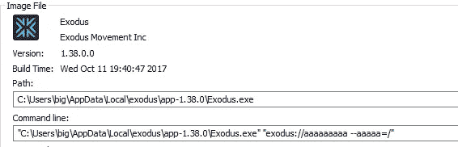

# 在《出埃及记》钱包中开发电子 RCE

> 原文：<https://medium.com/hackernoon/exploiting-electron-rce-in-exodus-wallet-d9e6db13c374>

在浏览 Twitter 时，我注意到协议处理程序中的 [ElectronJS 远程代码执行漏洞](https://electronjs.org/blog/protocol-handler-fix)。听起来很严重。正如官方描述中所述，应用程序易受攻击足以将其自身注册为某个协议的默认处理程序。不久前，我在笔记本电脑上安装了一个基于电子的应用程序，名为 [Exodus](https://www.exodus.io/) 加密货币钱包。我知道它把自己注册为*出埃及记://* URI 计划的处理者。

由于官方博客上没有关于漏洞的细节，我直接去了 electron [Github](https://github.com/electron/electron) 寻找最近的提交。接下来的[提交](https://github.com/electron/electron/commit/c49cb29ddf3368daf279bd60c007f9c015bc834c)是对漏洞的修复。最大的变化是一个新创建的文件 *command_line_args.cc* ，它实现了对命令行参数的少量检查。

[](https://github.com/electron/electron/blob/c49cb29ddf3368daf279bd60c007f9c015bc834c/atom/app/command_line_args.cc) [## 电子/电子

### 用 JavaScript、HTML 和 CSS 构建跨平台桌面应用

github.com](https://github.com/electron/electron/blob/c49cb29ddf3368daf279bd60c007f9c015bc834c/atom/app/command_line_args.cc) 

基本上，代码根据黑名单检查命令行参数。基于此，可以假设可以通过 URI 处理程序**注入命令行参数。**基于电子的应用程序基本上是一堆 Javascript 和 HTML 文件，前端由 Chromium 呈现，后端由 nodejs 呈现。Chromium 和 nodejs 被捆绑在主可执行文件中。fix commit 中的黑名单字符串是 Chromium 和 nodejs 的命令行开关。似乎要利用漏洞，我们只需要在 Chromium 或 nodejs 中找到命令行选项，就可以产生额外的进程。

为了测试是否真的可以通过协议 I 向 Exodus.exe 注入参数，我创建了 HTML 文件:

```
<!doctype html>
<script>
  window.location = 'exodus://aaaaaaaaa --aaaaa='
</script>
```

《出埃及记》钱包推出时有以下论点。



有效负载用双引号括起来。然而，双引号在作为命令行参数传递之前并没有被过滤掉或清理掉。下面允许注入额外的命令行开关。

```
<!doctype html>
<script>
  window.location = 'exodus://aaaaaaaaa" --aaaaa=bbbb'
</script>
```


对于远程代码执行，需要找到一个好的 Chromium 命令行开关来执行额外的命令。我发现第[页](https://peter.sh/experiments/chromium-command-line-switches/)包含了 Chromium 命令行开关的列表。gpu-launcher 看起来很有前途。

> —用于启动 gpu 进程的 gpu-launcher 额外命令行选项(通常用于调试)。使用 like renderer-cmd-prefix。

是时候试试了。

```
<!doctype html>
<script>
  window.location = 'exodus://aaaaaaaaa" --gpu-launcher="cmd" --aaaaa='
</script>
```


Exodus wallet 很快发布了一个更新，它是在漏洞宣布后不久发布的。此外，它通过显示消息为最终用户推送更新做得很好，然而更新不是自动的，用户仍然必须确认更新。无论如何，有很多基于电子的桌面应用程序，所以最好检查一下你的机器上是否有基于电子的应用程序，并确保它已经打了补丁。