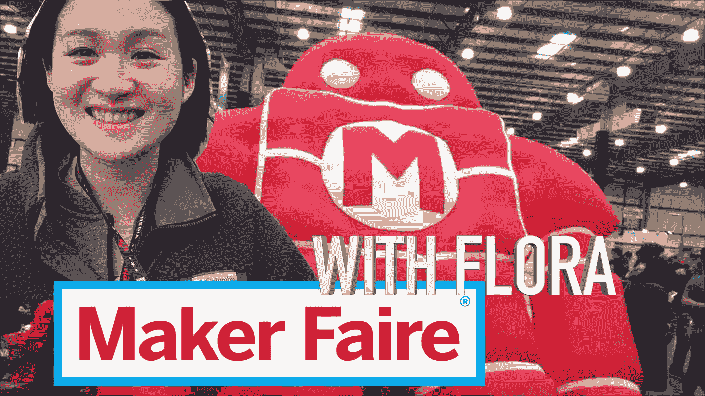

# 和我一起探索创客大会吧！[5 分钟视频]

> 原文：<https://medium.com/hackernoon/explore-maker-faire-with-me-5-min-video-cbd61ec03bd3>

我知道你们中的许多人都去过“创造者大会”。但是如果你和我一起去会更有趣！跟我一起解锁你的[创意](https://hackernoon.com/tagged/creativity)！

如果你和我一起去，会有趣得多。这个东西开启了你的全部创造力和艺术灵感。对孩子好，对成年人好，因为不管你多大，你都可以而且应该继续想象和创造！！！

创意没有边界！

面试内容:

*   纸骨架
    *3D 打印卡车传动系统模型
    *车库望远镜
    *乐高城市
    *pvc 雕塑等等！！！