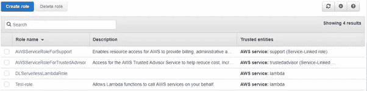
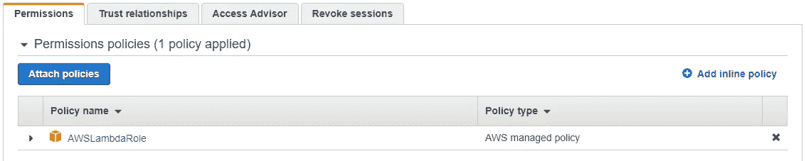

# 探索 AWS Lambda 部署限制

> 原文：<https://medium.com/hackernoon/exploring-aws-lambda-deployment-limits-38b7b9b61825>


Photo by [Ludovic Charlet](https://unsplash.com/photos/CGWK6k2RduY?utm_source=unsplash&utm_medium=referral&utm_content=creditCopyText) on [Unsplash](https://unsplash.com/?utm_source=unsplash&utm_medium=referral&utm_content=creditCopyText)

在我们上一篇文章的[中，我们探索了如何使用](https://dashbird.io/blog/machine-learning-in-aws-lambda/) [AWS Lambda](https://aws.amazon.com/lambda/) 部署机器学习模型。使用 AWS Lambda 部署 ML 模型适合于早期项目，因为使用 Lambda 函数有一定的限制。然而，如果您需要在您的机器学习项目中充分利用 AWS Lambda，这不是一个担心的理由。当使用 Lambda 函数时，开发人员总是担心部署包的大小。

让我们首先来看看 AWS Lambda 部署限制，并解决 AWS 官方文档中 50 MB 的包大小，这有点令人迷惑，因为您可以对未压缩的文件进行更大的部署。

# AWS Lambda 有以下限制。

运行时环境限制:

*   磁盘空间限制为 512 MB。
*   *默认部署包大小为 50 MB。
*   *内存范围从 128 到 1536 MB。
*   *一个函数的最大执行超时是 15 分钟*。

lambda 的请求限制:

*   请求和响应正文有效负载大小最大为 6 MB。
*   *事件请求正文最大可达 128 KB。

定义 50 MB 限制的原因是，您不能将您的部署包直接上传到 lambda，因为它的大小大于定义的限制。从技术上来说，如果您让 lambda 函数从 S3 获取部署包，限制可能会高得多。与直接上传到 lambda 或任何其他 AWS 服务相比，AWS S3 允许以高得多的部署包限制来部署功能代码。事实上，大多数 AWS 服务默认限制都可以通过 [AWS 服务限制](https://docs.aws.amazon.com/general/latest/gr/aws_service_limits.html)支持请求来提高。

然而，对于许多开发者来说，什么是实际的限制还是一个疑问。为了找到这个问题的答案，我们将通过上传不同大小的部署包来进行测试。

# 部署包

我们将使用机器学习模型作为我们的部署包，创建指定大小的随机数据来测试不同大小的限制。我们将测试文档中描述的以下限制:

**50 MB** :最大部署包大小 **250 MB** :可以压缩到部署包(未压缩)中的代码/依赖项的大小。zip/。罐子大小)

对于这个测试，我们将使用我们在[上一篇文章](https://dashbird.io/blog/machine-learning-in-aws-lambda/)中创建的机器学习模型。是基于 TensorFlow Inception-v3 模型的图像识别深度学习模型。虽然我们的数据没有这么压缩。总文件大小约为 150 MB，远远超过了指定的 50 MB 限制。

# 测试

我们直接上传到 lambda 函数来测试一下吧。以下是要遵循的主要步骤:**首先，我们要把包裹的拉链拉上。**这个 zip 包将包含我们所有的文件，例如:

*   分类 _ 图像. py
*   classify_image_graph_def.pb
*   机器学习包. zip

这个模型是专门为这个项目创建的。但是，机器学习模型可以从以下来源下载。

https://github.com/fchollet/deep-learning-models**:**

****TensorFlow** : [官方发布](https://github.com/tensorflow/models/tree/master/official)，[性能车型](https://www.tensorflow.org/performance/performance_models)， [tensornets](https://github.com/taehoonlee/tensornets)**

**2 让我们称我们的包为 MachineLearning.zip**

```
zip MachineLearning.zip MachineLearning
```

****3 现在检查我们是否可以压缩文件。****

```
$ ls -lhtr | grep zip -rw-r--r-- 1 john staff 123M Nov 4 13:05 MachineLearning.zip
```

**即使在压缩和压缩之后，整个包的大小大约是 132 MB。**

****4 为了创建 lambda 函数，我们需要创建 IAM 角色。**由于我们的主要目标是测试限制，我们将跳过角色创建过程。使用您的凭据登录 IAM 管理控制台，创建一个测试角色并附加 AWSLambdaRole 策略。**

********

****5 接下来，我们将通过**[**AWS CLI**](https://docs.aws.amazon.com/cli/latest/userguide/cli-chap-welcome.html)**创建一个 lambda 函数，并将我们的部署包直接上传到该函数。****

```
aws lambda create-function --function-name mlearn-test --runtime nodejs6.10 --role arn:aws:iam::XXXXXXXXXXXX:role/Test-role --handler tensorml --region ap-south-1 --zip-file fileb://./MachineLearning.zip
```

**用您的 AWS 帐户 id 替换 XXXXXXXXXXXX。由于我们的包大小大于 50 MB 的指定限制，它抛出一个错误。**

```
An error occurred (RequestEntityTooLargeException) when calling the UpdateFunctionCode operation: Request must be smaller than 69905067 bytes for the UpdateFunctionCode operation
```

**由于我们的部署包相当大，我们将在亚马逊 S3 的 AWS Lambda 推理执行期间再次加载它。为此，我们需要从 AWS CLI 创建 AWS S3 存储桶:**

```
aws s3 mb s3://mlearn-test --region ap-south-1
```

**这将为我们创造 S3 桶。现在我们将把我们的包上传到这个桶中，并用 S3 对象键更新我们的 lambda 函数。**

```
aws s3 cp ./ s3://mlearn-test/ --recursive --exclude "*" --include "MachineLearning.zip"
```

**一旦我们的包被上传到桶中，我们将用包的对象键更新 lambda 函数。**

```
aws lambda update-function-code --function-name mlearn-test --region ap-south-1 --s3-bucket mlearn-test --s3-key MachineLearning.zip
```

**这一次，即使在更新我们的 lambda 函数之后，它也没有显示任何错误，并且我们能够成功地上传我们的包。这意味着如果通过 S3 上传而不是直接上传，包的大小可能会大于 50 MB。由于压缩后我们的包大小约为 132 MB，我们仍然不清楚上传包的最大限制是什么。**

**为了得到最大的限制，我们将创建一个大约 300 MB 的随机数据，并通过 S3 上传，更新我们的 lambda 函数。**

```
fsutil file createnew sample300.txt 350000000
```

**这将创建一个大约 300 MB 的样本文件。我们将压缩文件，并通过 S3 再次上传。**

```
aws s3 cp ./ s3://mlearn-test/ --recursive --exclude "*" --include "sample300.zip"
```

**`aws lambda update-function-code --function-name mlearn-test --region ap-south-1 --s3-bucket mlearn-test --s3-key sample300.zip`**

**更新我们的 lambda 函数后，我们得到以下错误:**

**`An error occurred (InvalidParameterValueException) when calling the UpdateFunctionCode operation: Unzipped size must be smaller than 262144000 bytes`**

**错误描述解压缩后的包的大小应该小于 262144000 字节，大约是 **262 MB** 。我们可以注意到，这个大小比指定的可以压缩到一个部署包(未压缩)中的代码/依赖项大小的限制 **250 MB** 稍大一点。zip/。罐子大小)。因此，我们发现通过 S3 上传时，未压缩部署包的最大大小限制是 250 MB。然而，当直接上传到 lambda 函数时，我们不能上传超过 50 MB 的包。**

**这里需要注意的重要一点是，在未压缩状态下，您的代码及其依赖项应该在 250 MB 的大小限制之内。即使我们考虑更大的封装尺寸，它也可能严重影响 lambda 函数的冷启动时间。因此，对于更大的包，lambda 函数将需要更长的时间来执行。**

*** 2018 年 10 月，最大执行时间从 5 分钟增加到 15 分钟。**

***原载于 2018 年 11 月 4 日*[*dash bird . io*](https://dashbird.io/blog/exploring-lambda-limitations/)*。***