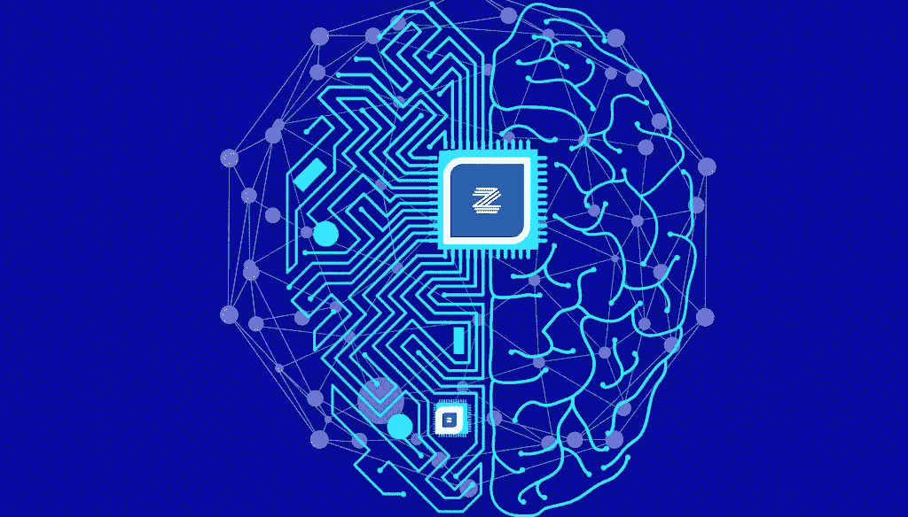
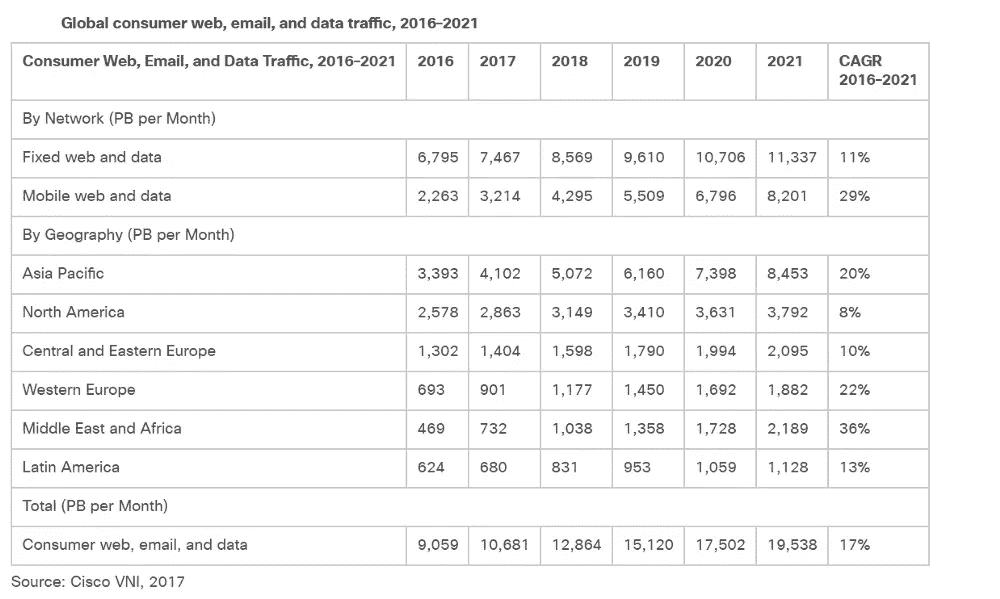
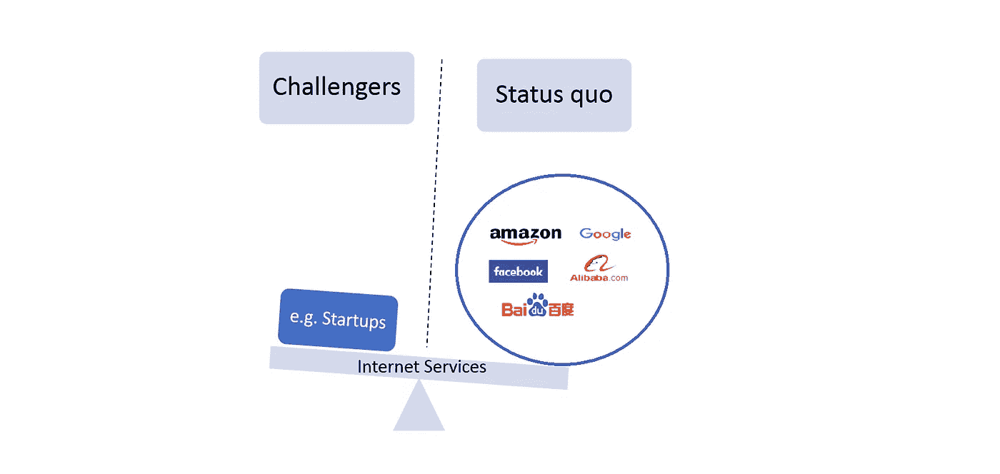

# 用同态加密探索去中心化

> 原文：<https://medium.com/hackernoon/exploring-decentralization-with-homomorphic-encryption-a8295755ba5f>

在我们生活的世界中，数据是新的石油，分布式系统和异构网络正在成为现代软件行业的规范。据估计，我们平均每天生成大约 2.5 万亿字节的数据。思科的一份[报告预测如下:](http://www.cisco.com/c/en/us/solutions/collateral/service-provider/visual-networking-index-vni/vni-hyperconnectivity-wp.html)

●到 2020 年，每两分钟就会有相当于所有电影的千兆字节(GB)通过全球互联网。

●在全球范围内，IP 流量将在 2020 年达到 511 万亿比特每秒(Tbps)，相当于 1.42 亿人每天全天同时传输互联网高清(HD)视频。

●到 2020 年全球 IP 流量将相当于每年 5040 亿张 DVD，每月 420 亿张 DVD，或每小时 5800 万张 DVD。

思科还更新了他们对[2016–2021](https://www.cisco.com/c/en/us/solutions/collateral/service-provider/visual-networking-index-vni/complete-white-paper-c11-481360.html)的全球消费者网络、电子邮件、数据流量预测。

不幸的是，今天以消费者为导向的互联网服务过于集中于少数几家公司，这些公司几乎完全垄断了地球上大多数人所体验的互联网服务。因此，在他们之间，这些公司通过直接或通过我们工作的公司向我们提供各种服务，掌握着我们的大量数据(作为消费者和员工)。

我们强烈推荐阅读 Andre Staltz 最近的一项独立研究，题为“[网络在 2014 年开始消亡，下面是如何](https://staltz.com/the-web-began-dying-in-2014-heres-how.html)”——事实上，数据表明，谷歌和脸书可能对超过 70%的互联网流量产生直接影响！

另一个令人担忧的原因是，这些大型科技公司一直在大肆收购，利用其庞大的现金储备和分销能力来摆脱初创公司，有一天可能会在某些垂直领域与它们竞争。最近的一个例子是 GitHub，它被微软收购了。

Image by Dave Simonds — taken from a related article on the [Economist](https://www.economist.com/business/2018/06/02/american-tech-giants-are-making-life-tough-for-startups).

那么，我们能逃离脸书和 Cos 吗？

有人可能会回答是的，我们需要做的就是停止使用他们的服务？事情没那么简单！首先，正如最近披露的那样，脸书可以并且一直在收集没有脸书账户的人的信息，也就是所谓的影子档案。第二，即使你删除了你的账户或者根本没有账户，很有可能你在地球上的某个地方有朋友知道你的联系方式，他们与脸书分享他们的联系列表，因此可能会在你不知情和未经你同意的情况下将你的一些数据交给公司。

我们相信，随着世界各地的人们和监管机构越来越意识到访问我们的数字足迹在经济、社会和政治中的重要性，去中心化将成为大势所趋，Dapps 将成为消费者和企业访问互联网服务的标准方式。当然，Dapps 在数据安全性和保密性方面面临着巨大的挑战。

在 [Zaiku Group](http://bit.ly/2IqltME) ，我们正在进行一个名为“ [The Brainstrust Project](http://bit.ly/2MYol78) ”的项目——我们试图优化现有的同态方案，使它们更实用，同时也在研究新的方案。简单地说，同态加密的目的是允许对加密数据进行计算。我们对全同态加密(FHE)特别感兴趣，它被许多人认为是现代密码学的圣杯。

如果你是 FHE 研究人员或好奇的纯数学家(例如从事代数和代数几何/拓扑学方面的工作),我们希望收到你的来信——我们喜欢跳出框框思考，希望将新颖的抽象方法如群/环上同调应用到我们的项目中！:)

*发帖人*[*bambordébaldé*](https://medium.com/u/665359d135fa?source=post_page-----a8295755ba5f--------------------------------)*，联合创始人|推特:*[*@ cloud balde*](https://twitter.com/cloudbalde)*|领英:*[linkedin.com/in/bambordé](https://www.linkedin.com/in/bambord%C3%A9)