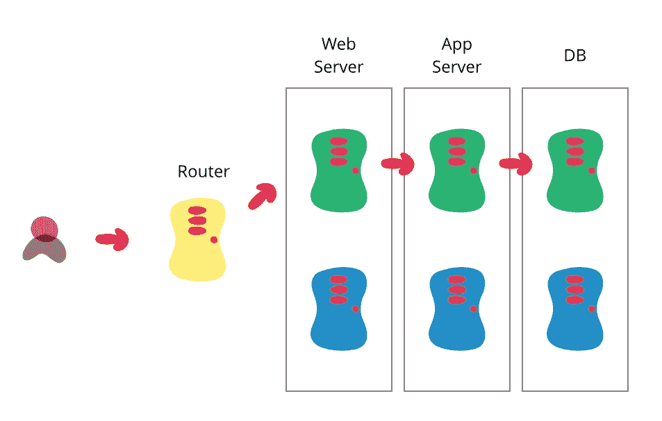
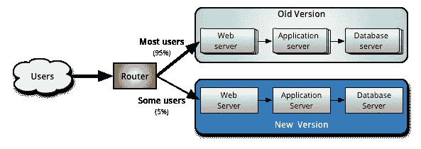
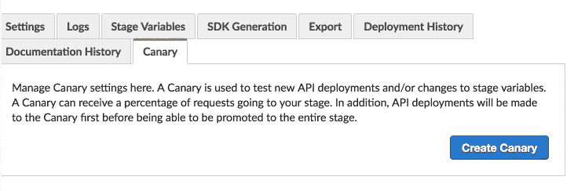
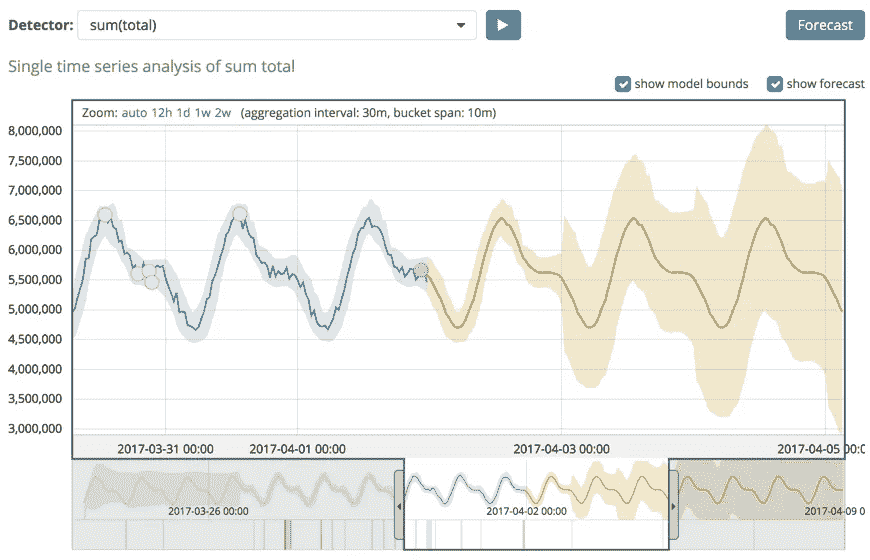
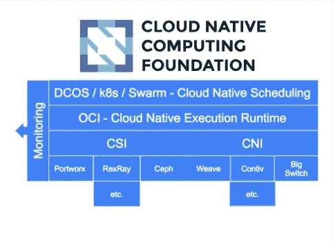

# 探索 CI/CD 和 DevOps 的新领域

> 原文：<https://medium.com/hackernoon/exploring-new-frontiers-in-ci-cd-and-devops-420b0f9bde53>

DC: The New Frontier, Darwyn Cooke, 2004, [source](https://www.theglobeandmail.com/arts/books-and-media/darwyn-cooke-a-comics-legend-who-explored-new-frontiers-inart/article30106509/)

十年前，DevOps 的想法来自安德鲁·谢弗和帕特里克·德博伊斯。一年后，他们实际上将其命名为“DevOps”。十周年纪念标志着一个很好的时机来看看 DevOps 把我们作为一个行业和我们的方向。

这篇文章不是关于供应商、商业、开源或其他方面的。至少不是排他的。这篇文章回顾了 DevOps 和 CI/CD 实践的历史，并深入探讨了这些年来发展的模式以及我们看到的即将到来的模式。

# 敏捷的出生

在多伦多的敏捷 2008 会议上，Andrew Shafer 做了一个演讲，成为整个 DevOps 运动的种子。这在技术世界中已经是“古老的历史”了，但是值得提醒我们自己的是，DevOps 是一个由敏捷运动产生的想法，或者至少是在敏捷运动的背景下产生的。

现在，2001 年的[敏捷宣言](http://agilemanifesto.org/principles.html)在细节上有些轻描淡写，但是*在……上相当清楚*

1.  “高质量软件的持续交付”
2.  “频繁交付工作软件”
3.  “利用变化…作为竞争优势”

毫不奇怪，DevOps 和 CI/CD 的实践引起了敏捷人员的共鸣。

# 从手工到编码

吸引了几乎所有 IT 和相关专业人员想象力的主要想法是，不仅要编写业务逻辑，还要编写围绕它的支持基础设施。

*   持续集成本质上是一个编码的手工测试和代码管理过程。
*   **代码为**的基础设施和带有 API 的云资源是经过编码的手动安装和配置流程。
*   **连续交付**和部署本质上是编码的手动发布活动。

没有代码化，DevOps 和敏捷的其他大承诺都是天上掉馅饼。编码有两个主要用途:

**缩短交付周期。**测试应用程序、设置服务器或安装应用程序都是非常耗时的活动。将过程抽象成代码并重用这些代码几乎总是生产力的净收益和交付周期的下降。

**风险规避**。即使你不是最快和最敏捷的，编码也有助于解决“改变事物”的内在危险，并增强发布高质量软件的可预测性。

*   自动化测试可以更早更快地发现错误。
*   作为代码的基础设施防止配置漂移。
*   自动回滚为拙劣的发布提供了一个安全阀。
*   当自动化时，以上所有的都不容易出现人为错误。

这不是一个目标，但肯定有一个巨大的附带好处，那就是代码在开发人员和系统管理员之间创建了一个共享的语言、平台和理解。Flickr 的约翰·奥斯鲍和保罗·哈蒙德在 2009 年的同名演讲完全抓住了这种精神

从“编纂所有的东西”中涌现出了一个完整的产品和服务行业，托管、SaaS、开源、商业以及介于两者之间的一切:Heroku、Cloud Foundry、AWS Beanstalk、TravisCI、Jenkins、CodeShip、Bamboo、Puppet、Ansible、Terraform。这个清单还在继续。

# 从编纂到实验

DevOps 实践的第一波浪潮勾选了敏捷宣言的“持续的”、“频繁的”和“工作软件”框。然而，事实证明，另一个盒子，“利用变化…作为竞争优势”，有点神秘。哪些变化*实际上对我们有利？我们怎么知道他们什么时候不是呢？顾客真正想要的是什么？*

这类问题一直是**营销、UX 和产品管理人员**的领域。A/B 和多变量测试、测试受众和短暂的实验特征是该领域中发现的典型武器。基本假设是“我们不知道答案。让我们实验一下，找出答案。”

这种实验思维现在正在进入后端领域。是时候了。软件工程师、架构师和系统管理员天生比适配器更善于预测。**我们预测未来**，并构建我们的代码库和基础设施，以尽可能好地完成未来的工作。我们称之为“规范”或“评估”

但是有一个障碍。如果你做过这种类型的预测，并且在事情上线后发现你的预测完全偏离目标，请举手。✋

# 实验模式、工具和服务

抛弃预测和估计可能是一件非常强大的事情。当然，故事并没有就此结束。在过去的几年里，许多模式、技术、工具和服务涌现出来，帮助工程师们把“我不知道”变成“我已经学会”。我现在知道了”。

## 1.蓝色/绿色部署

所有这些模式的鼻祖，也是迄今为止最原始但分布最广的模式是蓝/绿部署。可以说，早在 DevOps 问世之前，许多工程师就已经实现了这种模式。

source: [https://martinfowler.com/bliki/BlueGreenDeployment.html](https://martinfowler.com/bliki/BlueGreenDeployment.html)

典型的蓝/绿部署场景包括两个相同的环境和某种形式的交换机，用于将流量路由到其中一个环境。到了发布时间，你部署到一个环境，并引导流量。你保留另一个环境，以防事情变糟。

## 2.金丝雀释放

比蓝/绿部署简单得多的是金丝雀释放。原理是一样的，只是粒度高了很多。有了 canary releasing，您实际上可以开始运行适当的实验，而不会将您的生产环境置于风险之中。

source: [https://martinfowler.com/bliki/CanaryRelease.html](https://martinfowler.com/bliki/CanaryRelease.html)

您的路由组件需要“智能”来释放金丝雀，因为您希望只将总流量的一小部分作为目标，并将该流量导向新版本的应用程序。

释放金丝雀仍然是一种模式。实现和执行留给读者作为练习。然而，有产品已经提供了这种一等公民。通过 https://vamp.io ，我们可以针对许多不同的流量方面，如用户代理、设备、地理位置等。并在 UI 中内置了支持。AWS 在其 API 网关服务中提供金丝雀发布

AWS Api Gateway Canary Releasing

## 3.A/B 测试

A/B 测试是金丝雀发布的，有一个围绕它的统计框架。总的来说，它提供了类似金丝雀释放的目标选择，但它增加了目标组合。这有助于确定不同版本或新版本的应用程序是否有助于实现特定目标，以及有多大作用。

source: [https://www.optimizely.com/optimization-glossary/ab-testing/](https://www.optimizely.com/optimization-glossary/ab-testing/)

A/B 测试由 Optimizely、可视化网站优化器(VWO)、Google Optimize 等供应商提供，并在许多其他服务中作为功能实现，如 Unbounce、Mailchimp 和 Kissmetrics。公司也自己建立，像 [Pinterest](/@Pinterest_Engineering/building-pinterests-a-b-testing-platform-ab4934ace9f4) 和 [Booking](https://blog.booking.com/concept-dne-execution.html) 。

然而，所有这些服务和实现都严格地在前端(网页、电子邮件等)工作。).这意味着您可以主要测试现有应用程序的视觉和文本变化。如果您需要在应用程序堆栈的其他部分进行试验，该怎么办？产品和服务正在这个舞台上出现。

Optimizely X Full Stack 是一个完整的服务解决方案，涵盖多种语言和运行时间。在开源世界里，我们有脸书的 [Planout](https://facebook.github.io/planout/) ，Intuit 的 [Wasabi](https://github.com/intuit/wasabi) 和 Wix 的 [Petri](https://github.com/wix/petri) 。

## 4.功能切换

功能切换更像是一种并行模式。它将 canary 发布和 A/B 测试的各个方面集成到一个关注 toggles 的模式中。这些开关打开和关闭应用程序功能。无论是一般的还是针对目标受众的。

特性切换的主要优点是您可以将部署时刻与发布时刻分离开来。提供功能切换的服务例如是[黑暗启动](https://launchdarkly.com/)和 [Split.io](https://www.split.io/) 。开源替代方案是 Java 平台的 [Togglz](https://www.togglz.org/) 和 Ruby 平台的 [Flipper](https://github.com/jnunemaker/flipper) 。

## 5.影子交通

影子流量也被称为“黑暗流量”，是指从生产流程中抽取流量，并将其暴露给应用程序的实验版本，而最终用户并不直接参与其中。

这种模式牢固地植根于后端，可以用于负载和性能测试，或者作为一般的健全性检查。目前的实现似乎完全是定制的，在撰写本文时，我找不到任何提供影子流量的 SaaS 服务。像 [Istio](https://istio.io/) (用于 Kubernetes 栈)和 [GoReplay](https://goreplay.org/) 这样的开源中间件类型的项目相对较新。

所有实现都需要克服一些棘手的问题，如网络流量如何在最低层工作，客户端响应、加密等。然而，作为像 Kubernetes 这样的集成平台的一部分，潜力是很大的。

# 走向实验平台

随着实验模式在整个 IT 栈中被采用，实验的粒度和它们被部署的规模都增加了。这就产生了一系列新问题。

*   如何处理实验的数据输出？不是每个公司都有专门的数据科学团队。
*   如何将基础设施与实验需求相匹配？成功的实验可能很快需要更多/新的/不同的资源。
*   如何做到这一切并保持理智？

这些问题中有许多是自动化问题，属于 DevOps 实践的范围。我们可以看到第一批旨在解决这些问题的产品和服务出现。

## 1.机器学习和人工智能

使用机器学习和人工智能来理解典型的现代 IT 堆栈生成的大量日志和指标仍处于初级阶段，但看起来非常有前景。

模式识别、过滤和预测分析都是很好理解的数学问题。我们可以看到这些技术出现在面向 DevOps 的产品和服务中，如[significal](https://www.signifai.io/)和 [Logz](https://logz.io/solutions-ai-devops/) 。这两种服务都承诺减少数据流中固有的噪音，并帮助团队专注于寻找埋藏在碎片中的金块。

ElasticSearch 是一个流行的开源搜索引擎，被许多人用来分析日志数据，[刚刚在其功能集中添加了机器学习](https://www.elastic.co/guide/en/x-pack/current/ml-overview.html)。这给用户提供了一个相对容易的途径来使用机器学习来搜索他们的数据。

predictive analysis in ElasticSearch ML, source: [https://www.elastic.co/guide/en/x-pack/current/ml-overview.html](https://www.elastic.co/guide/en/x-pack/current/ml-overview.html)

一般来说，利用 ML 和 AI 来帮助制定关于部署、扩展、功能切换和运行实验的决策，在很大程度上仍然是未探索的领域。

## 2.智能编排 2.0

像 Kubernetes、Docker Swarm 和 Mesosphere 的 DC/OS 这样的现代容器平台完全符合 DevOps 的新模式。这些平台被称为“原生云”，提供了可移植性、可伸缩性和快速、标准化的部署模式。

在这种情况下，它们是运行基于实验的 IT 基础架构的理想基础架构，因为它们符合这种系统所需的几乎所有条件:

*   编纂和标准化的运行时间，网络和存储通过(码头)集装箱和相关技术。
*   通过平台的 API 编写部署流程。
*   通过覆盖网络、集成 API 网关和服务发现/网格实现智能路由。

OCI, CSI and CNI aim to standardise the container, storage and network layers of cloud native platforms.

向云原生基础架构的迁移已经开始，我们已经可以看到由云原生范式支持的新应用出现。

像 [Istio](https://istio.io/) 和 [Vamp](https://vamp.io) 这样的产品和框架将**智能路由**带到了路由决策成为实时可延展应用属性的水平。加上监控解决方案，智能路由解决方案正在成为 DC/OS 和 Kubernetes 上实现的 A/B 测试和影子流量模式的主干。

**Bin packing** 是一种技术，其中许多应用程序进程共享一个物理主机，直到达到其最大容量，以免浪费未使用的容量。Kubernetes 和 DC/OS 已经这样做了。

[将它与 AWS Spot instances](https://blog.argoproj.io/use-spot-instances-with-your-kubernetes-clusters-on-aws-2a27f1887bb0) 相结合，可以将成本效率提升到另一个水平。通过将成本水平与更高层次的业务目标联系起来，例如在 A/B 测试中，可以取得有趣的进展。许多公司通过内部成本核算和归属来构建其 IT 成本。这将极大地有助于实验性应用或服务的商业案例。

> 想增加创新？降低失败的成本
> 
> — Joi Ito，麻省理工学院媒体实验室主任

如果你喜欢这篇文章，请用**鼓掌**来表达你的欣赏👏下面！

蒂姆是 [https://vamp.io](https://vamp.io/?utm_campaign=frontierscicd&utm_source=Hackernoon) 的产品倡导者，这是为现代云平台发布的智能&无压力应用。

