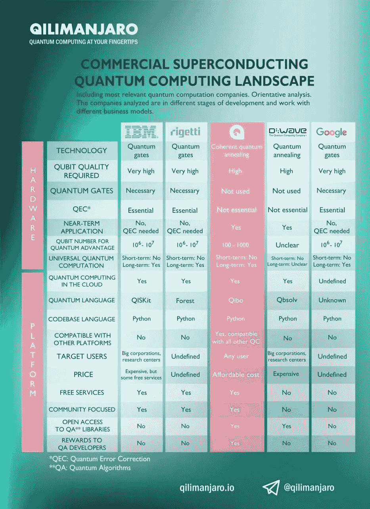
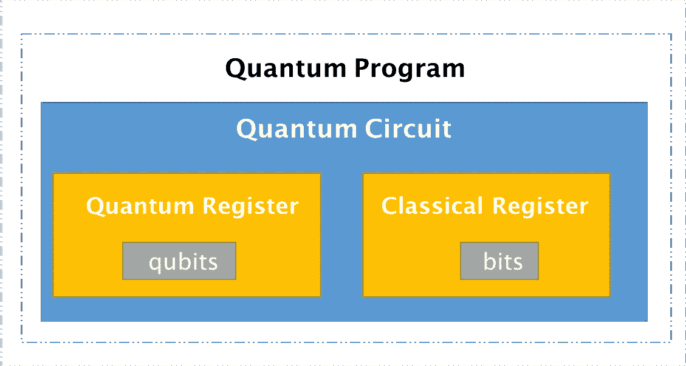

# 探索量子编程从“你好世界”到“你好量子世界”

> 原文：<https://medium.com/hackernoon/exploring-quantum-programming-from-hello-world-to-hello-quantum-world-109add25305f>


# 介绍

我们已经进入了一个时代，现在我们可以在类似于经典计算的量子电路上实现基本的 AND、OR 和 XOR 逻辑，我们将这个时代称为**量子时代**。

这篇文章是对*应用量子计算(AQC)* 的简单介绍，我们将在**真实量子芯片**上编写一个 *Hello World* 程序😅。

> 但是等等…我没有量子计算机，我怎么能做到呢？？？

对此有一个非常简单的解决方案，像 IBM 和 Google 这样的公司实际上在制造量子设备，我们可以利用它们在真正的设备上构建和测试东西，而不需要任何设置。

这是我们的技术堆栈:

1.  [Google Colab](https://colab.research.google.com) :运行代码和执行实验的云平台。
2.  [QISKit](https://qiskit.org/) :量子[编程](https://hackernoon.com/tagged/programming)的 Python 库。
3.  IBM Q :来自 IBM Q 网络的量子位芯片组。


所以让我们手缠在一起。😉

# 背景

## **什么是量子计算机？**

量子计算机基于量子位，也称为量子位。它们有两种可能的值(状态)作为`0`和`1`，类似于我们在经典计算机中的值。但是量子力学的定律也允许其他的可能性，我们称之为[叠加](https://en.wikipedia.org/wiki/Quantum_superposition)态。


A Quantum Computer created by IBM combining the quantum registers.

## 为什么是量子计算？

通过利用量子比特(量子位)操作中的**叠加**和**纠缠**，量子计算可以为某些类别的问题实现指数加速。一个这样的例子是在 [*人工智能*](https://hackernoon.com/tagged/artificial-intelligence) 空间中使用量子计算，我们可以实现优化算法，该优化算法可以使用叠加的属性，并帮助加速优化问题，这最终可以导致更好和更快的学习算法。


Quantum Annealing Optimizer : Computing multiple local and global minima at a time.

## **量子计算机有哪些让我兴奋的地方？**

在经典玻尔兹曼机器中使用量子退火，可以使重量发现过程量子化，这可以帮助我们发现使用经典退火过程( [SGD](https://en.wikipedia.org/wiki/Stochastic_gradient_descent) )无法发现的模式。

> 这可能是通向人工智能的关键(AGI)。

## **量子景观的现状如何？**

最近在质量控制领域有了很多发展，市场上所有的主要参与者都在试图取得革命性的突破。其中一些列举如下:



Image Source : www.qilimanjaro.io

# **实现“你好量子世界！！!"**

让我们使用量子寄存器实现我们的第一个 Hello World 程序。

> Colab 链接:[https://colab . research . Google . com/drive/1g vet-ccdbscgojhtng 9 gcvle 7 phiyuqp](https://colab.research.google.com/drive/1gVet-CcDbsCgOjhtNg9gCvlE7PHIYuQP)
> 
> Github 链接:[https://github.com/goodrahstar/hello-quantum-world](https://github.com/goodrahstar/hello-quantum-world)

从量子编程开始，我们将使用**开源量子信息科学工具包(**[**QISKit**](https://qiskit.org/)**)**。这是一个快速发展的开源社区，致力于让更多的人更容易使用量子计算。

更多:[https://github.com/QISKit](https://github.com/QISKit)

```
pip install qiskit
```


现在我们已经设置好了软件包，让我们熟悉一下量子世界中的编程范例。量子编程有 4 个主要组成部分。



1.  **量子程序**:运行模拟/实验的环境。
2.  **量子电路**:设置实验的虚拟电路。
3.  **量子寄存器**:由量子位组成的寄存器。
4.  **经典寄存器**:包含位的寄存器。

我们将初始化量子程序，创建一个具有 2 个量子位的量子寄存器和一个具有 2 个位的经典寄存器，并使用以下脚本将它们设置到电路中:

```
from qiskit import QuantumProgram**# Create a QuantumProgram object instance.** qp = QuantumProgram()**# Create a Quantum Register called "qr" with 2 qubits.**
qr = qp.create_quantum_register('qr',2)**# Create a Classical Register called "cr" with 2 bits.**
cr = qp.create_classical_register('cr',2)**# Create a Quantum Circuit called "qc" involving qr and cr.** qc = qp.create_circuit('HelloWorldCircuit', [qr],[cr])
```

一旦我们准备好电路，我们需要在量子计算机上运行它。真正的乐趣来了。😃

我们将连接到一个真正的量子芯片组，并在我们的*hello world 电路上执行量子操作。*这里我使用的是 IBM-Q 部署的芯片组，它有各种选项，如:

*   ibmqx5: is 16 量子位芯片组。[[https://ibm.biz/qiskit-ibmqx5](https://ibm.biz/qiskit-ibmqx5)
*   ibmqx4: is 5 量子位芯片组。https://ibm.biz/qiskit-ibmqx4
*   IBM qx 2:is 5 量子位芯片组。https://ibm.biz/qiskit-ibmqx2

> 它们仍处于开发阶段，在您阅读本文时，它们可能会被弃用。因此，要获得更新的名单，请点击这里查看[。](https://github.com/QISKit/qiskit-backend-information)

要访问这些芯片组，您需要在 [IBM Quantum Experience](https://quantumexperience.ng.bluemix.net/qx/) 上拥有一个帐户。并从这里的[生成令牌](https://quantumexperience.ng.bluemix.net/qx/account/advanced)。


将后端设置为 *ibmqx5，*提供您的令牌并设置连接。如果令牌有效并且后端已配置，那么您就可以访问 quantum power 了。

```
backend = 'ibmqx5'token = 'a7dbfb3cfc1252c4a7555020c32808cff17102a467c595801371f7b7f1f7c3a3355d565469aa4a37564df269f3710f33d7d13ba3c900ca947c1513598b64c5e7'qp.set_api(token,url='[https://quantumexperience.ng.bluemix.net/api'](https://quantumexperience.ng.bluemix.net/api'))
```

现在是时候组成我们的电路并进行实验了。

创建 Hello World 电路的步骤:

1.  我们将添加具有 1 个量子位的哈达玛门(H ),以增加叠加特性。h 门具有映射 X→Z 和 Z→X 的性质。
2.  我们增加了受控非门(CX)，这是一个两量子位的门，如果控制处于状态 1，它就会翻转目标量子位。这个门是产生纠缠所必需的。
3.  检查状态的测量门。


Our Hello World circuit.

```
**# Add the H gate in the Qubit 1, putting this qubit in superposition.**
qc.h(qr[1])**# Add the CX gate on control qubit 1 and target qubit 0, putting the qubits in a Bell state i.e entanglement**
qc.cx(qr[1], qr[0])**# Add a Measure gate to see the state.**
qc.measure(qr[0],cr[0])
qc.measure(qr[1],cr[1])**# Compile and execute the Quantum Program in the ibmqx5**
results = qp.execute(['HelloWorldCircuit'] ,backend ,timeout=2400)
print(results.get_counts('HelloWorldCircuit'))
```

现在当我们检查结果时，你会看到 4 个量子态 0000，0001，0010，0011，每个都有一些相关的概率。

> 这描绘了所有四种状态在给定时间共存。

```
{‘00’: 488, ‘01’: 90, ‘10’: 58, ‘11’: 388}
```


恭喜你！！！🎊 🙌你刚刚经历了量子世界的两个基本性质，即**叠加**和**纠缠**。

# **未来阅读**

在这篇文章中，我们只是触及了量子计算的表面，还有很多事情正在发生。这里有一些很棒的链接来跟上这个领域。

*   [Strawberry Fields](https://strawberryfields.readthedocs.io/) 是一个全栈 Python 库，用于设计、模拟和优化连续变量量子光电路。
*   量子深度学习的通用训练算法:[https://arxiv.org/abs/1806.09729](https://t.co/QSfvqCIC3D)
*   内森的量子科技时事通讯作者[内森·沙马赫](https://medium.com/u/c1a3e4da471a?source=post_page-----109add25305f--------------------------------):[https://medium.com/quantum-tech](https://medium.com/quantum-tech)
*   如何给量子计算机编程作者:詹姆斯·伍顿博士:[https://medium . com/qiskit/how-to-program-a-quantum-computer-982 a 9329 ed 02](/qiskit/how-to-program-a-quantum-computer-982a9329ed02)
*   量子生成对抗学习:【https://arxiv.org/pdf/1804.09139.pdf
*   Cirq :谷歌的一个开源框架，用于在嘈杂的中级量子(NISQ)计算机上开发算法。